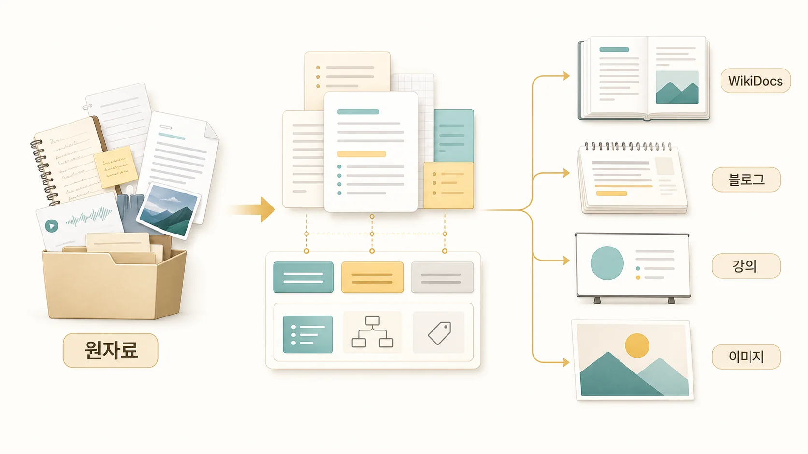

## 7장. AI 문서화 자동화와 WikiDocs 콘텐츠 시스템

6장에서 반복 절차를 Skill로 남기는 법을 봤다면, 7장에서는 그 기준을 콘텐츠 제작에 적용한다. `AI 문서화 자동화`, `WikiDocs 발행 자동화`, `GitHub WikiDocs 연동`을 찾는 독자라면 여기서 자동화의 끝을 초안 생성이 아니라 원본 관리, 공개 반영, 검증까지 이어지는 콘텐츠 시스템으로 봐야 한다. 에르메스 에이전트(Hermes Agent)로 AI 문서화 자동화를 한다고 해서 조사 결과가 바로 좋은 콘텐츠가 되지는 않는다. WikiDocs, 블로그, 강의, 이미지 자산은 같은 내용을 담더라도 역할이 다르다.

7장의 핵심은 “어디에 많이 저장할까”가 아니라 “어떤 채널이 어떤 독자 문제를 맡을까”다. Obsidian LLM Wiki와 HALOX Brain은 원장과 연결형 지식을 맡고, shared-memory는 팀 handoff를 맡고, WikiDocs는 함께 읽을 수 있는 책 구조를 맡는다. 블로그와 강의는 그 위에서 목적에 맞게 다시 파생된다.

[TOC]

## 이 장에서 다루는 문제

| 문제 | 흔한 착각 | 실제 기준 |
|---|---|---|
| WikiDocs와 블로그 | 같은 글을 복사하면 된다 | WikiDocs는 책 구조, 블로그는 유입/캠페인 목적 |
| Obsidian 원장 | 메모를 그대로 옮기면 된다 | 읽기 쉬운 설명과 판단 기준으로 다시 써야 한다 |
| 조사 결과 | 정보가 많으면 글이 좋아진다 | 독자 문제/근거/판단 기준/다음 행동으로 재구성한다 |
| 이미지 | 글 다 쓰고 나중에 붙인다 | 페이지 메시지와 위치를 먼저 정한다 |
| 강의 | 문서를 슬라이드로 바꾸면 된다 | 흐름/실습/전환 포인트를 다시 설계한다 |

## 콘텐츠 시스템으로 남길 산출물

| 산출물 | 확인 질문 |
|---|---|
| 채널 역할표 | Obsidian/shared-memory/WikiDocs/블로그/강의의 역할이 분리되어 있는가 |
| 조사→원고 handoff | 근거/해석/독자 질문/다음 행동이 분리되어 넘어가는가 |
| 이미지 제작 기준 | 하망이가 만들 이미지는 장식이 아니라 페이지 메시지를 설명하는가 |
| 발행 검증 흐름 | GitHub 원본, WikiDocs 공개본, 링크/이미지/전자책 규칙을 함께 확인하는가 |
| 파생 콘텐츠 기준 | WikiDocs 원본에서 블로그/강의/카드가 어떤 목적과 형식으로 나뉘는가 |

## 이 책이 콘텐츠 시스템으로 만들어지는 방식

이 WikiDocs 책 자체가 콘텐츠 시스템의 예시다. 기존 글, 공식 기능 기준, 세션 기록, Slack 대화, shared-memory, Obsidian에 흩어진 운영 이야기를 다시 모아 책의 흐름으로 바꿨다. GitHub는 원본이고, WikiDocs는 공개 배포 채널이다. 뽀동이는 독자가 읽을 수 있는 구조로 바꾸고, 하망이는 필요한 이미지를 만들고, 하비는 최종 통합과 검증을 본다.

중요한 점은 기록을 많이 남기는 것이 아니라 채널마다 역할을 정하는 것이다. 내부 원장은 판단의 근거가 되고, WikiDocs는 오래 읽히는 운영서가 되며, 블로그는 특정 문제를 찾는 독자의 입구가 된다. 강의는 다시 순서와 실습을 설계해야 한다. 실제 이미지 제작 흐름은 [하망이와 WikiDocs 본문 이미지를 만드는 법](https://wikidocs.net/345989)에서 따로 다룬다.

## 이 장에서 얻을 기준

- WikiDocs는 오래 읽히는 운영서로 쓴다.
- 블로그는 특정 문제/키워드/캠페인에 맞춰 파생한다.
- 강의는 문서를 그대로 읽는 것이 아니라 흐름과 실습을 다시 설계한다.
- Obsidian은 4장의 기억층으로 보고, 7장에서는 공유 콘텐츠로 변환하는 흐름만 다룬다.
- 이미지 자산은 장식이 아니라 독자의 이해를 돕는 메시지 단위로 만든다.
- 공유 문서에는 불필요한 세부값을 제거하되, 실제 요청/판단/결과는 읽기 쉬운 사례로 살린다.

이 장은 [외부 도구/MCP/자동화 운영](https://wikidocs.net/345907)과도 이어진다. cron 조사가 콘텐츠 신호를 만들고, GitHub/WikiDocs가 발행 흐름을 잡으며, Skill은 반복 제작 품질을 지킨다. 특히 [크론 조사에서 WikiDocs 발행까지 이어지는 케이스](https://wikidocs.net/345992)는 5장 자동화와 7장 콘텐츠 시스템이 만나는 장면이다.
