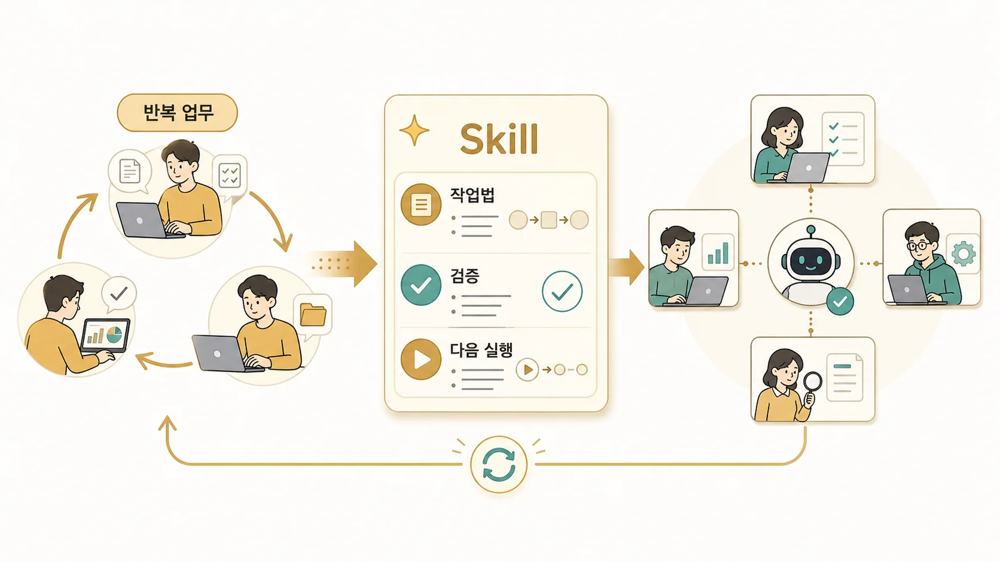

## 6장. Hermes Agent Skill 운영과 자기 개선형 AI 에이전트

5장에서 외부 도구를 어떤 방식으로 붙일지 봤다면, 6장에서는 그 도구를 **어떤 순서와 기준으로 다시 쓸 것인지**를 다룬다. 에르메스 에이전트(Hermes Agent)에서 Skill은 프롬프트 모음이 아니라 반복 업무에서 생긴 작업법이다. 순서, 판단 기준, 실패 패턴, 검증 방법을 다음 세션에서도 다시 쓰게 만드는 운영 지식이다.

Skill을 memory와 헷갈리면 운영이 쉽게 무너진다. memory는 오래 유지할 선호와 기준을 담고, Skill은 반복 업무를 처리하는 절차를 담는다. MCP가 외부 도구를 연결한다면, Skill은 그 도구를 어떤 순서로 쓰고 어떤 결과를 확인할지 정한다.

## 이 장에서 다루는 문제

| 순서 | 글 | 핵심 질문 |
|---|---|---|
| 06-1 | Hermes Agent Skill은 무엇이고 언제 만들까 | 반복 절차와 검증 기준이 생겼을 때 Skill로 남길 수 있을까 |
| 06-2 | 반복 업무는 어떻게 Skill이 되는가 | 한 번의 시행착오를 다음 작업의 실행 기준으로 바꿀 수 있을까 |
| 06-3 | 역할형 에이전트별 Skill은 어떻게 나눌까 | 하비/방울이/뽀동이/하망이/봉구의 Skill 경계를 어떻게 잡을까 |
| 06-4 | Skill은 어떻게 보강하고 QA해야 할까 | 실제 운영과 어긋난 Skill을 언제 어떻게 고칠까 |
| 06-5 | 공개 GitHub Skill과 내부 Skill은 어떻게 분리할까 | 공유할 수 있는 절차와 팀 내부 기준을 어떻게 나눌까 |
| 06-6 | Skill과 memory/MCP/cron/gateway는 어떻게 다를까 | 기억, 도구 연결, 예약 실행, 채널 입구와 Skill을 어떻게 구분할까 |

## Skill로 남길 것과 남기지 않을 것

| 구분 | Skill에 남기기 좋음 | Skill에 넣지 말 것 |
|---|---|---|
| 반복 절차 | 검증 순서, 발행 절차, 리뷰 기준 | 일회성 작업 로그 |
| 판단 기준 | 언제 멈추고 확인할지, 어떤 산출물을 볼지 | 토큰, 계정값, 개인 경로 |
| 실패 패턴 | 자주 틀리는 명령, 누락되는 검증 | 아직 검증되지 않은 추측 |
| 역할 경계 | 조사형/정리형/실행형별 작업법 | 모든 에이전트가 공유할 필요 없는 내부 맥락 |

예를 들어 WikiDocs 발행 작업에서 중요한 것은 “원격 저장소에 반영한다”는 한 줄이 아니다. H1 사용 여부, 이미지 경로, TOC 링크, 본문 링크, 첫 문단의 독자 질문, 공개 WikiDocs 반영까지 확인해야 한다. 이 반복 검증 흐름이 Skill이 된다.

## 역할별 Skill이 필요한 이유

하비의 Skill은 요청을 나누고 결과를 통합하는 기준에 가깝다. 방울이의 Skill은 근거 수집과 반례 확인에 가깝다. 뽀동이의 Skill은 문서 구조, 문체, 링크, 출간 품질에 가깝다. 하망이의 Skill은 이미지 방향과 vision QA에 가깝고, 봉구의 Skill은 파일 수정과 실행 검증에 가깝다.

같은 Skill을 무리하게 공유하면 각 역할의 실패 패턴이 흐려진다. 역할형 에이전트를 운영한다면 Skill도 역할별로 나누고, 공통 검증 기준만 함께 볼 수 있게 두는 편이 안전하다.

## 이 장에서 가져갈 기준

- Skill은 프롬프트 저장소가 아니라 반복 업무 절차/판단 기준/검증 기준이다.
- 한 번의 성공보다 반복되는 실패와 수정 기준이 Skill 후보를 만든다.
- 최신 정보, 토큰, 계정값, 일회성 로그는 Skill에 넣지 않는다.
- 역할이 다르면 Skill도 역할별로 나누는 편이 좋다.
- 공개 Skill과 내부 Skill은 보호해야 할 정보, 경로, 계정, 조직 맥락 기준으로 분리한다.
- 오래된 Skill은 자산이 아니라 위험이므로 실제 운영과 어긋나면 바로 고친다.

Skill 기준이 잡히면 7장의 콘텐츠 시스템도 안정된다. WikiDocs 원고, 이미지, 발행 검증처럼 반복되는 품질 기준을 매번 새로 설명하지 않고 재사용할 수 있기 때문이다.
