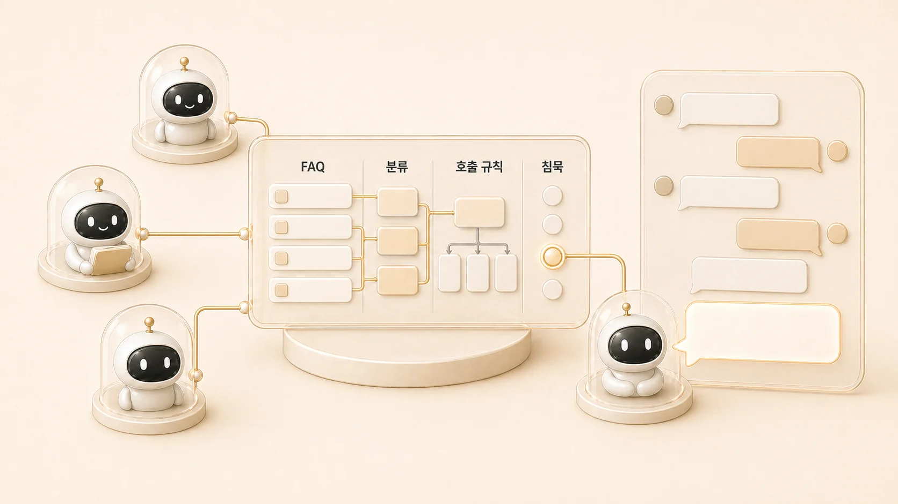

## 8장. Hermes Agent 운영 FAQ와 멀티봇 실패 패턴

7장까지가 콘텐츠와 산출물의 흐름이었다면, 8장부터는 실제 운영 중 자주 막히는 질문을 다룬다. [Hermes Agent](https://wikidocs.net/346055)를 AI 개인비서와 역할형 에이전트 팀으로 쓰면 FAQ는 단순 답변 목록이 아니라 문제를 어느 레이어에서 볼지 정하는 라우터가 되어야 한다.

Slack에서는 “이거 누가 해야 해?”, “왜 같은 하비인데 다르게 답하지?”, “방울이와 뽀동이를 같이 불러도 되나?”처럼 질문이 섞여 들어온다. 8장은 이런 질문을 identity, profile, role, tool, runtime, source of truth, recovery 중 어디에 놓을지 나누는 장이다.

## 처음 막혔을 때의 빠른 분기

| 사용자가 느끼는 문제 | 먼저 분류할 레이어 | 바로 확인할 것 |
|---|---|---|
| 봇이 답하지 않는다 | runtime/gateway | CLI는 되는지, gateway process와 delivery target이 맞는지 |
| 답은 오는데 엉뚱한 봇이 말한다 | identity/trigger | 멘션/호출 이름/스레드 규칙이 맞는지 |
| 같은 봇인데 말투나 기억이 다르다 | profile/memory | 실행 profile, AGENTS/SOUL, session/memory 경계 |
| 조사 결과와 문서화 결과가 다르다 | role/source | 조사형 근거와 정리형 판단이 분리됐는지 |
| 수정했는데 공개 화면이 안 바뀐다 | publishing/source of truth | GitHub 원본, WikiDocs 동기화, 공개 page ID 링크 |
| 반복해서 같은 장애가 난다 | recovery/checklist | FAQ가 아니라 체크리스트/복구 플레이북으로 내려갈 문제인지 |

## 이 장에서 다루는 문제

| 순서 | 글 | 핵심 질문 |
|---|---|---|
| 08-1 | Hermes Agent 운영 질문은 어떻게 분류할까 | 반복 질문을 identity/profile/role/tool/runtime/source of truth 중 어디에 놓을까 |
| 08-2 | 멀티봇 스레드는 왜 쉽게 시끄러워질까 | 여러 에이전트가 있는 Slack 스레드에서 누가 언제 말해야 할까 |

## FAQ는 답변집이 아니라 운영 라우터다

반복 질문은 보통 여섯 레이어 중 하나에 걸린다.

| 레이어 | 대표 증상 | 연결할 장 |
|---|---|---|
| identity | 지금 누구에게 말하는지 헷갈린다 | [AI 팀 읽는 법](https://wikidocs.net/345935) |
| role | 조사형/정리형/실행형의 일이 섞인다 | [역할형 에이전트 분리](https://wikidocs.net/345925) |
| memory | 기억해야 할 것과 작업 로그가 섞인다 | [기억 경계](https://wikidocs.net/346126) |
| tool | 파일, MCP, gateway, cron 문제가 보인다 | [외부 도구 운영](https://wikidocs.net/345907) |
| source of truth | GitHub, WikiDocs, Obsidian 중 무엇을 믿을지 모른다 | [WikiDocs 콘텐츠 시스템](https://wikidocs.net/345911) |
| recovery | 고치기 전에 무엇부터 봐야 할지 모른다 | [복구 플레이북](https://wikidocs.net/345918) |

바로 답을 주기보다 먼저 어느 레이어에서 생긴 문제인지 찾는다. 그래야 같은 문제가 다른 말로 다시 와도 처리 순서가 흔들리지 않는다.

## 멀티봇 규칙이 필요한 이유

역할형 에이전트가 늘면 유용함보다 소음이 먼저 생길 수 있다. 한 스레드에서 하비/방울이/뽀동이/하망이가 모두 즉시 끼어들면 작업은 빨라 보이지만 사용자가 읽을 흐름은 무너진다.

팀 채널에서는 메인 창구를 먼저 정하고, 보조 에이전트는 필요할 때만 명시 호출하는 편이 안전하다. 사람 대화가 끼면 자동 응답을 멈추고, 다시 직접 호출될 때 재개한다. 침묵 규칙은 봇을 소극적으로 만들기 위한 장치가 아니라 사용자가 한 번에 볼 수 있는 결과를 만들기 위한 운영 규칙이다.

## 이 장에서 얻을 기준

- FAQ는 질문 목록이 아니라 레이어 분류표로 만든다.
- 멀티봇 스레드는 기본적으로 메인 창구를 먼저 정한다.
- 보조 에이전트는 필요할 때만 명시 호출한다.
- 사람 대화가 끼면 자동 응답을 멈추고 다시 호출될 때 재개한다.
- 반복 질문은 9장의 [체크리스트](https://wikidocs.net/345917)와 [복구 플레이북](https://wikidocs.net/345918)으로 내려보낸다.
