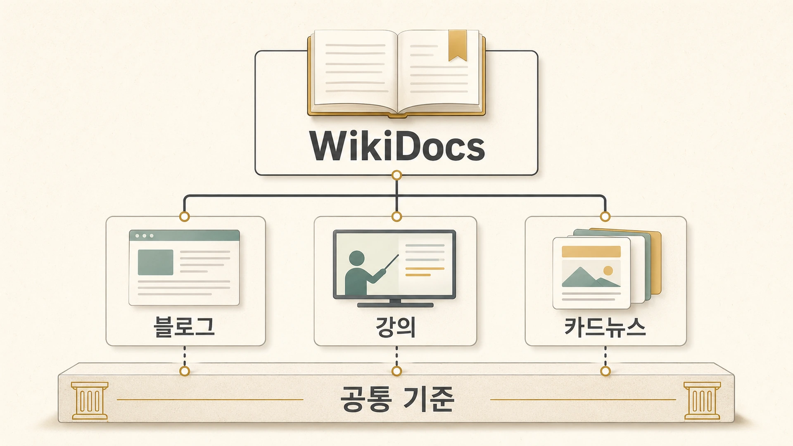
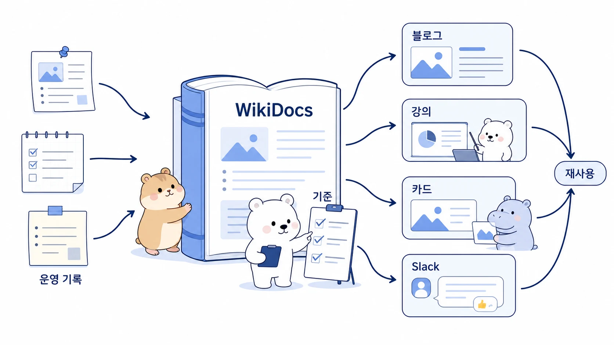

## Obsidian을 먼저 쓰면 WikiDocs도 되고 블로그도 된다

에르메스 에이전트(Hermes Agent)로 콘텐츠를 운영할 때 바로 WikiDocs나 블로그부터 쓰면 금방 막힌다. 공개 글은 독자에게 맞게 정리되어야 하고, 블로그는 검색 유입과 메시지가 선명해야 하며, 강의는 순서와 실습이 필요하다. 이 모든 채널을 처음부터 따로 쓰면 기준이 흩어진다.

그래서 먼저 필요한 것은 Obsidian 같은 내부 지식 본체다. 조사 원문, 운영 기록, 판단 기준, 발행 이력, 이미지 브리프, 다음 액션을 Obsidian에 쌓아 두면 그다음 WikiDocs는 공개용 책으로 정리하고, 블로그/링크드인/강의/뉴스레터는 목적에 맞게 재가공할 수 있다.



이 페이지에서 말하는 “먼저”는 공개 발행 순서가 아니라 지식 정리 순서다. 내부에서는 Obsidian이 사람이 읽고 에이전트가 다시 찾는 원본 지식에 가깝고, WikiDocs는 그중 독자가 읽어도 되는 기준을 책처럼 정리한 공개본이다. 블로그와 SNS는 다시 그 공개본에서 특정 문제와 메시지를 뽑아낸 배포 채널이다.



[TOC]

## 왜 바로 블로그부터 쓰면 기준이 흩어질까

블로그를 먼저 쓰면 당장의 메시지는 선명할 수 있다. 하지만 여러 글이 쌓이면 같은 설명이 반복되고, 어떤 글이 최신 기준인지 찾기 어려워진다. 강의부터 만들 때도 비슷하다. 강의는 전달력이 좋지만 시간과 흐름에 맞춰 압축되기 때문에, 기준 문장과 체크리스트, 원자료 링크가 흩어질 수 있다.

반대로 Obsidian에 먼저 지식 본체를 만들면 원자료와 판단 기준이 분리된다. 조사 결과는 조사 결과대로 남고, 그중 공개할 만한 기준은 WikiDocs로 정리되며, 특정 독자 문제는 블로그나 링크드인 글로 다시 뽑을 수 있다. 이때 Obsidian은 단순 메모장이 아니라 [외부 장기 기억층](https://wikidocs.net/346129)으로 작동한다.

이 책도 그렇게 다듬고 있다. 기존 블로그를 옮긴 뒤, 사용자는 “처음 보는 사람은 축약되어 있다고 느낄 수 있다”고 봤다. 그래서 단순 분량 추가가 아니라 실제 세션과 운영 기록에서 함께 읽을 만한 이야기를 회수해 각 장에 다시 넣었다. 이 회수의 출발점은 공개 페이지가 아니라 내부 지식 기록과 장기 기억이다.

## Obsidian, WikiDocs, 블로그는 역할이 다르다

| 채널 | 역할 | 좋은 사용 방식 |
|---|---|---|
| Obsidian | 내부 지식 본체/운영 기록 | 원자료, 판단 기준, 발행 이력, 이미지 브리프, 다음 액션을 연결한다 |
| WikiDocs | 공개용 책/지식 베이스 | Obsidian의 지식을 독자가 읽을 수 있는 기준과 사례로 다시 쓴다 |
| 블로그/브런치 | 특정 문제와 검색 유입 | WikiDocs의 한 주제를 캠페인형 글로 압축한다 |
| 링크드인/카톡 | 짧은 관점 공유 | 운영자가 실제로 느낀 메시지와 링크를 전달한다 |
| 강의 | 순서와 실습 | WikiDocs 기준을 학습 흐름과 실습 과제로 재배열한다 |
| 카드뉴스/이미지 | 한 메시지 전달 | 본문 핵심을 시각 자산으로 변환한다 |

이 구조에서는 WikiDocs가 원본이 아니라 공개본이다. 원본 지식은 Obsidian에 있고, WikiDocs는 독자가 이해할 수 있는 형태로 편집된 책이다. GitHub는 WikiDocs 원고의 source of truth이고, WikiDocs는 공개 배포 화면이다. 이 발행 검증 흐름은 [GitHub와 WikiDocs로 콘텐츠를 발행하고 고치는 흐름](https://wikidocs.net/345994)에서 더 자세히 다룬다.

## 실제 운영 흐름: Obsidian에서 공개 콘텐츠까지

에르메스 에이전트 팀으로 콘텐츠를 만들 때는 보통 다음 순서가 안정적이다.

```text
1. 조사/회의/Slack 스레드/운영 기록이 생긴다.
2. 원자료와 판단 기준을 Obsidian에 남긴다.
3. 반복될 기준은 memory/shared-memory/Skill 중 맞는 위치로 분리한다.
4. 독자가 읽을 만한 기준은 WikiDocs 페이지로 다시 쓴다.
5. 특정 메시지는 링크드인/블로그/카톡으로 짧게 뽑는다.
6. 강의나 워크숍은 WikiDocs 기준을 순서와 실습으로 재배열한다.
```

이 순서가 중요한 이유는 채널마다 문체와 목적이 다르기 때문이다. Obsidian 노트는 내부자가 다시 찾기 좋아야 하고, WikiDocs는 처음 보는 독자도 이해해야 하며, 블로그는 검색 의도와 문제 해결이 앞에 와야 한다. 같은 원자료라도 채널마다 다시 써야 한다.

## 본문 링크가 콘텐츠 구조를 바꾼 순간

처음에는 각 페이지 끝에 순차 링크를 붙이는 방식으로 본문 링크를 보강했다. 하지만 사용자가 원한 것은 본문 안에서 [AI 개인비서](https://wikidocs.net/345923), [역할형 에이전트](https://wikidocs.net/345925), [memory/profile/session](https://wikidocs.net/345902), [MCP/cron/gateway](https://wikidocs.net/345907)가 자연스럽게 연결되는 구조였다.

이 피드백 덕분에 WikiDocs는 단순 글 모음이 아니라 개념 지도에 가까워졌다. 블로그는 보통 한 글 안에서 끝나지만, 책은 페이지 사이를 읽으며 이해가 깊어져야 한다. Obsidian은 이 개념 지도에 들어갈 원자료와 판단 기준을 계속 보관하는 내부 지식층이다.

또 하나의 기준도 생겼다. GitHub 원본에서는 파일 링크가 자연스러워 보여도, WikiDocs 공개 화면에서는 독자가 클릭할 수 있는 공개 페이지 URL이 필요하다. 그래서 콘텐츠 시스템은 글쓰기만이 아니라 링크 변환, 이미지 경로, 공개 화면 확인까지 포함한다.

## 판단 기준

1. 먼저 Obsidian에 원자료와 판단 기준을 남긴다.
2. WikiDocs는 Obsidian의 지식 중 독자에게 설명할 수 있는 기준과 사례를 책 구조로 다시 쓴다.
3. 블로그는 독자 문제와 검색 키워드에 맞춰 WikiDocs의 한 주제를 압축한다.
4. 강의는 WikiDocs 순서를 그대로 읽지 말고 실습 흐름으로 재구성한다.
5. 본문 링크는 페이지 끝 이동보다 문장 안의 개념 연결을 우선한다.
6. 공유 콘텐츠에는 불필요한 세부값을 제거하고, 이야기와 판단 기준만 남긴다.

## FAQ

### Obsidian과 WikiDocs를 같은 저장소처럼 쓰면 안 되나요?

같게 두면 둘 다 약해진다. Obsidian은 사람이 읽고 에이전트가 다시 찾는 내부 지식 본체이고, WikiDocs는 독자가 읽는 공개 책이다. Obsidian에는 원자료와 판단 과정이 남아도 되지만, WikiDocs에는 읽는 사람이 바로 이해할 수 있는 기준과 사례만 남겨야 한다.

### 블로그와 WikiDocs를 같은 글로 운영하면 안 되나요?

완전히 같게 두면 둘 다 약해진다. WikiDocs는 책 구조와 개념 연결, 블로그는 문제 해결과 유입에 집중하는 편이 좋다.

### 강의는 언제 만들면 좋나요?

Obsidian에 원자료와 판단 기준이 쌓이고, WikiDocs에서 공개 기준과 사례가 어느 정도 안정된 뒤가 좋다. 그때 강의는 문서 복사가 아니라 학습 순서 설계가 된다.
