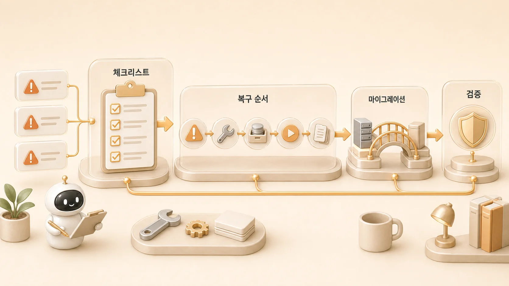

## 9장. Hermes Agent 보안/마이그레이션/복구 플레이북

8장에서 운영 질문을 분류했다면, 9장에서는 그 질문을 실행 가능한 순서로 바꾼다. [Hermes Agent](https://wikidocs.net/346055)를 오래 운영하려면 좋은 답변보다 먼저 보안/마이그레이션/복구 기준이 필요하다. 같은 실수를 반복하지 않게 만드는 체크리스트, 시스템을 옮길 때 기준을 잃지 않게 하는 마이그레이션 절차, 문제가 생겼을 때 무엇부터 볼지 정하는 복구 플레이북이 안전망이 된다.

질문이 반복되면 FAQ가 되고, FAQ가 반복되면 체크리스트가 되고, 체크리스트가 실제 장애를 만나면 복구 플레이북이 된다. 여기에 위험 명령 승인, gateway allowlist, sandbox, credential filtering, checkpoint/rollback 같은 보안 기준을 붙여야 한다. 그래야 AI 개인비서와 역할형 에이전트 팀이 “잘 되는 날만 잘 되는 시스템”이 아니라 “문제가 생겨도 돌아오는 시스템”이 된다.

## 이 장에서 다루는 문제

| 순서 | 글 | 핵심 질문 |
|---|---|---|
| 09-1 | 시행착오를 운영 체크리스트로 바꾸는 법 | 삽질 기록을 다음 사람이 바로 쓰는 기준으로 바꿀 수 있을까 |
| 09-2 | 복구 플레이북은 왜 문서보다 순서가 중요할까 | 문제가 생겼을 때 무엇부터 확인해야 할까 |
| 09-3 | Hermes Agent 운영 체크리스트는 어떻게 써야 할까 | 체크리스트가 실제 운영 속도를 높이려면 어떤 모양이어야 할까 |
| 09-4 | Hermes Agent 보안 체크리스트는 어떻게 만들까 | 공식 security model을 운영 체크리스트로 어떻게 바꿀까 |
| 09-5 | Hermes Agent 위험 명령 승인과 YOLO mode는 어떻게 관리할까 | 빠른 실행과 안전 경계를 어떻게 나눌까 |
| 09-6 | Hermes Agent gateway 권한과 실행 격리는 어떻게 나눌까 | 호출 권한, 실행 권한, credential 권한을 어떻게 분리할까 |
| 09-7 | Hermes Agent checkpoint와 rollback은 복구 흐름에서 어떻게 쓸까 | 실행 전후 되돌릴 기준점을 어떻게 확보할까 |
| 09-8 | OpenClaw에서 Hermes로 넘어올 때 무엇을 점검해야 할까 | 전환 과정에서 memory/profile/runtime/원본 기준를 어떻게 잃지 않을까 |

## 복구 장에서 남길 안전망

| 산출물 | 확인 질문 |
|---|---|
| 시행착오 체크리스트 | 같은 문제가 다시 왔을 때 먼저 볼 순서가 있는가 |
| 복구 플레이북 | 증상 보존→원인 확인→수정→검증→기록 순서가 분명한가 |
| 보안 경계표 | 호출자/도구/credential/실행 위치/복구 경로가 분리되어 있는가 |
| 마이그레이션 점검표 | OpenClaw 같은 과거 유산을 현재 Hermes 기준으로 재분류했는가 |

## 복구는 고치기 전에 순서를 잡는 일이다

운영 실수는 대개 처음 보는 문제가 아니다. gateway가 살아 있는지 확인하지 않고 cron을 고치려 하거나, GitHub가 원본인데 WikiDocs 화면만 보며 수정 상태를 판단하거나, memory에 넣으면 안 되는 작업 로그를 장기 기억으로 남기려는 일이 반복된다.

복구도 같다. 문제가 생겼을 때 바로 재설치하거나 재시작하면 원인이 사라질 수 있다. 먼저 증상, process, 최근 변경, profile/runtime 경계, 원본 기준를 확인해야 한다. 그런 다음 수정하고, 마지막에 검증과 기록을 남긴다. 반복되는 확인 순서는 [Hermes Agent Skill](https://wikidocs.net/346235)로 남길 수 있고, 도구 장애는 [외부 도구/MCP/채널 연동](https://wikidocs.net/345907)의 runtime/delivery 기준으로 되돌아간다.

## 이 장에서 얻을 기준

- 사건 기록은 시간순으로 남기고, 체크리스트는 확인 순서로 남긴다.
- 복구 플레이북은 명령어 모음이 아니라 판단 순서다.
- 마이그레이션은 기존 값을 모두 복사하는 일이 아니라 현재 판단 기준으로 재분류하는 일이다.
- 보안은 단일 옵션이 아니라 호출자, 실행 위치, credential, 복구 경로를 나누는 일이다.
- 실행 전에는 증상을 보존하고, 실행 후에는 검증 결과를 남긴다.
- 공유 문서에는 내부 경로와 값이 아니라 상황, 판단, 기준, 결과만 남긴다.

이 기준이 잡히면 10장의 조직 도입도 “AI를 팀에 붙이는 일”이 아니라 역할, 권한, 기록, 검증, 복구 책임을 함께 설계하는 일로 보인다.
