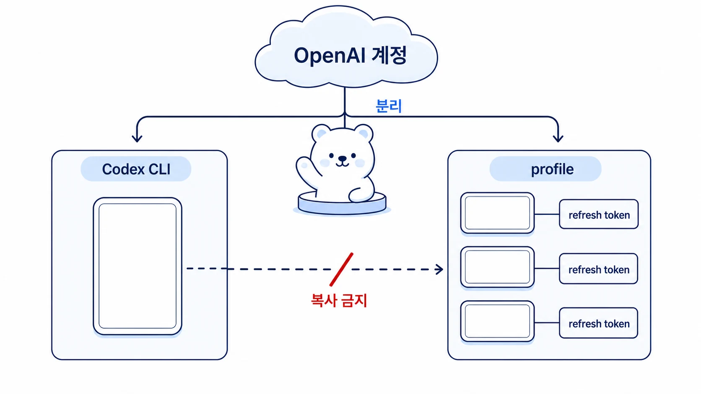

## Hermes Agent 에이전트별 Codex auth는 어떻게 설정해야 할까

Hermes Agent를 여러 profile로 운영하면서 `openai-codex`를 메인 provider로 쓴다면, 가장 먼저 정해야 할 것은 “누가 어떤 Codex credential을 가질 것인가”다. Slack gateway가 잘 살아 있어도 Codex OAuth credential이 꼬이면 에이전트는 갑자기 fallback provider로 우회하거나, 특정 profile만 응답 품질이 달라질 수 있다.

결론은 단순하다. Codex CLI와 Hermes Agent profile들은 같은 OpenAI 계정을 써도 되지만, 같은 refresh token을 공유하면 안 된다. 각 profile은 `auth add openai-codex`를 따로 진행해서 독립 device auth credential을 가져야 한다. 이 글은 문제가 터진 뒤 복구하는 방법보다, 에이전트들의 Codex auth를 처음부터 어떻게 나눠야 하는지를 먼저 다룬다.



[TOC]

## 왜 이 문제가 생길까

Codex OAuth 인증에는 access token과 refresh token이 있다.

| 구분 | 비유 | 역할 |
|---|---|---|
| access token | 잠깐 쓰는 출입증 | 실제 API 호출에 사용된다 |
| refresh token | 새 출입증을 받는 교환권 | access token이 만료됐을 때 새 access token을 받는다 |

문제는 refresh token이 회전될 수 있다는 점이다. 한 client가 refresh token으로 새 토큰을 발급받으면, 기존 refresh token은 더 이상 쓸 수 없게 될 수 있다. 그런데 여러 Hermes profile이나 Codex CLI가 같은 refresh token을 복사해서 들고 있으면, 한쪽이 먼저 갱신하는 순간 나머지는 “이미 사용된 교환권”을 들고 있는 상태가 된다.

이때 로그에는 이런 식의 메시지가 남을 수 있다.

```text
Primary provider auth failed:
Codex refresh token was already consumed by another client
Fallback provider resolved: fallback-provider-name
```

이 메시지는 “Slack 연결이 끊겼다”는 뜻이 아니다. gateway는 살아 있고 메시지도 받을 수 있지만, 메인 provider인 `openai-codex` 인증이 실패해서 다른 provider로 우회하고 있다는 뜻에 가깝다.

## 같은 계정과 같은 token은 다르다

헷갈리기 쉬운 지점은 여기다. 하나의 OpenAI 계정으로 여러 device auth session을 만드는 것은 가능하다. Codex CLI도 쓰고, Hermes Agent도 쓰고, Hermes 안에서도 하비/방울이/뽀동이 같은 여러 profile을 쓸 수 있다.

문제는 “OpenAI 계정 하나를 여러 곳에서 쓴다”가 아니다. 문제는 “하나의 refresh token을 여러 곳에 복사해서 쓴다”다.

| 구조 | 판단 |
|---|---|
| OpenAI 계정 1개 / profile별 device auth 따로 진행 | 안전한 구조 |
| Codex CLI credential과 Hermes profile credential 분리 | 안전한 구조 |
| 한 profile의 `auth.json`을 다른 profile에 복사 | 위험한 구조 |
| Codex CLI credential을 Hermes 여러 profile에 import | 위험한 구조 |
| 로그인 상태만 보고 token 중복 여부를 확인하지 않음 | 불안정한 구조 |

겉으로는 모두 `logged in`처럼 보일 수 있다. 하지만 같은 refresh token을 공유하는 상태라면 다음 refresh 시점에 한쪽부터 깨질 수 있다.

## 에이전트별 Codex auth의 권장 구조

역할형 에이전트를 profile 단위로 운영한다면 credential도 profile 단위로 분리해야 한다.

```text
OpenAI 계정 1개
├─ Codex CLI 세션: 코드 작업용 독립 credential
├─ harvey Hermes profile: 메인 창구용 독립 credential
├─ bangwooli Hermes profile: 조사형 에이전트용 독립 credential
├─ ppodongi Hermes profile: 정리형 에이전트용 독립 credential
├─ bonggu Hermes profile: 실행형 에이전트용 독립 credential
├─ bibungi Hermes profile: 제품/기능 정리용 독립 credential
└─ hamangi Hermes profile: 이미지 제작형 에이전트용 독립 credential
```

이 구조에서는 같은 OpenAI 계정을 쓰더라도 각 실행 주체가 자기 refresh token을 가진다. 하비가 token refresh를 해도 방울이나 뽀동이의 credential을 직접 소비하지 않는다. Codex CLI도 Hermes profile들과 별도 세션으로 남는다.

반대로 아래 구조는 피해야 한다.

```text
하나의 Codex credential 파일
├─ Codex CLI에서 사용
├─ harvey profile에 복사
├─ bangwooli profile에 복사
├─ ppodongi profile에 복사
└─ 다른 profile에도 복사
```

이 방식은 처음에는 편해 보이지만, 실제 운영에서는 profile이 많을수록 장애 범위가 커진다. 한 profile이 refresh token을 먼저 소비하면 다른 profile이 차례로 깨질 수 있기 때문이다.

## 처음 설정할 때의 기준

새 profile을 만들거나 Codex provider를 붙일 때는 아래 순서를 기준으로 둔다.

```text
1. Codex CLI는 CLI 전용 credential로 둔다.
2. Hermes profile마다 `auth add openai-codex`를 따로 실행한다.
3. 로그인 과정에서 기존 Codex CLI credential import를 선택하지 않는다.
4. profile 간 `auth.json`을 복사하지 않는다.
5. profile별 직접 Codex 호출 테스트를 한다.
6. 필요한 gateway를 재시작한다.
7. 운영 전 token 지문 중복 여부를 확인한다.
```

명령 예시는 환경에 따라 달라질 수 있지만 흐름은 같다.

```bash
codex login status

hermes --profile harvey auth add openai-codex
hermes --profile bangwooli auth add openai-codex
hermes --profile ppodongi auth add openai-codex

hermes --profile harvey gateway run --replace
```

프로젝트 소스에서 직접 실행하는 설치라면 `python -m hermes_cli.main --profile PROFILE_NAME auth add openai-codex`처럼 해당 환경의 Hermes CLI 진입점을 쓰면 된다. 중요한 것은 명령 모양이 아니라 profile마다 새 device auth를 따로 만드는 것이다.

## 운영 중 점검표

| 질문 | 안전한 답 |
|---|---|
| Codex CLI와 Hermes profile이 같은 credential 파일을 쓰는가 | 아니오 |
| Hermes profile끼리 auth 파일을 복사했는가 | 아니오 |
| 각 profile에서 `auth add openai-codex`를 따로 진행했는가 | 예 |
| profile별 직접 provider 호출 테스트를 했는가 | 예 |
| refresh/access token 지문 중복이 없는가 | 예 |
| gateway 재시작 후 Slack/Telegram/Discord 같은 채널 응답을 확인했는가 | 예 |
| token 원문이 로그/문서/Slack에 남지 않았는가 | 예 |

중복 여부를 확인할 때도 token 원문을 출력하면 안 된다. 필요하다면 해시 지문 일부만 비교하고, 공유 문서에는 `duplicates: {}`처럼 결과만 남기는 편이 안전하다.

## 이미 문제가 생겼다면 어떻게 복구할까

이미 `Codex refresh token was already consumed by another client`가 떴다면 복구는 “다시 로그인”보다 “credential 경계 재분리”에 가깝다.

```text
1. 현재 증상과 로그를 보존한다.
2. Slack/gateway 장애인지 provider auth 장애인지 나눠 본다.
3. 각 Hermes profile의 `openai-codex` 인증 상태를 확인한다.
4. Codex CLI credential과 Hermes profile credential의 token 지문 중복을 확인한다.
5. 깨진 profile은 새 device auth로 다시 로그인한다.
6. 낡은 공유 credential은 제거한다.
7. 각 profile에서 직접 Codex 호출 테스트를 한다.
8. 필요한 gateway process를 재시작한다.
9. 중복 지문이 사라졌는지 다시 확인한다.
```

이 복구 흐름은 9장의 [복구 플레이북](https://wikidocs.net/345918)과 같은 원칙을 따른다. 먼저 channel, process, provider를 분리해서 보고, 그다음 최소 수정과 검증으로 들어간다.

## 우리 팀에서 기준이 바뀐 순간

우리 운영에서는 Hermes Agent를 Slack gateway로 띄워 두고, 동시에 Codex CLI를 코드 작업용으로 사용했다. 이 구조 자체는 자연스럽다. 하비는 메인 창구로 요청을 받고, 방울이/뽀동이/봉구/비벙이/하망이 같은 역할형 에이전트는 profile 단위로 분리되어 움직인다. Codex CLI는 별도로 코드 작업을 맡는다.

문제는 일부 profile이 같은 Codex refresh token을 공유하고 있었던 점이었다. 그래서 한 profile이나 CLI 쪽에서 token refresh가 일어나자 다른 profile의 credential이 `already consumed` 상태가 됐다. 이후 기준을 바꿨다. 역할형 에이전트의 profile만 분리하는 것이 아니라, Codex credential도 profile별로 분리한다.

이 사례에서 남긴 운영 기준은 네 가지다.

- profile은 성격만 나누는 것이 아니라 credential 경계도 나눠야 한다.
- Codex CLI와 Hermes Agent는 같은 계정을 써도 되지만 같은 refresh token을 공유하면 안 된다.
- gateway 장애처럼 보여도 먼저 provider 인증과 fallback 여부를 확인해야 한다.
- 복구 후에는 “로그인됨”만 보지 말고 profile별 직접 호출과 token 중복 여부를 검증해야 한다.

## FAQ

### OpenAI 계정 하나로 여러 Hermes profile을 써도 되나요?

가능하다. 다만 각 profile에서 새 device auth를 따로 진행해야 한다. 같은 계정의 사용량/한도는 공유될 수 있지만, refresh token은 profile별로 독립된 세션이어야 한다.

### Codex CLI를 같이 쓰면 위험한가요?

같이 쓰는 것 자체가 위험한 것은 아니다. Codex CLI는 CLI 전용 credential을 쓰고, Hermes profile은 profile별 credential을 쓰면 된다. 위험한 것은 CLI credential을 Hermes profile에 import하거나, profile 간 auth 파일을 복사해서 같은 refresh token을 공유하는 것이다.
