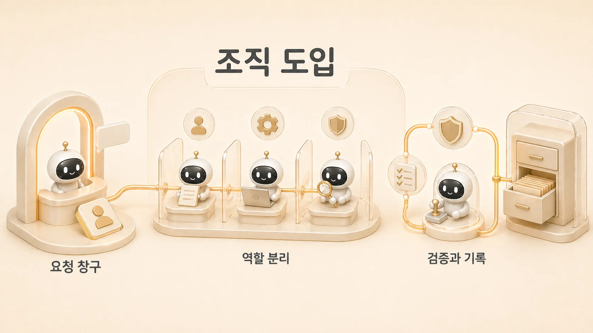

## 10장. AI 에이전트 조직 도입과 운영 확장

Hermes Agent를 개인용 AI 개인비서로 쓰는 것과 조직의 업무 자동화 시스템으로 확장하는 것은 다른 문제다. [Hermes Agent](https://wikidocs.net/346055)를 조직에 도입하려면 역할, 권한, 기록, 검증, 책임자가 함께 정리되어야 한다. 개인은 하비 하나로도 많은 일을 처리할 수 있지만, 조직에서는 그 기준을 팀원이 함께 볼 수 있는 운영 문서와 승인 흐름으로 꺼내야 한다.

개인 운영에서는 “내가 아는 맥락”이 판단 기준이 될 수 있다. 하지만 조직에서는 그 맥락이 사람마다 다르다. 누군가는 Slack 대화만 보고 판단하고, 누군가는 GitHub 이력을 기준으로 삼고, 누군가는 WikiDocs에 올라온 공유 문서만 본다. 이 기준이 맞지 않으면 AI 에이전트 도입은 모델 성능과 무관하게 흔들린다.

10장은 “AI 에이전트를 도입하면 일이 자동으로 좋아진다”는 기대를 낮추고, 실제 운영으로 이어지는 조건을 다룬다. AI 에이전트 도입, AI 에이전트 도입 사례, AI 에이전트 운영 사례를 찾는 독자에게도 핵심은 더 좋은 모델을 고르는 일이 아니다. 요청이 들어오고, [역할형 에이전트](https://wikidocs.net/345925)가 나뉘고, 결과가 검증되고, 지식으로 남는 흐름을 만드는 일이다. 이 조건이 잡히면 다음 장의 실제 케이스를 단순 성공담이 아니라 재현 가능한 업무 자동화 흐름으로 읽을 수 있다.

## 이 장에서 다루는 문제

| 순서 | 글 | 핵심 질문 |
|---|---|---|
| 10-1 | AI 에이전트 도입은 왜 운영에서 자주 무너질까 | 데모는 잘 되는데 실제 조직 운영에서는 왜 멈추거나 흐려질까 |

## 조직 도입 전에 정리할 기준

| 산출물 | 확인 질문 |
|---|---|
| 첫 도입 업무 후보 | 권한이 작고 검증이 쉬운 반복 업무부터 시작하는가 |
| 조직용 역할표 | 메인 창구/조사/정리/실행/이미지/승인 책임이 보이는가 |
| 권한/기록 기준 | 누가 실행하고 어디에 결과를 남길지 정했는가 |
| 확장 판단표 | 개인 운영에서 조직 운영으로 넘길 때 필요한 조건이 보이는가 |

## 개인 운영과 조직 운영은 무엇이 다른가

개인 운영에서는 사용자가 하비에게 바로 말하고, 하비가 맥락을 해석하고, 필요하면 방울이/뽀동이/하망이에게 나눈다. 이 구조는 빠르다. 하지만 조직으로 가면 누가 요청했는지, 어떤 권한으로 실행하는지, 결과를 어디에 남길지, 누가 최종 승인할지까지 정해야 한다.

예를 들어 콘텐츠 운영 하나만 봐도 그렇다. 방울이의 오전 리서치, 뽀동이의 글 구조화, 하망이의 이미지 제작, 하비의 최종 통합, GitHub/WikiDocs 발행, Obsidian/shared-memory 기록이 모두 이어져야 한다. 개인이 머릿속으로 잡고 있던 흐름을 조직에서는 문서와 체크리스트로 꺼내야 한다.

## 조직 도입에서 자주 무너지는 지점

| 무너지는 지점 | 겉으로 보이는 증상 | 실제 원인 |
|---|---|---|
| 요청 창구 | 여러 채널에서 AI를 부른다 | 메인 창구가 없다 |
| 역할 분리 | 모두가 조사/작성/실행을 동시에 한다 | 역할형 에이전트 기준이 없다 |
| 권한 | 도구는 붙었는데 실행을 못 한다 | 계정/범위/승인 기준이 없다 |
| 기록 | 결과가 사라진다 | source of truth가 없다 |
| 검증 | 한 번은 되지만 반복 품질이 없다 | 체크리스트가 없다 |
| 복구 | 문제 때마다 새로 추측한다 | 플레이북이 없다 |

이 표는 모델이 약해서 생기는 문제가 아니다. 운영 구조가 없어서 생기는 문제다.

## 조직에서 시작하기 좋은 범위

AI 에이전트 도입은 큰 자동화보다 작은 반복 업무에서 시작하는 편이 좋다. 예를 들어 Daily Briefing Bot처럼 [cron](https://wikidocs.net/345926)이 조사 시작점을 만들고, 사람이 검토하고, 필요한 것만 콘텐츠나 제품 신호로 넘기는 흐름은 적합하다. 권한이 과하지 않고, 결과 검증이 가능하며, 기록 위치도 분명하기 때문이다.

반대로 처음부터 모든 회의, 메일, 문서, 배포를 AI에게 맡기면 책임 경계가 흐려진다. 조직은 개인보다 실패 비용이 크다. 작게 시작해도 요청 창구, 역할 분리, 검증, 기록, 복구 순서가 모두 보여야 한다.

## 이 장에서 얻을 기준

- 조직 도입은 모델 선택보다 운영 흐름 설계가 먼저다.
- 첫 도입 범위는 권한이 작고 검증이 쉬운 반복 업무가 좋다.
- 팀 채널에서는 [멀티봇 호출 규칙](https://wikidocs.net/345913)을 먼저 정한다.
- 업무 결과는 GitHub, WikiDocs, Obsidian, shared-memory 중 어디에 남을지 정한다.
- 데모 성공보다 반복 성공을 기준으로 본다.

## 다음 장으로 가기 전 체크 질문

- 조직에서 AI 요청을 받는 메인 창구가 하나로 보이는가?
- 조사/정리/실행/이미지/제품 정리 역할이 구분되어 있는가?
- 도구 권한과 승인 기준이 문서로 남아 있는가?
- 결과가 사라지지 않고 source of truth로 들어가는가?
- 문제가 생겼을 때 누구나 같은 순서로 복구할 수 있는가?
