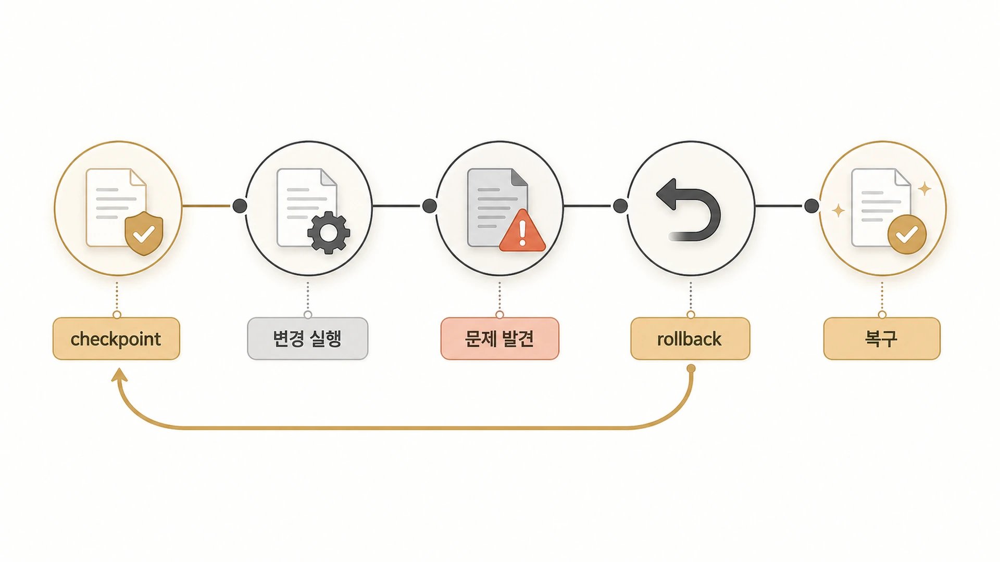

## Hermes Agent checkpoint와 rollback은 복구 흐름에서 어떻게 쓸까

Hermes Agent 복구에서 가장 좋은 상황은 “문제가 생기기 전 상태로 돌아갈 수 있는 길이 이미 있는 것”이다. [공식 Checkpoints and rollback 문서](https://hermes-agent.nousresearch.com/docs/user-guide/checkpoints-and-rollback)는 Hermes Agent가 destructive operation 전 project snapshot을 만들고, `/rollback`으로 되돌릴 수 있다고 설명한다. 이 기능은 복구 플레이북의 마지막 보험이 아니라, 실행 전부터 확인해야 할 안전망이다. 되돌리기 전에 [복구 플레이북](https://wikidocs.net/345918)처럼 증상, 영향 범위, 판단 순서를 먼저 확인해야 한다.



중요한 점은 checkpoint가 있다고 해서 아무렇게나 실행해도 되는 것은 아니라는 점이다. checkpoint는 실수를 줄이는 장치가 아니라, 실수 후 복구 범위를 좁히는 장치다. 실행 전 승인, 실행 환경 격리, credential 최소화가 먼저이고, rollback은 그다음이다.

## checkpoint가 필요한 순간

공식 문서 기준 checkpoint는 파일 변경 도구나 destructive terminal command 같은 mutating operation 전에 만들어진다. 운영에서는 아래 상황을 checkpoint 필요 작업으로 본다.

| 상황 | checkpoint 확인이 필요한 이유 |
|---|---|
| 여러 Markdown 페이지를 한 번에 수정 | 어느 문장이 깨졌는지 되돌리기 어렵다 |
| TOC/링크/이미지 경로 변경 | 공개 WikiDocs 구조가 흔들릴 수 있다 |
| 설정 파일 수정 | gateway/cron/model routing에 영향이 갈 수 있다 |
| migration 작업 | 이전 기준과 새 기준이 섞일 수 있다 |
| 삭제/이동/rename 작업 | 복구 범위가 커질 수 있다 |

실행 전에는 “고칠 수 있을까?”보다 “되돌릴 기준점이 있는가?”를 먼저 본다.

## `/rollback`을 복구 플레이북에 넣는 법

복구 플레이북에는 명령어 자체보다 판단 순서를 적어야 한다.

```text
1. 현재 증상과 마지막 정상 상태를 적는다.
2. git status 또는 현재 파일 상태를 확인한다.
3. Hermes checkpoint 목록을 확인한다.
4. 필요한 경우 rollback diff로 되돌릴 범위를 미리 본다.
5. 전체 rollback인지 단일 파일 rollback인지 고른다.
6. rollback 후 검증 명령/문서 검사를 다시 실행한다.
7. 왜 rollback이 필요했는지 체크리스트에 반영한다.
```

핵심은 바로 되돌리지 않는 것이다. diff를 먼저 보고, 전체 복구와 단일 파일 복구를 나눈다.

## git과 checkpoint의 역할을 나눈다

공식 문서는 Hermes checkpoint가 별도 shadow git repository 아래에서 관리되고, 실제 project `.git`을 건드리지 않는다고 설명한다. 그래서 운영에서는 git과 checkpoint를 서로 대체재로 보지 않는다.

| 도구 | 역할 |
|---|---|
| git | 공개 원본/원본 기준, commit 단위 변경 이력 |
| Hermes checkpoint | 작업 중 실수 복구, turn 단위 안전망 |
| WikiDocs sync | 공개 배포 반영 확인 |
| 복구 플레이북 | 무엇을 먼저 보고 어떻게 되돌릴지 정하는 순서 |

GitHub에 이미 반영한 뒤의 문제라면 git revert/patch가 더 맞을 수 있다. 작업 중 아직 commit하지 않은 변경이라면 checkpoint/rollback이 빠를 수 있다.

## rollback 후 검증 기준

rollback은 끝이 아니라 중간 단계다. 되돌린 뒤에는 아래를 다시 확인한다.

- `git status`가 의도한 상태인지 확인한다.
- TOC 링크와 이미지 경로가 깨지지 않았는지 본다.
- H1, heading spacing, raw `.md` 링크, 불필요한 구분 문자 같은 WikiDocs 검증을 다시 돌린다.
- gateway/cron/config를 건드렸다면 실제 process와 delivery를 확인한다.
- 실패 원인을 체크리스트나 Skill 보강 후보로 남긴다.

복구는 “원래대로 돌아왔다”가 아니라 “같은 문제가 다시 줄었다”까지 가야 끝난다.

rollback은 [복구 플레이북](https://wikidocs.net/345918) 안에서 위치가 정해져야 한다. 위험 명령을 실행하기 전에는 [승인/YOLO mode 기준](https://wikidocs.net/346260)을 확인하고, 실행 후에는 GitHub 원본이나 WikiDocs 공개본처럼 원본 기준가 실제로 회복됐는지 검증한다.

## FAQ

### checkpoint가 있으면 git commit을 덜 해도 되나요?

아니다. checkpoint는 작업 중 안전망이고, git commit은 원본 기준 이력이다. 공개 책이나 운영 문서는 여전히 GitHub 원본에 정리된 commit으로 남겨야 한다.

### rollback은 언제 바로 실행해도 되나요?

작업 범위가 작고, diff를 봤고, 되돌릴 대상이 분명할 때다. 범위가 불명확하면 먼저 증상과 변경 목록을 기록한다.
