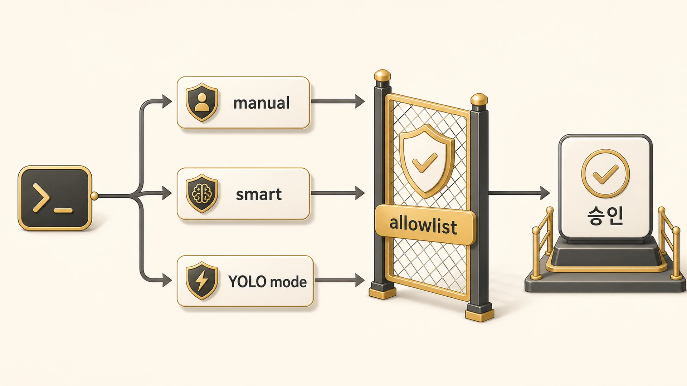

## Hermes Agent 위험 명령 승인과 YOLO mode는 어떻게 관리할까

Hermes Agent는 실행형 에이전트가 강력한 만큼 위험 명령 승인 기준이 중요하다. [공식 Security 문서](https://hermes-agent.nousresearch.com/docs/user-guide/security)는 `approvals.mode`를 `manual`, `smart`, `off`로 나누고, 위험 명령은 기본적으로 사람의 승인을 거치게 한다. 이 장에서의 핵심은 “승인을 귀찮게 볼 것인가, 운영 안전장치로 볼 것인가”다. 실행 범위가 넓어질수록 [gateway 권한과 실행 격리](https://wikidocs.net/346261)를 같이 점검해야 한다.



위험 명령 승인은 속도를 늦추기 위한 장치가 아니다. AI가 파일을 고치고, shell을 실행하고, 배포나 삭제에 가까운 일을 할 때 사용자가 마지막 경계를 잡는 장치다. 특히 Slack/gateway처럼 채팅에서 바로 실행되는 환경에서는 승인 기준이 없으면 대화와 실행의 경계가 흐려진다.

## approval mode를 고르는 기준

| mode | 의미 | 추천 상황 | 피해야 할 상황 |
|---|---|---|---|
| manual | 위험 명령마다 사람에게 묻는다 | 일반 운영, 학습 중인 환경, 민감 repo | 너무 많은 반복 명령이 이미 검증된 경우 |
| smart | 보조 판단으로 낮은 위험은 통과, 애매하면 묻는다 | 반복 작업이 많지만 완전 자동화는 부담스러운 경우 | 보조 판단 기준을 신뢰할 수 없는 환경 |
| off | 승인 확인을 끈다 | disposable container, CI, 충분히 격리된 실험 | 개인 PC, 운영 repo, 민감 credential이 있는 환경 |

기본값은 보수적으로 잡는 편이 좋다. 처음에는 `manual`을 쓰고, 반복되는 안전 명령만 점진적으로 허용한다.

## YOLO mode를 써도 되는 경우와 안 되는 경우

YOLO mode는 현재 세션에서 위험 명령 승인 prompt를 우회한다. 공식 docs 기준으로 CLI flag, `/yolo`, 환경 변수로 켤 수 있다. 이름처럼 편하지만, 운영에서는 “편한 mode”가 아니라 “안전 경계를 의도적으로 내리는 mode”로 봐야 한다.

| 상황 | 판단 |
|---|---|
| throwaway sandbox에서 테스트 데이터를 지우는 작업 | 제한적으로 가능 |
| Docker/Modal 같은 격리 환경에서 반복 검증 스크립트를 돌리는 작업 | 조건부 가능 |
| 운영 repo에서 파일 삭제/대량 변경이 섞인 작업 | 피한다 |
| gateway가 열린 Slack 세션에서 여러 사람이 부르는 작업 | 피한다 |
| credential이 들어간 환경에서 외부 command를 실행하는 작업 | 피한다 |

YOLO를 켜야 한다면 먼저 세 가지를 확인한다. 작업 디렉터리가 맞는가, 되돌릴 수 있는가, credential이 노출될 수 있는가.

## permanent allowlist를 쓸 때의 원칙

공식 docs는 승인 prompt에서 `always`를 선택하면 config에 permanent allowlist가 저장될 수 있다고 설명한다. 이 기능은 반복 작업에는 편하지만, 오래된 allowlist는 나중에 위험해질 수 있다.

```text
allowlist 판단 기준
- 명령 전체를 넓게 허용하지 않는다.
- repo/path/context가 바뀌면 다시 검토한다.
- 삭제, 권한 변경, 네트워크 전송, credential 접근 명령은 permanent allowlist에 넣지 않는다.
- 분기마다 config를 열어 오래된 allowlist를 지운다.
```

좋은 allowlist는 “이 명령은 언제나 안전하다”가 아니라 “이 환경/이 목적에서는 반복 승인할 만큼 위험이 낮다”에 가깝다.

## 실행 전 5초 점검

위험 명령 승인 prompt가 떴을 때는 아래 질문을 빠르게 본다.

1. 이 명령이 읽기인지 쓰기인지 구분했는가?
2. 작업 디렉터리가 예상한 repo인가?
3. 삭제/이동/권한 변경/네트워크 전송이 포함되는가?
4. 되돌릴 checkpoint, git 상태, 백업이 있는가?
5. 이 승인 범위를 one/session/always 중 어디까지 줄 것인가?

이 질문에 답하지 못하면 `deny`가 기본이다. 공식 docs에서도 approval timeout은 응답이 없으면 deny되는 fail-closed 방식으로 설명된다.

승인 기준은 [보안 체크리스트](https://wikidocs.net/346259)와 [gateway 권한/실행 격리](https://wikidocs.net/346261)를 함께 봐야 한다. 특히 cron이나 Slack gateway처럼 사람이 없는 실행 경로에서는 빠른 실행보다 되돌릴 수 있는 범위와 로그가 먼저다.

## FAQ

### `session` 승인은 안전한가요?

항상 안전한 것은 아니다. 같은 pattern이 반복되는 동안 세션 안의 작업 범위가 바뀔 수 있다. session 승인은 같은 repo, 같은 목적, 같은 위험 수준일 때만 쓴다.

### `always`를 누르면 안 되나요?

쓸 수는 있다. 다만 삭제, credential 접근, 외부 전송, 권한 변경처럼 피해가 큰 명령은 permanent allowlist에 넣지 않는 편이 좋다.
