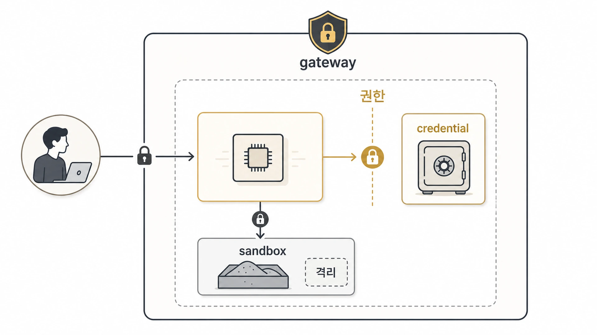

## Hermes Agent Messaging Gateway 권한과 실행 격리는 어떻게 나눌까

Hermes Agent를 CLI로 혼자 쓸 때와 Messaging Gateway로 Slack/Telegram/Discord에 붙일 때의 위험은 다르다. CLI는 사용자가 직접 보고 실행하지만, Messaging Gateway는 메시징 플랫폼에서 호출되고 cron과 연결될 수 있다. 여기서 말하는 gateway는 메시징 채널 연결 기능이며, web/image/TTS/browser 도구 호출을 Nous 구독으로 라우팅하는 Nous Tool Gateway와는 다르다. 그래서 권한 기준은 “모델이 똑똑한가”가 아니라 “누가 호출하고, 어디서 실행되고, 어떤 credential을 볼 수 있는가”에서 시작해야 한다. 문제가 생겼을 때는 [checkpoint와 rollback](https://wikidocs.net/346262)으로 되돌릴 수 있는 경계도 함께 설계해야 한다.



[공식 Security 문서](https://hermes-agent.nousresearch.com/docs/user-guide/security)는 gateway user authorization, container isolation, environment variable passthrough, MCP credential handling을 따로 설명한다. 운영에서는 이 네 가지를 따로 보되, 하나의 권한 표로 묶어 관리하는 편이 안전하다.

## 권한은 세 층으로 나눈다

| 층 | 질문 | 대표 기준 |
|---|---|---|
| 호출 권한 | 누가 bot에게 말할 수 있는가 | allowlist, DM pairing, platform별 allowed users |
| 실행 권한 | bot이 어디서 명령을 실행하는가 | local, Docker, Modal, SSH, workdir allowlist |
| credential 권한 | 어떤 key/file을 볼 수 있는가 | env passthrough, skill-scoped credential, MCP env filtering |

이 셋을 섞으면 문제가 생긴다. 예를 들어 Slack 사용자를 제한했다고 해서 실행 환경이 안전해지는 것은 아니다. Docker로 격리했다고 해서 credential이 안전한 것도 아니다. credential을 최소화했다고 해서 아무나 bot을 호출해도 되는 것도 아니다.

## gateway 사용자 권한 기준

공식 문서 기준 gateway는 platform allowlist, global allowlist, allow-all, DM pairing 같은 방식으로 사용자를 승인한다. 운영에서는 allow-all을 기본값처럼 쓰지 않는 것이 좋다.

```text
gateway 권한 체크
1. 운영 채널과 테스트 채널을 나눈다.
2. 운영 채널은 allowlist 또는 pairing 승인 사용자를 기준으로 둔다.
3. allow-all은 일시 테스트 또는 폐쇄 환경에서만 쓴다.
4. unknown DM 처리 방식을 pair/ignore 중 의도적으로 고른다.
5. 승인된 사용자 목록은 정기적으로 검토한다.
```

특히 팀 채널에서는 “메시지를 볼 수 있는 사람”과 “AI에게 실행을 시킬 수 있는 사람”이 다를 수 있다. 이 차이를 문서화해야 한다.

## 실행 환경 격리 기준

Hermes Agent의 terminal backend는 local만 있는 것이 아니다. 공식 문서는 Docker 같은 sandbox backend와 resource limit, filesystem persistence, env 전달 기준을 함께 설명한다.

| 실행 위치 | 장점 | 주의점 |
|---|---|---|
| local | 빠르고 단순하다 | 호스트 파일/credential에 가까워진다 |
| Docker | 호스트와 작업 공간을 분리하기 좋다 | container에 넘긴 env는 읽힐 수 있다 |
| Modal/remote backend | 무거운 작업이나 격리에 유리하다 | credential mount와 동기화 기준이 필요하다 |
| SSH | 원격 환경 작업에 유리하다 | 원격 권한/경로/원본 기준을 따로 확인해야 한다 |

실무 기준은 단순하다. 읽기/문서화 중심 작업은 local도 가능하지만, 삭제/대량 수정/외부 code 실행이 섞이면 sandbox를 먼저 검토한다.

## credential passthrough는 최소화한다

공식 문서는 skill-scoped passthrough와 config-based passthrough를 나눠 설명한다. Skill이 필요한 env를 선언하면 해당 skill에 필요한 값만 통과시키고, 그 외 값은 `terminal.env_passthrough` 같은 명시 설정으로 다룬다.

판단 기준은 아래처럼 잡는다.

- provider API key 같은 Hermes infrastructure secret은 임의 passthrough 대상에 넣지 않는다.
- GitHub token처럼 작업에 필요한 credential도 작업 목적과 범위를 줄인다.
- credential file은 가능하면 read-only mount로 취급한다.
- MCP server에는 필요한 env만 명시하고, 기본 host env를 그대로 넘기지 않는다.
- 오류 메시지나 로그에 token, bearer, password, secret 값이 남지 않는지 확인한다.

credential은 “있으면 편한 값”이 아니라 “노출되면 사고가 되는 값”이다.

## 권한 표 예시

```text
채널: Slack 운영 채널
호출자: 승인된 사용자만
실행 위치: 기본 local, 위험 작업은 Docker
credential: GitHub 발행 작업에 필요한 token만 제한적으로 사용
금지: allow-all, YOLO 상시 사용, provider key passthrough, 미검토 외부 script 실행
복구: git 상태 확인 → checkpoint/rollback 또는 수동 revert → 결과 기록
```

이 정도만 적어도 팀 안에서 “이 bot이 어디까지 할 수 있는가”가 훨씬 명확해진다.

## 채널 권한과 실행 권한을 분리한다

Slack 채널에 봇이 들어와 있다고 해서 그 채널의 모든 사람이 같은 실행 권한을 가져야 하는 것은 아니다. 메시지를 읽는 권한, 답변을 받는 권한, 파일을 읽는 권한, terminal을 실행하는 권한은 다르게 봐야 한다.

| 권한 | 운영 질문 |
|---|---|
| 호출 권한 | 누가 봇을 부를 수 있는가 |
| 채널 권한 | 어느 채널/스레드에서 응답할 수 있는가 |
| 도구 권한 | 파일/브라우저/terminal/MCP 중 무엇을 쓸 수 있는가 |
| 실행 권한 | 위험 명령은 승인 없이 실행될 수 있는가 |
| 전달 권한 | 결과를 어디로 보낼 수 있는가 |

팀 채널에서는 최소한 `호출 권한`과 `실행 권한`을 분리해야 한다. 누구나 질문은 할 수 있어도, 파일 수정/배포/터미널 실행은 승인된 사용자나 별도 실행형 에이전트로 제한하는 방식이 안전하다.

이 페이지의 권한 표는 [always-on gateway](https://wikidocs.net/345906), [보안 체크리스트](https://wikidocs.net/346259), [checkpoint/rollback 복구](https://wikidocs.net/346262)를 함께 읽을 때 실제 사용 기준이 된다. 채널 권한과 실행 권한을 분리해야 멀티봇 운영에서도 책임 경계가 흐려지지 않는다.

## FAQ

### Slack 채널에 있는 사람은 모두 실행 권한을 가져도 되나요?

아니다. 읽을 수 있는 권한과 실행시킬 수 있는 권한은 다르다. gateway allowlist나 pairing으로 실행 권한을 별도로 관리하는 편이 안전하다.

### Docker를 쓰면 credential도 자동으로 안전한가요?

아니다. Docker에 넘긴 env나 mounted credential file은 container 안에서 접근될 수 있다. sandbox와 credential 최소화는 같이 써야 한다.
