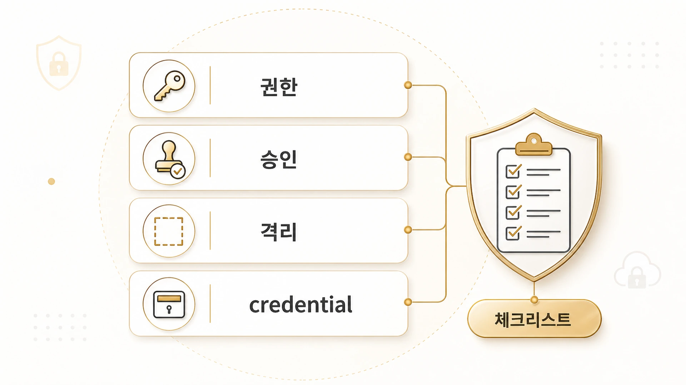

## Hermes Agent 보안 체크리스트는 어떻게 만들까

Hermes Agent 보안은 “나쁜 명령을 조심하자”에서 끝나지 않는다. [공식 Security 문서](https://hermes-agent.nousresearch.com/docs/user-guide/security)는 사용자 권한, 위험 명령 승인, 컨테이너 격리, MCP credential filtering, context file scanning, cross-session isolation, input sanitization을 함께 본다. 즉 보안은 한 옵션이 아니라 운영 층위 전체의 문제다. 위험 명령은 [승인/YOLO mode 기준](https://wikidocs.net/346260)과 함께 관리해야 한다.



AI 개인비서와 역할형 에이전트를 실제 업무에 붙이면 권한이 빠르게 넓어진다. Slack에서 부르고, 터미널을 열고, GitHub를 고치고, WikiDocs를 발행하고, cron이 혼자 실행된다. 그래서 9장의 보안 체크리스트는 “무엇을 막을까”보다 “누가/어디서/무엇을/어떤 권한으로 실행하는가”를 먼저 묻는다.

[TOC]

## 공식 문서 기준 7개 보안 층

| 층 | 공식 기준 | 운영에서 묻는 질문 |
|---|---|---|
| 사용자 권한 | allowlist, DM pairing | 누가 이 에이전트에게 말할 수 있는가 |
| 위험 명령 승인 | manual/smart/off approval | 사람이 확인해야 하는 실행인가 |
| 실행 격리 | Docker/Singularity/Modal/Daytona | 호스트를 건드려도 되는 작업인가 |
| MCP credential filtering | subprocess env filtering | 외부 도구가 꼭 필요한 credential만 받는가 |
| context file scanning | prompt injection 탐지 | 프로젝트 지침 파일을 그대로 믿어도 되는가 |
| 세션 격리 | session/cron storage isolation | 다른 세션 상태를 침범하지 않는가 |
| 입력 sanitization | working directory allowlist | 경로/입력값이 shell injection으로 이어지지 않는가 |

이 표를 그대로 외울 필요는 없다. 중요한 것은 기능을 켤 때마다 이 일곱 질문 중 어디가 바뀌는지 보는 것이다.

## Hermes Agent 운영 보안 체크리스트

처음 운영 환경을 만들 때는 아래 순서로 점검한다.

```text
1. gateway를 누가 호출할 수 있는지 allowlist 또는 pairing 기준을 정한다.
2. 위험 명령 승인 모드가 manual/smart/off 중 무엇인지 확인한다.
3. YOLO 또는 approvals.mode: off를 상시 운영에 쓰고 있지 않은지 본다.
4. terminal backend가 local인지 Docker/remote sandbox인지 확인한다.
5. container로 넘기는 env와 credential file이 최소 범위인지 본다.
6. MCP server env가 필요한 값만 받는지 확인한다.
7. AGENTS.md/SOUL.md/.cursorrules 같은 context file에 수상한 지시가 없는지 본다.
8. cron prompt가 fresh session에서 혼자 실행될 만큼 안전한지 본다.
9. 실패 시 rollback/checkpoint 또는 Git 상태로 되돌아올 수 있는지 본다.
```

체크리스트는 길어질수록 안 쓰인다. 운영 첫날에는 1~4번만으로도 충분하다. gateway, cron, MCP, Docker가 붙기 시작하면 5~9번을 추가한다.

## 전용 머신/개인 PC/클라우드 판단표

보안 질문은 추상적으로 두면 실천하기 어렵다. 입문자에게 필요한 것은 “내 노트북에 깔아도 되는가”에 대한 판단표다.

| 환경 | 써도 좋은 경우 | 피해야 할 경우 |
|---|---|---|
| 개인 PC | CLI 실습, 읽기 위주 작업, 제한된 폴더 접근 | 개인 계정/업무 자료가 많고 terminal 권한이 넓은 경우 |
| 전용 Mac mini/미니 PC | Slack gateway, cron, 장기 실행 작업 | 물리 보안/원격 접속/백업 기준이 없는 경우 |
| VPS/클라우드 | 팀 채널, webhook, 외부 접속이 필요한 자동화 | 비용 알림, 방화벽, secret 관리가 없는 경우 |
| Docker sandbox | 위험 명령, 재현 가능한 빌드/테스트 | container에 모든 host credential을 넘기는 경우 |
| 임시 disposable 환경 | 실험적 코드 실행, 외부 repo 검증 | 결과 보존과 로그 회수가 필요한 장기 작업 |

핵심은 완벽히 안전한 환경을 찾는 것이 아니라, 실패했을 때 무엇이 노출되고 무엇을 되돌릴 수 있는지 미리 정하는 것이다.

## 운영에서 자주 놓치는 부분

| 놓치는 부분 | 왜 위험한가 | 안전한 기준 |
|---|---|---|
| allow-all 설정 | 원하지 않는 사용자가 bot을 호출할 수 있다 | 운영 채널은 allowlist/pairing을 기본으로 둔다 |
| YOLO 상시 사용 | 위험 명령 승인 경계가 사라진다 | disposable sandbox나 검증된 자동화에만 제한한다 |
| provider key passthrough | 모델/API key가 도구 실행 환경에 노출될 수 있다 | Hermes infrastructure secret은 전용 경로로 두고 임의 passthrough를 피한다 |
| cron prompt 과신 | 사람이 없는 fresh session에서 실행된다 | self-contained prompt와 실패 보고 기준을 둔다 |
| context file 과신 | 프로젝트 파일이 agent 지침으로 들어간다 | 외부/이전 repo의 지침 파일은 먼저 읽고 검토한다 |

보안은 “모두 막기”가 아니다. 실행해야 할 일은 실행하되, 호출자/도구/credential/복구 경로를 분리하는 것이다.

이 보안 기준은 앞의 [gateway 권한/실행 격리](https://wikidocs.net/346261), [위험 명령 승인](https://wikidocs.net/346260), [checkpoint/rollback](https://wikidocs.net/346262)과 한 묶음으로 읽어야 한다. 보안 체크리스트만 따로 두면 경고 문서가 되고, 복구 경로까지 연결하면 실제 사용 기준이 된다.

## FAQ

### 개인용이면 allowlist가 꼭 필요한가요?

gateway를 켠다면 필요하다. CLI로 혼자 쓰는 것과 메시징 플랫폼에서 bot을 열어 두는 것은 다르다. DM pairing이나 allowlist가 없으면 예상하지 못한 사용자가 호출할 수 있다.

### Docker를 쓰면 안전 문제가 끝나나요?

아니다. Docker는 호스트 보호에 도움이 되지만, container에 넘긴 env나 credential은 container 안에서 읽힐 수 있다. 격리는 시작점이고, credential 최소화가 같이 필요하다.
