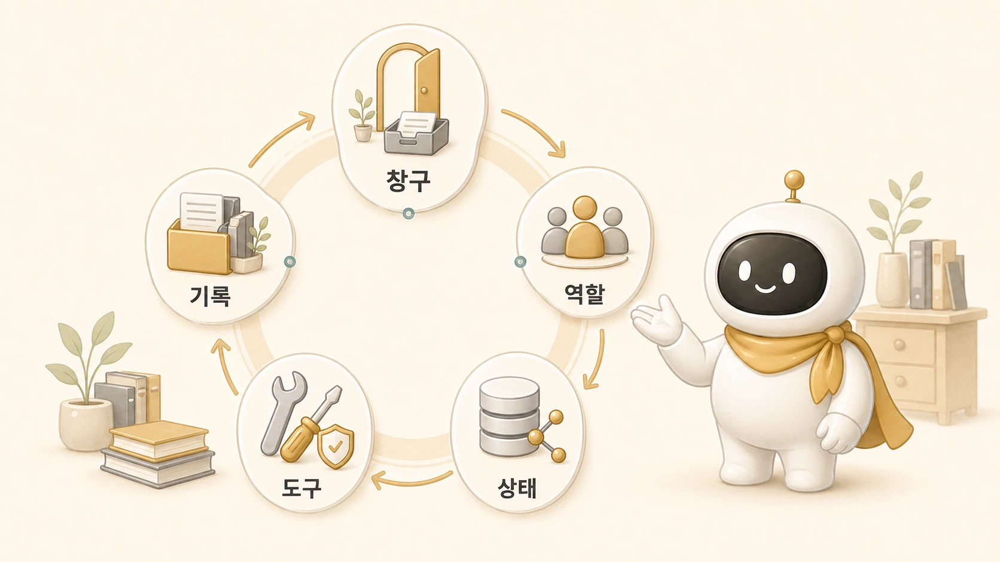
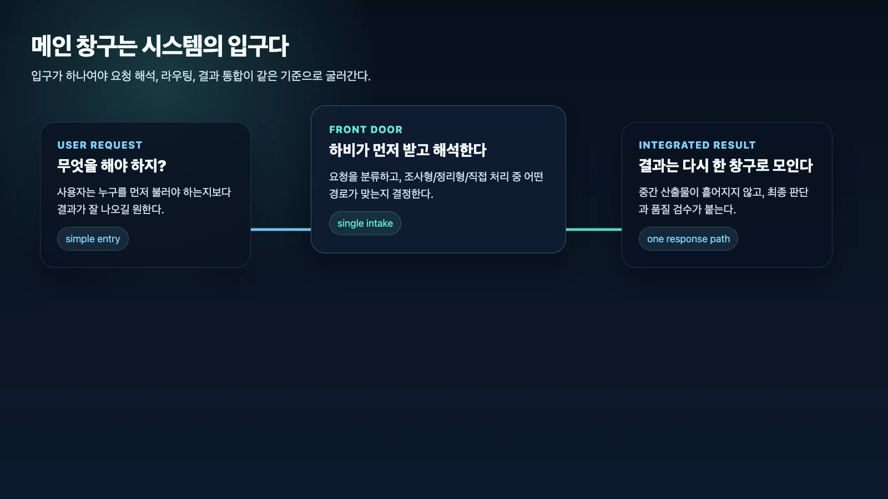
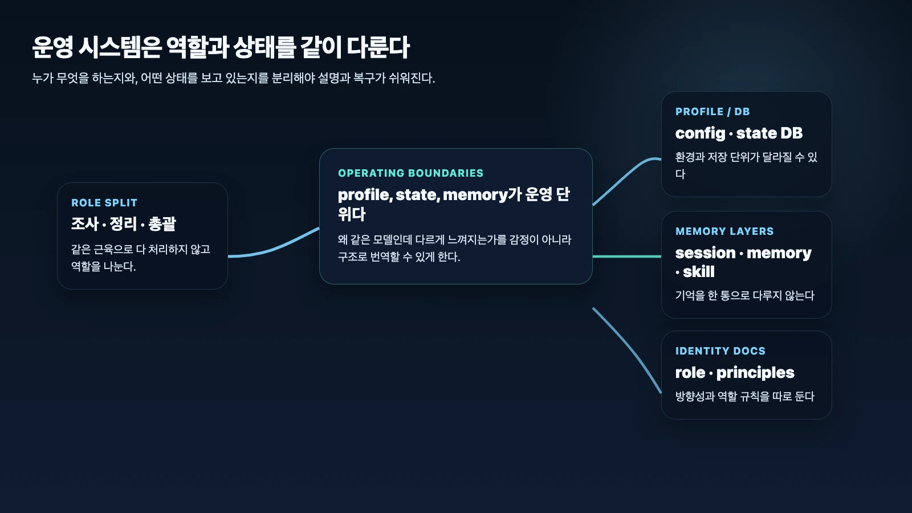
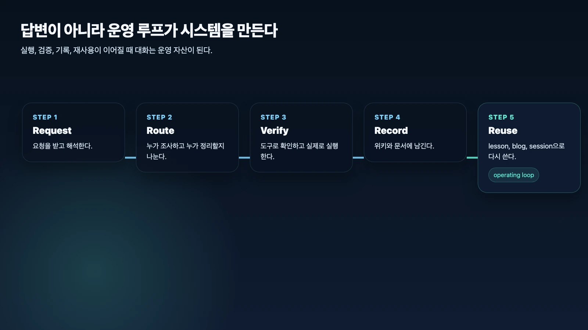

## 에르메스 에이전트(Hermes Agent)는 왜 운영 시스템인가

에르메스 에이전트(Hermes Agent)는 단순 챗봇이 아니라 AI 개인비서, 역할형 에이전트, 메모리, 스킬, 외부 도구, 자동화가 함께 움직이는 운영 시스템이다. 질문에 답하는 것에서 끝나지 않고, 요청을 해석하고, 일을 나누고, 실행을 검증하고, 결과를 기록으로 남기는 구조까지 다룬다.



처음에는 챗봇처럼 보일 수 있다. 질문을 받고 답하고, 도구를 쓰고, 메모를 남기기 때문이다. 하지만 실제 업무에 붙여보면 중요한 지점은 답변 한 번의 품질이 아니다. 누가 요청을 받고, 누가 조사하고, 누가 정리하고, 어떤 프로필과 기억을 쓰고, 무엇을 공유 자산으로 남길지가 더 중요해진다.

## 이 글의 답

Hermes를 운영 시스템으로 봐야 하는 이유는 이 시스템이 단순히 말 잘하는 AI가 아니라 **창구, 역할, 상태, 기억, 도구, 기록을 함께 굴리는 구조**이기 때문이다.

핵심은 다섯 가지다.

- 메인 창구가 요청 해석과 라우팅을 책임진다.
- 역할 분리형 구조가 조사/정리/최종 판단을 나눈다.
- 프로필은 캐릭터가 아니라 상태 저장 단위다.
- 기억은 [session](https://wikidocs.net/346126), memory, skill, identity로 레이어가 나뉜다.
- 도구 실행과 기록 자산화까지 연결되어야 실제 운영이 된다.

즉, 이건 똑똑한 답변 하나의 문제가 아니라 **지속적으로 굴러가는 운영 구조를 어떻게 만들 것인가**의 문제다.

## 왜 챗봇이라고만 보면 자꾸 설명이 어긋날까

많은 사람이 AI 시스템을 볼 때 먼저 이렇게 생각한다.

- 질문하면 답한다.
- 잘 말하면 좋은 AI다.
- 기능이 많으면 더 좋은 시스템이다.

이 관점 자체가 완전히 틀린 건 아니다. 하지만 Hermes를 여기에만 맞춰 보면 자꾸 설명이 어긋난다.

예를 들어 실제로 중요한 건 이런 것들이다.

- 누가 이 요청을 먼저 받는가.
- 조사와 정리를 같은 방식으로 처리해도 되는가.
- 어떤 profile이 살아 있는가.
- 지금의 답이 session 때문인가 memory 때문인가 [skill](https://wikidocs.net/345904) 때문인가.
- 실제로 확인하고 실행했는가.
- 이 결과를 나중에 다시 찾을 수 있게 남겼는가.

즉, Hermes의 핵심은 한 번의 대화가 아니라 **대화를 포함한 운영 전체 흐름**이다.

## 실제 운영에서 드러난 차이

WikiDocs 책을 만드는 작업은 이 차이를 잘 보여준다. 처음 요청은 “블로그 내용이 잘 옮겨졌는지 봐달라”였다. 챗봇 관점이라면 현재 목차를 요약하고 끝낼 수 있다.

하지만 운영 시스템 관점에서는 일이 이렇게 바뀐다.

```text
현재 상태 확인
→ 원본 자료와 목차 확인
→ 빠진 내용과 중복 내용 점검
→ 읽는 사람에게 필요한 흐름으로 재구성
→ 본문 링크와 이미지 확인
→ 함께 공유할 수 있는 범위로 정리
→ 발행 후 화면에서 다시 확인
```

여기서 Hermes는 대화 상대가 아니라 운영 흐름의 접착제가 된다. 요청을 받고, 필요한 자료를 확인하고, 본문을 고치고, 검증하고, 공개 채널에 남긴다. 답변만 잘하는 시스템이라면 이 흐름을 끝까지 책임지기 어렵다.

## 메인 창구가 왜 이 시스템의 시작점인가

Hermes는 여러 역할이 있어도 사용자 앞에서는 하비 같은 메인 창구가 먼저 받는다.

이게 중요한 이유는 단순하다.

- 요청 해석을 한 곳에서 한다.
- 누가 조사할지, 누가 정리할지 사용자가 매번 고르지 않아도 된다.
- 결과가 흩어지지 않고 한 창구로 모인다.

좋은 운영 시스템은 기능이 많아 보이는 것보다 **입구가 단순한 것**이 더 중요할 때가 많다. 그래서 Hermes를 챗봇보다 운영 시스템이라고 보는 순간, 하비는 캐릭터가 아니라 **front door이자 orchestrator**로 이해된다.



## 왜 역할 분리와 프로필 경계가 같이 중요할까

두 번째 핵심은 역할과 상태를 한 덩어리로 보지 않는다는 점이다.

Hermes에선 보통 이런 구분이 들어간다.

- 조사형
- 정리형
- 실행형
- 이미지형
- 총괄형

그리고 profile에 따라 달라질 수 있는 것도 분명하다.

- config
- state DB
- session history
- installed skills
- identity docs
- gateway 상태

이 말은 Hermes가 단순히 여러 봇이 있는 시스템이라는 뜻이 아니다. **역할 분리와 상태 경계를 운영 단위로 본다**는 뜻이다.

그래서 같은 모델을 써도 다르게 느껴질 수 있고, 같은 하비인데 기억이 다르게 느껴지는 일도 구조적으로 설명할 수 있다. 좋은 운영 시스템은 개성을 늘리는 게 아니라 **경계를 선명하게 만드는 방식**으로 안정성을 얻는다.

## 기억을 한 통으로 다루지 않는 이유

Hermes는 기억을 마법처럼 한 덩어리로 보지 않는다. 보통 이렇게 나눈다.

- session: 과거 대화와 작업 이력
- memory: 장기 선호와 규칙
- skill: 재사용 절차
- identity docs: 역할과 원칙
- shared-memory와 WikiDocs: 팀이 함께 보는 운영 기준과 공유 자산

이게 왜 중요하냐면, 문제가 생겼을 때 어디를 봐야 하는지가 달라지기 때문이다.

- 지금 이 말투는 user preference 때문인가?
- 이 행동은 특정 skill 때문인가?
- 이 맥락은 session history 때문인가?
- 이 방향성은 identity docs 때문인가?
- 이 내용은 공개 WikiDocs에 남길 이야기인가, 내부 기록에만 둘 정보인가?

Hermes는 기억을 똑똑해 보이게 포장하기보다 **운영 가능한 층으로 분해**해서 다룬다.



## 도구 실행과 기록 자산화까지 붙어야 왜 운영이 되나

좋은 답을 말하는 것과 실제로 확인하고 고치고 남기는 것은 다르다. Hermes가 운영 시스템에 가까운 이유는 대체로 여기까지 묶기 때문이다.

- 파일 읽기/수정
- 프로세스 확인
- 브라우저 확인
- 일정/도구 연동
- 결과 검증
- Obsidian 기록
- WikiDocs/GitHub 발행
- lesson learned와 블로그/강의 자산화

즉, 대화를 잘하는 AI에서 끝나는 게 아니라 **실행 → 검증 → 기록 → 재사용**으로 이어져야 운영 시스템이 된다. 이게 빠지면 결국 대화는 휘발되고, 시스템은 반복 학습 대신 반복 삽질을 하게 된다.

## 그래서 Hermes를 어떻게 설명하는 게 맞나

우리 기준에선 이렇게 설명하는 편이 가장 정확하다.

### 1. 챗봇이 아니라 메인 창구가 있는 운영 시스템

하비는 단순 페르소나가 아니라 요청의 입구다.

### 2. 멀티봇이 아니라 역할 분리형 구조

조사, 정리, 실행, 이미지 제작, 최종 판단을 같은 근육으로 처리하지 않는다.

### 3. 캐릭터가 아니라 상태 경계를 다루는 체계

profile, state DB, history, skill이 운영 단위로 나뉜다.

### 4. 기억을 마법이 아니라 레이어로 보는 체계

session, memory, skill, docs를 분리해서 본다.

### 5. 답변이 아니라 실행과 기록까지 포함하는 체계

도구 검증과 Obsidian/WikiDocs 자산화까지 연결한다.

핵심은 Hermes를 챗봇으로만 설명하면 구조가 사라지고, 운영 시스템으로 설명해야 왜 이런 설계를 했는지가 보인다는 점이다.



## 운영 사례를 책에 담을 때의 원칙

실제 운영 시스템을 설명하려면 사례가 필요하다. 하지만 사례를 넣는다는 말은 내부 정보를 그대로 드러낸다는 뜻이 아니다.

공유 문서에는 아래를 남긴다.

- 어떤 요청에서 문제가 시작됐는가.
- 어떤 역할 분리가 필요했는가.
- 어떤 기능이나 기록 층을 확인했는가.
- 무엇을 검증했고, 어떤 기준이 생겼는가.
- 다음 사람이 따라 할 체크리스트는 무엇인가.

반대로 아래는 제거한다.

- 드러내기 어려운 세부 설정이나 사적인 맥락
- 읽는 사람이 몰라도 되는 불필요한 내부값
- 고객사나 개인이 특정될 수 있는 보호 정보
- 판단 기준이 아니라 호기심만 자극하는 내부 사정

이 원칙을 지켜야 실제 케이스가 안전한 운영 지식이 된다.

## 운영 시스템으로 볼 때의 기준

### 원칙 1. 메인 창구를 먼저 세운다

사용자가 에이전트 운용법부터 고민하게 만들지 않는다.

### 원칙 2. 역할 분리와 상태 경계를 같이 본다

누가 무엇을 하는지와, 어떤 상태를 보는지를 분리한다.

### 원칙 3. 기억은 레이어로 다룬다

session, memory, skill, docs를 섞어 설명하지 않는다.

### 원칙 4. 도구로 확인하고 실행한다

설명보다 실제 검증을 우선한다.

### 원칙 5. 결과를 기록 자산으로 남긴다

대화를 휘발시키지 않고 위키/블로그/강의로 연결한다.

### 원칙 6. 함께 공유할 이야기와 보호할 정보를 분리한다

운영 판단은 공유 자산으로 만들고, 보호해야 할 정보와 불필요한 내부값은 제거한다.

## 결론

Hermes를 단순 챗봇이라고 부르면 이 시스템의 중요한 절반이 빠진다.

핵심은 이거다. **Hermes는 질문에 답하는 AI가 아니라, 요청을 해석하고, 역할을 태우고, 상태를 관리하고, 도구로 검증하고, 기록으로 남기는 운영 시스템이다.**

그래서 Hermes의 경쟁력은 단순히 답변이 그럴듯한가에만 있지 않다. **운영이 계속 굴러가고, 다음에도 다시 붙을 수 있는 구조를 만들었는가**에 있다.

## FAQ

### 챗봇과 운영 시스템의 차이는 뭔가요?

챗봇은 대화 자체에 초점이 있지만, 운영 시스템은 창구, 라우팅, 상태, 실행, 기록까지 함께 다룬다.

### 왜 메인 창구가 그렇게 중요한가요?

요청 해석과 결과 통합을 한 곳에서 해야 사용자가 덜 헤매고 품질도 덜 흩어지기 때문이다.

### 왜 profile을 캐릭터가 아니라 상태 단위로 보나요?

config, state DB, session history, installed skills가 실제로 달라질 수 있기 때문이다.

### 왜 기억을 한 통으로 다루지 않나요?

문제가 생겼을 때 원인을 더 정확히 찾고, 운영 기준을 더 선명하게 설명하기 위해서다.

### 왜 Obsidian/WikiDocs 기록까지 붙어야 하나요?

실행과 시행착오가 기록과 자산화로 이어져야 시스템이 다음에도 더 똑똑하게 굴러가기 때문이다.

## 다음 글

이제 Hermes를 운영 시스템으로 보는 관점은 잡혔다. 다음 글에서는 OpenClaw에서 Hermes로 넘어온 이유와, 그 전환이 단순 리브랜딩이 아니라 운영 기준점 재정리였던 이유를 다룬다.

[다음 글: OpenClaw에서 Hermes로 왜 넘어왔나](https://wikidocs.net/345889)
