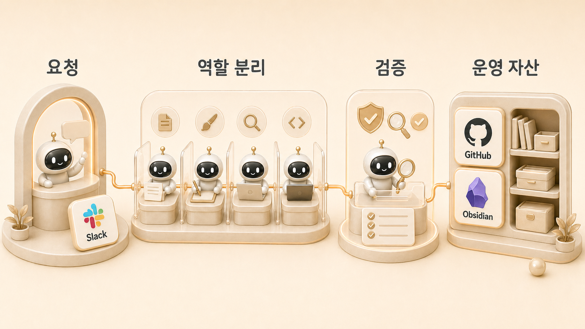

## 11장. Hermes Agent AI 업무 자동화 사례

에르메스 에이전트(Hermes Agent)로 실제 AI 업무 자동화 사례를 어떻게 만들 수 있을까? 11장은 그 질문에 답하는 사례 모음이다. Slack 요청, cron 조사, 역할형 에이전트 분업, GitHub/WikiDocs 발행이 어떻게 하나의 운영 흐름으로 이어지는지 보여준다.

[Hermes Agent](https://wikidocs.net/346055)는 기능 목록으로만 보면 잘 와닿지 않는다. 실제 가치는 하비가 요청을 해석하고, 방울이/뽀동이/하망이 같은 [역할형 에이전트](https://wikidocs.net/345925)가 이어받고, 결과가 공유 문서와 반복 가능한 기준으로 남을 때 드러난다. 성공담을 모으는 장이 아니라, 요청이 운영 자산으로 바뀌는 과정을 남기는 장이다.

## 이 장에서 다루는 문제

| 순서 | 케이스 | 핵심 흐름 |
|---|---|---|
| 11-1 | 하망이와 WikiDocs 이미지 제작 | 이미지 요청 → 메시지 압축 → 제작/검수 → GitHub 발행 |
| 11-2 | 크론 조사에서 WikiDocs 발행 | cron 조사 → 하비 판단 → 방울이 확장조사 → 뽀동이 원고화 |
| 11-3 | 방울이/뽀동이 handoff | 근거 수집과 문서 구조화의 경계 |
| 11-4 | GitHub/WikiDocs 발행 | source of truth와 공개 배포 채널 분리 |
| 11-5 | Slack 스레드 분배 | 하비가 메인 창구로 역할을 나누고 통합 |
| 11-6 | SEO/GEO 치트시트 자산화 | 이미지 제작 → QA → skill화 → 배포 문안 → WikiDocs 기록 |

## 실제 케이스를 읽는 기준

각 케이스는 “이런 것도 했다”가 아니라 “어떤 운영 기준이 생겼는가”를 중심으로 읽어야 한다. AI 자동화 사례는 결과물보다 반복 가능한 요청 흐름과 검증 기준이 남을 때 가치가 있다. 콘텐츠로 이어지는 케이스는 먼저 [WikiDocs/블로그/강의 콘텐츠 시스템](https://wikidocs.net/345911)의 채널 역할을 기준으로 읽으면 흐름이 더 잘 보인다. 좋은 케이스는 다음 다섯 가지를 남긴다.

| 항목 | 읽을 때 볼 것 |
|---|---|
| 시작점 | Slack 요청, cron, GitHub 변경, 콘텐츠 아이디어 중 무엇이었나 |
| 역할 분리 | 하비/방울이/뽀동이/하망이/실행형 중 누가 무엇을 맡았나 |
| 도구 연결 | Slack, cron, GitHub, WikiDocs, Obsidian, MCP가 어떻게 이어졌나 |
| 시행착오 | 처음 착각한 지점과 바뀐 운영 기준은 무엇인가 |
| 자산화 | 결과가 문서, skill, 체크리스트, 발행물 중 무엇으로 남았나 |

## 앞 장과 연결되는 방식

11장은 독립 사례집이 아니다. 각각 앞 장의 개념을 다시 증명한다.

- 하망이 이미지 제작은 [콘텐츠 시스템](https://wikidocs.net/345911)과 이미지형 에이전트 기준을 보여준다.
- 크론 조사 케이스는 [외부 도구/자동화 운영](https://wikidocs.net/345907)과 [Daily Briefing Bot](https://wikidocs.net/345926)의 실제 확장이다.
- 방울이/뽀동이 handoff는 [역할형 에이전트 분리](https://wikidocs.net/345925)의 실전 예시다.
- GitHub/WikiDocs 발행은 source of truth와 공개 배포 채널 분리를 보여준다.
- Slack 스레드 분배는 [멀티봇 규칙](https://wikidocs.net/345913)과 메인 창구 구조를 보여준다.
- SEO/GEO 치트시트는 콘텐츠 산출물이 skill과 배포 문안으로 확장되는 과정을 보여준다.

## 이 장에서 얻을 기준

- 실제 케이스는 보호해야 할 정보가 아니라 상황/판단/기준/결과만 남긴다.
- 한 번의 산출물이 반복 가능해지면 skill 또는 체크리스트 후보로 본다.
- Slack 대화는 그대로 옮기지 않고 읽는 사람의 문제와 운영 흐름으로 재작성한다.
- GitHub는 원본, WikiDocs는 공개 배포 채널로 유지한다.
- 케이스는 8장 FAQ와 9장 체크리스트로 다시 연결되어야 한다.

## 책을 마무리하며

이 책의 핵심은 AI를 더 많이 쓰는 법이 아니다. 요청을 해석하고, 역할을 나누고, 근거를 확인하고, 문서로 남기고, 반복 가능한 기준으로 바꾸는 법이다. Hermes Agent는 그 흐름을 하나의 운영 시스템으로 묶는 도구다.

처음에는 하비 하나에게 묻는 것으로 시작해도 된다. 하지만 일이 쌓이면 조사형/정리형/실행형/이미지형 에이전트가 필요해지고, 기억과 source of truth가 필요해지고, 체크리스트와 복구 플레이북이 필요해진다. 이 장의 실제 케이스들은 그 전환이 어떻게 일어나는지 보여준다.

## 이어서 읽기

먼저 [하망이와 WikiDocs 이미지를 만든 실제 운영 케이스](https://wikidocs.net/345991)를 읽고, 자동화 흐름이 궁금하다면 [크론 조사에서 WikiDocs 발행까지 이어지는 AI 업무 자동화 케이스](https://wikidocs.net/345992)로 이어간다.
