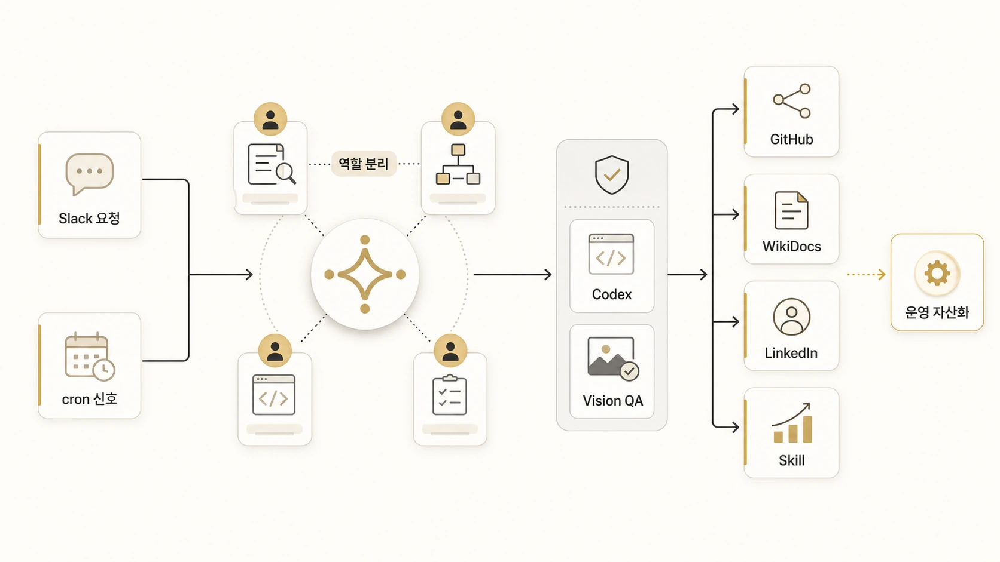

## 11장. Hermes Agent AI 업무 자동화 사례

앞 장들이 Hermes Agent 운영 기준을 하나씩 세웠다면, 11장은 그 기준이 실제 요청에서 어떻게 이어지는지 보여준다. `AI 업무 자동화 사례`, `AI 자동화 시스템`, `AI 업무 자동화 툴`, `AI 워크플로우 자동화`를 찾는 독자라면 이 장에서 도구 목록보다 반복 가능한 흐름을 먼저 보면 된다. 에르메스 에이전트(Hermes Agent)로 AI 업무 자동화를 한다는 말은 “에이전트가 알아서 다 해준다”는 뜻이 아니다. 요청이 들어오고, 메인 창구가 일을 해석하고, 조사형/정리형/실행형/이미지형 에이전트가 역할을 나누고, 마지막에는 검증 가능한 문서나 발행물로 남는 흐름을 만드는 것이다.



사례를 읽을 때는 도구 이름보다 흐름을 먼저 보면 좋다. 같은 Hermes Agent라도 어떤 요청은 하비가 직접 처리하고, 어떤 요청은 방울이/뽀동이/하망이/실행형 에이전트로 나뉘며, 어떤 결과는 Skill이나 체크리스트로 남는다. 11장의 목적은 “우리도 이렇게 했다”를 보여주는 것이 아니라, 시행착오를 독자가 따라 할 수 있는 운영 규칙으로 바꾸는 것이다.

이 장은 실패담을 모은 회고가 아니다. 실제 Slack 요청, 반복 조사, 이미지 제작, GitHub/WikiDocs 발행 과정에서 막혔던 지점을 기준으로 “처음에는 왜 잘 안 됐는가 → 어떤 원인을 찾았는가 → 그래서 어떤 규칙을 만들었는가 → 지금 따라 하려면 무엇부터 하면 되는가”를 정리한 실무 사례집이다.

## 이 장을 읽는 방법

20개 사례를 번호순으로 읽을 필요는 없다. 로이드가 Slack에서 실제로 요청했던 흐름을 기준으로 보면 더 쉽다. 독자는 “어떤 에이전트를 쓸까?”보다 “내가 지금 줄이고 싶은 일이 무엇인가?”에서 출발하면 된다.

예를 들어 메일이 쌓여 힘들다면 `메일 정리 → Google Workspace 권한 → Slack 고객응대` 순서로 읽는다. 이미지가 필요하다면 `하망이 이미지 제작 → 이미지 생성 검수 → 블로그/뉴스레터 재가공` 순서로 읽는다. 상세페이지나 랜딩페이지를 만들고 싶다면 이미지 제작만 보지 말고, 자료조사/콘텐츠 재가공/제품 요구사항/반복 문서 제작까지 함께 보면 된다. 정기 자동화가 실패했을 때는 `모닝 브리핑 → 크론 오류 복구 → Skill 보강` 순서로 보면 좋다.

## 먼저 고를 업무 유형

| 하고 싶은 일 | 먼저 읽을 묶음 | 핵심 질문 |
|---|---|---|
| 메일과 고객 문의를 줄이고 싶다 | 이메일/고객응대 자동화 | 자동 발송 전에 어떤 승인 지점을 둘 것인가 |
| 이미지, 썸네일, 상세페이지를 만들고 싶다 | 이미지/콘텐츠 제작 자동화 | 어떤 메시지를 어떤 화면 자산으로 바꿀 것인가 |
| 자료조사 결과를 의사결정에 쓰고 싶다 | 조사/회의자료 자동화 | 링크 목록을 어떤 결정 질문으로 바꿀 것인가 |
| WikiDocs, 블로그, 뉴스레터를 발행하고 싶다 | 문서화/발행 자동화 | 원본을 어디에 두고 어떤 채널로 재가공할 것인가 |
| 제품 아이디어를 실행 작업으로 바꾸고 싶다 | 제품/실행/기억 자동화 | 요구사항, 실행 범위, 검증 기준을 어떻게 나눌 것인가 |
| 정기 자동화 오류를 재발 방지로 바꾸고 싶다 | 크론/Skill 개선 자동화 | 실패를 어느 레이어에서 보고 어떤 기준으로 남길 것인가 |

## 바로 따라 하는 대표 레시피

아래 5개 레시피는 실제 Slack 요청에서 반복적으로 나온 업무를 독자가 바로 따라 할 수 있게 묶은 것이다. 처음에는 하나만 골라서 따라 하면 된다.

### 1. 이메일 자동화

매일 쌓이는 메일을 줄이고 싶다면 메일함 전체를 AI에게 맡기지 않는다. 먼저 읽기 전용 요약과 답장 초안부터 시작한다.

```text
메일 확인 → 중요도 분류 → 답장 초안 → 사람 승인 → 기록/후속 액션
```

읽을 순서:

1. [11-08. 메일 정리와 답장 초안](37-email-triage-reply-draft-agent-workflow.md)
2. [11-16. Google Workspace와 메일 MCP](46-google-workspace-email-mcp-workflow.md)
3. [11-17. Slack 고객응대 초안/승인](47-slack-customer-support-draft-approval-workflow.md)

따라 할 때의 기준은 단순하다. 자동 발송은 마지막에 두고, 초안 생성/사람 승인/기록 위치를 먼저 정한다.

### 2. 이미지 제작과 상세페이지 만들기

이미지 제작은 “예쁜 이미지”가 목표가 아니다. 상세페이지, 카드뉴스, 썸네일, WikiDocs 본문 이미지처럼 쓰일 화면을 먼저 정해야 한다.

```text
핵심 메시지 → 독자 행동 → 이미지 브리프 → 생성 → vision 검수 → 상세페이지/글에 연결
```

읽을 순서:

1. [11-01. 하망이와 WikiDocs 이미지 제작](29-hamangi-wikidocs-image-production-case.md)
2. [11-15. 이미지 생성 요청/검수/재사용](45-image-generation-review-reuse-workflow.md)
3. [11-18. 블로그/뉴스레터 재가공](48-blog-newsletter-content-repurposing-workflow.md)
4. [11-07. 반복 문서 제작 자동화](36-repeat-document-production-agent-workflow.md)

상세페이지를 만들 때는 상품 설명을 바로 쓰기보다 `문제 → 해결 흐름 → 이미지/섹션 구성 → CTA → 검수` 순서로 바꾼다.

### 3. 자료조사에서 결정 메모 만들기

자료조사는 많이 찾는 일이 아니라 판단할 수 있게 줄이는 일이다. 방울이는 근거와 반례를 찾고, 뽀동이는 비교표와 결정 메모로 바꾼다.

```text
질문 좁히기 → 근거 수집 → 비교표 → 리스크 → 추천안 → 다음 액션
```

읽을 순서:

1. [11-09. 자료조사와 결정 메모](38-research-to-comparison-decision-memo-workflow.md)
2. [11-10. 모닝 브리핑과 주간 리포트](40-daily-briefing-weekly-report-cron-workflow.md)
3. [11-19. 정기 리서치에서 회의자료](49-recurring-research-to-decision-meeting-workflow.md)

핵심은 링크 목록을 회의자료로 착각하지 않는 것이다. 회의에서 물어볼 질문과 선택지가 남아야 한다.

### 4. 회의록에서 보고서와 발표자료 만들기

회의록은 발언록이 아니라 결정과 실행 기준으로 바꿔야 한다. 긴 회의 메모를 그대로 요약하면 보기만 좋은 문서가 된다.

```text
회의 메모 → 결정/미정/쟁점 → 액션 아이템 → 보고서 → 발표자료 구조
```

읽을 순서:

1. [11-14. 회의록에서 보고서/발표자료](44-meeting-notes-to-report-slide-workflow.md)
2. [11-11. 비벙이 제품 요구사항 정리](41-bibungi-product-requirements-agent-workflow.md)
3. [11-12. 봉구 실행/배포/검증](42-bonggu-execution-deployment-verification-workflow.md)

따라 할 때는 “누가 무슨 말을 했나”보다 “무엇이 결정됐고 누가 언제 무엇을 할 것인가”를 먼저 뽑는다.

### 5. WikiDocs/블로그 발행 자동화

콘텐츠 자동화는 글쓰기만의 문제가 아니다. 조사, 원고, 이미지, GitHub 원본, WikiDocs 공개 반영, Slack 보고가 이어져야 한다.

```text
주제 선정 → 방울이 조사 → 뽀동이 원고화 → 하망이 이미지 → 봉구 검증/발행 → 공개 확인
```

읽을 순서:

1. [11-02. 크론 조사에서 WikiDocs 발행](30-cron-research-to-agent-content-workflow.md)
2. [11-03. 방울이/뽀동이 handoff](31-bangwooli-ppodongi-content-handoff.md)
3. [11-04. GitHub/WikiDocs 발행](32-github-wikidocs-content-publishing-workflow.md)
4. [11-06. SEO/GEO 치트시트 자산화](34-hermes-seo-geo-cheatsheet-content-asset-case.md)
5. [11-20. 크론 오류를 Skill/메모리 개선으로 바꾸는 운영 케이스](https://wikidocs.net/346701)

여기서 중요한 것은 Slack 대화를 그대로 복사하지 않는 것이다. Slack은 시작점이고, 공개 문서는 독자가 따라 할 수 있는 절차로 다시 정리해야 한다.

## 전체 사례 색인

| 묶음 | 사례 | 언제 보면 좋은가 |
|---|---|---|
| 이메일/고객응대 | 11-08, 11-16, 11-17 | 메일, 고객 문의, 답장 초안, 승인 흐름을 만들 때 |
| 조사/회의자료 | 11-09, 11-10, 11-14, 11-19 | 리서치, 브리핑, 회의록, 의사결정 자료가 필요할 때 |
| 이미지/상세페이지/콘텐츠 | 11-01, 11-06, 11-07, 11-15, 11-18 | 이미지 제작, 카드뉴스, 상세페이지, 블로그/뉴스레터를 만들 때 |
| 문서화/발행 | 11-02, 11-03, 11-04 | WikiDocs, GitHub, SEO/GEO 발행 흐름을 만들 때 |
| 제품/실행/기억 | 11-05, 11-11, 11-12, 11-13 | Slack 요청을 제품 요구사항, 실행 작업, 장기 기억으로 바꿀 때 |
| 운영/복구/Skill 개선 | 11-10, 11-20 | 정기 자동화 오류를 원인 추적, Skill 보강, memory 기준으로 바꿀 때 |

## 사례를 읽고 남길 실행 기준

| 산출물 | 확인 질문 |
|---|---|
| 재현 가능한 업무 자동화 사례 | 입력/역할 분리/중간 판단/검증/발행 결과가 모두 보이는가 |
| 따라 할 수 있는 레시피 | 독자가 첫 요청문, 승인 지점, 결과물 위치를 알 수 있는가 |
| 역할형 에이전트 handoff 예시 | 하비/방울이/뽀동이/하망이/봉구/비벙이가 각각 어디서 이어받는가 |
| 발행/검증 체크리스트 | GitHub 원본과 WikiDocs 공개본을 함께 확인하는가 |
| 다음 자산화 기준 | 결과물이 Skill, 체크리스트, 블로그, 강의 중 어디로 이어질지 정했는가 |
| 실패 복구 기준 | 오류가 schedule/tool/model/delivery 중 어느 레이어에서 생겼는지 나눴는가 |

## 먼저 준비할 것

이 장의 사례를 그대로 따라 하려면 모든 도구를 한 번에 갖출 필요는 없다. 다만 아래 네 가지는 미리 결정되어 있어야 한다.

| 준비 항목 | 왜 필요한가 | 관련 장 |
|---|---|---|
| 메인 창구 | 요청을 누가 해석하고 분배할지 정해야 한다 | [AI 개인비서 메인 창구](https://wikidocs.net/345892) |
| 역할 분리 | 조사/정리/실행/이미지 작업을 한 에이전트에게 몰아주지 않기 위해 필요하다 | [역할형 에이전트](https://wikidocs.net/345925) |
| 원본 위치 | 결과물이 Slack에만 남지 않게 하기 위해 필요하다 | [기억과 원본 기준](https://wikidocs.net/345902) |
| 발행 기준 | WikiDocs/블로그/강의/이미지 중 어디로 보낼지 정하기 위해 필요하다 | [콘텐츠 시스템](https://wikidocs.net/345911) |

처음에는 Slack과 GitHub/WikiDocs만 있어도 충분하다. 이후 반복 주제가 생기면 cron을 붙이고, 반복 절차가 생기면 [Skill](https://wikidocs.net/346235)로 분리하면 된다.

## 공통 아키텍처

공식 Architecture 관점으로 보면 요청이 들어오는 입구는 여러 개다. Slack 같은 Messaging Gateway, CLI, cron, ACP가 모두 시작점이 될 수 있다. 실제 운영 사례에서는 그 입구를 바로 기능 목록으로 설명하지 않고, “누가 요청을 해석하고, 어떤 역할이 이어받고, 어디에 결과를 남기는가”로 바꿔 읽는다.

```text
입구: 사용자 요청 / Slack thread / cron 신호
        ↓
AIAgent core: 목적 해석 / provider 선택 / tool 호출 / session 기록
        ↓
하비: 목적/역할/결과물 판단
        ↓
방울이: 근거/사례/반례 확장조사
        ↓
뽀동이: 독자 문제/제목/본문/FAQ/링크 구조화
        ↓
하망이 또는 실행형 에이전트: 이미지/검증/발행 작업
        ↓
GitHub 원본 반영 → WikiDocs 공개 반영 → Slack 완료 보고
```

이 구조에서 중요한 점은 중간에 사람이 판단할 수 있는 지점이 있다는 것이다. cron이 조사 결과를 보내면 하비가 `넘겨/더 파/제품/보류/중복`처럼 다음 액션을 정한다. 원고가 완성되면 뽀동이는 바로 끝내지 않고 링크, H1, 이미지 경로, 문체, 공개 반영을 검증한다.

## AI 업무 자동화 사례를 읽을 때 볼 체크리스트

| 체크 항목 | 좋은 사례의 조건 | 나쁜 사례의 신호 |
|---|---|---|
| 시작점 | 요청/cron/자료 변화가 분명하다 | “뭔가 해줘”만 남아 있다 |
| 역할 분리 | 누가 무엇을 맡는지 보인다 | 한 에이전트가 조사/작성/검증을 모두 떠안는다 |
| 중간 판단 | 보류/확장/발행 기준이 있다 | 결과가 많을수록 좋은 것으로 착각한다 |
| 공유 범위 | 보호해야 할 정보와 읽는 사람에게 필요한 정보가 분리된다 | Slack 대화를 그대로 옮긴다 |
| 검증 | 링크/이미지/형식/문체를 확인한다 | 만들었다는 사실만 보고한다 |
| 자산화 | 문서/Skill/체크리스트/다음 사례로 남는다 | 다음에 같은 일을 처음부터 다시 설명한다 |

## 바로 써볼 수 있는 요청 예시

```text
하비야, 이 주제를 Hermes Agent 업무 자동화 사례로 만들 수 있을지 봐줘.

1. 방울이는 공식 문서, 실제 운영 사례, 반례를 확장조사해줘.
2. 뽀동이는 WikiDocs 독자가 따라 할 수 있는 구조로 정리해줘.
3. 하망이가 필요한 이미지 방향이 있으면 별도로 잡아줘.
4. 최종 결과는 시작 상황, 운영 흐름, 체크리스트, FAQ, 다음 링크로 정리해줘.
5. 보호해야 할 정보는 공개하지 말고 판단 기준만 남겨줘.
```

## 책을 마무리하며

이 책의 핵심은 AI를 더 많이 쓰는 법이 아니다. 요청을 해석하고, 역할을 나누고, 근거를 확인하고, 문서로 남기고, 반복 가능한 기준으로 바꾸는 법이다. Hermes Agent는 그 흐름을 하나의 운영 시스템으로 묶는 도구다.

처음에는 하비 하나에게 묻는 것으로 시작해도 된다. 하지만 일이 쌓이면 조사형/정리형/실행형/이미지형 에이전트가 필요해지고, 기억과 원본 기준이 필요해지고, 체크리스트와 복구 플레이북이 필요해진다. 11장의 실제 케이스들은 그 전환이 어떻게 일어나는지 보여준다.
