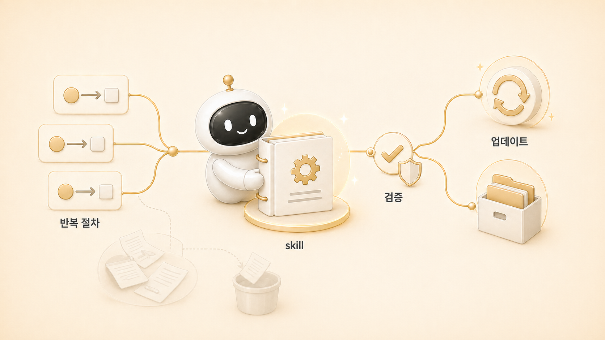

## Hermes Agent Skill은 무엇이고 언제 만들까

에르메스 에이전트(Hermes Agent)의 Skill은 “자주 쓰는 프롬프트 모음”이 아니다. 반복되는 업무에서 필요한 순서, 도구, 실패 패턴, 검증 기준을 묶어 두는 운영 절차다. 그래서 Skill은 많이 만드는 것보다 정확히 만들고 계속 고치는 것이 중요하다.

공식 Skills Hub처럼 Hermes Agent에는 여러 내장 Skill이 있다. 하지만 실전 운영에서는 내장 Skill을 그대로 쓰는 것보다, 내가 반복해서 겪은 문제를 어떻게 Skill로 바꾸는지가 더 중요하다. 같은 실수가 두 번 반복되고, 해결 순서와 검증 방법이 보이면 Skill 후보가 된다.

## 스킬은 많을수록 좋은 게 아니다

| 상황 | Skill이 맞는가 | 이유 |
|---|---|---|
| 한 번만 하는 단순 요청 | 아니다 | 절차로 남길 가치가 낮다 |
| 반복되고 실패 패턴이 있음 | 맞다 | 같은 실수를 줄인다 |
| 검증 명령이 정해져 있음 | 맞다 | 품질 기준을 재사용할 수 있다 |
| 매번 최신 정보가 바뀜 | 조심 | Skill보다 검색/조회가 먼저일 수 있다 |
| 예약 실행이 필요함 | cron 검토 | Skill은 절차, cron은 실행 일정이다 |

## 실제 운영 장면: 내부 링크 실수에서 Skill 기준이 바뀌었다

처음 내부 링크를 보강했을 때는 `이어서 읽기` 중심으로 처리했다. 하지만 사용자는 본문 문장 안에서 개념과 기능이 연결되는 contextual hyperlink를 원했다. 또 GitHub `.md` 링크는 WikiDocs 독자 화면에서 제대로 동작하지 않는 문제도 확인됐다.

이 경험은 단순한 작업 로그가 아니라 재발 방지 규칙이었다. 같은 기준은 [GitHub와 WikiDocs로 콘텐츠를 발행하고 고치는 흐름](https://wikidocs.net/345994)에서도 반복된다. 그래서 Skill에 “본문 내부 링크는 WikiDocs page ID URL을 써야 한다”는 기준을 추가했다. 이후 장별 리라이트에서는 이 기준이 매번 검증 항목으로 들어간다.

구체적으로는 세 가지가 Skill로 들어갔다. 첫째, pages 본문에는 H1을 쓰지 않는다. 둘째, 이미지 경로는 페이지 위치 기준으로 실제 파일 존재까지 확인한다. 셋째, GitHub에서는 자연스러운 `.md` 링크라도 WikiDocs 공개 본문에는 page ID URL을 쓴다. 이 정도로 반복 조건과 검증 방법이 생기면 프롬프트가 아니라 Skill로 남길 만하다.

## Skill, memory, cron을 나누는 기준

| 남길 곳 | 질문 | 예시 |
|---|---|---|
| memory | 다음 세션에도 항상 주입돼야 하는 안정 규칙인가 | 로이드의 보고 선호 |
| Skill | 반복 절차와 검증 방법이 있는가 | WikiDocs 발행 검증 절차 |
| cron | 정해진 시간에 자동 실행해야 하는가 | 매일 아침 SEO/GEO 모니터링 |
| shared-memory | 팀이 같이 보는 작업 원본인가 | 콘텐츠 package, handoff, 운영 규칙 |

이 구분은 [memory/profile/session](https://wikidocs.net/345899) 경계와 직접 연결된다. 모든 것을 Skill로 만들면 절차가 비대해지고, 모든 것을 memory에 넣으면 기억이 흐려진다.

## 공식 기준 mini 정의: Skill과 cron의 차이

Hermes Agent의 Skill은 “다음에도 같은 방식으로 처리해야 하는 절차”를 남기는 장치다. 반면 cron은 “정해진 시간에 독립 실행해야 하는 작업”을 예약하는 장치다.

둘은 함께 쓸 수 있다. 예를 들어 WikiDocs 검증 절차는 Skill로 남기고, 매일 아침 콘텐츠 신호를 찾는 일은 cron으로 돌릴 수 있다. 다만 cron job이 Skill을 불러 쓰더라도 prompt는 fresh session에서 혼자 이해될 만큼 충분해야 한다.

## 운영 기준

1. 같은 실수가 두 번 반복되면 Skill 보강 후보로 본다.
2. Skill에는 “무엇을 할지”보다 “어떤 순서로 검증할지”를 넣는다.
3. 실제 운영과 Skill이 어긋나면 즉시 고친다.
4. cron job은 Skill을 불러 쓸 수 있지만, cron prompt 자체도 self-contained해야 한다.
5. 공개 콘텐츠 Skill에는 내부값 제거 기준을 포함한다.

## FAQ

### memory와 Skill 중 어디에 남겨야 하나요?

짧고 안정적인 선호는 memory, 반복 절차와 도구 사용법은 Skill이다. 예를 들어 “Slack 보고는 짧게”는 memory에 가깝고, “WikiDocs 발행 전 검증 순서”는 Skill에 가깝다.

### Skill이 많아지면 더 똑똑해지나요?

아니다. 오래된 Skill은 오히려 위험하다. 실제 운영과 달라진 절차는 바로 고쳐야 한다.

### Skill과 공식 docs는 어떤 관계인가요?

공식 docs는 기능 기준이고, Skill은 우리 운영에서 검증된 실행 절차다. 둘이 다르면 공식 기준을 확인한 뒤 운영 절차를 갱신해야 한다.

## 다음 글

다음은 반복 업무가 어떤 조건을 통과할 때 Skill이 되는지 본다. 그 기준을 잡아야 6장의 나머지 글에서 역할별 Skill과 공개/내부 Skill 분리를 제대로 이해할 수 있다.
