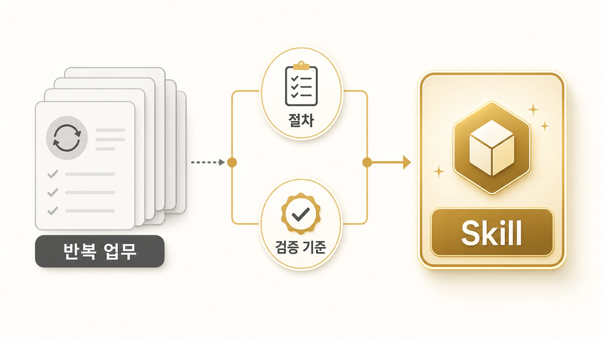

## Hermes Agent Skill은 무엇이고 언제 만들까

Hermes Agent Skill은 반복 업무를 처리하는 작업법이다. “앞으로 이런 요청이 오면 어떤 순서로 확인하고, 어떤 도구를 쓰고, 어디서 멈춰야 하는지”를 남겨 다음 세션에서도 같은 품질을 재현하게 만든다.

Skill은 [memory](https://wikidocs.net/346126)와 다르다. memory는 오래 유지할 선호, 규칙, 사용자 맥락을 담는다. Skill은 일을 수행하는 절차와 검증 기준을 담는다. 예를 들어 “보고는 짧게 받는 것을 선호한다”는 memory에 가깝고, “[WikiDocs 발행 전 검증](https://wikidocs.net/345994)처럼 H1, 이미지, TOC, 본문 링크, SEO 첫 문단을 확인한다”는 Skill에 가깝다.

## Skill은 많을수록 좋은 게 아니다

Skill이 많아지면 에이전트가 더 똑똑해질 것처럼 보인다. 하지만 실제로는 기준이 겹치면 더 헷갈린다. 좋은 Skill은 많지 않아도 된다. 대신 언제 로드해야 하는지, 어떤 실패를 막는지, 어떤 검증을 해야 하는지 선명해야 한다.

우리가 Skill을 만들기 시작한 계기도 “새로운 기능을 추가하고 싶어서”가 아니었다. 같은 종류의 작업에서 같은 실수가 반복됐기 때문이다. WikiDocs 원고를 고칠 때는 전자책 호환과 공개 링크 검증이 반복됐고, 하망이 이미지 작업에서는 한글/워터마크/잘림 QA가 반복됐다. 하비의 경우에는 [직접 처리할 일과 다른 에이전트에게 넘길 일](https://wikidocs.net/345893)을 가르는 판단이 반복됐다.

## 기준이 바뀐 사례: 내부 링크 실수

초기 WikiDocs 작업에서는 본문 끝에 “이어서 읽기” 링크를 넣으면 내부 링크 보강이 끝났다고 생각하기 쉬웠다. 그런데 사용자는 본문 안에서 개념이 나올 때 바로 관련 페이지로 이어지는 contextual hyperlink를 원했다. 독자는 책을 순서대로만 읽지 않고, 검색 결과나 특정 페이지에서 바로 들어오기 때문이다.

이 피드백은 단순히 한 페이지를 고치는 일로 끝나지 않았다. `wikidocs-github-ebook-pipeline` Skill에 “내부 링크는 푸터 링크가 아니라 본문 맥락 링크다”라는 기준이 들어갔다. 이후 WikiDocs 작업에서는 TOC 링크가 맞는지뿐 아니라, 독자가 읽는 흐름 안에서 `Skill`, `MCP`, `memory`, `하비`, `뽀동이`, `하망이` 같은 개념이 자연스럽게 연결되는지까지 본다.

## Skill, memory, cron을 나누는 기준

| 구분 | 남길 내용 | 예시 |
|---|---|---|
| memory | 오래 유지할 사용자 선호/운영 규칙 | 짧은 보고 선호, 중점 대신 슬래시 사용 |
| Skill | 반복 업무의 절차/검증 기준 | WikiDocs 발행 검증, 이미지 QA, GitHub PR 리뷰 |
| cron | 정해진 시간에 실행할 작업 | 매일 조사, 정기 브리핑, 사용량 모니터링 |
| session_search | 과거에 처리한 구체 사례 회수 | 예전에 SEO 링크를 어떻게 고쳤는지 찾기 |

이 구분이 흐려지면 Skill이 작업 로그가 되거나, memory가 긴 매뉴얼이 된다. Skill은 “언제나 알아야 할 사실”이 아니라 “다음에 같은 일을 할 때 따라야 할 방법”으로 유지해야 한다.

## Skill로 만들기 좋은 순간

1. 같은 작업을 두세 번 반복하며 비슷한 실수가 보인다.
2. 사용자가 같은 피드백을 반복한다.
3. 검증은 통과했지만 결과물이 독자 관점에서 약하다.
4. 도구를 쓰는 순서가 중요해졌다.
5. 다른 에이전트가 이어받아도 같은 품질을 내야 한다.

## FAQ

### memory와 Skill 중 어디에 남겨야 하나요?

“항상 알아야 하는 안정 맥락”이면 memory, “다음에도 같은 방식으로 처리해야 하는 절차”이면 Skill에 가깝다. 작업 진행 상황은 둘 다 아니라 session, GitHub log, source of truth에서 찾는 편이 안전하다.

### Skill이 많아지면 더 똑똑해지나요?

아니다. Skill이 많아질수록 로드 기준이 더 중요해진다. 이름만 많은 Skill보다, 반복 실패를 정확히 막는 Skill이 낫다.

### Skill과 공식 docs는 어떤 관계인가요?

공식 docs는 기능의 기준선이다. Skill은 그 기능을 실제 운영에서 어떤 순서와 검증 기준으로 쓸지 정리한 작업법이다.

## 다음 글

다음은 [반복 업무는 어떻게 Skill이 되는가](https://wikidocs.net/346236)에서 어떤 조건을 통과할 때 Skill로 남길 수 있는지 본다. 그 기준을 잡아야 역할별 Skill과 공개/내부 Skill 분리를 제대로 이해할 수 있다.
