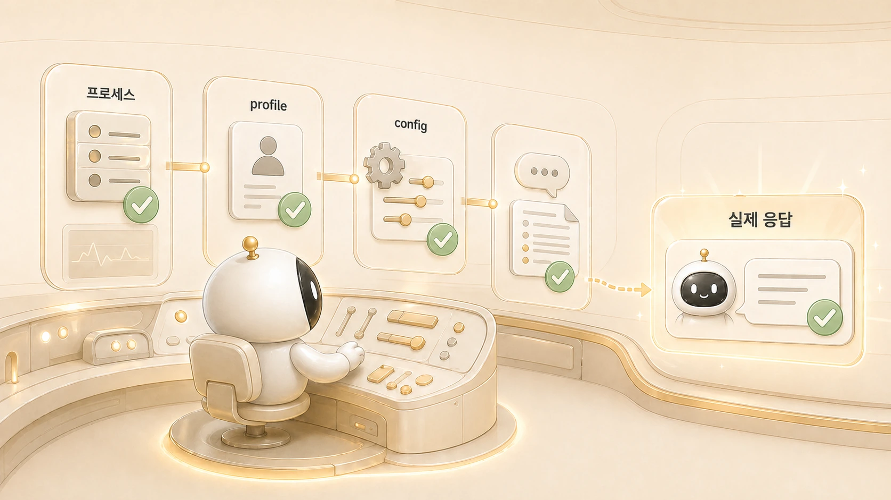

## always-on gateway는 왜 자주 헷갈릴까

에르메스 에이전트(Hermes Agent)의 always-on gateway는 “켜져 있다”는 말 때문에 단순해 보인다. 하지만 운영에서는 gateway process, messaging platform 연결, cron scheduler, delivery target, 로그가 함께 맞아야 한다. 하나라도 어긋나면 status는 괜찮아 보여도 사용자는 결과를 받지 못할 수 있다.

Hermes Agent에서 gateway는 대화형 업무와 예약 실행을 연결하는 중요한 축이다. 그래서 gateway 문제는 5장 도구 자동화뿐 아니라 [체크리스트/복구 플레이북](https://wikidocs.net/345921)으로도 이어진다. 특히 어느 profile에서 실행되는지 헷갈릴 때는 [session/memory/profile 경계](https://wikidocs.net/346126)를 함께 봐야 한다.

## 왜 켜져 있는데도 헷갈릴까

| 확인 대상 | 헷갈리는 이유 | 봐야 할 것 |
|---|---|---|
| process | 실행 중처럼 보일 수 있음 | 실제 PID, 최근 로그, restart 시각 |
| messaging | 플랫폼 연결은 별도 | Slack/Telegram delivery 여부 |
| cron | 스케줄러는 fresh session으로 실행 | prompt, schedule, target, recent output |
| profile | profile마다 gateway 설정이 다름 | 어떤 profile의 gateway인지 |
| target | home channel과 thread가 다름 | origin/local/명시 target 구분 |

## 보고 규칙을 고친 뒤 gateway를 다시 봐야 하는 이유

뽀동이의 보고 방식이 장황하다는 피드백이 있었고, 프로필 운영 문서와 memory에 짧은 보고 규칙을 반영했다. 여기서 작업은 파일 수정으로 끝나지 않았다. 새 규칙이 실제 Slack 응답에 안정적으로 반영되려면 gateway 재시작과 상태 확인이 필요했다.

이 장면이 보여주는 것은 gateway가 단순 백그라운드 프로세스가 아니라는 점이다. 에이전트 정체성/프로필 변경, 메시징 응답, cron 실행이 모두 gateway와 만난다. 그래서 “수정했다”와 “실제로 반영됐다” 사이에 확인 단계가 필요하다.

확인 순서도 구체적이어야 한다. 먼저 어느 profile의 gateway를 보고 있는지 확인한다. 그다음 최근 로그에 새 설정을 읽은 흔적이 있는지 보고, 실제 Slack 스레드에서 응답 톤이 바뀌었는지 확인한다. 마지막으로 cron처럼 사람이 직접 부르지 않는 작업도 같은 gateway/delivery 경로를 타는지 본다. status만 보고 끝내면 “프로세스는 켜져 있는데 사용자는 못 받는” 상태를 놓칠 수 있다.

## gateway status를 그대로 믿으면 안 되는 이유

status는 출발점이다. 실제 운영에서는 다음 질문까지 봐야 한다.

1. 내가 보고 있는 gateway가 맞는 profile인가?
2. 최근 로그에 restart나 오류가 남았는가?
3. 메시지가 실제 대상 채널/스레드로 갔는가?
4. cron job은 최근 실행 결과를 남겼는가?
5. delivery target이 `origin`, home channel, explicit target 중 무엇인가?

이 기준이 없으면 [Daily Briefing Bot](https://wikidocs.net/345926) 같은 자동화도 “돌았는지”와 “도착했는지”를 헷갈리게 된다.

## 공식 기능 기준: gateway와 delivery

gateway는 Hermes Agent를 메시징 플랫폼과 예약 실행 흐름에 붙여 두는 always-on 운영 축이다. 그래서 gateway를 볼 때는 process, scheduler, messaging connection, delivery target을 함께 확인해야 한다.

특히 delivery는 별도 검증 대상이다. gateway가 켜져 있어도 `origin`, home channel, explicit target이 어긋나면 사용자는 결과를 받지 못한다. 그래서 cron troubleshooting은 “실행됐는가”와 “도착했는가”를 반드시 나눠 본다.

## 실제로 자주 나온 설치/세팅 실패 사례

초보자 설치 실패는 install script 자체보다 “설치 이후 연결 단계”에서 더 자주 나온다. 우리 운영 기록에서도 gateway, profile, config, Slack 설정이 섞이면서 원인 분리가 어려웠다.

| 증상 | 실제로 헷갈렸던 지점 | 먼저 볼 것 |
|---|---|---|
| Slack에서 home channel 안내가 반복된다 | `/sethome` 안내와 Slack slash command UX가 다를 수 있다 | `SLACK_HOME_CHANNEL`, `/hermes sethome`, config 반영 여부 |
| config를 고쳤는데 Slack 응답이 안 바뀐다 | 파일 수정과 gateway 재시작은 별도다 | 올바른 profile의 gateway restart, 최근 로그 |
| `gateway status`는 이상한데 process는 떠 있다 | service manager 기준과 수동 실행 process 기준이 다를 수 있다 | PID, launchd/service 상태, 실행 인자, profile |
| CLI는 되는데 Slack은 안 된다 | model/provider가 아니라 messaging/gateway 문제일 수 있다 | bot token, app token, socket mode, 채널 권한, delivery target |
| 같은 하비/뽀동이인데 성격이 다르다 | 다른 profile/session/memory를 보고 있을 수 있다 | profile 이름, AGENTS.md, memory, 실행 HOME |
| cron 결과가 안 온다 | 실행 실패와 전달 실패가 섞인다 | recent output, deliver target, home channel, thread target |

이 표의 핵심은 “재설치부터 하지 않는다”는 것이다. 먼저 CLI 기본 chat, provider/model, config/env, gateway process, platform permission, delivery target을 나눠 보면 문제 범위가 빠르게 좁혀진다.

## 봇이 갑자기 답하지 않을 때의 분리 진단

실제 운영 질문에서 가장 흔한 형태는 “어느 순간 봇이 아무 답도 안 한다”였다. 이때 바로 모델 문제로 보면 원인을 놓치기 쉽다.

| 증상 | 먼저 볼 것 | 다음 확인 |
|---|---|---|
| CLI는 되는데 Slack에서 답이 없다 | gateway process/profile | bot token, app token, socket 연결, 채널 권한 |
| 특정 스레드에서만 답이 없다 | mention/trigger 규칙 | thread_ts, require_mention, 멀티봇 침묵 규칙 |
| cron 결과가 오지 않는다 | job 실행 결과 | deliver target, home channel, thread target |
| 재시작 후 성격/규칙이 안 바뀐다 | profile/AGENTS/SOUL 로딩 | gateway가 같은 profile로 재시작됐는지 |
| 파일 첨부를 못 읽는다 | 지원 확장자/크기/권한 | Slack private file download와 document cache |

복구 순서는 `model → gateway → channel permission → thread/trigger → delivery`가 아니라, 현재 증상에 따라 나눠야 한다. CLI가 정상이라면 모델보다 gateway/channel을 먼저 보는 편이 빠르다.

## 판단 기준

- gateway는 process, log, delivery를 함께 확인한다.
- profile별 gateway를 섞어 보지 않는다.
- cron 결과는 실행 여부와 전달 여부를 분리해서 본다.
- 설정 변경 후에는 restart 여부와 실제 응답 변화를 확인한다.
- 공유 문서에는 내부 서비스 라벨, 계정, 사적인 전달 대상을 그대로 쓰지 않는다.

## FAQ

### gateway status가 OK면 끝 아닌가요?

아니다. OK는 살아 있다는 신호일 뿐이다. 메시지가 원하는 채널/스레드에 전달됐는지까지 봐야 한다.

### 항상 켜두는 게 좋은가요?

메시징/cron 운영을 한다면 켜져 있어야 한다. 다만 always-on이라고 해서 검증이 필요 없는 것은 아니다.
