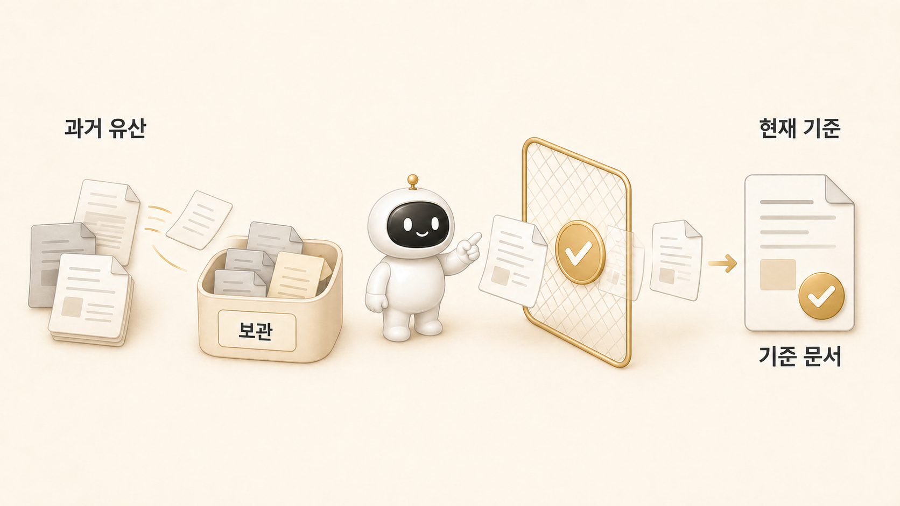

## 과거 유산과 현재 기준은 어떻게 나눌까



과거 유산은 무조건 지울 필요도, 현재 운영 문서에 계속 섞어둘 필요도 없다. 핵심은 archive/history에는 남기고, 현재 기준 문서에서는 [Hermes Agent](https://wikidocs.net/346055) 기준을 먼저 보이게 하는 것이다.

[OpenClaw에서 Hermes로](https://wikidocs.net/345889) 넘어올 때도 이 문제가 있었다. 이름은 Hermes로 바뀌었지만 과거 파일, autostart 흔적, profile 이름, skill 설명, 문서 링크가 남아 있으면 사용자는 지금 기준이 무엇인지 헷갈린다.

이 페이지는 단순 정리법이 아니라 실제 마이그레이션에서 생긴 판단 기준을 다룬다. 어떤 것은 삭제하지 않고 남겨야 했고, 어떤 것은 현재 문서에서 빼야 했다. 또 어떤 것은 민감정보 때문에 원문을 보존하면 안 됐다.

## 왜 과거 흔적이 현재 규칙을 흔들까

운영 문서는 사람이 읽는 기준이면서 에이전트가 따르는 기준이기도 하다. 현재 문서에 과거 명칭과 예전 절차가 섞이면 하비, [방울이](https://wikidocs.net/345895), 뽀동이도 어느 기준을 따라야 할지 흐려진다.

문제는 과거 유산 자체가 아니다. 과거 유산이 현재 기준처럼 보이는 순간이 문제다.

예를 들어 OpenClaw 시절에는 agent list, Slack binding, workspace, heartbeat, identity 파일이 각각의 역할을 했다. Hermes로 넘어온 뒤에는 profile, SOUL.md, AGENTS.md, memory, skill, cron, gateway가 그 역할을 다시 나눠 맡는다. 두 구조가 1:1로 맞지 않는데 예전 표현을 그대로 현재 문서에 두면, 에이전트는 지금 실행해야 할 기준과 과거 설명을 구분하지 못한다.

## 실제 케이스: OpenClaw 설정은 자동 이사가 아니라 수동 재구성이었다

OpenClaw에서 Hermes로 옮길 때 중요한 발견은 “모든 설정이 자동으로 옮겨지는 것은 아니다”였다. migration notes에는 OpenClaw의 여러 설정이 Hermes에 직접 대응되지 않아 archive로 들어갔고, 수동 검토가 필요하다고 남았다.

대표적으로 아래 항목들은 현재 실행 기준으로 바로 쓰기보다, 전환 자료로 보관해야 했다.

| OpenClaw 유산 | 현재 판단 | 이유 |
|---|---|---|
| `IDENTITY.md`, `SOUL.md` 계열 | Hermes profile의 `SOUL.md`와 `AGENTS.md`로 재해석 | 로딩 방식과 역할이 다르다 |
| `agents-list.json` | profile 분리와 gateway 운영 기준으로 재구성 | OpenClaw agent 구조가 Hermes에 그대로 대응되지 않는다 |
| `bindings.json` | Slack 호출 규칙과 profile routing 기준으로 재검토 | 과거 Slack binding이 현재 멀티봇 규칙과 다르다 |
| `cron-config`, cron store | Hermes cron으로 필요한 작업만 재생성 | 예약 실행 방식과 delivery 기준을 다시 봐야 한다 |
| OpenClaw workspace memory | archive/history로 보관 후 필요한 기준만 승격 | 현재 memory에 장문으로 섞으면 오염된다 |

이 지점이 중요하다. 마이그레이션은 “파일을 다 복사했다”가 아니라 “현재 실행 기준으로 다시 조립했다”에 가깝다.

## 실제 케이스: 뽀동이 soul은 없어진 것이 아니라 약해진 것이었다

전환 과정에서 로이드가 “소울이 없어진 것 같다”고 느낀 적이 있었다. 확인해보니 Hermes의 `ppodongi/SOUL.md`는 실제로 존재했다. 문제는 파일이 없는 것이 아니라 OpenClaw 시절의 강한 정체성, 즉 “콘텐츠 퀄리티 책임자/귀엽지만 타협 없는 햄스터” 감각이 현재 Hermes 문서에서 약해져 있었다는 점이었다.

그래서 결론은 새 `IDENTITY.md`를 하나 더 만드는 것이 아니었다. Hermes가 실제로 읽는 것은 profile의 `SOUL.md`이므로, 현재 기준에 맞게 `SOUL.md`와 `AGENTS.md`를 강화하는 쪽이 맞았다.

이 사례는 과거 유산을 다루는 좋은 기준이 된다.

```text
과거 정체성의 좋은 부분 → 현재 SOUL.md에 반영
과거 OpenClaw 전용 명령/경로 → 현재 실행 문서에서 제거
전환 이유와 비교 설명 → WikiDocs와 archive/history에 보관
```

과거의 느낌까지 모두 버리면 운영 문화가 사라지고, 과거 명령까지 모두 살리면 현재 기준이 흐려진다. 남길 것과 뺄 것을 나눠야 한다.

## 실제 케이스: source of truth는 하나로 정해야 했다

HaloX와 Lecture OS, Hermes WikiDocs 작업에서도 같은 문제가 반복됐다. Obsidian, shared-memory, memory, GitHub, WikiDocs가 모두 기록처럼 보였지만 역할은 달랐다.

그래서 우리는 기준을 나눴다.

| 영역 | 현재 기준 |
|---|---|
| 팀 공통 규칙 | `shared-memory/team-rules.md` |
| HaloX 운영 규칙 | `shared-memory/projects/halox-memory-ops.md` |
| HaloX 누적 지식 | Obsidian `HALOX Brain` |
| Lecture/강의 자산 | Obsidian `Lecture OS` |
| WikiDocs 책 원본 | GitHub repo |
| WikiDocs 공개 화면 | 배포 채널 |

이 기준이 없으면 “어디에는 이렇게 쓰여 있는데?”라는 질문이 계속 생긴다. source of truth를 정한다는 것은 다른 기록을 버린다는 뜻이 아니다. 어떤 기록이 현재 실행 기준이고, 어떤 기록이 원천 메모이며, 어떤 기록이 공개 배포본인지 나누는 것이다.

## 남길 것과 뺄 것

| 구분 | 남길 위치 | 이유 |
|---|---|---|
| 전환 과정 기록 | archive/history, WikiDocs 사례 | 나중에 왜 바꿨는지 설명할 수 있음 |
| 실패 사례 | 회고/FAQ/복구 플레이북 | 같은 문제를 반복하지 않기 위해 필요 |
| 현재 실행 기준 | AGENTS.md, SOUL.md, skill, repo 문서 | 에이전트가 따라야 하는 기준 |
| 오래된 명령 | archive 또는 migration 문서 | 현재 명령처럼 보이면 위험 |
| 토큰/웹훅/시크릿 | 어디에도 원문 보존하지 않음 | 보안 리스크 |
| 과거 캐릭터/운영 문화 | 현재 역할 문서에 맞게 재해석 | 팀의 사용 감각을 살리기 위해 필요 |

현재 기준 문서에는 지금 써야 할 이름, 경로, 명령, source of truth만 남겨야 한다.

## 민감정보는 유산이 아니라 폐기 대상이다

과거 기록을 보존할 때 가장 조심해야 하는 것은 토큰, 웹훅, OAuth client secret 같은 민감정보다. 실제 Slack 운영에서도 인증 파일이나 secret이 대화에 올라오는 일이 있었다. 이런 정보는 “나중에 참고하려고” 원문으로 남기면 안 된다.

민감정보는 전환 기록이 아니다. 보존 대상도 아니다. 필요하면 “어떤 종류의 인증 문제가 있었고, 어떤 복구 기준이 생겼는지”만 남긴다. 값 자체는 삭제하거나 교체하고, 공개 문서에서는 `[REDACTED]`로 처리한다.

이 기준은 WikiDocs에서도 중요하다. 독자는 실제 토큰 값이 아니라, 토큰이 노출됐을 때 어떻게 생각하고 복구해야 하는지를 배워야 한다.

## 실제 운영 예시

OpenClaw 흔적을 모두 지우면 전환사가 사라진다. 반대로 모든 흔적을 현재 문서에 남기면 Hermes 기준이 흐려진다. 그래서 우리는 이렇게 나눴다.

```text
과거 전환 이유와 시행착오 → 책의 1장/8장 사례
현재 운영 기준 → AGENTS.md, SOUL.md, skill, GitHub repo
공용 source of truth → shared-memory/team-rules.md
누적 지식과 모니터링 원장 → HALOX Brain
민감정보 → 원문 보존 금지, [REDACTED] 처리
```

이렇게 나누면 독자는 전환의 맥락을 이해하고, 에이전트는 현재 기준을 따른다.

## 현재 문서를 정리할 때의 체크리스트

과거 문서나 migration archive를 현재 문서로 옮기기 전에는 아래 질문을 먼저 본다.

1. 이 내용은 지금 실행 기준인가, 전환 설명인가?
2. 현재 Hermes profile 구조에서 실제로 읽히는 파일인가?
3. 예전 명령이나 경로가 지금도 유효한가?
4. 같은 기준이 shared-memory, AGENTS.md, skill에 중복되어 있지 않은가?
5. 민감정보가 포함되어 있지 않은가?
6. 독자에게 필요한 것은 원문인가, 아니면 시행착오에서 나온 기준인가?

이 질문에 답하지 않고 복사하면 과거 유산은 지식이 아니라 혼선이 된다.

## 운영 기준

과거 유산을 다룰 때는 아래 기준을 둔다.

- 현재 기준 문서에는 현재 이름과 경로를 먼저 쓴다.
- 과거 이름은 전환 설명이나 비교 문맥에서만 쓴다.
- archive/history와 active docs를 섞지 않는다.
- 민감정보는 원문으로 남기지 않는다.
- 전환에서 배운 기준은 skill이나 [체크리스트](https://wikidocs.net/345919)로 옮긴다.
- 현재 source of truth가 무엇인지 문서 상단에서 분명히 한다.
- 과거 운영 문화 중 현재에도 유효한 것은 현재 역할 문서로 재해석한다.

## FAQ

### 과거 문서를 다 지우면 안 되나요?

지우면 전환 과정에서 배운 이유와 실패 패턴이 사라진다. 다만 현재 운영 기준처럼 보이지 않게 위치를 나눠야 한다. 과거 문서는 archive/history에 두고, 현재 기준은 AGENTS.md, SOUL.md, skill, repo 문서에 남긴다.

### 과거 이름을 본문에서 써도 되나요?

가능하다. OpenClaw에서 Hermes로 넘어온 이유처럼 맥락을 설명할 때는 필요하다. 다만 현재 실행 기준은 Hermes 기준으로 고정해야 한다.

### 이전 명령이 아직 작동할 수도 있으면 남겨야 하나요?

현재 표준이 아니라면 active 문서에 남기지 않는 편이 좋다. 필요하면 migration 문서나 archive에 남기고, 현재 문서에는 “과거 명령이므로 현재 기준이 아니다”라고 분명히 표시한다.

### secret이 포함된 과거 기록은 어떻게 하나요?

원문 보존하지 않는다. 값은 삭제하거나 교체하고, 문서에는 어떤 유형의 문제가 있었는지와 복구 기준만 남긴다. 공개 WikiDocs에는 절대 실제 값을 넣지 않는다.

## 다음 글

다음 글에서는 긴 대화가 쌓일 때 컨텍스트가 왜 흐려지고, Hermes가 이 문제를 어떻게 줄이는지 정리한다. 과거 유산과 현재 기준을 나누는 일은 결국 컨텍스트를 맑게 유지하기 위한 운영 습관이기도 하다.

[다음 글: 긴 대화에서 컨텍스트는 왜 흐려질까](https://wikidocs.net/345901)
