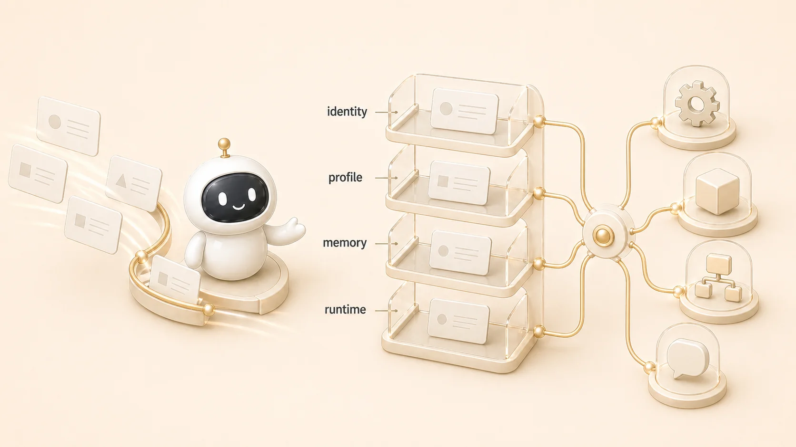

## Hermes Agent 운영 질문은 어떻게 분류할까

[Hermes Agent](https://wikidocs.net/346055) 운영 질문은 대부분 새로운 문제가 아니라 이미 있는 혼선의 변형이다. 같은 하비인데 기억이 다르게 느껴지는 문제, 도구가 파일을 못 읽는 문제, gateway가 살아 있는지 헷갈리는 문제, WikiDocs에 링크가 보이지만 클릭이 안 되는 문제는 서로 달라 보여도 모두 “어느 레이어를 먼저 볼 것인가”의 문제다.



그래서 운영 FAQ를 만들 때는 질문을 그대로 쌓지 않는다. 질문을 identity/profile/role/tool/runtime/source of truth/recovery 같은 레이어에 먼저 놓고, 그다음 하비가 직접 답할지, [방울이](https://wikidocs.net/345895)가 근거를 모을지, [뽀동이](https://wikidocs.net/345896)가 문서로 정리할지, 실행형 에이전트가 검증할지 정한다.

## FAQ가 약해지는 이유

초보자에게 약한 FAQ는 “질문은 많은데 어디부터 봐야 할지 모르는 문서”다. 그래서 Hermes Agent 운영 FAQ는 단순 Q&A보다 첫 분기와 확인 순서를 먼저 보여줘야 한다.

약한 FAQ는 이런 식으로 쌓인다.

```text
왜 기억을 못 하지?
왜 파일을 못 읽지?
왜 gateway가 켜져 있는데 답이 없지?
왜 WikiDocs 링크가 안 먹지?
왜 방울이와 뽀동이가 다르게 말하지?
```

질문만 모으면 답변은 많아지지만 운영은 좋아지지 않는다. 새 질문이 들어올 때마다 또 설명해야 하고, 다른 사람이 이어받을 때도 같은 판단을 반복한다. FAQ는 지식 창고가 아니라 첫 분기표여야 한다.

## 먼저 나눌 레이어

| 레이어 | 대표 질문 | 먼저 볼 것 | 연결 페이지 |
|---|---|---|---|
| identity | 지금 누구에게 말하고 있나 | 하비/보조 에이전트 호출 여부 | [AI 팀 읽는 법](https://wikidocs.net/345935) |
| role | 누가 조사하고 누가 정리하나 | 조사형/정리형/실행형 경계 | [역할 분리](https://wikidocs.net/345925) |
| memory | 왜 기억이 다르게 느껴지나 | session/memory/profile/source of truth | [기억 경계](https://wikidocs.net/346126) |
| tool | 파일, MCP, gateway, cron이 왜 안 되나 | 권한/경로/process/delivery | [도구 운영](https://wikidocs.net/345907) |
| publishing | GitHub와 WikiDocs 중 무엇을 고치나 | source of truth와 공개 배포 채널 | [WikiDocs 발행 흐름](https://wikidocs.net/345994) |
| recovery | 무엇부터 고쳐야 하나 | 증상 보존, 최근 변경, 복구 순서 | [복구 플레이북](https://wikidocs.net/345918) |

## 실제 운영 예시

WikiDocs 본문 링크 문제는 처음에는 “링크가 이상하다”로 보였다. 하지만 실제 원인은 글쓰기 문제가 아니라 publishing/source of truth 레이어였다. GitHub 본문에는 `.md` 링크가 자연스럽지만, GitHub 연동 WikiDocs 화면에서는 공개 페이지 ID 링크가 필요했다. 그래서 해결책도 단순 문장 수정이 아니라 WikiDocs TOC에서 page ID를 확인하고 본문 링크를 `https://wikidocs.net/{page_id}`로 바꾸는 것이었다.

같은 방식으로 “하비가 왜 기억을 못 하지?”는 기억 레이어로, “방울이와 뽀동이가 왜 다르게 말하지?”는 역할 레이어로, “cron 결과가 어디로 갔지?”는 runtime/delivery 레이어로 먼저 분류한다. 분류가 맞으면 답은 짧아진다.

## 자주 막히는 질문을 다시 쓰는 법

같은 질문도 FAQ에 어떻게 쓰느냐에 따라 복구 속도가 달라진다.

| 약한 질문 | 운영형 질문 | 연결할 확인 순서 |
|---|---|---|
| 왜 안 돼요? | CLI도 안 되는가, Slack만 안 되는가? | CLI → provider/config → gateway |
| Slack 봇이 죽었나요? | gateway process는 살아 있고 delivery target은 맞는가? | process → log → token/permission → channel/thread |
| 비용이 왜 늘었나요? | OAuth/구독/API key/검색 API 중 어느 비용인가? | provider 설정 → usage/quota → cron 반복 주기 |
| 검색 결과가 이상해요 | 검색 API 결과인가, 원문 검증 결과인가? | DuckDuckGo/SearXNG → browser 원문 → 유료 API 필요성 |
| 같은 에이전트가 다르게 말해요 | 같은 profile/session/AGENTS/SOUL을 쓰고 있는가? | profile → session → memory → gateway restart |
| 문서가 반영 안 돼요 | GitHub 원본이 바뀌었고 WikiDocs가 동기화됐는가? | source of truth → sync → public page spot-check |

이렇게 다시 쓰면 답변은 짧아지고, 운영자는 바로 확인 순서로 넘어갈 수 있다.

## 판단 기준

1. 질문 문장을 그대로 믿지 않는다. 먼저 레이어를 찾는다.
2. 답변보다 확인 순서를 먼저 쓴다.
3. 반복되는 질문은 FAQ에만 두지 않고 체크리스트 후보로 내린다.
4. 한 질문에 여러 레이어가 섞이면 메인 창구가 분리 순서를 정한다.
5. 책이나 팀 문서로 정리할 때는 읽는 사람이 몰라도 되는 내부값을 빼고 판단 기준만 남긴다.

## FAQ

### FAQ는 모든 질문을 다 모아야 하나요?

아니다. 모든 질문을 모으면 검색은 되지만 운영은 느려진다. 자주 반복되는 질문을 레이어별 대표 질문으로 묶고, 나머지는 관련 체크리스트나 복구 플레이북으로 연결하는 편이 낫다.

### 하비가 모든 질문에 답하면 안 되나요?

하비는 메인 창구로 답할 수 있지만, 모든 일을 직접 처리하면 병목이 된다. 근거 수집은 조사형, 문서화는 정리형, 실행 검증은 실행형으로 넘기고 하비는 판단과 통합을 맡는 구조가 안정적이다.
