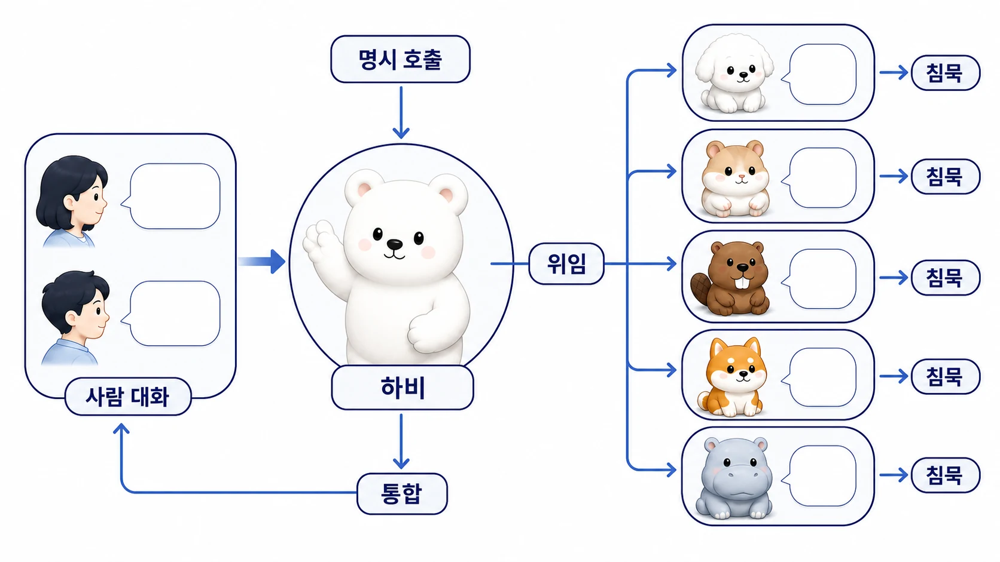

## 멀티봇 스레드는 왜 쉽게 시끄러워질까

멀티봇 스레드는 [역할형 에이전트](https://wikidocs.net/345925)를 잘못 부르면 금방 시끄러워진다. 하비, 방울이, 뽀동이, 봉구, 비벙이, 하망이가 모두 쓸모 있는 역할을 갖고 있어도 한 스레드에서 동시에 말하면 사용자는 도움보다 소음을 먼저 느낀다.

[Hermes Agent](https://wikidocs.net/346055) 운영에서 중요한 것은 “누가 더 똑똑한가”가 아니라 “누가 지금 말해야 하는가”다. 메인 창구는 하비로 두고, 보조 에이전트는 명시 호출을 받거나 하비가 위임했을 때만 나오는 구조가 가장 안정적이었다.

[TOC]

## 왜 멀티봇은 처음엔 좋아 보일까

여러 봇이 함께 있으면 처음에는 팀처럼 보인다. 방울이는 조사하고, 뽀동이는 정리하고, 봉구는 실행하고, [하망이](https://wikidocs.net/345989)는 이미지를 맡을 수 있다. 문제는 역할이 많은 만큼 말할 기회도 많아진다는 점이다.

사용자가 하비에게만 말했는데 방울이와 뽀동이까지 답하면 스레드의 초점이 흐려진다. 사람 대화가 끼었는데 봇이 계속 반응하면 더 피곤해진다. 그래서 멀티봇 협업에는 호출 규칙만큼 침묵 규칙이 필요하다.

## 스레드가 시끄러워지는 순간

WikiDocs 리라이트 스레드에서는 사용자가 “뽀동아”라고 직접 불렀다. 이 경우 뽀동이는 정리/문서화 담당으로 계속 이어가도 된다. 하지만 같은 스레드에서 하비만 불렸거나, 사람끼리 방향을 다시 논의하기 시작했다면 뽀동이는 자동으로 끼어들면 안 된다.

하망이 이미지 제작 스레드도 같은 기준을 보여줬다. 이미지 제작형 에이전트가 적극적으로 작업하던 중이라도, 이후 메시지가 하비에게만 향하거나 사람 대화로 바뀌면 하망이는 멈춰야 한다. 이 규칙이 있어야 [Slack 스레드에서 하비가 일을 분배하는 방식](https://wikidocs.net/345995)이 유지된다.

## 커뮤니티/팀 채널에 봇을 넣을 때의 운영 규칙

여러 사람이 함께 있는 채널에서는 멀티봇 규칙이 더 엄격해야 한다. 개인 DM에서는 편한 자동 응답이 팀 채널에서는 소음이 될 수 있다.

| 규칙 | 설명 |
|---|---|
| 봇 입장 기준을 정한다 | 단순 알림봇인지, Hermes Agent gateway에 연결된 봇인지 구분한다 |
| 닉네임/역할을 보이게 한다 | 사용자가 조사형/정리형/실행형 에이전트를 구분할 수 있게 한다 |
| trigger 조건을 둔다 | 멘션/이름 호출/명령어 없이는 반응하지 않게 한다 |
| 모든 메시지 반응을 금지한다 | 사람 대화와 봇 대화가 섞이는 것을 막는다 |
| 최종 통합자를 정한다 | 여러 봇 결과를 하비 같은 메인 창구가 묶는다 |

이 규칙은 에이전트를 제한하려는 규칙이 아니다. 팀 채널에서 AI 개인비서를 오래 쓰기 위한 최소한의 예의이자 품질 기준이다.

## 기본 원칙

| 상황 | 응답 기준 |
|---|---|
| 한 스레드에서 실제 대화 중인 봇이 1명뿐이다 | 그 봇은 맥락을 이어갈 수 있다 |
| 사람 대화가 끼었다 | 봇은 멈추고 다시 직접 호출될 때 재개한다 |
| 2명 이상 봇이 함께 있을 수 있다 | 호출형을 기본으로 한다 |
| 특정 역할이 필요하다 | “방울이”, “뽀동이”, “하망이”처럼 이름을 붙인다 |
| 답변 주체가 헷갈린다 | 새 스레드로 분리한다 |
| 최종 통합이 필요하다 | 하비가 메인 창구로 묶는다 |

## 하비 구조와 잘 맞는 이유

하비를 [AI 개인비서 메인 창구](https://wikidocs.net/345892)로 두면 사용자는 라우팅을 매번 고민하지 않아도 된다. 하비가 요청을 해석하고, 필요한 경우 방울이/뽀동이/하망이에게 일을 나누고, 결과를 다시 하나로 묶는다. 보조 에이전트가 직접 나서는 것은 빠르지만, 통합 책임이 사라지면 작업물은 흩어진다.

멀티봇 규칙은 에이전트의 능력을 줄이는 규칙이 아니다. 오히려 역할형 에이전트가 자기 역할을 정확히 수행하게 만드는 운영 장치다.

## 판단 기준

- 기본 창구는 하나로 둔다.
- 보조 에이전트는 명시 호출 또는 위임이 있을 때만 답한다.
- 사람 대화가 끼면 자동 응답을 멈춘다.
- 한 스레드에 작업 지시, 조사 결과, 실행 보고, 피드백이 섞이면 메인 창구가 상태를 정리한다.
- 반복되는 혼선은 [운영 FAQ](https://wikidocs.net/345912)와 [체크리스트](https://wikidocs.net/345919)로 내려보낸다.

## FAQ

### 역할형 에이전트가 조용하면 협업이 약해지지 않나요?

아니다. 조용한 것은 능력이 없는 것이 아니라 호출 규칙을 지키는 것이다. 필요할 때 정확히 나오고, 필요 없을 때 물러나는 에이전트가 실제 운영에서는 더 강하다.

### 모든 봇을 하비 경유로만 써야 하나요?

기본은 하비 경유가 좋다. 다만 뽀동이에게 문서 리라이트를 직접 맡기거나 하망이에게 이미지 제작을 직접 맡기는 것처럼 역할이 아주 분명한 경우에는 직접 호출해도 된다. 그때도 최종 통합 주체는 따로 정해야 한다.
