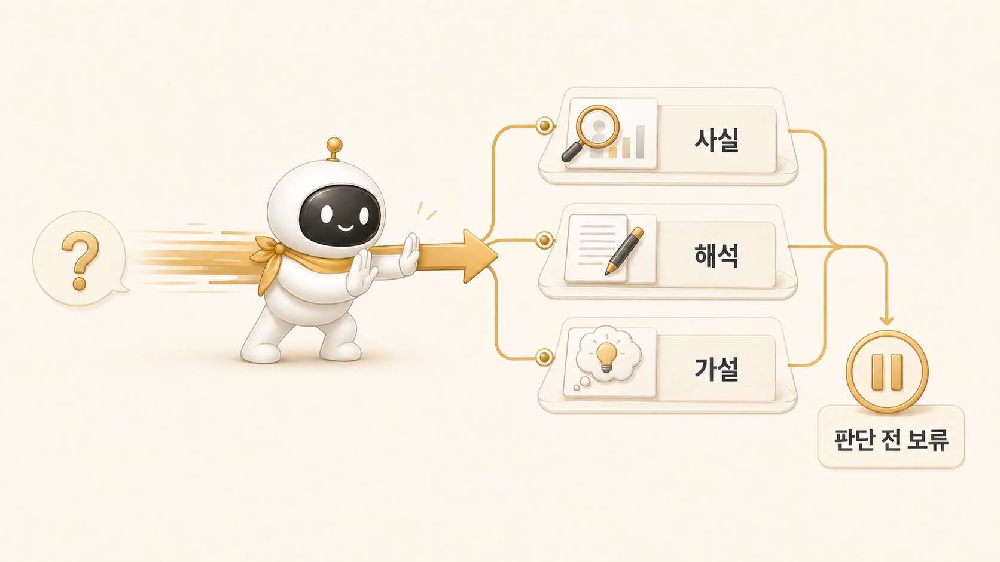

## 조사형 에이전트는 왜 자주 결론을 서두를까



[조사형 에이전트](https://wikidocs.net/345895)가 자주 결론을 서두르는 이유는 질문이 넓고 산출물 기준이 흐릴 때가 많기 때문이다. “이 주제 조사해줘”라고만 말하면 에이전트는 근거를 충분히 모으기보다 빠르게 그럴듯한 답을 만들려고 한다.

[Hermes Agent](https://wikidocs.net/346055) 업무 자동화에서 조사형 에이전트는 최종 판단자가 아니라 근거를 준비하는 역할이다. 방울이가 해야 할 일은 “이게 답이다”라고 단정하는 것이 아니라, 공식 문서, 기존 블로그, 실제 운영 사례, 반례를 나눠서 다음 단계가 판단할 수 있게 넘기는 것이다.

## 결론이 먼저 나오면 생기는 문제

결론이 근거보다 먼저 나오면 세 가지 문제가 생긴다.

첫째, 틀린 방향으로 정리가 시작된다. 정리형 에이전트는 주어진 재료를 구조화하는 데 강하지만, 잘못된 결론을 원자료처럼 받으면 그 결론을 더 읽기 좋게 만들어버릴 수 있다.

둘째, 미확인 항목이 사라진다. 조사에서 “아직 모른다”는 정보는 실패가 아니라 다음 단계의 안전장치다. 미확인을 숨기면 하비나 뽀동이가 공개 글에서 단정 표현을 쓰기 쉽다.

셋째, 검증 위치가 흐려진다. 어떤 출처를 봤고 무엇을 못 봤는지 남지 않으면, 나중에 오류를 발견해도 어디로 돌아가야 하는지 알기 어렵다.

## 사실, 해석, 가설을 나눠야 하는 이유

조사형 결과물은 최소한 사실, 해석, 가설을 나눠야 한다.

| 구분 | 의미 | 예시 |
|---|---|---|
| 사실 | 확인한 자료에서 직접 확인된 내용 | TOC에 3장 페이지가 6개 있다 |
| 해석 | 사실을 바탕으로 보는 의미 | 3장은 역할 분리의 핵심 장이다 |
| 가설 | 추가 확인이 필요한 추정 | 실행형/이미지형 설명을 더 보강하면 좋다 |
| 미확인 | 아직 확인하지 못한 항목 | 특정 공식 docs의 최신 반영 여부 |

이 구분이 있으면 정리형은 무엇을 단정해도 되는지, 무엇을 조심해야 하는지 알 수 있다. 하비도 최종 통합할 때 “근거 있는 결론”과 “다음에 더 봐야 할 지점”을 분리할 수 있다.

## 실제 운영 장면: WikiDocs 3장 보강 전 조사

3장을 다시 쓰기 전에도 먼저 조사형 절차가 필요했다. 현재 3장 페이지가 어떤 상태인지, TOC에서 어떤 순서로 읽히는지, 이미지가 있는지, 기존 링크가 WikiDocs URL인지, SOURCE_MAP에서 어떤 원천과 연결되어 있는지 확인해야 했다.

여기서 바로 “3장은 역할 분리가 핵심이다”라고 쓰기 시작하면 약하다. 독자가 이미 1장에서 AI 팀 관점을 읽고, 2장에서 하비 메인 창구를 읽은 다음 3장으로 넘어온다는 맥락을 확인해야 한다. 그래야 3장이 단순 캐릭터 소개가 아니라 “메인 창구 다음에 필요한 책임 분리”로 읽힌다.

또 Slack 운영 기록과 shared-memory를 보면 팀 규칙은 이미 분명하다. 하비는 메인 창구, 방울이는 조사/탐색/근거수집, 뽀동이는 정리/문서화/작성, 하망이는 이미지 제작, 봉구와 비벙이는 실행/제품 흐름을 맡는다. 조사형의 일은 이 규칙을 찾아내고, 공개 글에 넣을 수 있는 수준으로 추상화해 넘기는 것이다.

## 방울이에게 주는 요청 예시

조사형에게는 아래처럼 요청하는 편이 좋다.

```text
이 주제에 대해 먼저 결론을 내지 말고,
공식 문서/기존 WikiDocs 페이지/Slack 운영 기록/shared-memory를 나눠서 확인해줘.
각 항목을 사실/해석/미확인/다음 확인 포인트로 분리하고,
뽀동이가 공개 글로 바꿀 때 빼야 할 민감정보나 내부 디테일도 표시해줘.
```

이 요청에는 결론을 늦추는 장치가 들어 있다. “먼저 결론을 내지 말고”라는 말보다 더 중요한 것은 산출물 형식이다. 사실/해석/미확인/다음 확인 포인트를 요구하면 조사형이 빠른 결론으로 도망가기 어렵다.

## 운영 기준

조사형 에이전트를 쓸 때는 아래 기준을 둔다.

- 질문이 넓을수록 결론을 늦춘다.
- 공식 문서와 실제 운영 기록을 분리한다.
- 사실, 해석, 가설, 미확인을 나눈다.
- 출처가 약한 신호는 약한 신호로 표시한다.
- 다음 역할이 쓸 수 있게 요약보다 구조를 우선한다.
- 민감정보와 내부 식별값은 공개 본문 재료에서 제거한다.

조사형의 좋은 결과물은 빠른 답보다 재검토 가능한 재료다.

## FAQ

### 조사형 에이전트가 빠르게 결론을 내면 좋은 것 아닌가요?

간단한 질문에는 좋을 수 있다. 하지만 운영 문서, WikiDocs, 제품 판단처럼 되돌리기 어려운 작업에서는 빠른 결론보다 근거 분리가 더 안전하다.

### 조사 결과가 너무 길어지면 어떻게 하나요?

길이를 줄이기 전에 구조를 먼저 만든다. 출처/핵심 발견/미확인/다음 확인 포인트로 나누면 긴 조사도 쓸 수 있다. 구조 없는 짧은 요약이 더 위험할 때가 많다.

### 미확인 항목을 남기면 답이 약해 보이지 않나요?

오히려 강해진다. 미확인을 남기면 다음 단계에서 무엇을 확인해야 하는지 보인다. 운영에서는 모르는 것을 숨기는 것보다 모르는 위치를 표시하는 편이 안전하다.

## 다음 글

- 정리형이 재료 부족 상태에서 어떻게 약해지는지는 [정리형 에이전트는 왜 그럴듯하지만 약한 글을 만들까](https://wikidocs.net/345910)에서 이어서 본다.
- 이 기준이 실제 콘텐츠 파이프라인으로 이어지는 장면은 [방울이 확장조사와 뽀동이 글쓰기는 어떻게 이어질까](https://wikidocs.net/345993)에서 확인할 수 있다.
