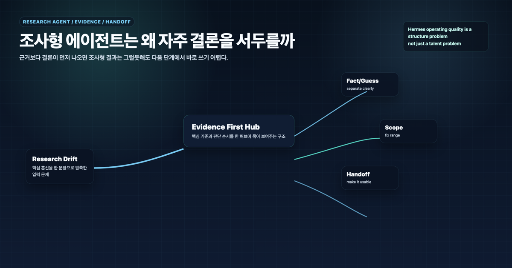

## 조사형 에이전트는 왜 자주 결론을 서두를까

> 이 글은 **에르메스 에이전트(Hermes Agent)**를 역할형 에이전트로 운영하며 정리한 실전 기록입니다.

조사형 에이전트가 결론을 서두르는 이유는 대체로 요청이 “답”처럼 들어오기 때문이다. 사용자는 빨리 알고 싶고, 에이전트는 그 기대를 맞추려고 한다. 그러면 아직 충분히 확인하지 않은 내용도 하나의 결론처럼 묶인다.

AI 업무 자동화에서 조사형 에이전트의 목적은 빠른 확신이 아니다. 메인 창구와 정리형 에이전트가 안전하게 판단할 수 있도록 **검증 가능한 재료를 만드는 것**이다. 그래서 조사형에게는 결론보다 근거 구조를 먼저 요구해야 한다.

## 왜 조사 결과는 그럴듯해도 불안하게 느껴질까

조사 결과가 길고 말이 자연스러워도 불안할 때가 있다. 보통 이유는 세 가지다.

- 출처가 선명하지 않다.
- 사실과 해석이 섞여 있다.
- 아직 확인하지 않은 가설이 결론처럼 쓰였다.

이 상태에서 정리형 에이전트가 문서를 만들면 글은 매끄러워질 수 있다. 하지만 근거가 약한 문서가 된다.

## 결론이 근거보다 먼저 나오는 순간 무슨 일이 생기나

조사형 에이전트가 결론을 먼저 내면 다음 단계가 흔들린다.

첫째, 메인 창구가 실제 판단 재료를 볼 수 없다. 둘째, 정리형 에이전트가 검증되지 않은 결론을 전제로 문서를 만든다. 셋째, 나중에 틀렸을 때 어디서 틀렸는지 추적하기 어렵다.

그래서 조사형 결과는 “추천안”보다 “판단 가능한 재료 묶음”이어야 한다.

## 사실, 해석, 가설을 왜 나눠야 하나

조사형 handoff에서 가장 중요한 구분은 사실, 해석, 가설이다.

| 구분 | 의미 | 예시 |
|---|---|---|
| 사실 | 출처로 확인된 내용 | 공식 문서에 적힌 기능, 날짜, 절차 |
| 해석 | 확인된 사실을 바탕으로 한 설명 | 이 기능은 업무 자동화에서 cron 패턴으로 볼 수 있음 |
| 가설 | 아직 검증이 더 필요한 판단 | 이 구조를 콘텐츠 발행 루틴에도 적용할 수 있을 듯함 |

이 셋을 나누면 메인 창구가 어디까지 믿고 어디부터 조심해야 하는지 알 수 있다.

## 조사 범위와 handoff 형식이 같이 중요한 이유

조사 범위가 없으면 에이전트는 너무 넓게 헤맨다. handoff 형식이 없으면 결과가 다음 단계에서 다시 정리되어야 한다.

좋은 조사 요청은 처음부터 아래를 포함한다.

- 조사 질문
- 포함할 범위
- 제외할 범위
- 우선 확인할 출처
- 사실/해석/가설 구분
- 다음 역할이 받을 출력 형식

예를 들어 “MCP 조사해줘”보다 “Hermes Agent에서 MCP를 업무 자동화에 붙일 때 필요한 공식 기준, 실제 운영 리스크, WikiDocs 5장에 넣을 체크리스트 후보를 사실/해석/가설로 나눠줘”가 더 안전하다.

## 실제로는 무엇을 고쳐야 하나

### 1. 결론보다 근거를 앞에 둔다

조사 결과의 첫 부분에는 확인한 사실과 출처가 먼저 와야 한다. 결론은 그다음이다.

### 2. 사실/해석/가설을 분리한다

이 구분이 있으면 정리형 에이전트가 안전하게 문서화할 수 있다.

### 3. 조사 범위를 먼저 고정한다

범위가 없으면 조사형은 너무 넓게 가거나, 반대로 너무 빨리 좁힌다.

### 4. 다음 단계가 쓰기 좋은 형태로 넘긴다

조사 결과는 끝이 아니라 handoff다. 다음 역할이 바로 쓸 수 있어야 한다.

## 우리가 실제로 세운 운영 원칙

### 원칙 1. 결론보다 근거 먼저

조사형 에이전트에게는 빠른 답보다 근거 구조를 요구한다.

### 원칙 2. 출처 없는 확신은 낮은 신뢰로 본다

말이 자연스러워도 출처가 없으면 다시 확인한다.

### 원칙 3. 사실, 해석, 가설을 분리한다

특히 공식 문서 반영과 실무 경험 반영을 섞지 않는다.

### 원칙 4. 조사 결과는 정리형이 받을 수 있게 넘긴다

긴 나열보다 다음 작업자가 쓸 수 있는 구조가 중요하다.

## FAQ

### 1. 조사형 에이전트가 빠르게 결론을 주면 좋은 것 아닌가요?

간단한 질문은 그럴 수 있다. 하지만 중요한 의사결정이나 공개 문서에 들어갈 내용은 근거가 먼저다.

### 2. 출처가 많으면 좋은 조사인가요?

출처 수보다 출처의 적합성과 구분이 중요하다. 공식 문서, 실제 사례, 해석을 나눠야 한다.

### 3. 조사 결과를 어떻게 넘기면 좋나요?

확인된 사실, 해석, 가설, 남은 질문, 다음 단계 추천으로 나눠 넘기면 좋다.

## 다음 글

다음 글에서는 정리형 에이전트가 왜 보기 좋은데 약한 글을 만들 수 있는지 다룬다.

[다음 글: 정리형 에이전트는 왜 그럴듯하지만 약한 글을 만들까](17-why-writing-agents-produce-polished-but-weak-drafts.md)
