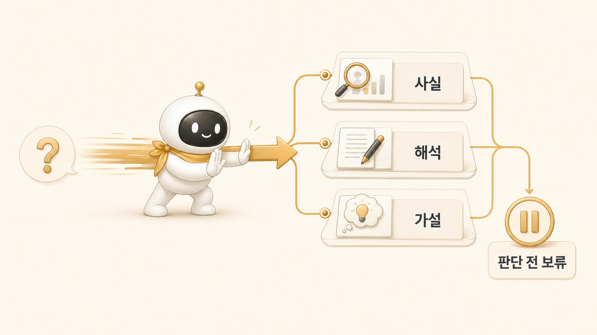

## 조사형 에이전트는 왜 자주 결론을 서두를까

에르메스 에이전트(Hermes Agent)에서 조사형 에이전트가 자주 흔들리는 지점은 속도다. 빠르게 자료를 모으다 보면, 어느 순간 “이 정도면 답이 나왔다”고 느끼기 쉽다. 하지만 [역할형 에이전트](https://wikidocs.net/345925) 운영에서 조사형의 일은 최종 결론을 내리는 것이 아니라 [정리형 에이전트](https://wikidocs.net/345896)가 다음 판단을 할 수 있도록 근거를 정리하는 것이다.



방울이 같은 조사형 에이전트에게 필요한 태도는 단정이 아니라 구분이다. 사실, 해석, 가설, 미확인 항목을 나눠야 정리형 에이전트가 그 재료를 안전하게 글로 바꿀 수 있다.

[TOC]

## 결론이 먼저 나오면 생기는 문제

조사형이 결론을 서두르면 다음 문제가 생긴다.

- 출처를 봤지만 맥락을 놓친다.
- 일부 사례를 전체 경향처럼 말한다.
- 공식 설명과 실제 운영 경험을 섞어 쓴다.
- 확인하지 못한 부분을 자연스럽게 메운다.
- 정리형 에이전트가 그 결론을 그대로 문장화한다.

이렇게 되면 최종 글은 빠르게 나오지만, 나중에 고치기 어렵다. 겉으로는 논리가 있어 보이지만 어떤 문장이 사실이고 어떤 문장이 해석인지 추적하기 힘들기 때문이다.

## 사실, 해석, 가설을 나눠야 하는 이유

조사형 결과는 아래처럼 나뉘어야 한다.

| 구분 | 의미 | 예시 |
|---|---|---|
| 사실 | 확인 가능한 내용 | 현재 페이지에 이미지가 있다/없다 |
| 해석 | 사실을 바탕으로 한 판단 | 이미지가 있지만 본문 메시지와 연결이 약하다 |
| 가설 | 아직 검증 전인 설명 | 독자는 이 장을 역할 소개로만 읽을 수 있다 |
| 미확인 | 더 봐야 하는 항목 | 공개 화면에서 링크가 어떻게 보이는지는 추가 확인 필요 |

이 구분은 글을 느리게 만들기 위한 절차가 아니다. 오히려 다음 단계의 수정 속도를 높인다. 정리형은 사실을 근거로 쓰고, 해석을 읽는 흐름으로 바꾸고, 가설은 조심스럽게 다룰 수 있다.

## 실제 장면: 3장 보강 전 조사

3장을 다시 쓰기 전에도 먼저 조사형 절차가 필요했다. 현재 3장 페이지가 어떤 순서로 읽히는지, 이미지가 있는지, 기존 링크가 공개 WikiDocs URL인지, 어떤 문장이 1장/2장과 반복되는지 확인해야 했다.

이때 조사형이 바로 “3장은 역할 분리 장이다”라고 결론 내리면 부족하다. 더 필요한 질문은 이런 것들이다.

1. 3장 intro가 1장/2장의 역할 분리 설명을 반복하고 있지 않은가?
2. 조사형과 정리형의 차이가 실제 실패 패턴으로 보이는가?
3. 실행형의 책임이 빠져서 글쓰기 이야기로만 보이지 않는가?
4. 내부 기록으로 읽히는 표현이 읽기 쉬운 사례로 바뀌었는가?
5. 공유 글에 남길 수 없는 세부값이 섞여 있지 않은가?

이 질문에 답해야 정리형이 3장을 “역할 소개”가 아니라 “역할 실패를 줄이는 판단 기준”으로 바꿀 수 있다.

## 조사형 에이전트에게 주는 요청 예시

```text
방울아, 3장 페이지들을 먼저 조사해줘.
페이지별 제목/길이/이미지/다음 링크를 확인하고,
1장/2장과 반복되는 문장, 읽는 사람에게 불필요한 내부 표현,
조사형/정리형/실행형 경계가 흐린 부분을 나눠서 알려줘.
결론은 확정하지 말고 사실/해석/미확인 항목으로 구분해줘.
```

이 요청의 핵심은 “결론을 내지 말라”가 아니다. 결론의 재료와 결론을 분리해 달라는 것이다.

## 결론을 서두르지 않게 하는 기준

- 조사 결과를 사실/해석/가설/미확인 항목으로 나눈다.
- 출처나 확인 범위를 함께 남긴다.
- 일부 사례를 전체 결론처럼 쓰지 않는다.
- 공식 설명과 실제 운영 경험을 구분한다.
- 정리형이 쓸 수 있는 재료 형태로 넘긴다.
- 본문에 그대로 넣기 어려운 내부 세부값은 제외하거나 표시한다.

## FAQ

### 조사형 에이전트가 빠르게 결론을 내면 좋은 것 아닌가요?

빠른 임시 결론은 도움이 된다. 다만 그것이 최종 판단처럼 전달되면 위험하다. “현재 확인한 범위에서는”이라는 경계를 남겨야 한다.

### 조사 결과가 너무 길어지면 어떻게 하나요?

원자료 전체를 넘기지 말고 핵심 발견, 반례, 미확인 항목으로 줄인다. 긴 자료보다 구분된 자료가 다음 역할에게 더 유용하다.
