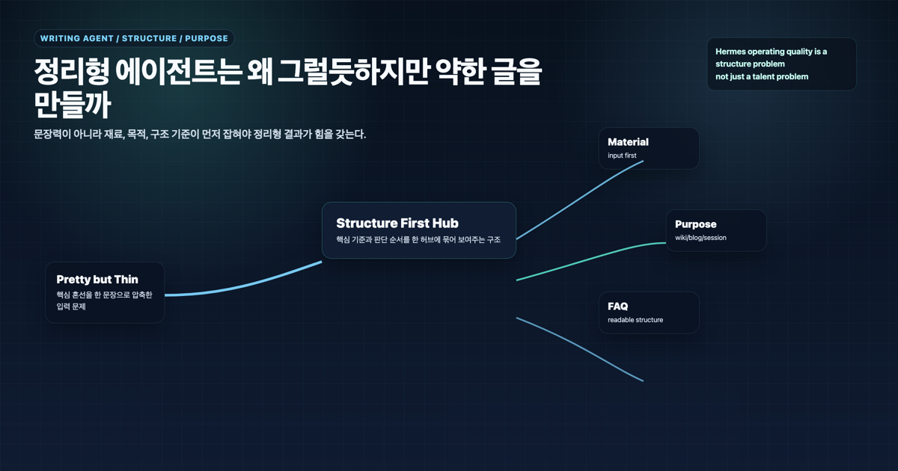
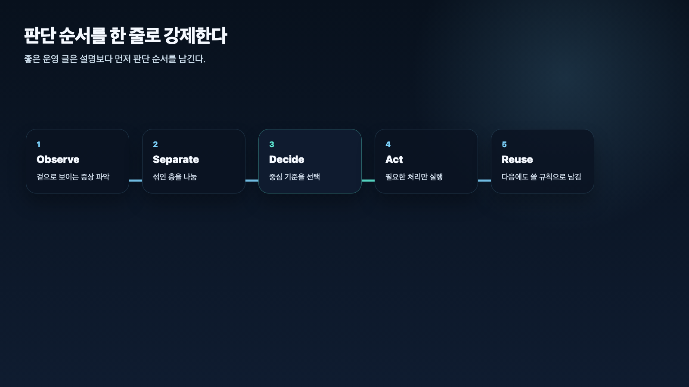

## 정리형 에이전트는 왜 그럴듯하지만 약한 글을 만들까

> 이 글은 **에르메스 에이전트(Hermes Agent)**를 역할형 에이전트로 운영하며 정리한 실전 기록입니다.

정리형 에이전트가 그럴듯하지만 약한 글을 만드는 이유는 보통 재료보다 완성도를 먼저 요구받기 때문이다. “읽기 좋게 정리해줘”라는 요청은 자연스럽지만, 입력 재료가 부족하면 정리형 에이전트는 빈칸을 문장으로 메우기 쉽다.

AI 업무 자동화에서 정리형 에이전트의 목적은 예쁜 문장을 만드는 것이 아니다. 독자, 목적, 핵심 메시지, 근거를 기준으로 재료를 다시 배열해 **바로 쓸 수 있는 문서 구조**를 만드는 것이다.

## 왜 보기 좋은데도 힘이 없게 느껴질까

보기 좋은 글이 약하게 느껴질 때는 대체로 아래 중 하나가 빠져 있다.

- 실제 사례
- 독자 문제
- 핵심 메시지
- 근거와 출처
- 다음 행동 기준

문장이 매끄럽다고 좋은 글은 아니다. 특히 WikiDocs나 전자책처럼 오래 읽힐 문서는 문장보다 구조와 근거가 중요하다.

## 재료 없이 그럴듯한 초안이 왜 위험한가

재료가 부족한 상태에서 정리형 에이전트에게 완성도를 요구하면 일반론이 늘어난다. “중요합니다”, “효율적입니다” 같은 문장이 생기기 쉬운 이유도 여기에 있다.

겉으로는 문서가 완성된 것처럼 보인다. 하지만 나중에 보면 실제 경험, 시행착오, 공식 문서 근거가 약하다. 그러면 다시 조사해야 하고, 결국 시간이 더 든다.

## 목적 없는 정리는 왜 어정쩡해질까

같은 재료라도 Slack 보고, WikiDocs 페이지, 블로그, 강의안은 구조가 다르다.

- Slack 보고는 짧고 다음 액션이 보여야 한다.
- WikiDocs 페이지는 개념, 기준, FAQ, 다음 링크가 필요하다.
- 블로그는 독자 문제와 클릭 가능한 제목이 중요하다.
- 강의안은 순서와 예제가 중요하다.

목적이 없으면 정리형 에이전트는 안전한 일반 문서로 간다. 하지만 안전한 문서가 곧 좋은 문서는 아니다.

## 조사형 역할까지 같이 하려 하면 왜 둘 다 약해질까

정리하다 보면 빈칸이 보인다. 이때 정리형 에이전트가 추측으로 채우면 위험하다. 근거가 필요한 빈칸은 조사형 에이전트로 되돌려야 한다.

역할 분리는 속도를 늦추기 위한 장치가 아니다. 오히려 틀린 확신을 줄이기 위한 장치다. 정리형은 구조를 만들고, 조사형은 필요한 근거를 채운다. 메인 창구는 둘의 결과를 검수해 최종 문서로 묶는다.

## 그럼 무엇을 먼저 고쳐야 하나

### 1. 입력 재료를 충분히 준다

정리형 에이전트에게는 원문, 조사 결과, 대화 맥락, 결정 사항을 같이 줘야 한다.

### 2. 출력 목적을 먼저 고정한다

누가 읽는지, 어디에 쓰는지, 읽고 나서 무엇을 해야 하는지 먼저 정한다.

### 3. 정보량보다 전달 구조를 본다

많은 정보를 넣는 것보다 독자가 따라갈 수 있는 순서가 중요하다.

### 4. 제목, 첫 답변, 기준, FAQ, 다음 링크를 요구한다

특히 WikiDocs 페이지라면 검색과 AI 인용을 위해 첫 답변과 FAQ가 중요하다.

## 우리가 실제로 세운 운영 원칙

### 원칙 1. 재료 없는 정리는 시키지 않는다

재료가 부족하면 먼저 조사형으로 돌린다.

### 원칙 2. 목적과 독자를 먼저 준다

문체보다 목적이 먼저다. 독자가 다르면 구조도 달라진다.

### 원칙 3. 보기 좋은 문장보다 쓸 수 있는 구조를 본다

제목, 흐름, 기준, FAQ, 다음 액션이 살아 있어야 한다.

### 원칙 4. 근거가 빈 곳은 문장으로 덮지 않는다

모르는 부분은 모른다고 표시하고, 추가 조사로 넘긴다.

### 원칙 5. 최종 공개 전에는 메인 창구가 다시 검수한다

정리형 초안이 좋아도 최종 책임은 메인 창구에 남는다.

## FAQ

### 1. 정리형 에이전트가 글을 잘 쓰면 충분하지 않나요?

아니다. 글쓰기 품질과 근거 품질은 다르다. 재료가 약하면 문장이 좋아도 결과물은 약하다.

### 2. 정리형 에이전트에게 가장 먼저 줘야 할 것은 무엇인가요?

독자, 목적, 핵심 메시지, 유지할 사실, 출력 형식이다.

### 3. AI스러운 글은 왜 생기나요?

재료와 목적이 약할 때 일반적인 표현으로 빈칸을 메우기 때문이다. 실제 사례와 기준을 주면 훨씬 자연스러워진다.

## 다음 글

다음 장에서는 역할형 에이전트가 오래 안정적으로 움직이려면 기억, 컨텍스트, 프로필 경계를 어떻게 나눠야 하는지 다룬다.

[다음 장: 기억, 컨텍스트, 프로필 경계](04-chapter-4.md)
