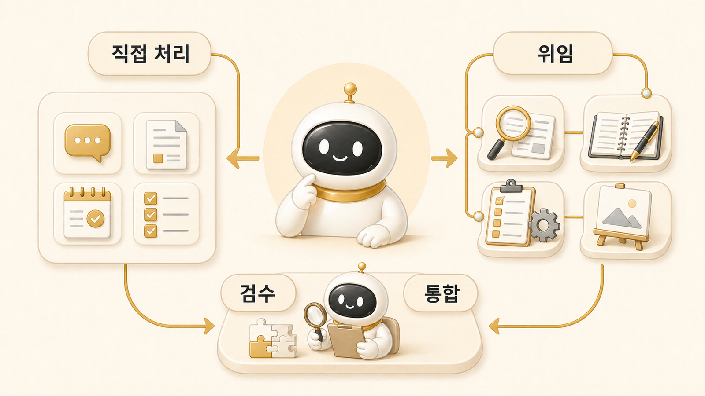

## 직접 처리할 일과 역할형 에이전트에 맡길 일



AI 개인비서가 잘 굴러가려면 직접 처리할 일과 [역할형 에이전트](03-role-based-agent-splitting.md)에 맡길 일을 구분해야 한다. 하비가 모든 일을 직접 하면 메인 창구가 병목이 되고, 반대로 모든 일을 위임하면 사용자는 조각난 결과만 받게 된다.

핵심 기준은 일의 성격이다. 짧은 판단, 우선순위, 최종 통합은 메인 창구가 직접 처리하는 편이 좋다. 반면 근거 수집, 긴 문서 정리, 파일 수정, 이미지 방향처럼 깊이가 필요한 일은 방울이, 뽀동이, 봉구, [하망이](28-how-image-agent-creates-wikidocs-visuals.md) 같은 역할형 에이전트에게 맡기는 편이 안정적이다.

## 왜 다 해도 문제고, 다 넘겨도 문제일까

[AI 개인비서](00-ai-chatbot-vs-ai-personal-assistant.md)는 사용자와 가장 가까운 창구다. 그래서 사용자는 자연스럽게 하비에게 모든 일을 맡기고 싶어진다. 하지만 하비가 조사, 정리, 실행, 이미지 제작, 검증까지 모두 붙잡으면 한 대화 안에 너무 많은 맥락이 섞인다.

반대로 위임만 많이 해도 문제가 생긴다. [방울이](23-where-bangwooli-research-agent-is-strong-and-where-it-wobbles.md)가 조사한 결과, 뽀동이가 정리한 초안, 봉구가 수정한 파일, 하망이가 잡은 이미지 방향이 서로 따로 놀 수 있다. 위임은 일을 던지는 것이 아니라 **맡긴 뒤 다시 받아 검수하고 묶는 과정**까지 포함한다.

## 하비가 직접 처리하기 좋은 일

| 직접 처리할 일 | 이유 | 예시 |
|---|---|---|
| 짧은 판단 | 사용자가 바로 다음 행동을 정해야 함 | “지금은 2장부터 볼까, 4장부터 볼까?” |
| 우선순위 정리 | 전체 흐름을 봐야 함 | “1장은 끝났고 2장 제목부터 손보자” |
| 요청 재해석 | 사용자의 의도를 먼저 잡아야 함 | “제목을 줄이라는 게 책 제목이 아니라 페이지 제목이었구나” |
| 최종 통합 | 여러 결과를 하나로 묶어야 함 | 조사 결과와 초안을 합쳐 WikiDocs 원고로 정리 |
| 짧은 보고 | 사용자가 다음 액션만 원함 | “완료 / 남음 / 다음” 형식 보고 |

하비가 직접 처리할 일은 대부분 짧고, 맥락을 유지해야 하고, 최종 판단과 연결된다.

## 역할형 에이전트에 맡기기 좋은 일

| 맡길 역할 | 맡길 일 | 넘기기 전 기준 |
|---|---|---|
| 방울이 | 확장조사, 출처 확인, 비교, 반례 찾기 | 질문 범위와 필요한 근거 수준이 정해졌는가 |
| 뽀동이 | 글 구조화, 보고서, WikiDocs 페이지 정리 | 목적, 독자, 원자료가 있는가 |
| 봉구 | 파일 수정, 명령 실행, 검증, 반복 작업 | 작업 범위와 rollback 기준이 있는가 |
| 비벙이 | 제품/기능 흐름, 요구사항, 기능 문서화 | 사용자 문제와 결정 기준이 있는가 |
| 하망이 | 썸네일, 설명 이미지, 시각 콘셉트 | 핵심 메시지와 채널이 정해졌는가 |

역할형 에이전트에 맡길수록 요청은 더 구체적이어야 한다. “조사해줘”보다 “공식 문서와 기존 블로그 기준으로 빠진 근거를 찾아줘”가 좋고, “정리해줘”보다 “WikiDocs 2장 흐름에 맞게 첫 문단/표/FAQ/다음 링크로 정리해줘”가 좋다.

## 실제 운영 예시

나쁜 요청은 이렇게 생긴다.

```text
하비야, Hermes 책 좀 잘 정리해줘.
```

이 요청은 범위가 너무 넓다. 하비가 직접 처리할지, 방울이에게 조사시킬지, 뽀동이에게 정리시킬지 판단하기 어렵다.

더 나은 요청은 이렇게 쓴다.

```text
하비야, 2장 메인 창구 파트를 다시 봐줘.
제목은 SEO 키워드 살리되 너무 길지 않게 정리하고,
방울이가 공식 docs 기준으로 빠진 기능 연결을 확인하게 해줘.
그다음 뽀동이가 WikiDocs 책 문체로 다듬고,
마지막에 네가 전체 흐름과 다음 링크를 검수해줘.
```

이 요청은 하비가 직접 할 일과 위임할 일이 분리되어 있다. 하비는 메인 창구로 전체 흐름을 잡고, 방울이는 확인할 근거를 찾고, 뽀동이는 읽히는 구조로 다듬는다.

## 위임 기준 체크리스트

위임하기 전에 아래를 확인한다.

- 결과물이 짧은 판단인가, 깊은 작업인가?
- 추가 근거가 필요한가?
- 문서 구조화가 필요한가?
- 실제 파일 수정이나 명령 실행이 필요한가?
- 이미지나 시각 메시지가 필요한가?
- 중간 결과를 누가 검수할 것인가?
- 최종 보고 형식은 무엇인가?

## FAQ

### 하비가 직접 처리하면 안 되는 일은 뭔가요?

근거 확인이 길거나, 문서 구조가 복잡하거나, 실제 파일 수정이 필요한 일은 혼자 붙잡지 않는 편이 좋다. 역할형 에이전트에게 맡기고 최종 통합만 가져오는 구조가 안정적이다.

### 위임을 많이 하면 품질이 좋아지나요?

항상 그렇지는 않다. 위임 기준과 검수 기준이 없으면 결과가 흩어진다. 위임은 역할을 나누는 일이지 책임을 없애는 일이 아니다.

### 사용자는 어느 정도까지 지시해야 하나요?

사용자는 목표와 제약을 말하면 된다. 구체적인 역할 배정은 메인 창구가 돕되, 중요한 기준은 사용자가 확인해야 한다.

## 다음 글

다음 글에서는 AI 개인비서 메인 창구가 왜 강력한지, 그리고 어떤 상황에서 병목이 되는지 정리한다.

[다음 글: 메인 창구의 강점과 병목](22-why-harvey-main-window-is-powerful-and-where-it-bottlenecks.md)
