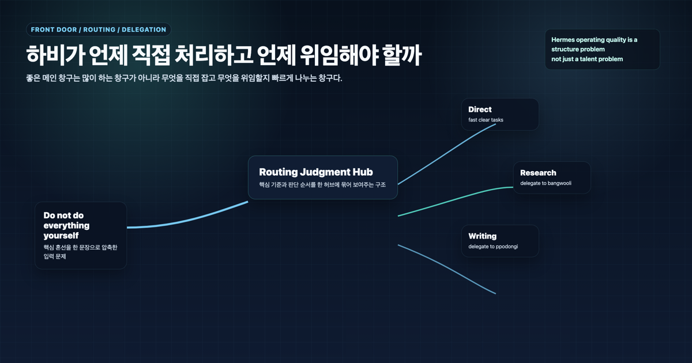
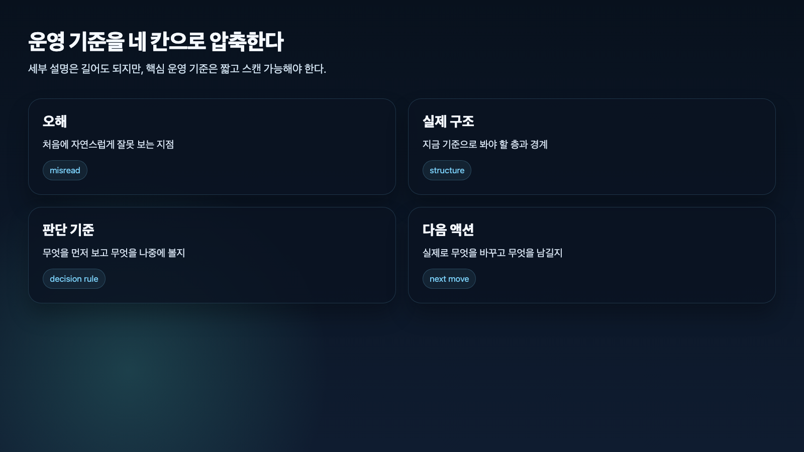

## AI 개인비서는 언제 직접 처리하고 언제 위임해야 할까

> 이 글은 **에르메스 에이전트(Hermes Agent)**를 AI 개인비서와 역할형 에이전트로 운영하며 정리한 실전 기록입니다.

AI 개인비서의 메인 창구는 모든 일을 직접 처리하면 병목이 되고, 모든 일을 위임하면 책임이 흐려진다. 그래서 중요한 것은 “할 수 있느냐”가 아니라 **지금 직접 잡는 편이 좋은가, 역할형 에이전트에게 넘기는 편이 좋은가**를 빠르게 판단하는 일이다.

우리 운영에서 하비는 사용자의 첫 요청을 받는다. 하지만 하비가 모든 조사와 모든 정리를 혼자 하는 것은 아니다. 짧은 판단, 우선순위 정리, 최종 보고는 직접 잡고, 근거 수집은 조사형 에이전트에게, 문서 구조화는 정리형 에이전트에게 넘긴다. 대신 최종 해석과 통합 책임은 계속 하비에게 남긴다.

좋은 메인 창구는 많이 하는 창구가 아니라 **잘 나누고 끝까지 책임지는 창구**다.

## 왜 다 해도 문제고, 다 넘겨도 문제일까

메인 창구가 모든 일을 직접 처리하면 처음에는 편해 보인다. 사용자는 한 곳에 말하고 바로 답을 받는다. 하지만 작업이 커지면 곧 병목이 생긴다.

- 조사와 근거 수집이 얕아진다.
- 긴 문서 정리 품질이 떨어진다.
- 여러 작업이 동시에 오면 응답 속도가 흔들린다.
- 메인 창구가 검수와 실행까지 모두 떠안는다.

반대로 너무 쉽게 위임해도 문제가 생긴다.

- 사용자는 중간 산출물을 너무 많이 본다.
- 조사 결과와 정리 초안이 따로 논다.
- 최종 결론이 누구 책임인지 애매해진다.
- 결국 사용자가 다시 편집자와 PM 역할을 맡는다.

즉 메인 창구의 핵심은 노동량이 아니라 **분배 기준과 책임 구조**다.

## 직접 처리해야 하는 일

하비 같은 AI 개인비서가 직접 처리하는 편이 좋은 일은 대체로 짧고, 맥락이 이미 있고, 위임 비용이 더 큰 작업이다.

### 1. 짧은 판단과 우선순위 정리

예를 들어 “지금 어디까지 됐지?”, “다음에 뭐 하면 돼?”, “이 방향 맞아?” 같은 질문은 하비가 직접 잡는 편이 낫다. 이미 대화 맥락이 있고, 사용자는 긴 조사보다 빠른 판단을 원한다.

### 2. 사용자 대화 흐름 유지

메인 창구는 사용자의 말투, 선호, 현재 작업 흐름을 가장 잘 보고 있다. 대화의 톤과 다음 액션을 잡는 일은 직접 처리하는 편이 자연스럽다.

### 3. 기준이 이미 선명한 작업

정해진 규칙에 따라 짧게 확인하거나, 이전에 합의한 기준을 적용하는 일은 굳이 위임하지 않아도 된다.

### 4. 최종 통합과 보고

조사형·정리형 에이전트가 중간 결과를 만들더라도 마지막 보고는 메인 창구가 잡아야 한다. 사용자에게 전달되는 최종 문장은 하나의 흐름이어야 한다.

## 위임해야 하는 일

위임은 책임 회피가 아니라 역할 특화 품질을 끌어오는 방법이다. 핵심은 “누가 더 잘하나”보다 “어떤 실패를 줄이고 싶은가”다.

### 조사형 에이전트에게 맡길 일

조사형 에이전트는 넓게 찾고, 비교하고, 근거를 모으는 일에 강하다.

- 새로운 주제 탐색
- 공식 문서 확인
- 경쟁 사례 비교
- 사실 확인과 출처 수집
- 여러 후보의 장단점 정리

이런 일은 메인 창구가 빠르게 결론을 내리기보다 조사형 에이전트에게 재료를 모으게 하는 편이 안전하다.

### 정리형 에이전트에게 맡길 일

정리형 에이전트는 재료를 읽기 좋은 구조로 바꾸는 데 강하다.

- 회의 메모 정리
- 보고서 초안
- WikiDocs 페이지 리라이트
- 발표용 흐름 재구성
- 제목, 소제목, CTA 정리

재료는 있는데 구조가 약할 때는 정리형 에이전트에게 넘기는 편이 낫다.

### 실행형 에이전트에게 맡길 일

실제 명령 실행, 파일 수정, 배포, 반복 검증처럼 도구 사용이 중심인 일은 실행형 흐름이 필요하다.

- 파일 생성/수정
- 테스트 실행
- Git 커밋/푸시
- 배포 확인
- 로그와 프로세스 점검

다만 실행형 위임은 범위가 선명해야 한다. 무엇을 바꾸고, 어디까지 검증하고, 어떤 결과를 보고할지 먼저 정해야 한다.

## 위임할 때 반드시 남겨야 하는 것

좋은 위임은 “태우고 끝”이 아니다. 메인 창구가 계속 쥐고 있어야 하는 것이 있다.

- 요청의 목적
- 사용자가 원하는 최종 형식
- 민감정보와 공개 범위
- 검수 기준
- 최종 판단과 보고 책임

이 다섯 가지가 빠지면 위임은 분업이 아니라 산출물 떠넘기기가 된다.

## 실전 판단 순서

우리 기준에서는 아래 순서가 가장 안정적이었다.

### 1. 사용자가 원하는 것은 답인가, 작업 완료인가

짧은 답이면 직접 처리한다. 파일 수정, 조사, 문서화처럼 작업 완료가 필요하면 위임 가능성을 본다.

### 2. 근거가 부족한가

근거가 부족하면 조사형 에이전트가 먼저다. 이 단계를 건너뛰면 그럴듯하지만 약한 결론이 나온다.

### 3. 재료는 있는데 구조가 약한가

그렇다면 정리형 에이전트가 맞다. 문장을 예쁘게 만드는 것이 아니라 목적에 맞는 구조로 다시 묶는 일이 핵심이다.

### 4. 실제 도구 실행이 필요한가

파일, Git, 서버, API, 브라우저 확인이 필요하면 실행형 흐름이 필요하다. 이때는 범위와 검증 조건을 먼저 고정한다.

### 5. 위임 오버헤드가 직접 처리보다 큰가

짧은 판단 하나를 위해 위임을 태우면 오히려 느려진다. 위임은 품질이나 검증 이득이 있을 때 쓴다.

### 6. 최종 결과를 다시 통합해야 하는가

대부분 그렇다. 그래서 메인 창구는 위임 후에도 최종 사용자-facing 결과를 다시 묶어야 한다.

## 우리가 실제로 세운 운영 원칙

### 원칙 1. 창구 해석과 최종 통합은 메인 창구가 맡는다

요청을 어떻게 이해할지, 최종 결과를 어떤 형식으로 낼지는 메인 창구가 책임진다.

### 원칙 2. 조사·정리·실행은 역할 특화로 나눈다

근거 수집, 구조화, 도구 실행은 서로 다른 실패 패턴을 가진다. 같은 방식으로 처리하지 않는다.

### 원칙 3. 위임은 검수와 함께 온다

위임 결과를 그대로 사용자에게 던지지 않는다. 정확성, 목적 적합성, 표현, 다음 액션을 다시 본다.

### 원칙 4. 짧은 일은 직접 잡는다

위임 오버헤드가 더 큰 일은 직접 처리한다. 좋은 운영은 무조건 나누는 것이 아니라 적절히 나누는 것이다.

### 원칙 5. 사용자는 내부 복잡성을 보지 않게 한다

사용자가 원하는 것은 내부 작업 배분표가 아니라 바로 쓸 수 있는 결과다.

## FAQ

### 1. AI 개인비서가 다 직접 하면 더 빠르지 않나요?

짧은 일은 그렇다. 하지만 조사, 정리, 실행 검증이 커지는 순간 메인 창구가 모두 직접 하면 병목이 된다.

### 2. 위임하면 책임도 같이 넘어가나요?

아니다. 위임은 작업을 나누는 것이지 책임을 넘기는 것이 아니다. 최종 해석과 사용자-facing 통합 책임은 메인 창구에 남는다.

### 3. 가장 먼저 봐야 할 기준은 무엇인가요?

이 일이 창구 해석, 조사, 정리, 실행 중 어디 비중이 가장 큰지 보는 것이다. 그 비중이 위임 대상을 결정한다.

### 4. 위임을 너무 많이 하면 어떻게 되나요?

중간 산출물이 늘고 최종 판단이 흐려진다. 사용자는 다시 편집자 역할을 하게 된다.

## 다음 글

다음 글에서는 메인 창구 구조가 왜 강력한지, 그리고 같은 이유로 어디서 병목이 생기는지 정리한다.

[다음 글: AI 개인비서 메인 창구 구조는 왜 강력하고 어디서 병목이 생길까](22-why-harvey-main-window-is-powerful-and-where-it-bottlenecks.md)
