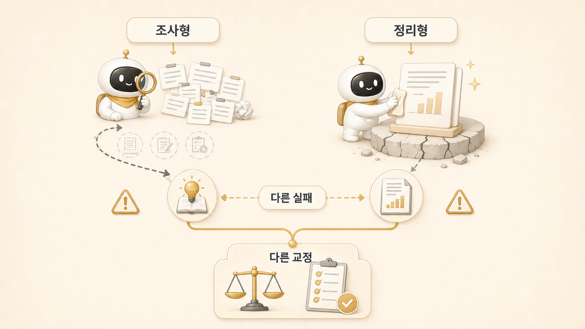
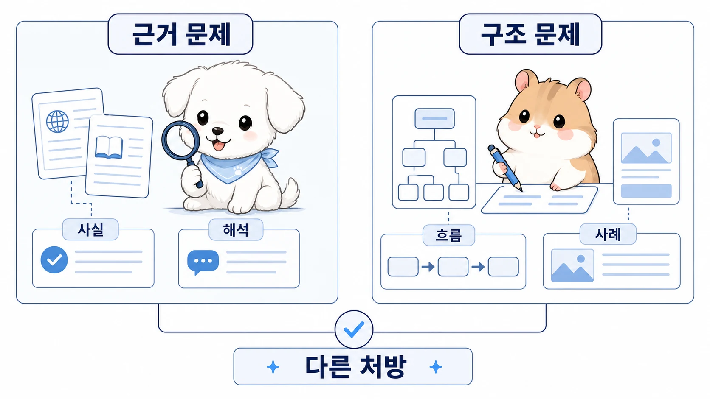

## 조사형/정리형 에이전트는 왜 다르게 실패할까

에르메스 에이전트(Hermes Agent)로 공유할 글과 운영 문서를 만들 때 조사형과 정리형은 모두 품질에 영향을 준다. 하지만 실패 방식은 다르다. 조사형이 실패하면 근거가 약해지고, 정리형이 실패하면 흐름은 있어 보이지만 내용이 비어 보인다. 이 차이는 [조사형 에이전트](https://wikidocs.net/345895)와 [정리형 에이전트](https://wikidocs.net/345896)를 따로 운영해야 하는 이유다.

이 차이를 구분하지 못하면 [역할형 에이전트 운영](https://wikidocs.net/345925)의 피드백이 흐려진다. “글이 약하다”는 말만으로는 무엇을 고쳐야 하는지 알 수 없다. 근거를 다시 찾아야 하는지, 구조를 다시 잡아야 하는지, 실제 장면을 보강해야 하는지 나눠 봐야 한다.

[TOC]

## 조사형은 왜 결론을 서두를까

조사형 에이전트는 빠르게 넓게 보는 데 강하다. 그래서 오히려 결론을 빨리 내고 싶어진다.

- 몇 개 자료만 보고 전체 흐름처럼 말한다.
- 사실과 해석을 한 문장에 섞는다.
- 확인하지 못한 항목을 생략한다.
- “대체로 맞다”는 느낌을 최종 결론처럼 전달한다.

조사형의 좋은 결과는 완성된 글이 아니라 판단 재료다. 출처, 핵심 발견, 반례, 미확인 항목이 분리되어 있어야 한다.

## 정리형은 왜 속이 약한 글을 만들까

정리형은 읽히는 구조를 만드는 역할이다. 그런데 재료가 부족하면 구조만 남고 내용이 비어 보일 수 있다. 특히 AI가 쓴 듯한 문장은 여기서 자주 생긴다. 문장 자체는 자연스럽지만 독자가 붙잡을 실제 상황과 판단 기준이 없다.

책을 보강할 때 “처음 보는 사람에게 축약되어 보인다”는 문제는 여기에 가깝다. 페이지는 있지만 실제 운영 스토리와 왜 이 기준을 세웠는지가 충분하지 않으면 책처럼 읽히지 않는다.

## 둘을 같이 보면 보이는 기준

| 품질 문제 | 조사형에서 볼 것 | 정리형에서 볼 것 |
|---|---|---|
| 근거가 약함 | 출처와 반례가 있는가 | 근거가 본문에 자연스럽게 들어갔는가 |
| 내용이 축약됨 | 빠진 원자료가 있는가 | 독자 여정으로 충분히 풀었는가 |
| 글이 장황함 | 필요한 근거만 골랐는가 | 설명을 줄이고 구조를 잡았는가 |
| 실제감이 없음 | 실제 사례를 찾았는가 | 사례를 읽기 쉬운 이야기로 바꿨는가 |
| 공유 범위가 애매함 | 원자료에서 제외할 세부값을 표시했는가 | 읽는 사람에게 필요한 이야기만 남겼는가 |

즉 조사형은 재료의 품질을 책임지고, 정리형은 읽히는 구조를 책임진다. 둘 중 하나만 좋아서는 공유할 글의 품질이 안정되지 않는다.

## 실제 예시: 링크 문제와 본문 보강

WikiDocs 작업에서 처음 본문 링크를 보강했을 때, 페이지 끝에 순서대로 링크만 붙이는 방식으로는 부족했다. 독자는 문장을 읽다가 개념이 궁금해지는 순간에 이동해야 한다. 이 피드백은 조사형과 정리형의 역할이 함께 필요한 사례다.

조사형은 먼저 링크 대상이 되는 핵심 개념과 페이지를 찾아야 한다. 정리형은 그 링크를 문장 흐름 안에 자연스럽게 넣어야 한다. 조사형만 있으면 링크 목록은 생기지만 글이 딱딱해지고, 정리형만 있으면 자연스럽지만 연결 근거가 약할 수 있다.

## 두 역할을 함께 쓸 때의 기준

- 근거가 약하면 조사형으로 되돌린다.
- 구조가 약하면 정리형으로 되돌린다.
- 둘 다 약하면 먼저 조사형, 그다음 정리형 순서로 간다.
- 조사형 결과는 사실/해석/미확인 항목을 나눠 받는다.
- 정리형 결과는 독자 문제/실제 장면/판단 기준이 보이는지 본다.
- 공유 글에는 불필요한 세부값을 넣지 않는다.

## FAQ

### 조사형과 정리형을 하나로 합치면 안 되나요?

짧은 작업은 가능하다. 하지만 품질이 중요한 글에서는 분리하는 편이 안전하다. 그래야 근거 부족과 구조 부족을 따로 고칠 수 있다.

### 두 에이전트 결과가 충돌하면 어떻게 하나요?

메인 창구가 기준을 정해야 한다. 조사형의 근거가 더 필요할 수도 있고, 정리형이 읽는 흐름에 맞게 재배열해야 할 수도 있다.
