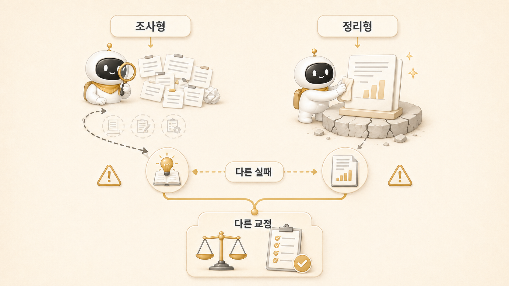

## 조사형/정리형 에이전트는 왜 다르게 실패할까

[조사형 에이전트](https://wikidocs.net/345895)와 [정리형 에이전트](https://wikidocs.net/345896)는 실패하는 방식이 다르다. 조사형은 근거를 모으기도 전에 결론을 서두르기 쉽고, 정리형은 재료가 부족한데도 그럴듯한 문장으로 완성하려고 한다.

이 차이를 모르면 교정도 어긋난다. 방울이에게 “글을 더 예쁘게 써줘”라고 하면 문제가 해결되지 않고, 뽀동이에게 “출처를 더 많이 찾아줘”라고만 하면 정리의 힘이 약해진다. 각 역할은 다른 기준으로 봐야 한다.

## 조사형은 왜 결론을 서두를까

조사형은 넓게 찾는 역할이다. 그런데 질문이 모호하면 빠르게 그럴듯한 패턴을 잡고 결론처럼 말할 수 있다.

예를 들어 “Hermes 공식 docs가 잘 반영됐는지 봐줘”라는 요청이 있다고 하자. 조사형이 곧바로 “대체로 반영됐다”고 답하면 빠르지만 약하다. 실제로는 delegation, cron, MCP, memory, migration 같은 공식 주제가 어느 장에 들어갔는지, 빠진 것은 무엇인지, 운영 경험으로 번역됐는지 확인해야 한다.

조사형의 실패는 대개 아래처럼 보인다.

- 근거 목록보다 평가가 먼저 나온다.
- 미확인 항목이 없다.
- 출처의 성격이 구분되지 않는다.
- “더 봐야 할 지점”이 사라진다.
- 다음 역할에게 넘길 구조가 없다.

그래서 조사형에게는 결론보다 재료의 분류를 요구해야 한다.

## 정리형은 왜 속이 약한 글을 만들까

정리형은 읽히는 구조를 만드는 역할이다. 그런데 재료가 부족하면 구조만 남고 내용이 비어 보일 수 있다. 특히 AI가 쓴 듯한 문장은 여기서 자주 생긴다. 문장 자체는 자연스럽지만 독자가 붙잡을 실제 상황과 판단 기준이 없다.

WikiDocs 보강 작업에서 로이드가 지적한 “처음 보는 사람들은 축약되어 있다고 느낄 것 같다”는 말이 여기에 가깝다. 페이지는 있었지만, 실제 운영 스토리와 왜 이 기준을 세웠는지가 충분하지 않으면 책처럼 읽히지 않는다.

정리형의 실패는 대개 아래처럼 보인다.

- 제목과 문단은 깔끔하지만 새로 얻는 기준이 없다.
- 내부 이름은 나오지만 독자용 개념이 약하다.
- 실제 사례가 빠져 추상 설명처럼 보인다.
- 근거가 약한 내용을 단정한다.
- 다음 링크가 단순 이동이고 본문 맥락 링크가 약하다.

그래서 정리형에게는 원자료, 독자, 목적, 금지선을 함께 줘야 한다.

## 둘을 같이 보면 보이는 기준

방울이와 뽀동이를 함께 운영하면 좋은 점은 서로 다른 실패를 잡아준다는 것이다.

| 상황 | 방울이 기준 | 뽀동이 기준 |
|---|---|---|
| 새 주제 검토 | 공식 문서/기존 글/실제 기록 확인 | 독자 문제와 페이지 위치 확인 |
| 콘텐츠 보강 | 누락된 근거와 반례 찾기 | 이야기와 기준으로 재구성 |
| WikiDocs 링크 | 링크 대상과 page ID 확인 | 문장 안에서 자연스럽게 연결 |
| 민감정보 처리 | 공개하면 안 되는 원자료 표시 | 독자에게 필요한 이야기만 남김 |
| 최종 산출물 | 판단 재료 제공 | 발행 가능한 구조와 문장 제공 |

이 표를 보면 한 에이전트가 모든 일을 다 해야 하는 이유가 줄어든다. 조사형은 판단 재료를 만들고, 정리형은 판단 가능한 글로 바꾼다.

## 실제 운영 예시: 링크 문제와 본문 보강

WikiDocs 작업에서 처음 내부 링크를 보강했을 때, 단순히 “이어서 읽기”를 붙이는 방식으로는 부족했다. 로이드는 본문 안에서 주요 개념과 기능이 서로 연결되어야 한다고 다시 말했다. 이 피드백은 조사형과 정리형의 역할이 함께 필요한 사례다.

조사형 관점에서는 먼저 어떤 링크가 실제로 작동하는지 봐야 했다. GitHub `.md` 링크가 WikiDocs 독자 화면에서 잘 먹지 않는 문제를 확인하고, WikiDocs page ID 기반 URL로 바꾸는 기준이 필요했다.

정리형 관점에서는 링크를 아무 데나 많이 넣는 것이 아니라, 문장을 읽는 중에 [AI 개인비서](https://wikidocs.net/345923), [역할형 에이전트](https://wikidocs.net/345925), [memory/profile/session](https://wikidocs.net/345902), [GitHub/WikiDocs 발행](https://wikidocs.net/345994) 같은 개념으로 자연스럽게 이동하게 만들어야 했다.

이 사례에서 조사형은 “무엇이 안 되는가”를 찾고, 정리형은 “어떻게 읽히게 할 것인가”를 해결했다.

## 운영 기준

조사형과 정리형을 함께 쓸 때는 아래 기준을 둔다.

- 조사형에게는 결론보다 근거/미확인/다음 확인 포인트를 요구한다.
- 정리형에게는 재료/독자/목적/금지선을 준다.
- 두 결과가 충돌하면 하비가 최종 통합 기준을 정한다.
- 공개 글에는 민감정보와 불필요한 내부값을 넣지 않는다.
- 역할의 강점을 섞되 책임은 흐리지 않는다.

역할 분리의 목표는 에이전트를 나눠 세우는 것이 아니라 재작업 지점을 줄이는 것이다.

## FAQ

### 조사형과 정리형을 하나로 합치면 안 되나요?

작은 일은 가능하다. 다만 공개 콘텐츠나 운영 문서처럼 품질 기준이 있는 작업에서는 분리하는 편이 안전하다. 하나로 합치면 빠를 수 있지만, 실패 원인을 찾기 어렵다.

### 두 에이전트 결과가 충돌하면 어떻게 하나요?

하비 같은 메인 창구가 통합해야 한다. 조사형의 근거가 정리형의 흐름을 흔들면 글을 고치고, 정리형이 독자 흐름상 추가 근거가 필요하다고 판단하면 조사형에게 되돌린다.

### 어떤 역할이 더 중요하나요?

둘 중 하나가 더 중요하지 않다. 조사형이 없으면 글의 근거가 약해지고, 정리형이 없으면 조사 결과가 독자에게 전달되지 않는다.

## 다음 글

- 조사형 실패를 더 자세히 보려면 [조사형 에이전트는 왜 자주 결론을 서두를까](https://wikidocs.net/345914)를 읽는다.
- 정리형 실패를 더 자세히 보려면 [정리형 에이전트는 왜 그럴듯하지만 약한 글을 만들까](https://wikidocs.net/345910)를 읽는다.
