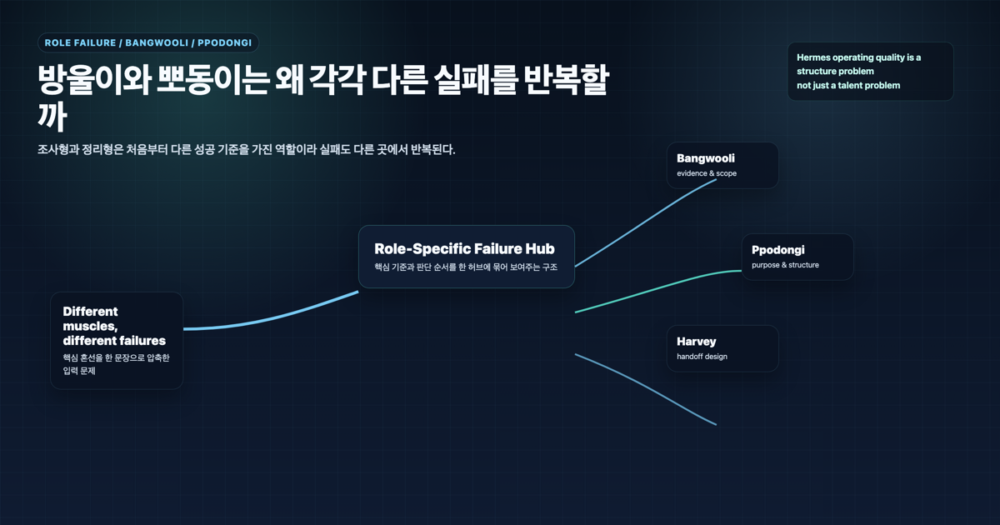
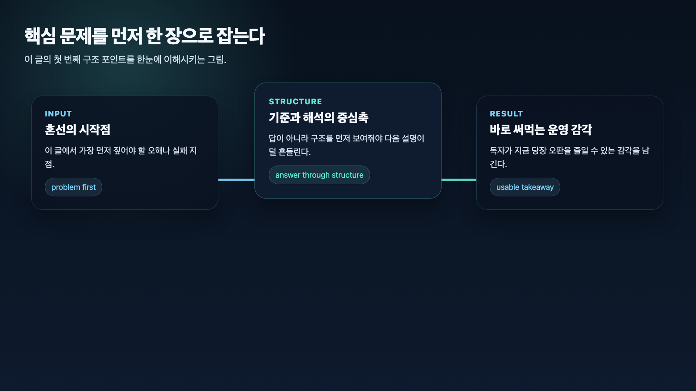

## 조사형과 정리형 에이전트는 왜 각각 다른 실패를 반복할까

> 이 글은 **에르메스 에이전트(Hermes Agent)**를 역할형 에이전트로 운영하며 정리한 실전 기록입니다. 우리 운영 사례에서는 조사형 에이전트를 방울이, 정리형 에이전트를 뽀동이라고 부릅니다.

조사형 에이전트와 정리형 에이전트는 실패하는 방식이 다르다. 조사형은 근거가 충분하지 않은데 결론을 빨리 내리기 쉽고, 정리형은 재료가 부족한데도 문서를 그럴듯하게 완성하기 쉽다. 그래서 둘을 같은 기준으로 평가하면 교정도 틀어진다.

AI 개인비서 메인 창구가 해야 할 일은 이 차이를 알고 위임하는 것이다. 조사형에게는 범위와 출처 기준을 주고, 정리형에게는 목적과 독자 기준을 줘야 한다. 둘 다 “잘해줘”로는 부족하다.

## 왜 둘을 같은 기준으로 보면 답이 안 나올까

조사형과 정리형은 모두 결과물을 만든다. 그래서 겉으로는 비슷해 보인다. 하지만 실제로는 다른 일을 한다.

조사형은 아직 불확실한 영역에서 재료를 찾는다. 정리형은 이미 있는 재료를 읽히는 구조로 바꾼다. 하나는 탐색의 품질이 중요하고, 다른 하나는 전달의 품질이 중요하다.

이 차이를 무시하면 이런 일이 생긴다.

- 조사형에게 예쁜 글을 요구한다.
- 정리형에게 없는 근거를 채우게 한다.
- 조사 결과를 최종본처럼 발행한다.
- 정리 초안을 사실 검증 없이 믿는다.

결과적으로 메인 창구는 중간 산출물을 다시 뜯어고치게 된다.

## 조사형은 왜 결론을 너무 빨리 내리기 쉬운가

조사형 에이전트는 사용자가 답을 기다린다고 느끼면 결론을 먼저 내리기 쉽다. 특히 질문이 넓고 범위가 약하면 더 그렇다.

흔한 실패는 이렇다.

- 몇 개 자료만 보고 전체 경향처럼 말한다.
- 공식 문서와 개인 해석을 섞는다.
- 비교 후보를 충분히 열기 전에 하나를 추천한다.
- 출처보다 요약을 먼저 보여준다.

이 실패를 줄이려면 조사형에게 “결론”보다 “재료의 구조”를 요구해야 한다. 사실, 해석, 가설, 출처를 나눠 달라고 해야 다음 단계가 안전해진다.

## 정리형은 왜 보기 좋은데 속이 약해지기 쉬운가

정리형 에이전트는 문서를 매끄럽게 만드는 데 강하다. 그래서 입력 재료가 약해도 일단 읽히는 형태를 만들 수 있다. 이게 장점이자 위험이다.

흔한 실패는 이렇다.

- 실제 사례가 부족한데 일반론으로 문단을 채운다.
- 핵심 메시지가 약한데 제목과 소제목만 정돈한다.
- 독자와 목적이 없어서 어디에도 애매한 글을 만든다.
- 조사해야 할 빈칸을 문장으로 덮는다.

이 실패를 줄이려면 정리형에게 “예쁘게”보다 “무엇을 위해, 누구에게, 어떤 결론을 남길지”를 줘야 한다.

## 둘의 실패를 같이 보면 무엇이 보이나

조사형과 정리형의 실패는 서로 이어진다. 조사형이 근거를 약하게 넘기면 정리형은 보기 좋은 빈 문서를 만들기 쉽다. 정리형이 목적을 흐리게 잡으면 조사형에게 필요한 추가 질문도 흐려진다.

그래서 역할 분리는 따로 놀면 안 된다. 메인 창구가 둘 사이의 handoff 기준을 잡아야 한다.

좋은 handoff에는 아래가 들어간다.

- 조사형이 남긴 확인된 사실
- 아직 가설인 부분
- 정리형이 반드시 살려야 할 핵심 메시지
- 독자와 사용 목적
- 빠진 재료와 추가 조사 필요 여부

## 그래서 실전에서는 어떻게 다르게 교정해야 하나

### 조사형 교정

조사형은 근거 구조와 범위 기준으로 교정한다.

- 결론보다 근거를 먼저 요구한다.
- 출처를 남기게 한다.
- 사실, 해석, 가설을 나누게 한다.
- 비교 후보를 충분히 열게 한다.
- 다음 역할이 바로 쓸 handoff 형식으로 받는다.

### 정리형 교정

정리형은 목적과 출력 기준으로 교정한다.

- 독자를 먼저 고정한다.
- 핵심 메시지를 먼저 정한다.
- 유지할 사실과 빼야 할 내용을 나눈다.
- 제목, 소제목, FAQ, 다음 링크 구조를 준다.
- 근거가 부족하면 조사형으로 되돌린다.

## 우리가 실제로 세운 운영 원칙

### 원칙 1. 조사형과 정리형 실패를 같은 기준으로 보지 않는다

조사형은 근거와 범위, 정리형은 목적과 구조를 먼저 본다.

### 원칙 2. 조사형 결과는 최종본이 아니다

조사 결과는 재료다. 최종 판단과 전달은 메인 창구가 다시 묶는다.

### 원칙 3. 정리형 결과는 사실 검증을 대체하지 않는다

문장이 매끄러워도 근거가 약하면 다시 조사로 돌린다.

### 원칙 4. handoff 형식을 고정한다

역할이 나뉠수록 넘겨주는 형식이 중요해진다.

### 원칙 5. 최종 통합은 메인 창구가 맡는다

조사형과 정리형이 각각 잘해도 최종 사용자-facing 결과는 하나의 흐름이어야 한다.

## FAQ

### 1. 조사형과 정리형을 꼭 나눠야 하나요?

모든 작업에서 꼭 나눌 필요는 없다. 하지만 근거 수집과 문서화가 모두 큰 작업에서는 나누는 편이 실패를 줄인다.

### 2. 정리형 에이전트가 조사까지 하면 안 되나요?

간단한 확인은 가능하다. 다만 근거 수집이 핵심이면 조사형으로 분리하는 편이 안전하다.

### 3. 조사형 결과를 바로 발행하면 왜 위험한가요?

조사형 결과는 보통 재료에 가깝다. 독자 흐름, 메시지, 문체, 다음 액션을 다시 정리해야 공개 콘텐츠가 된다.

## 다음 글

다음 글에서는 조사형 에이전트가 결론을 서두르는 문제를 더 구체적으로 다룬다.

[다음 글: 조사형 에이전트는 왜 자주 결론을 서두를까](16-why-research-agents-rush-to-conclusions.md)
