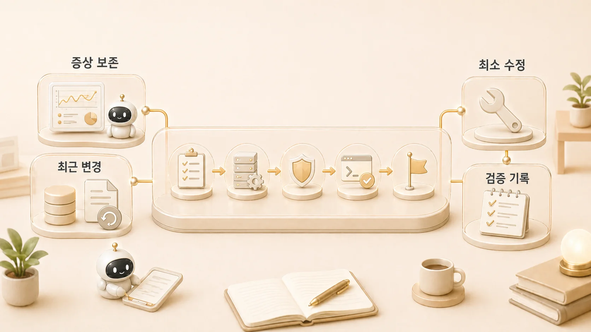

## 복구 플레이북은 왜 문서보다 순서가 중요할까

복구 플레이북의 핵심은 문서가 많다는 것이 아니라 순서가 분명하다는 것이다. [Hermes Agent](https://wikidocs.net/346055) 운영에서 문제가 생기면 바로 재시작하거나 설정을 고치고 싶지만, 먼저 봐야 할 것은 증상, process, profile/runtime 경계, 최근 변경, 원본 기준이다.



복구는 “아는 명령을 많이 실행하는 일”이 아니다. 잘못된 순서로 건드리면 원인을 더 흐리게 만든다. 그래서 복구 플레이북은 현재 상태를 보존하면서 문제를 좁히는 문서여야 한다.

[TOC]

## 왜 복구는 문서가 있어도 실패할까

문서가 있어도 실패하는 이유는 대개 두 가지다. 첫째, 문서가 기능 설명에 가깝고 실제 장애 순서를 말하지 않는다. 둘째, 확인 전에 수정부터 한다.

예를 들어 [gateway](https://wikidocs.net/345906)가 응답하지 않을 때 바로 재설치부터 하면 process 문제인지, 환경 변수 문제인지, profile 문제인지 구분하기 어렵다. WikiDocs가 갱신되지 않았을 때도 바로 본문을 다시 쓰면 원본 갱신 문제인지, 공개 동기화 문제인지, 목차 문제인지 흐려진다.

## 먼저 봐야 할 순서

| 순서 | 확인 항목 | 이유 |
|---|---|---|
| 1 | 증상 | 무엇이 안 되는지 정확히 정한다 |
| 2 | 최근 변경 | 마지막으로 바뀐 설정, 자동화, 절차, 원고를 본다 |
| 3 | process/runtime | 실제 실행 중인지와 어느 profile에서 도는지 본다 |
| 4 | 권한/경로 | 파일 접근, 전달 위치, 실행 위치를 확인한다 |
| 5 | 원본 기준 | GitHub, WikiDocs, Obsidian, shared-memory 중 무엇이 원본인지 정한다 |
| 6 | 최소 수정 | 한 번에 하나만 바꾼다 |
| 7 | 검증/기록 | 성공 기준과 남은 일을 남긴다 |

Hermes Agent에는 이 순서를 도와주는 [checkpoint와 `/rollback`](https://wikidocs.net/346262) 기능도 있다. provider 인증이 문제인데 gateway 장애처럼 보이는 경우에는 [에이전트별 Codex auth 설정 기준](https://wikidocs.net/347133)처럼 channel, process, provider를 먼저 분리해서 봐야 한다. 다만 rollback은 수정 전에 상태를 보존하고 diff를 본 뒤 쓰는 복구 수단이지, 확인 없이 실행해도 된다는 면허가 아니다.

## 복구 순서가 필요한 순간

OpenClaw에서 Hermes로 넘어온 뒤에는 과거 설정이 모두 새 구조에 1:1로 들어오지 않았다. 일부 cron, gateway, hooks, agent routing, skill registry는 archive/manual review 대상으로 남았다. 여기서 바로 “왜 예전처럼 안 되지?”라고 보면 복구가 꼬인다.

올바른 순서는 먼저 현재 Hermes에서 무엇이 원본 기준인지 확인하고, 그다음 archived record를 참고 자료로 본 뒤, 필요한 것만 새 Hermes 구조에 맞게 다시 만든다. 과거 유산은 버리는 것이 아니라 검토 대상으로 내려놓아야 한다. 이 기준은 [과거 유산과 현재 기준을 나누는 법](https://wikidocs.net/345920)과도 연결된다.

## 복구 플레이북 템플릿

```text
증상:
영향 범위:
마지막 정상 상태:
최근 변경:
먼저 볼 process/runtime:
먼저 볼 profile/config:
원본 기준:
수정 전 보존할 로그/상태:
최소 수정:
검증 기준:
후속 체크리스트 반영:
```

이 템플릿은 길게 쓰기 위한 것이 아니다. 장애 중에도 빠르게 채워서 “지금 어디를 보고 있는지”를 잃지 않기 위한 장치다.

## 판단 기준

- 수정 전에 증상을 보존한다.
- 한 번에 하나만 바꾼다.
- 명령어보다 확인 순서를 먼저 쓴다.
- 복구 후에는 [체크리스트](https://wikidocs.net/345919)로 내려보낼 항목을 찾는다.
- 공유 문서에는 내부 경로나 비밀값이 아니라 복구 판단 순서만 남긴다.

## FAQ

### 빠르게 재시작하면 되는 문제도 있지 않나요?

있다. 다만 재시작 전에 현재 증상과 최근 변경만이라도 남겨야 한다. 그래야 재시작으로 해결된 것인지, 우연히 증상이 사라진 것인지 구분할 수 있다.

### 복구 플레이북에 명령어를 많이 넣어야 하나요?

명령어보다 순서가 먼저다. 명령어는 환경마다 달라질 수 있지만, 증상 보존, 최근 변경 확인, process 확인, 원본 기준 확인이라는 순서는 오래 간다.
