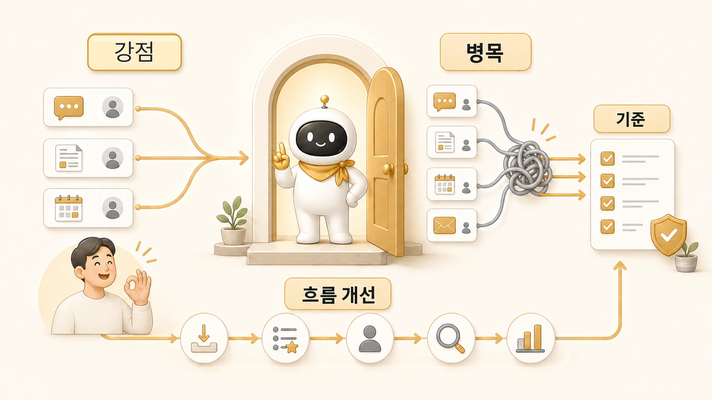

## 메인 창구의 강점과 병목

[AI 개인비서 메인 창구](https://wikidocs.net/345892) 구조는 강력하다. 사용자는 하비 같은 메인 창구에 먼저 말하면 되고, 메인 창구가 내부에서 방울이, 뽀동이, 봉구, 하망이 같은 역할형 에이전트로 일을 나눌 수 있기 때문이다.



하지만 같은 이유로 병목도 생긴다. 모든 요청이 메인 창구로 들어오는데 직접 처리 기준, 위임 기준, 보고 기준이 없으면 편한 입구가 아니라 막히는 입구가 된다.

## 왜 메인 창구가 강력한가

메인 창구의 힘은 사용자의 복잡도를 줄이는 데 있다. 사용자는 AI 팀 구조를 매번 기억하지 않아도 된다. “이거 정리해줘”라고 말하면 메인 창구가 요청을 해석하고 필요한 경우 역할을 나눈다.

| 강점 | 의미 | 실제 효과 |
|---|---|---|
| 단일 진입점 | 사용자가 말할 곳이 하나다 | 요청 시작이 빨라진다 |
| 책임 정리 | 최종 결과를 묶는 창구가 분명하다 | 결과가 조각나지 않는다 |
| 역할 숨김 | 내부 에이전트 구조를 사용자가 매번 몰라도 된다 | 운영 부담이 줄어든다 |
| 맥락 유지 | 사용자의 의도와 이전 흐름을 이어받는다 | 보고와 다음 액션이 자연스럽다 |
| 확장 가능성 | 뒤에 새 역할을 붙일 수 있다 | 조사/정리/실행/이미지 제작이 분리된다 |

이 구조가 잡히면 [AI 개인비서](https://wikidocs.net/345923)는 단순 응답자가 아니라 업무 흐름의 입구가 된다.

## 실제로 강했던 순간

WikiDocs 작업에서 메인 창구가 강했던 순간은 “한 번에 여러 층을 봐야 하는 요청”이 들어왔을 때다.

요청은 단순히 문장을 늘리는 일이 아니었다. 전체 읽는 흐름, 본문 안의 개념 링크, 기존 글 이전 상태, 공식 설명과 실제 사용 기준의 차이, 실제 케이스의 공유 범위를 함께 봐야 했다.

이런 요청에서 메인 창구는 “지금 답변할 내용”보다 “어떤 순서로 처리해야 완성되는지”를 먼저 잡는다. 먼저 흐름을 보고, 그다음 근거와 링크를 확인하고, 마지막에 공개 화면에서 깨지는 부분이 없는지 확인한다. 이 순서를 잡지 못하면 각 역할의 결과가 좋아도 책 전체의 흐름은 다시 흔들린다.

## 어디서 병목이 생기나

메인 창구의 병목은 보통 다섯 곳에서 생긴다.

### 1. 요청이 동시에 몰릴 때

모든 요청이 메인 창구로 들어오면 우선순위가 필요하다. 지금 답해야 할 일, 조사에 넘길 일, 나중에 정리할 일을 구분하지 않으면 메인 창구가 모든 일을 붙잡게 된다.

### 2. 위임 기준이 흐릴 때

[방울이](https://wikidocs.net/345895)에게 맡길 일인지, 뽀동이에게 맡길 일인지, 봉구가 실행해야 할 일인지 기준이 없으면 위임이 늦어진다. 결국 메인 창구가 혼자 판단하다가 병목이 된다.

### 3. 중간 산출물 품질이 낮을 때

[역할형 에이전트](https://wikidocs.net/345925)가 낸 결과가 부실하면 메인 창구가 다시 고쳐야 한다. 방울이가 근거를 충분히 모으지 못했거나, 뽀동이가 독자 문제를 놓쳤거나, 하망이가 메시지보다 예쁜 이미지만 잡으면 최종 통합이 흔들린다.

### 4. 위임만 하고 통합하지 않을 때

위임 결과를 모으기만 하면 사용자는 여러 조각을 받는다. 메인 창구의 역할은 조각을 전달하는 것이 아니라, 사용자에게 필요한 하나의 판단과 결과로 묶는 것이다.

### 5. 호출 규칙이 흔들릴 때

한 스레드에서 여러 봇이 동시에 답하면 메인 창구의 장점이 사라진다. 그래서 멀티봇 스레드에서는 누가 답해야 하는지 이름이나 멘션으로 분명히 하는 규칙이 필요하다. 이 문제는 [멀티봇 스레드는 왜 쉽게 시끄러워질까](https://wikidocs.net/345913)에서 다시 다룬다.

## 병목 신호

아래 신호가 보이면 메인 창구가 병목이 되고 있을 가능성이 높다.

- 요청은 시작됐는데 최종 결과가 늦어진다.
- 조사, 정리, 실행 결과가 따로 놀고 하나의 문서로 합쳐지지 않는다.
- 사용자가 “그래서 다음은 뭐야?”를 다시 물어야 한다.
- 같은 설명을 여러 에이전트에게 반복한다.
- 검증 없이 그럴듯한 답이 바로 보고된다.
- 기록용 디테일을 어디까지 읽기 쉬운 사례로 바꿔야 하는지 뒤늦게 다시 정리한다.

## 병목을 줄이는 방법

병목을 줄이려면 메인 창구의 역할을 더 많이 늘리는 것이 아니라 기준을 선명하게 해야 한다.

| 문제 | 필요한 기준 |
|---|---|
| 요청이 많다 | 우선순위와 보류 기준 |
| 메인 창구가 다 처리한다 | 직접 처리/위임 기준 |
| 결과가 흩어진다 | 최종 통합 형식 |
| 품질이 흔들린다 | 역할별 검수 기준 |
| 사용자가 다시 묻는다 | 완료/남음/다음 보고 형식 |
| 공유 범위가 흔들린다 | 읽는 사람에게 필요한 이야기와 제거할 불필요한 세부값의 경계 |

특히 반복 작업에서는 “알아서 해줘”보다 아래처럼 말하는 편이 좋다.

```text
이건 직접 다 처리하지 말고 역할을 나눠서 봐줘.
조사형은 근거 확인, 정리형은 WikiDocs 구조 정리,
실행형은 파일 수정과 검증이 필요한지 판단해줘.
마지막 보고는 완료/남음/다음으로 짧게 줘.
기록용 디테일은 읽기 쉬운 사례로 바꿔줘.
```

## 병목을 줄이는 판단 기준

메인 창구를 만들었다면 아래 기준을 같이 둔다.

- 메인 창구가 직접 처리할 작업 범위
- 역할형 에이전트로 넘길 기준
- 중간 산출물 검수 기준
- 최종 보고 형식
- 실패했을 때 멈추고 물어볼 기준
- 기록으로 남길 기준
- 공유 콘텐츠로 정리할 때 제거할 정보 기준

## FAQ

### 메인 창구가 있으면 사용자 경험은 좋아지나요?

대체로 좋아진다. 사용자가 여러 에이전트를 직접 관리하지 않아도 되기 때문이다. 다만 메인 창구가 모든 일을 붙잡으면 오히려 느려진다.

### 병목을 없애려면 메인 창구를 여러 개 두면 되나요?

대부분은 아니다. 메인 창구를 늘리면 사용자가 어느 창구로 말해야 할지 다시 헷갈린다. 먼저 직접 처리 기준과 위임 기준을 정하는 편이 낫다.
