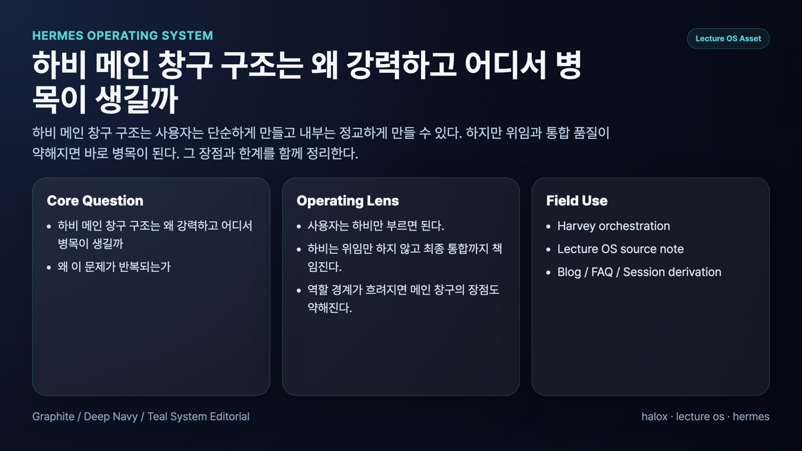
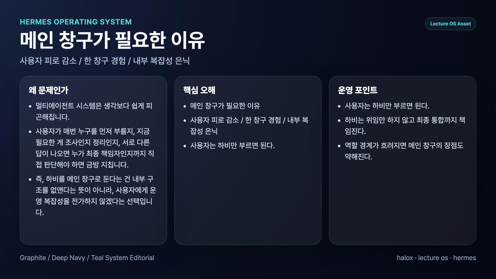
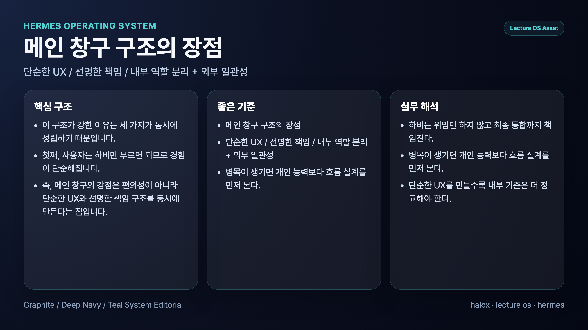
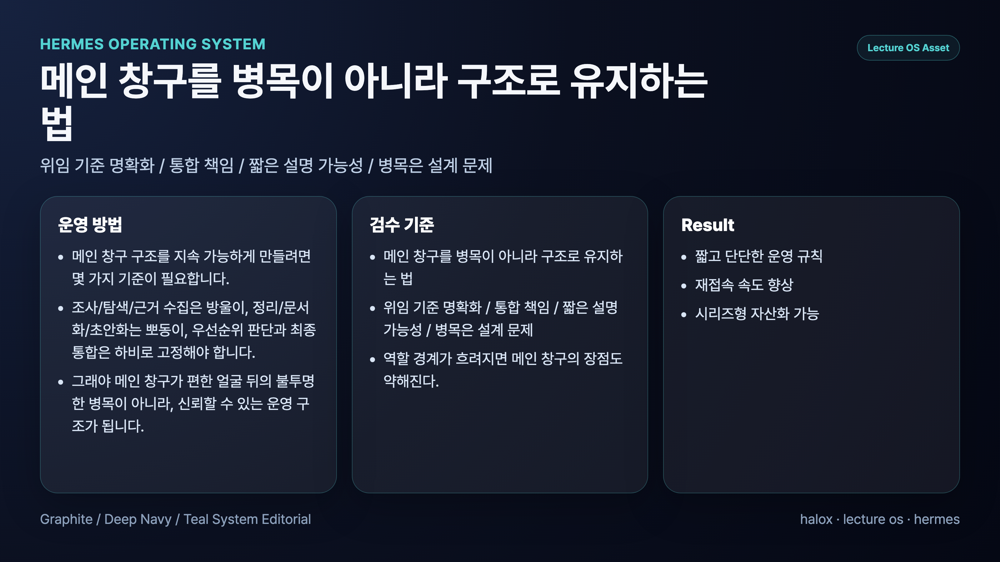

## AI 개인비서 메인 창구 구조는 왜 강력하고 어디서 병목이 생길까

> 이 글은 **에르메스 에이전트(Hermes Agent)**를 AI 개인비서와 역할형 에이전트로 운영하며 정리한 실전 기록입니다.

AI 개인비서 메인 창구 구조가 강력한 이유는 사용자의 입구를 단순하게 만들면서도 내부 역할 분리는 유지할 수 있기 때문이다. 사용자는 한 곳에 말하고, 시스템은 뒤에서 조사형·정리형·실행형 에이전트를 필요에 따라 태운다. 이 구조는 AI 업무 자동화에서 진입 장벽과 책임 혼선을 크게 줄인다.

하지만 같은 이유로 병목도 생긴다. 모든 요청이 메인 창구를 거치기 때문에, 메인 창구가 직접 처리와 위임을 늦게 판단하거나, 위임 결과를 제대로 검수하지 못하거나, 최종 통합을 놓치면 전체 시스템이 느리고 답답하게 느껴진다.

핵심은 메인 창구를 “모든 일을 하는 AI”로 보는 것이 아니라 **사용자 경험을 단순하게 만들고 내부 작업을 책임 있게 라우팅하는 운영 지점**으로 보는 것이다.

## 왜 메인 창구가 강력한가

메인 창구의 힘은 편의성 하나에서 나오지 않는다. 실제로는 세 가지가 동시에 맞물린다.

### 1. 사용자의 진입 장벽이 낮아진다

사용자는 조사형, 정리형, 실행형 중 누구를 불러야 할지 외우지 않아도 된다. 한 곳에 말하면 된다.

이 단순함은 작아 보여도 중요하다. 시스템이 복잡할수록 사용자는 “어디에 말해야 하지?”에서 멈춘다. 메인 창구는 이 멈춤을 줄인다.

### 2. 최종 책임이 선명해진다

역할형 에이전트가 여러 명이면 중간 결과는 좋아질 수 있다. 하지만 최종 책임자가 없으면 결과가 흩어진다.

메인 창구는 조사 결과, 정리 초안, 실행 결과를 받아 사용자에게 전달할 최종 형태로 묶는다. 그래서 실패했을 때도 무엇이 문제였는지 되짚기 쉽다.

### 3. 내부 역할 분리를 숨길 수 있다

좋은 시스템은 내부가 단순해서 좋은 것이 아니다. 내부가 복잡하더라도 사용자가 복잡성을 직접 관리하지 않아도 되기 때문에 좋다.

우리 운영에서는 하비가 메인 창구 역할을 하고, 방울이는 조사형, 뽀동이는 정리형으로 움직인다. 하지만 사용자는 매번 이 구조를 의식할 필요가 없다.

## 어디서 병목이 생기나

메인 창구 구조의 약점은 강점과 같은 곳에서 나온다. 모든 요청이 한 지점으로 모이기 때문이다.

### 1. 요청이 동시에 몰릴 때

여러 작업이 한꺼번에 오면 메인 창구는 우선순위 판단, 위임 결정, 결과 검수를 모두 처리해야 한다. 기준이 없으면 속도가 바로 떨어진다.

### 2. 위임 기준이 흐릴 때

무엇을 직접 처리하고 무엇을 넘길지 애매하면 메인 창구가 오래 망설인다. 이때 사용자는 “왜 이렇게 느리지?”라고 느낀다.

### 3. 중간 산출물 품질이 낮을 때

조사 결과가 근거 없이 요약되어 있거나, 정리 초안이 보기만 좋고 메시지가 약하면 검수 시간이 길어진다. 병목은 메인 창구 개인의 문제가 아니라 입력 품질 문제일 수 있다.

### 4. 위임만 하고 통합하지 않을 때

가장 위험한 병목은 보이지 않는다. 조사 결과와 정리 초안을 그대로 전달하면 겉으로는 빨라 보이지만, 사용자가 최종 통합을 떠안는다. 이 경우 병목은 시스템 밖, 즉 사용자에게 이동한다.

## 병목을 줄이는 운영 기준

메인 창구 구조를 지속 가능하게 만들려면 기준이 필요하다.

### 1. 요청 유형을 먼저 분류한다

요청이 질문인지, 조사인지, 정리인지, 실행인지 먼저 본다. 유형이 정리되면 직접 처리와 위임 판단이 빨라진다.

### 2. 위임 기준을 짧게 유지한다

기준이 복잡하면 메인 창구가 기준을 적용하는 데 시간을 쓴다. 아래 정도면 충분하다.

- 근거가 부족하면 조사형
- 재료는 있는데 구조가 약하면 정리형
- 파일·도구·검증이 필요하면 실행형
- 짧은 판단과 최종 보고는 메인 창구

### 3. 중간 결과의 품질 기준을 고정한다

조사형 에이전트는 사실, 해석, 가설을 나눠야 한다. 정리형 에이전트는 목적, 독자, 결론을 선명하게 잡아야 한다. 실행형 에이전트는 무엇을 바꿨고 어떻게 검증했는지 남겨야 한다.

### 4. 최종 통합을 생략하지 않는다

메인 창구의 핵심은 전달이 아니라 통합이다. 결과를 받았으면 사용자에게 맞는 길이, 톤, 다음 액션으로 다시 묶어야 한다.

## 강점과 병목을 한 표로 보면

| 구조 요소 | 강점 | 병목이 되는 순간 |
|---|---|---|
| 단일 창구 | 사용자가 어디에 말할지 고민하지 않는다 | 모든 요청이 한 지점에 몰린다 |
| 내부 역할 분리 | 조사·정리·실행 품질을 나눠 올린다 | 역할 경계가 흐리면 검수 비용이 커진다 |
| 최종 통합 | 결과가 한 흐름으로 나온다 | 통합을 생략하면 사용자가 다시 편집자가 된다 |
| 운영 기준 | 판단 속도가 빨라진다 | 기준이 복잡하거나 자주 바뀌면 오히려 느려진다 |
| 기록과 재사용 | 반복 업무가 자산이 된다 | 기록 위치가 흩어지면 다시 찾기 어렵다 |

## 우리가 실제로 세운 운영 원칙

### 원칙 1. 사용자는 메인 창구만 부르면 된다

AI 팀의 내부 구조는 사용자가 매번 고를 대상이 아니다.

### 원칙 2. 메인 창구는 위임만 하지 않고 최종 통합까지 책임진다

위임 결과를 전달하는 것과 최종 결과를 만드는 것은 다르다.

### 원칙 3. 역할 경계가 흐려지면 메인 창구의 장점도 약해진다

조사형, 정리형, 실행형의 실패 패턴이 다르기 때문에 경계가 필요하다.

### 원칙 4. 병목이 생기면 개인 능력보다 흐름 설계를 먼저 본다

느린 이유가 메인 창구 자체인지, 위임 기준인지, 중간 산출물 품질인지 나눠 봐야 한다.

### 원칙 5. 단순한 UX를 만들수록 내부 기준은 더 정교해야 한다

겉으로 단순해 보이는 시스템일수록 안쪽의 라우팅, 검수, 기록 기준이 중요하다.

## FAQ

### 1. 메인 창구가 있으면 왜 더 강해지나요?

사용자가 어디에 말할지 고민하지 않아도 되고, 최종 책임이 한 곳에 모이기 때문이다. 내부 역할 분리를 유지하면서도 사용자 경험은 단순해진다.

### 2. 메인 창구가 있으면 왜 더 느려질 수 있나요?

모든 요청이 한 지점을 거치기 때문이다. 위임 기준과 검수 기준이 없으면 그 지점이 병목이 된다.

### 3. 병목을 줄이려면 무엇부터 봐야 하나요?

메인 창구 개인의 성능보다 요청 분류, 위임 기준, 중간 산출물 품질, 최종 통합 여부를 먼저 봐야 한다.

### 4. 메인 창구 구조와 역할형 에이전트 구조는 같이 쓸 수 있나요?

같이 써야 한다. 사용자 앞에는 메인 창구를 두고, 내부에서는 역할형 에이전트를 나눠야 실무 운영이 안정된다.

## 다음 글

다음 장에서는 메인 창구 뒤에서 움직이는 역할형 에이전트를 어떻게 나눌지 다룬다. 조사형, 정리형, 실행형 에이전트는 같은 AI가 이름만 다른 것이 아니라 서로 다른 실패 패턴을 가진 운영 역할이다.

[다음 장: 조사형·정리형·실행형 에이전트 나누기](03-chapter-3.md)
