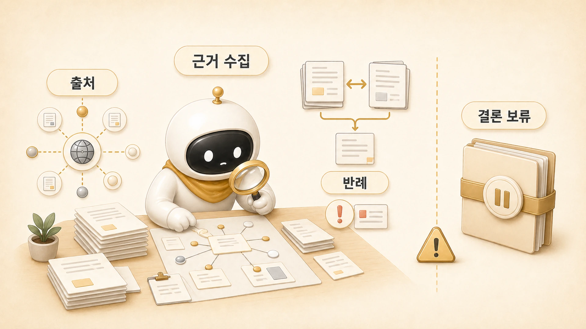

## 조사형 에이전트는 어디서 강하고 어디서 흔들릴까

에르메스 에이전트(Hermes Agent) 운영에서 조사형 에이전트는 모르는 것을 넓히는 데 강하다. 공식 문서, 기존 글, 과거 기록, 공개 자료를 훑고 판단 재료를 모은다. 이 책에서는 방울이가 조사형 에이전트의 예시다. 전체 기준은 [역할형 에이전트 분리](https://wikidocs.net/345925)에서 먼저 잡고, 여기서는 조사형의 강점과 흔들리는 지점을 본다.



하지만 조사형 에이전트는 최종 판단자가 아니다. 조사 결과와 해석을 분리하지 않으면 빠른 답은 나오지만 근거가 약해진다. 특히 [Hermes Agent](https://wikidocs.net/346055)처럼 공식 기능, 실제 운영 경험, 콘텐츠 발행 기준이 함께 얽힌 주제에서는 “찾은 것”과 “판단한 것”을 구분해야 한다.

## 조사형 에이전트가 강한 구간

| 강한 구간 | 설명 | 좋은 산출물 |
|---|---|---|
| 원천 확인 | 공식 문서, 기존 글, 기록을 넓게 확인한다 | 출처 목록과 핵심 발견 |
| 누락 찾기 | 빠진 근거, 빠진 사례, 오래된 정보를 찾는다 | 보강 필요 목록 |
| 비교 | 서로 다른 설명이나 기준을 나란히 둔다 | 차이점 표 |
| 반례 찾기 | 너무 빨리 결론 내린 부분을 흔든다 | 주의할 예외 |
| 후속 질문 만들기 | 아직 확인되지 않은 부분을 남긴다 | 미확인 항목 |

WikiDocs 작업에서도 이 강점이 드러난다. “기존 글이 잘 옮겨졌는지”, “공식 설명이 빠지지 않았는지”를 보려면 단순히 문장을 읽는 것만으로는 부족하다. 현재 목차, 실제 페이지, 공개 화면, 이전 작업 기록을 함께 봐야 한다. 이때 조사형은 읽는 흐름을 쓰기보다 판단 재료를 정확히 모으는 역할을 맡는다.

## 조사형 에이전트가 흔들리는 구간

조사형이 흔들리는 순간은 보통 결론을 서두를 때다.

- 출처는 봤지만 날짜와 맥락을 확인하지 않는다.
- 한두 자료만 보고 전체 경향처럼 말한다.
- 사실, 해석, 가설을 섞어서 전달한다.
- 읽는 사람에게 필요한 구조까지 혼자 만들려고 한다.
- 확인하지 못한 부분을 “그럴 것”으로 채운다.

조사형의 목표는 “답을 확정하는 것”이 아니라 다음 역할이 판단할 수 있게 재료를 넘기는 것이다.

## 실제 장면: 원문과 공식 설명 확인

책을 다시 다듬기 전에 조사형이 해야 할 일은 “이 책은 좋다/부족하다”를 바로 말하는 것이 아니다. 먼저 아래 질문을 확인해야 한다.

1. 현재 목차에서 어떤 페이지가 어느 장에 있는가?
2. 기존 글의 핵심 메시지가 현재 페이지에 남아 있는가?
3. 공식 설명과 충돌하는 표현은 없는가?
4. 너무 짧거나 실제 사례가 빠진 페이지는 어디인가?
5. 공유 글로 정리할 때 제거해야 할 사적인 세부 정보는 무엇인가?

이 답이 있어야 정리형 에이전트가 읽는 흐름을 만들 수 있다. 조사형이 이 단계를 건너뛰면 정리형은 빈칸을 그럴듯한 문장으로 채우기 쉽다.

## 조사형 에이전트에게 잘 요청하는 법

나쁜 요청은 이렇게 생긴다.

```text
방울아, 이 주제 조사해줘.
```

좋은 요청은 조사 범위와 산출물을 정한다.

```text
방울아, 이 장에서 빠진 근거를 찾아줘.
공식 설명, 기존 WikiDocs 페이지, 이전 작업 기록을 나눠서 확인하고,
사실/해석/미확인 항목을 구분해서 넘겨줘.
뽀동이가 공유 글로 정리할 때 빼야 할 내부 디테일도 표시해줘.
```

이렇게 요청하면 조사형은 결론을 꾸미지 않고 다음 단계가 쓸 수 있는 재료를 만든다.

## 조사형 에이전트를 맡길 때의 기준

조사형 에이전트에게 맡길 때는 아래 기준을 둔다.

- 출처와 날짜를 남긴다.
- 사실, 해석, 가설을 분리한다.
- 공식 설명과 실제 운영 기록을 구분한다.
- 확인하지 못한 항목을 숨기지 않는다.
- 최종 글 구조까지 혼자 완성하려 하지 않는다.
- 본문에 그대로 넣기 어려운 내부 식별값은 재료에서 제외한다.

## FAQ

### 조사형 에이전트가 결론을 쓰면 안 되나요?

쓸 수는 있다. 다만 결론은 “최종 판단”이 아니라 “현재 근거 기준의 임시 해석”으로 표시해야 한다. 공유 글이나 팀의 판단 기준으로 넘어갈 내용은 후속 검토가 필요하다.

### 조사 결과가 너무 많으면 어떻게 하나요?

전부 본문에 넣지 않는다. 핵심 발견, 반례, 미확인 항목으로 나눠 정리형 에이전트에게 넘긴다.
