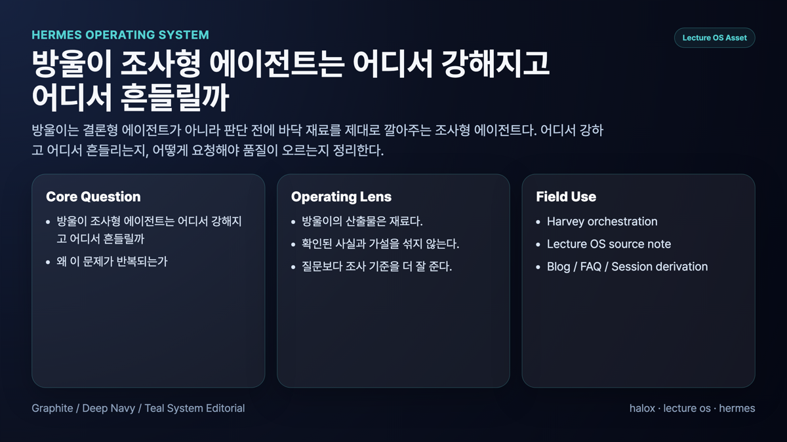
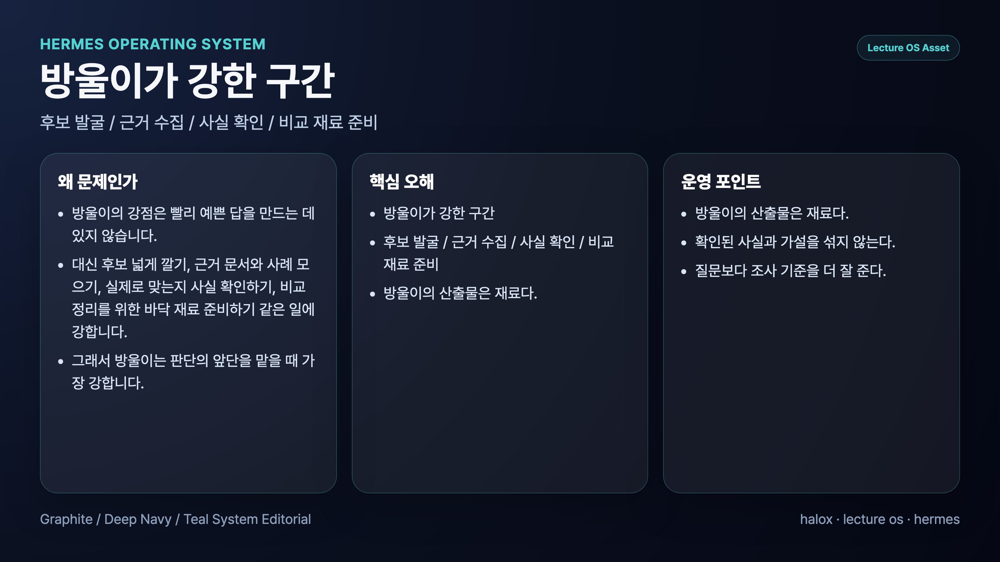
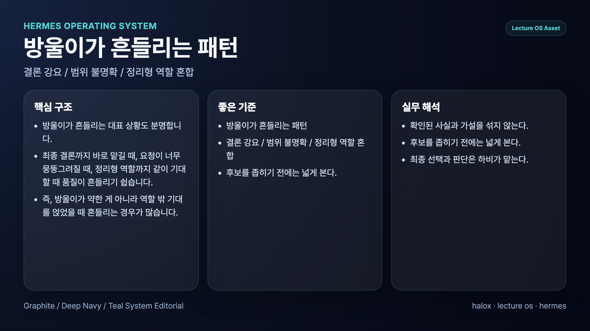
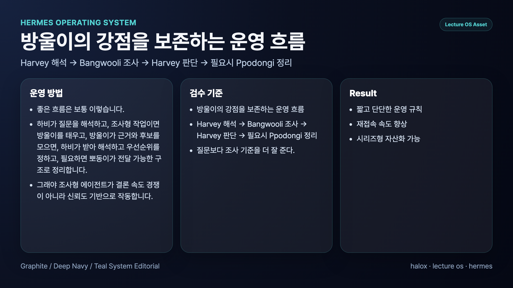

## 조사형 에이전트는 어디서 강해지고 어디서 흔들릴까

> 이 글은 **에르메스 에이전트(Hermes Agent)**를 역할형 에이전트로 운영하며 정리한 실전 기록입니다. 우리 운영 사례에서는 조사형 에이전트를 방울이라고 부릅니다.

조사형 에이전트는 새로운 주제를 넓게 훑고, 근거를 모으고, 후보를 비교하는 데 강하다. AI 업무 자동화에서 조사형 역할이 필요한 이유는 메인 창구가 성급하게 판단하지 않도록 바닥 재료를 만들어주기 위해서다.

하지만 조사형 에이전트는 쉽게 흔들린다. 질문이 넓고 기준이 약하면 근거를 충분히 모으기 전에 그럴듯한 결론을 먼저 낸다. 출처, 해석, 가설이 섞이면 다음 단계에서 정리형 에이전트가 받아 쓰기 어려워진다.

## 조사형 에이전트가 강한 구간

조사형 에이전트는 답을 예쁘게 쓰는 역할이 아니다. 모르는 영역을 열고, 판단에 필요한 재료를 모으는 역할이다.

강한 구간은 대체로 이렇다.

- 공식 문서나 원문 확인
- 여러 후보 비교
- 시장, 도구, 사례 탐색
- 장단점과 리스크 정리
- 의사결정 전에 필요한 근거 수집

예를 들어 Hermes Agent 공식 문서를 책에 반영할 때, 조사형 에이전트는 기능 이름만 요약하면 안 된다. 공식 가이드가 어떤 운영 패턴을 말하는지, 우리 책의 어느 장에 들어가야 하는지, 실제 시행착오와 연결되는 지점이 무엇인지까지 찾아야 한다.

## 조사형 에이전트가 흔들리는 구간

조사형 에이전트가 흔들리는 순간은 보통 답을 빨리 내야 한다는 압박이 걸릴 때다.

### 1. 결론을 너무 빨리 낸다

자료를 더 봐야 하는데 먼저 “이게 맞습니다”라고 말해버린다. 이러면 메인 창구는 판단 재료가 아니라 판단 결과만 받게 된다.

### 2. 사실과 해석을 섞는다

“공식 문서에 적힌 내용”과 “우리가 운영에서 해석한 내용”은 다르다. 이 둘이 섞이면 나중에 책이나 문서로 옮길 때 근거가 흐려진다.

### 3. 출처보다 요약을 앞세운다

조사 결과가 보기 좋게 정리되어도 출처가 약하면 다시 확인해야 한다. 조사형의 산출물은 예쁜 요약보다 검증 가능한 재료여야 한다.

### 4. 범위를 넓히기만 하고 좁히지 못한다

탐색은 넓게 시작해도 마지막에는 선택에 도움이 되도록 좁혀야 한다. 후보만 잔뜩 남기면 다음 역할의 부담이 커진다.

## 조사형 에이전트에게 잘 요청하는 법

조사형에게는 질문보다 기준을 더 잘 줘야 한다.

좋은 요청에는 보통 아래가 들어간다.

- 조사 질문: 무엇을 확인할 것인가
- 범위: 어디까지 보고 어디부터는 제외할 것인가
- 우선 출처: 공식 문서, 원문, 실제 사례 중 무엇을 먼저 볼 것인가
- 구분 방식: 사실, 해석, 가설을 어떻게 나눌 것인가
- handoff 형식: 다음 역할이 바로 쓸 수 있게 어떻게 넘길 것인가

예를 들어 “Hermes Agent의 cron 기능 조사해줘”보다 “공식 cron 가이드에서 업무 자동화 운영 기준, 실패 지점, 우리 책 5장/8장에 들어갈 체크리스트 후보를 사실/해석/적용안으로 나눠 정리해줘”가 더 좋다.

## 우리가 실제로 세운 운영 원칙

### 원칙 1. 조사형의 산출물은 최종본이 아니라 재료다

조사형 결과를 바로 발행하지 않는다. 메인 창구와 정리형 에이전트가 다시 해석하고 구조화해야 한다.

### 원칙 2. 확인된 사실과 가설을 섞지 않는다

공식 문서에 있는 내용, 우리가 운영에서 배운 내용, 앞으로 적용할 가설을 분리한다.

### 원칙 3. 질문보다 조사 기준을 더 잘 준다

범위와 출처가 약하면 조사형은 그럴듯한 방향으로 빨리 달린다.

### 원칙 4. 후보를 좁히기 전에는 넓게 본다

처음부터 하나의 결론을 고정하지 않는다. 비교 후보를 충분히 열고, 마지막에 판단 가능한 형태로 좁힌다.

### 원칙 5. 최종 선택과 판단은 메인 창구가 맡는다

조사형 에이전트는 근거를 만든다. 최종 우선순위와 사용자-facing 결론은 메인 창구가 통합한다.

## FAQ

### 1. 조사형 에이전트는 왜 결론을 서두르나요?

사용자가 답을 원한다고 해석하기 쉽기 때문이다. 그래서 조사 요청에는 결론보다 근거, 범위, 출처 구분을 먼저 넣어야 한다.

### 2. 조사형 결과가 길면 좋은 건가요?

아니다. 길이보다 다음 역할이 바로 쓸 수 있는 구조가 중요하다. 사실, 해석, 가설, 출처가 분리되어 있어야 한다.

### 3. 조사형 에이전트와 메인 창구의 차이는 무엇인가요?

조사형은 재료를 모으고, 메인 창구는 그 재료를 바탕으로 최종 판단과 보고를 한다.

## 다음 글

다음 글에서는 정리형 에이전트가 어디서 강해지고 어디서 흔들리는지 본다. 우리 운영 사례에서는 뽀동이를 기준으로 설명한다.

[다음 글: 정리형 에이전트는 어디서 강해지고 어디서 흔들릴까](24-where-ppodongi-organization-agent-is-strong-and-where-it-wobbles.md)
