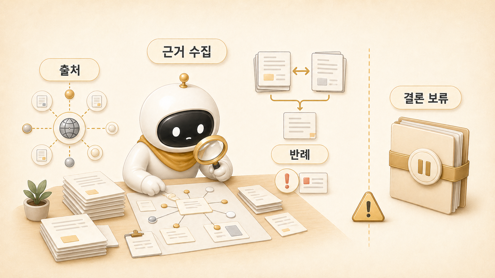

## 조사형 에이전트는 어디서 강하고 어디서 흔들릴까



조사형 에이전트는 모르는 것을 넓히는 데 강하다. 공식 문서, 기존 블로그, 세션 기록, Slack 스레드, shared-memory 같은 자료를 빠르게 훑고 판단 재료를 모은다. 우리 운영에서는 방울이가 이 역할에 가깝다. 이 역할이 왜 따로 필요한지는 앞의 [역할형 에이전트 분리 기준](https://wikidocs.net/345925)과 함께 읽으면 더 선명해진다.

하지만 조사형 에이전트는 최종 판단자가 아니다. [Hermes Agent](https://wikidocs.net/346055)처럼 공식 docs, 실제 운영 경험, OpenClaw에서 넘어온 기록, WikiDocs 발행 기준이 함께 있는 주제에서는 조사 결과와 해석을 분리해야 한다. 이 구분이 흐려지면 빠른 답은 나오지만 다음 단계가 흔들린다.

## 조사형 에이전트가 강한 구간

조사형은 “아직 무엇이 빠졌는지 모르는 상태”에서 특히 강하다.

| 강한 구간 | 이유 | 좋은 산출물 |
|---|---|---|
| 원천 확인 | 공식 문서/기존 글/세션 기록을 넓게 볼 수 있다 | 출처 목록과 핵심 발견 |
| 누락 탐색 | 이미 옮긴 내용과 빠진 내용을 비교할 수 있다 | 누락 후보와 우선순위 |
| 반례 찾기 | 결론을 강화하기보다 흔들 수 있는 근거를 찾는다 | 한계/미확인 항목 |
| handoff 준비 | 다음 역할이 쓸 수 있게 재료를 정렬한다 | 사실/해석/다음 확인 포인트 |

WikiDocs 작업에서도 이 강점이 드러났다. “블로그 내용이 잘 옮겨졌는지”, “공식 docs가 잘 반영됐는지”를 보려면 단순히 문장을 읽는 것만으로는 부족하다. `SOURCE_MAP.md`, TOC, 실제 페이지, WikiDocs 동기화 상태, 이전 세션 기록을 함께 봐야 한다. 이때 조사형은 독자 흐름을 쓰기보다 재료의 위치와 공백을 찾는 데 집중해야 한다.

## 조사형 에이전트가 흔들리는 구간

조사형이 흔들리는 순간은 대체로 결론을 빨리 요구받을 때다. “이 주제 괜찮아?”, “이거 맞아?”, “바로 글로 써줘” 같은 요청이 들어오면 조사형은 근거를 더 모으기 전에 그럴듯한 답을 만들 수 있다.

조사형이 흔들리는 대표 신호는 다음과 같다.

- 출처보다 결론이 먼저 나온다.
- 미확인 항목이 사라진다.
- 여러 자료의 신뢰도가 같은 수준으로 취급된다.
- 반례나 누락 가능성이 빠진다.
- 다음 역할이 바로 쓸 수 있는 구조가 없다.

방울이 운영 매뉴얼에서도 방울이는 최종 보고서보다 판단 재료를 만드는 역할에 집중한다. 사실/추론/미확인을 나누고, 공식 사이트와 1차 소스를 우선 확인하는 이유가 여기에 있다.

## 실제 운영 장면: 원문과 공식 docs 확인

로이드가 Hermes WikiDocs 전체 흐름을 점검하자고 했을 때, 조사형이 해야 할 일은 “책이 좋다/부족하다”를 바로 말하는 것이 아니었다. 먼저 아래 질문을 확인해야 했다.

1. 기존 블로그 1~27편이 어떤 페이지에 들어갔는가?
2. 공식 Hermes Agent docs 중 delegation, cron, MCP, memory, migration 같은 주제가 어디에 반영됐는가?
3. 본문 내부 링크가 GitHub `.md` 경로가 아니라 WikiDocs page URL로 작동하는가?
4. 너무 짧거나 실제 운영 케이스가 빠진 페이지는 어디인가?
5. 민감정보가 들어갈 위험이 있는 운영 기록은 무엇을 빼고 이야기로 바꿔야 하는가?

이 질문의 답을 모은 뒤에야 뽀동이가 책의 흐름으로 다시 쓸 수 있다. 조사형이 이 단계를 건너뛰면 정리형은 매끄러운 문장을 만들 수는 있어도 책의 신뢰를 세우기 어렵다.

## 방울이에게 잘 요청하는 법

조사형에게는 “답”보다 “판단 재료”를 요청하는 편이 좋다.

나쁜 요청은 이렇다.

```text
이 주제 맞는지 빨리 결론 내줘.
```

좋은 요청은 이렇다.

```text
이 주제에 대해 공식 문서, 기존 발행 글, 최근 운영 기록을 나눠서 확인해줘.
사실/해석/미확인/추가 확인 포인트로 분리하고,
뽀동이가 WikiDocs 본문으로 바꿀 수 있게 핵심 재료를 정리해줘.
```

이렇게 요청하면 조사형은 글을 쓰려 하지 않고 재료를 만든다. 그리고 정리형은 그 재료를 바탕으로 독자 흐름을 만들 수 있다.

## 운영 기준

조사형 에이전트에게 맡길 때는 아래 기준을 둔다.

- 결론보다 근거를 먼저 요구한다.
- 공식 문서/실제 운영 기록/추론을 분리한다.
- 미확인과 한계를 남긴다.
- 다음 역할이 바로 쓸 수 있는 구조로 넘긴다.
- 민감정보나 내부 식별값은 공개 본문 재료로 넘기지 않는다.

조사형의 결과가 길어지는 것은 문제가 아니다. 다만 길기만 하고 분류가 없으면 다음 단계가 막힌다.

## FAQ

### 조사형 에이전트가 결론을 쓰면 안 되나요?

쓸 수는 있다. 다만 결론은 “최종 판단”이 아니라 “현재 근거 기준의 임시 해석”으로 표시해야 한다. 특히 공개 글이나 운영 기준으로 넘어갈 내용은 하비나 뽀동이의 후속 검토가 필요하다.

### 조사 결과가 너무 많으면 어떻게 하나요?

처음부터 요약을 요구하기보다 분류를 요구한다. 출처/핵심 발견/미확인/다음 확인 포인트로 나누면 많아도 쓸 수 있다. 분류 없는 요약은 오히려 위험하다.

### 조사형과 정리형을 같은 에이전트가 하면 안 되나요?

작은 일은 가능하다. 하지만 공개 콘텐츠, WikiDocs, 제품 문서처럼 품질 기준이 있는 작업에서는 분리하는 편이 안전하다. 조사형은 넓게 보고, 정리형은 독자에게 읽히는 순서로 좁힌다.

## 다음 글

- 다음은 [정리형 에이전트는 어디서 강하고 어디서 흔들릴까](https://wikidocs.net/345896)에서 뽀동이 같은 정리형의 기준을 본다.
- 조사형이 결론을 서두르는 문제는 [조사형 에이전트는 왜 자주 결론을 서두를까](https://wikidocs.net/345914)에서 더 자세히 다룬다.
