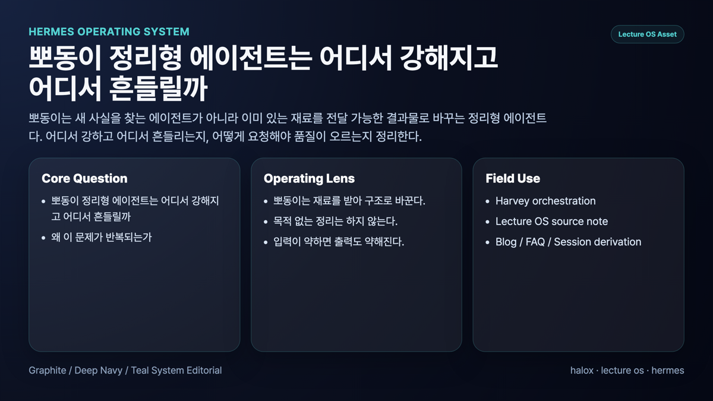
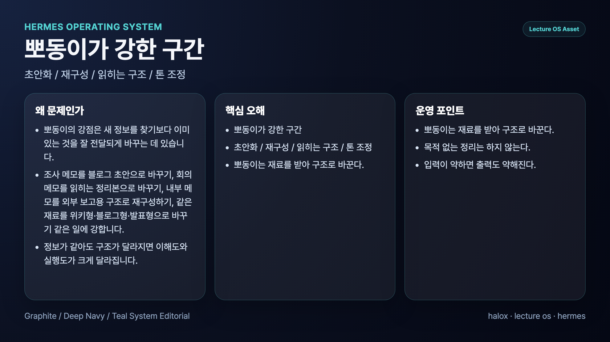
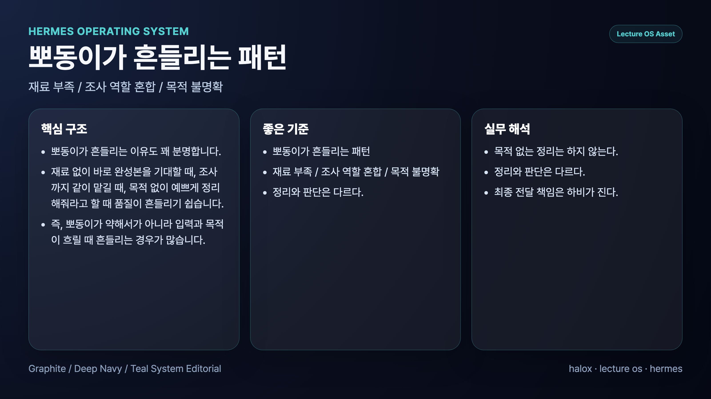
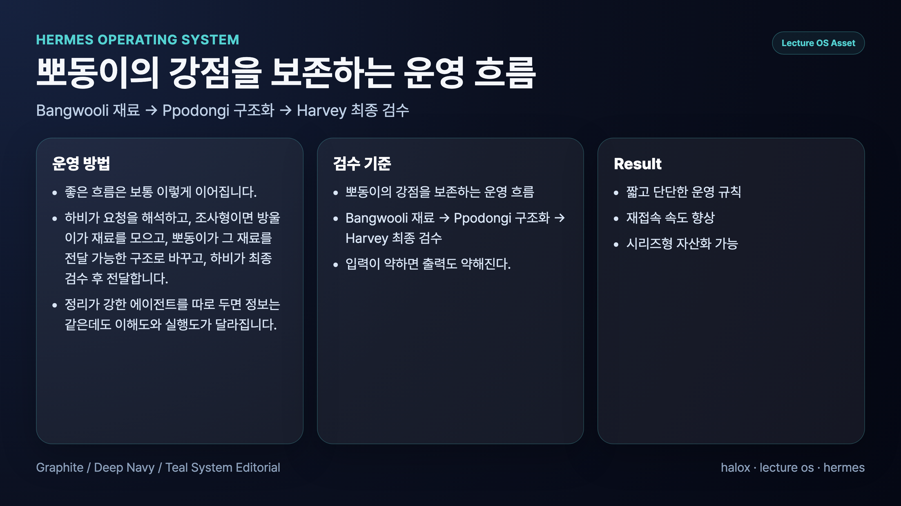

## 정리형 에이전트는 어디서 강해지고 어디서 흔들릴까

> 이 글은 **에르메스 에이전트(Hermes Agent)**를 역할형 에이전트로 운영하며 정리한 실전 기록입니다. 우리 운영 사례에서는 정리형 에이전트를 뽀동이라고 부릅니다.

정리형 에이전트는 복잡한 재료를 읽기 좋은 구조로 바꾸는 데 강하다. 회의 메모, 조사 결과, 운영 기록, 블로그 초안, WikiDocs 페이지처럼 흩어진 내용을 독자가 따라갈 수 있는 흐름으로 정리한다.

하지만 정리형 에이전트도 자주 흔들린다. 재료가 부족한데 완성도를 요구하면 문장은 매끄러운데 내용은 약한 결과물이 나온다. 목적과 독자가 없으면 예쁘게 정리했지만 어디에 쓰기 애매한 문서가 된다.

## 정리형 에이전트가 강한 구간

정리형 에이전트는 정보를 새로 많이 찾는 역할보다, 이미 있는 재료를 읽히는 구조로 바꾸는 역할에 가깝다.

강한 구간은 대체로 이렇다.

- 조사 결과를 보고서로 바꾸기
- 긴 대화를 회의록이나 실행 문서로 정리하기
- 블로그 초안을 WikiDocs 책 문맥으로 리라이트하기
- 제목, 소제목, FAQ, 다음 링크 정리하기
- 발표나 강의 흐름으로 재구성하기

예를 들어 Hermes Agent 책을 만들 때 정리형 에이전트는 단순히 문장을 다듬는 역할이 아니다. 독자가 처음 읽어도 이해할 수 있도록 문제, 시행착오, 운영 기준, 다음 장 흐름을 다시 잡는다.

## 정리형 에이전트가 흔들리는 구간

정리형 에이전트가 흔들리는 순간은 보통 재료보다 완성도를 먼저 요구할 때다.

### 1. 재료 없이 그럴듯한 글을 만든다

정보가 부족해도 문장은 만들 수 있다. 그래서 위험하다. 보기에는 완성된 것 같지만 근거가 약하고, 실제 운영 경험이 빠져 있을 수 있다.

### 2. 목적 없는 정리를 한다

같은 재료라도 블로그, WikiDocs, Slack 보고, 발표자료는 구조가 달라야 한다. 목적이 없으면 어디에도 애매한 문서가 된다.

### 3. 독자를 놓친다

내부 운영자를 위한 문서와 처음 읽는 독자를 위한 문서는 설명 순서가 다르다. 정리형 에이전트는 독자가 누구인지 알아야 한다.

### 4. 조사 역할까지 떠안는다

정리 중에 근거가 부족하면 조사형에게 되돌려야 한다. 정리형이 빈칸을 상상으로 메우기 시작하면 글은 매끄럽지만 약해진다.

## 정리형 에이전트에게 잘 요청하는 법

정리형에게는 “예쁘게 정리해줘”보다 목적과 독자를 줘야 한다.

좋은 요청에는 보통 아래가 들어간다.

- 이 문서의 독자
- 문서의 목적
- 반드시 살릴 핵심 메시지
- 유지해야 할 사실과 근거
- 원하는 출력 형식
- 피해야 할 문체나 표현
- 다음 링크나 CTA

예를 들어 “이거 블로그로 정리해줘”보다 “Hermes Agent WikiDocs 3장 독자가 역할형 에이전트를 왜 나누는지 이해하도록, 실무 시행착오 중심으로 정리하고 FAQ와 다음 글 링크까지 붙여줘”가 더 좋다.

## 우리가 실제로 세운 운영 원칙

### 원칙 1. 정리형은 재료를 받아 구조로 바꾼다

재료가 없으면 먼저 조사형으로 돌린다. 정리형에게 없는 사실을 만들게 하지 않는다.

### 원칙 2. 목적 없는 정리는 하지 않는다

문서가 어디에 쓰일지 먼저 정한다. Slack 보고인지, WikiDocs 페이지인지, 발표 흐름인지에 따라 구조가 달라진다.

### 원칙 3. 입력이 약하면 출력도 약해진다

정리형 에이전트의 품질은 입력 재료의 밀도에 크게 좌우된다.

### 원칙 4. 정리와 판단은 다르다

정리형은 구조를 잡지만 최종 우선순위와 공개 여부 판단은 메인 창구가 함께 봐야 한다.

### 원칙 5. 최종 전달 책임은 메인 창구가 진다

정리형이 좋은 초안을 만들더라도 사용자-facing 최종본은 메인 창구가 검수하고 묶는다.

## FAQ

### 1. 정리형 에이전트에게 바로 글을 맡기면 안 되나요?

맡길 수는 있다. 다만 재료와 목적이 약하면 그럴듯하지만 빈 글이 나오기 쉽다.

### 2. 좋은 정리형 요청의 핵심은 무엇인가요?

독자, 목적, 핵심 메시지, 유지할 사실, 출력 형식이다. 이 다섯 가지가 있으면 품질이 크게 올라간다.

### 3. 정리형 에이전트가 조사까지 하면 안 되나요?

간단한 확인은 할 수 있다. 하지만 근거 수집이 핵심이면 조사형으로 나누는 편이 안전하다.

## 다음 글

다음 글에서는 조사형과 정리형 에이전트가 왜 서로 다른 실패를 반복하는지 비교한다.

[다음 글: 조사형과 정리형 에이전트는 왜 각각 다른 실패를 반복할까](19-why-bangwooli-and-ppodongi-fail-differently.md)
