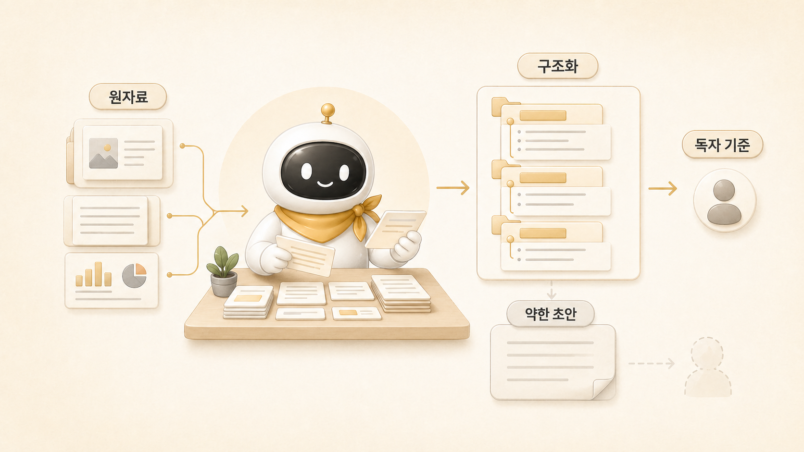

## 정리형 에이전트는 어디서 강하고 어디서 흔들릴까



정리형 에이전트는 흩어진 재료를 읽히는 구조로 바꾸는 데 강하다. 조사 결과, 회의 메모, 공식 문서 요약, 운영 경험을 독자가 따라갈 수 있는 글로 바꾼다. 우리 운영에서는 뽀동이가 이 역할에 가깝다. 정리형의 위치는 [역할형 에이전트 분리 기준](https://wikidocs.net/345925)에서 말한 책임 경계 안에서 이해해야 한다.

하지만 정리형 에이전트가 재료 없이 글을 쓰기 시작하면 위험하다. 문장은 매끄러운데 근거가 약하고, 제목은 그럴듯한데 독자 문제가 흐려진다. 공개 [WikiDocs](https://wikidocs.net/345908) 글에서는 이 문제가 특히 크게 보인다.

## 정리형 에이전트가 강한 구간

정리형은 “재료는 있는데 독자가 따라가기 어려운 상태”에서 힘을 낸다.

| 강한 구간 | 이유 | 좋은 산출물 |
|---|---|---|
| 흐름 재구성 | 흩어진 메모를 독자 여정으로 바꾼다 | 문제/오해/운영 기준/다음 링크 |
| 문체 정리 | 번역투와 AI 답변투를 줄인다 | 자연스러운 한국어 문장 |
| 공개 글 변환 | 내부 운영 기록을 독자용 이야기로 바꾼다 | 민감정보 제거된 사례 |
| 링크 설계 | 개념과 사례를 본문 안에서 연결한다 | contextual hyperlink |
| 검수 | 글이 목적에 맞는지 다시 본다 | 부족한 재료/약한 주장 표시 |

뽀동이는 조사 결과를 그대로 예쁘게 포장하는 역할이 아니다. 독자가 처음 보는 상태에서도 “왜 이 기준이 필요한지” 이해할 수 있도록 순서와 맥락을 만드는 역할이다.

## 실제 운영 장면: 축약된 책을 다시 책답게 만들기

Hermes WikiDocs 1차 이전이 끝났을 때 기술적으로는 많은 것이 갖춰져 있었다. TOC가 있었고, 페이지가 있었고, 이미지도 들어갔고, 검증도 통과했다. 하지만 로이드가 본 문제는 달랐다. 처음 보는 독자에게는 내용이 축약되어 보일 수 있고, 내부 링크도 단순한 다음 글 이동에 가까웠다.

이때 정리형의 일은 분량을 늘리는 것이 아니었다. 독자 흐름을 다시 보는 일이었다.

- 첫 문단에 답이 있는가?
- 내부 이름보다 공개 개념이 먼저 나오는가?
- 실제 운영 케이스가 문장 안에 녹아 있는가?
- 본문 링크가 개념/기능/사례를 연결하는가?
- 민감정보나 독자가 몰라도 되는 내부 디테일이 빠졌는가?
- 다음 장으로 넘어갈 이유가 보이는가?

이런 질문을 기준으로 1장과 2장을 다시 썼고, 3장에서도 같은 방식이 필요했다. 역할형 에이전트를 설명하려면 “방울이는 조사, 뽀동이는 정리”라는 소개만으로는 부족하다. 왜 그렇게 나누는지, 어디서 실패하는지, 어떻게 넘겨받는지까지 보여줘야 한다.

## 정리형 에이전트가 흔들리는 구간

정리형은 재료가 부족할 때 흔들린다. 근거가 적은데도 글을 완성하려고 하면 문장은 매끄럽지만 속이 비는 결과가 나온다.

특히 아래 상황에서 약해진다.

- 조사 결과가 출처 없이 요약만 되어 있다.
- 독자와 목적이 정해지지 않았다.
- “더 풍부하게”라는 요청만 있고 실제 사례가 없다.
- 공식 문서와 운영 경험의 경계가 섞여 있다.
- 발행 채널이 블로그인지 WikiDocs인지 강의인지 정해지지 않았다.

정리형은 없는 근거를 만들어내는 역할이 아니다. 재료를 받아 목적과 독자에 맞게 배치하는 역할이다. 따라서 정리형이 약해질 때는 “문장을 더 잘 써라”보다 “재료를 다시 모으자”가 맞는 처방일 때가 많다.

## 뽀동이에게 잘 요청하는 법

정리형에게는 목적, 독자, 원자료, 금지선을 함께 줘야 한다.

나쁜 요청은 이렇다.

```text
이거 더 있어 보이게 써줘.
```

좋은 요청은 이렇다.

```text
이 조사 결과와 기존 페이지를 바탕으로 WikiDocs 독자가 처음 읽어도 이해되게 다시 써줘.
공개 개념을 먼저 쓰고, 하비/방울이/뽀동이는 실제 운영 예시로 넣어줘.
민감정보나 독자가 몰라도 되는 내부 디테일은 빼고,
본문 안에서 관련 개념 페이지로 자연스럽게 링크해줘.
```

이렇게 요청하면 정리형은 문장만 다듬지 않는다. 독자 문제, 흐름, 링크, 검수 기준까지 함께 본다.

## 운영 기준

정리형 에이전트에게 맡길 때는 아래 기준을 둔다.

- 원자료가 충분한지 먼저 확인한다.
- 독자와 목적을 정한다.
- 내부 이름보다 공개 개념을 먼저 배치한다.
- 사례는 살리되 민감정보와 불필요한 내부값은 제거한다.
- 근거 없는 내용을 새로 만들지 않는다.
- 문장보다 구조, 구조보다 전달 목적을 우선한다.
- 다음 글로 이어지는 이유를 만든다.

이 기준은 WikiDocs뿐 아니라 보고서, 발표자료, 블로그, Slack 보고에도 그대로 적용된다.

## FAQ

### 정리형 에이전트가 조사까지 같이 하면 안 되나요?

작은 작업에서는 가능하다. 하지만 공개 문서나 책 구조를 다룰 때는 분리하는 편이 좋다. 조사형이 근거와 미확인을 분리하고, 정리형이 독자 흐름으로 바꾸면 서로의 실패를 줄일 수 있다.

### 글이 매끄러우면 좋은 정리 아닌가요?

아니다. 좋은 정리는 독자가 다음 판단을 할 수 있게 만드는 것이다. 문장이 매끄러워도 근거가 약하거나 기준이 흐리면 약한 글이다.

### 정리형이 제일 먼저 확인해야 할 것은 무엇인가요?

원자료, 독자, 목적이다. 이 세 가지가 없으면 제목과 문장이 좋아도 결과물이 흔들린다.

## 다음 글

- 다음은 [조사형/정리형 에이전트는 왜 다르게 실패할까](https://wikidocs.net/345897)에서 두 역할의 실패 패턴을 나란히 본다.
- 좋은 조사 결과가 바로 좋은 글이 되지 않는 이유는 [좋은 조사 결과가 바로 좋은 글이 되지 않는 이유](https://wikidocs.net/345909)에서도 이어진다.
