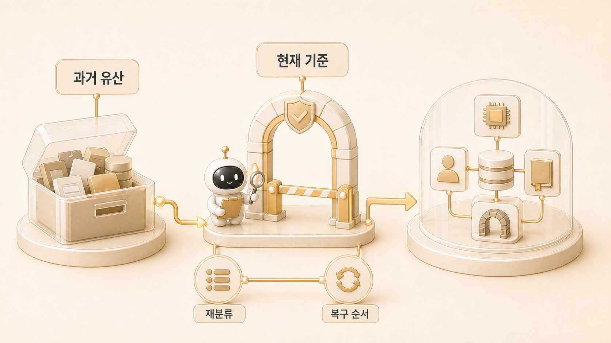

## OpenClaw에서 Hermes로 넘어올 때 무엇을 점검해야 할까

[OpenClaw에서 Hermes로](https://wikidocs.net/345889) 넘어오는 일은 이름만 바꾸는 작업이 아니었다. AI 개인비서 운영 기준, 역할형 에이전트 분리, memory/profile/runtime 경계, GitHub/WikiDocs source of truth까지 함께 정리해야 하는 마이그레이션이었다.

그래서 전환에는 [체크리스트](https://wikidocs.net/345919)와 [보안/권한 기준](https://wikidocs.net/346259)이 함께 필요했다. “이제 Hermes를 쓴다”는 선언보다 중요한 것은 무엇이 어디에 남아 있고, 어떤 프로세스가 실제로 돌고 있으며, 어떤 문서를 기준으로 믿을지 정하는 일이었다.

## 왜 시스템 전환은 감으로 처리되기 쉬울까

전환 작업은 겉으로 보면 간단해 보인다. 이름을 바꾸고, 설정을 옮기고, 새 도구를 실행하면 된다고 느끼기 쉽다. 하지만 실제 운영에서는 이전 시스템의 흔적이 곳곳에 남는다.

- 예전 이름이 문서에 남아 있다.
- profile과 state가 새 기준으로 정리되지 않았다.
- autostart나 [gateway](https://wikidocs.net/345906)가 이전 흐름을 보고 있다.
- memory에 남길 것과 skill로 옮길 것이 섞여 있다.
- GitHub, WikiDocs, Obsidian, shared-memory 중 원본이 흔들린다.

감으로 옮기면 당장은 돌아가도 나중에 “무엇이 현재 기준인지”가 흐려진다.

## 전환 체크리스트의 핵심

| 영역 | 확인할 것 | 판단 기준 |
|---|---|---|
| identity | 이름과 역할 | 공개 개념과 내부 이름이 분리되어 있는가 |
| profile | 프로필별 규칙 | 하비/방울이/뽀동이 역할이 겹치지 않는가 |
| memory | 장기 기억 | 작업 로그가 memory에 섞이지 않았는가 |
| skill | 반복 절차 | 재사용 절차가 skill로 옮겨졌는가 |
| cron | 예약 실행 | self-contained prompt와 delivery target이 있는가 |
| gateway | 상시 실행 | process/log/delivery 확인 순서가 있는가 |
| docs | source of truth | GitHub/WikiDocs/shared-memory 역할이 분리되어 있는가 |

## 실제 운영에서 중요했던 점

OpenClaw migration notes에는 자동으로 옮기기 어려운 항목들이 archive/manual review 대상으로 남았다. 예전 workspace identity, tools, heartbeat, bootstrap, cron store, hooks, gateway config, agent routing 같은 항목은 그대로 복사하기보다 Hermes의 새 구조에 맞춰 재분류해야 했다.

이 점이 핵심이다. 마이그레이션은 과거를 모두 버리는 것도 아니고, 모두 복사하는 것도 아니다. 과거 유산을 참고 자료로 보관하되, 현재 운영 기준은 [Hermes Agent 주요 개념과 기능](https://wikidocs.net/346055), profile 문서, shared-memory, GitHub 원본 기준으로 다시 세운다.

## 운영 기준

1. 현재 source of truth를 먼저 정한다.
2. 과거 설정은 archive로 보관하고 manual review 대상으로 분리한다.
3. profile/memory/skill/cron/gateway를 같은 범주로 취급하지 않는다.
4. 자동 실행되는 항목은 process와 delivery까지 확인한다.
5. 공유 문서에는 내부값이 아니라 전환 판단 기준만 남긴다.
6. 전환 후에는 [복구 플레이북](https://wikidocs.net/345918)을 만들어 되돌아올 순서를 남긴다.

## FAQ

### 이름만 Hermes로 바꾸면 안 되나요?

안 된다. 이름만 바꾸면 예전 운영 습관이 그대로 남는다. Hermes로 넘어왔다는 것은 메인 창구, 역할형 에이전트, memory/session/profile, gateway/cron, source of truth를 새 기준으로 다시 나누는 일이다.

### 이전 OpenClaw 기록은 지우는 게 좋나요?

바로 지우지 않는다. 다만 현재 기준과 섞지 않는다. 과거 기록은 archive/manual review로 두고, 현재 운영 문서에는 검증된 기준만 남긴다.

### 마이그레이션은 언제 끝난 것으로 보나요?

새 이름으로 실행되는 때가 아니라, 요청/실행/기록/복구/발행의 기준이 모두 Hermes 구조로 설명될 때 끝난다.

## 이어서 읽기

마이그레이션 이후에는 개인 운영을 넘어 조직 운영 기준을 봐야 한다. 다음 장의 [조직 도입과 AI 에이전트 운영 확장](https://wikidocs.net/345927)으로 이어진다.
