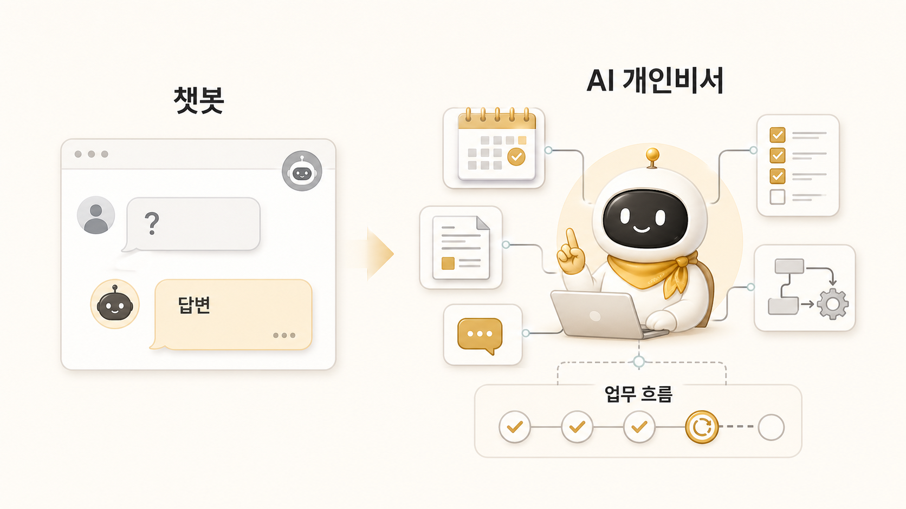

## 하망이와 WikiDocs 본문 이미지를 만드는 법

에르메스 에이전트(Hermes Agent) 운영에서 WikiDocs 본문 이미지는 장식이 아니다. 독자가 긴 설명을 읽기 전에 핵심 구조를 한 번에 잡게 만드는 안내판이다. 그래서 이미지형 에이전트인 하망이는 예쁜 그림을 만드는 역할이 아니라, 글의 메시지를 시각 구조로 바꾸는 역할을 맡는다.

우리 운영에서 하망이는 썸네일, 설명 이미지, HTML-to-PNG, Codex imagegen, PIL 후처리 같은 제작 흐름을 담당한다. 이 역할은 [조사형/정리형/실행형 에이전트](https://wikidocs.net/345898) 흐름에서 이미지형 에이전트로 확장된 사례다. 실제 운영 사례는 [하망이와 WikiDocs 이미지를 만든 케이스](https://wikidocs.net/345991)에서 더 자세히 다룬다. 하지만 최종 기준은 항상 메시지다. 디자인이 좋아도 본문 구조와 맞지 않으면 다시 만든다.

## 왜 본문 이미지는 나중에 붙이면 안 될까

이미지를 마지막에 붙이면 글과 따로 논다. 먼저 “이 페이지에서 독자가 무엇을 한눈에 이해해야 하는가”를 정해야 한다. 예를 들어 1장 이미지는 AI 챗봇과 AI 개인비서의 차이, 나만의 AI 팀 구성, 역할형 에이전트 구조를 보여줘야 했다.

4장 이미지는 memory/session/profile/source of truth 경계를 보여줘야 했고, 7장 이미지는 WikiDocs/블로그/강의 콘텐츠 시스템의 흐름을 보여줘야 한다. 즉 이미지는 페이지의 핵심 판단 기준을 압축해야 한다.

## 실제 사례: SEO/GEO 치트시트 자산화

SEO/GEO 치트시트 작업은 이미지 제작이 콘텐츠 시스템으로 확장된 사례다. 전체 사례는 [SEO/GEO 치트시트를 콘텐츠 자산으로 만든 실제 케이스](https://wikidocs.net/345996)와 연결된다. 처음에는 참고 이미지와 주제가 있었고, 하비는 이것을 일반 이미지 생성이 아니라 HTML-to-PNG 기반 인포그래픽 작업으로 판단했다. 이후 렌더, QA, 디자인 피드백, 수정, 최종 파일, LinkedIn 문안, skill화까지 이어졌다.

중요한 교훈은 레퍼런스를 복제하지 않는다는 점이었다. 레퍼런스에서 여백, 정보 밀도, SaaS/editorial 톤은 참고하지만, 구도나 장식 요소를 그대로 따라 하지 않는다. 또 햇살형 장식처럼 오해될 수 있는 요소는 제거한다. 이 기준은 shared-memory 디자인 시스템에도 남았다.

## 이미지형 에이전트가 맡는 일

| 단계 | 하망이가 하는 일 | 하비/뽀동이가 함께 봐야 할 것 |
|---|---|---|
| 메시지 정의 | 한 이미지에 담을 핵심 한 문장 정리 | 페이지 독자 문제와 맞는가 |
| 방향 선택 | HTML-to-PNG 또는 imagegen 경로 선택 | 구조형인지 창작형인지 |
| 제작 | 레이아웃, 시각 위계, 안전 여백 적용 | 본문 흐름과 맞는가 |
| QA | 텍스트 과밀, 잘림, 오해 요소 점검 | 발행 가능한가 |
| 재사용 | skill/템플릿/디자인 규칙 반영 | 다음 작업에 남길 기준인가 |

## 판단 기준

1. 이미지는 글의 핵심 메시지에서 출발한다.
2. 구조형 설명 이미지는 HTML-to-PNG를 우선한다.
3. 창작형/일러스트형 이미지는 imagegen을 검토한다.
4. 레퍼런스는 원칙만 추출하고 복제하지 않는다.
5. 렌더 후 시각 QA를 통과해야 발행한다.
6. 반복될 스타일과 금지 요소는 memory나 skill보다 디자인 시스템/shared-memory에 남긴다.

이미지 작업도 콘텐츠 시스템의 일부다. 이미지가 따로 예쁘게 완성되어도 본문 핵심 질문에 답하지 못하면 다시 잡아야 한다. 반대로 메시지가 선명하면 이미지는 WikiDocs, 블로그, 강의, 카드뉴스에서 같은 기준을 반복해 주는 자산이 된다.

## 체크리스트

- 이미지가 본문 첫 질문에 답하는가?
- 한 이미지에 메시지가 너무 많이 들어가지 않았는가?
- 작은 화면에서도 제목과 핵심 텍스트가 읽히는가?
- 한국어 줄바꿈이 어색하지 않은가?
- 레퍼런스 복제처럼 보이는 요소가 없는가?
- WikiDocs/PDF에서 이미지 경로가 깨지지 않는가?

## FAQ

### 하망이는 썸네일만 만들면 되나요?

아니다. 하망이는 본문 이미지, 설명 도표, 카드형 자산, 썸네일까지 맡을 수 있다. 다만 모든 작업은 메시지 기준으로 시작해야 한다.

### AI 이미지 안에 긴 한국어 문장을 넣어도 되나요?

가능하면 피하는 편이 좋다. 긴 한국어 텍스트는 HTML-to-PNG처럼 통제 가능한 렌더링이 더 안전하다.
