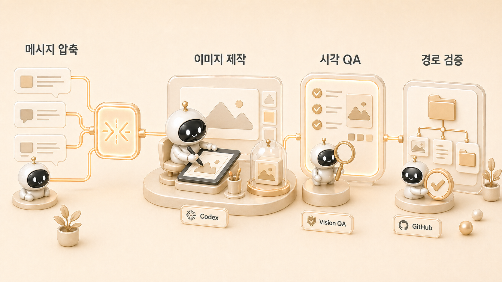

## 하망이와 WikiDocs 이미지를 만든 실제 운영 케이스

에르메스 에이전트(Hermes Agent) 운영에서 하망이 이미지 제작 케이스는 “예쁜 그림을 만들었다”가 아니라, WikiDocs 책의 메시지를 시각 자료로 바꾸는 업무 자동화 흐름을 보여준다. AI 개인비서와 [역할형 에이전트](https://wikidocs.net/345925) 운영서에서 이미지는 장식이 아니라 독자가 개념을 빨리 잡게 하는 설명 도구다.



이 케이스를 따라 하면 한 페이지의 핵심 메시지를 이미지로 압축하고, 생성 결과를 검수하고, `assets/`에 연결하고, WikiDocs 공개 화면까지 확인하는 흐름을 만들 수 있다. 하망이는 이미지 제작형 에이전트이고, 뽀동이는 본문 메시지를 정리하며, 하비는 책 전체 흐름과 맞는지 판단한다.

## 목표

- WikiDocs 페이지나 장의 핵심 메시지를 이미지 콘셉트로 바꾼다.
- 이미지가 본문 이해를 돕는지 검수한다.
- 파일명, asset 위치, Markdown 경로를 정리한다.
- GitHub 원본 반영 후 WikiDocs 공개 화면에서 보이는지 확인한다.

## 사전 준비

| 준비 항목 | 설명 |
|---|---|
| 페이지 원고 | 이미지가 들어갈 페이지의 제목, 첫 문단, 핵심 메시지가 있어야 한다 |
| 이미지 방향 | 창작형 일러스트인지, 구조형 다이어그램인지, 썸네일인지 정한다 |
| 디자인 기준 | 색상, 여백, 글자 밀도, 금지 장식, 브랜드 톤을 정한다 |
| 검수 방식 | vision QA 또는 사람 피드백으로 깨진 글자/오해 요소를 확인한다 |
| 발행 위치 | `assets/` 하위 경로와 Markdown 상대 경로를 정한다 |

이미지 작업은 원고보다 먼저 시작하면 흔들리기 쉽다. 본문에서 말하려는 한 문장이 정리되지 않았다면 프롬프트를 쓰기 전에 뽀동이가 먼저 메시지를 압축해야 한다.

## 설정 단계

### 1. 페이지 메시지를 한 문장으로 줄인다

먼저 이미지가 설명해야 할 문장을 만든다.

```text
이 페이지는 Hermes Agent에서 이미지형 에이전트가 장식이 아니라
본문 메시지를 시각적으로 압축하고 검증까지 맡는다는 점을 보여준다.
```

이 문장이 없으면 이미지는 “그럴듯한 분위기”로 흐른다. 좋은 WikiDocs 이미지는 페이지 제목, 첫 답변, 본문 구조와 같은 말을 해야 한다.

### 2. 이미지 유형을 고른다

| 유형 | 적합한 경우 | 주의점 |
|---|---|---|
| 구조형 다이어그램 | 역할 분리, 발행 흐름, 체크리스트를 설명할 때 | 텍스트가 너무 많으면 깨지거나 작아진다 |
| 카드형 이미지 | 한 문장 메시지나 대비 구조를 보여줄 때 | 장식이 과하면 저장용 자료처럼 보이지 않는다 |
| 창작형 일러스트 | 장 분위기, 사례 도입, 캐릭터 역할을 보여줄 때 | 본문 정보와 무관한 예쁜 그림이 되기 쉽다 |
| 썸네일 | 블로그/LinkedIn/강의 자료로 확장할 때 | WikiDocs 본문 이미지와 목적이 다를 수 있다 |

하망이는 이미지 제작형이지만, 모든 요청을 창작형 일러스트로 처리하면 안 된다. 정보 구조가 중요하면 HTML-to-PNG나 다이어그램 방식이 더 적합하다.

### 3. 프롬프트를 만든다

프롬프트에는 장식보다 정보 위계를 먼저 적는다.

```text
Hermes Agent WikiDocs 페이지에 들어갈 설명 이미지.
주제: 이미지형 에이전트 하망이가 페이지 메시지를 시각 자료로 바꾸는 흐름.
구성: Slack 요청 → 뽀동이 메시지 압축 → 하망이 이미지 제작 → vision QA → assets 연결 → WikiDocs 반영.
분위기: 깔끔한 업무 자동화 다이어그램, 과한 장식 없음, 작은 한국어 텍스트 최소화.
주의: 깨진 글자, 복잡한 배경, 무의미한 캐릭터 장식 금지.
```

이미지 안에 긴 한국어 문장을 넣는 것은 피한다. 필요한 텍스트는 본문이 담당하고, 이미지는 흐름과 관계를 보여주는 쪽이 안정적이다.

### 4. 생성 결과를 검수한다

이미지가 예쁘게 나와도 바로 쓰지 않는다. 다음 항목을 확인한다.

| 검수 항목 | 질문 |
|---|---|
| 메시지 | 이 이미지가 페이지 첫 문단과 같은 말을 하는가 |
| 글자 | 깨진 글자, 어색한 한글, 읽기 어려운 작은 텍스트가 있는가 |
| 정보 밀도 | 한 화면에 너무 많은 단계가 들어갔는가 |
| 오해 요소 | 독자가 잘못된 기능이나 역할로 이해할 장식이 있는가 |
| 브랜드 톤 | 책 전체의 이미지 톤과 어긋나지 않는가 |
| 재사용성 | 같은 유형의 다음 이미지에도 기준으로 쓸 수 있는가 |

하망이 작업에서 중요한 것은 “좋아 보인다”가 아니라 “오해를 줄인다”다.

### 5. 파일을 연결한다

이미지를 만든 뒤에는 파일 연결까지 끝내야 한다.

```text
assets/how-image-agent-creates-wikidocs-visuals/ch10-1-hamangi-image-production-tool-badges-codex.png
```

본문에서는 상대 경로로 연결한다.

```markdown


```

이미지 위아래에는 빈 줄을 둔다. GitHub 원본에는 이미지가 있어도 Markdown에서 경로가 틀리면 WikiDocs 공개 화면에서는 깨진 이미지가 된다.

## 운영 흐름

```text
1. 뽀동이가 페이지의 독자 문제와 핵심 메시지를 한 문장으로 정리한다.
2. 하망이가 이미지 유형을 고른다.
3. 프롬프트에서 흐름, 금지 요소, 텍스트 밀도를 명시한다.
4. 생성 결과에서 오해될 장식, 깨진 글자, 과한 텍스트를 제거한다.
5. 파일명을 장/페이지 구조와 맞춘다.
6. assets/에 넣고 Markdown에서 상대 경로로 연결한다.
7. 이미지 경로와 여백을 검증한다.
8. GitHub 원본에 반영하고 WikiDocs 공개 화면에서 확인한다.
```

## 시행착오

이미지 작업에서 가장 쉬운 실수는 “보기 좋은 그림”을 먼저 만드는 것이다. 하지만 WikiDocs 본문 이미지는 광고 배너가 아니다. 독자가 지금 읽는 개념을 덜 헷갈리게 해야 한다. 그래서 하망이 작업에서는 레퍼런스를 복제하지 않고 색상 관계, 여백, 정보 밀도, 글자 위계 같은 원칙만 추출한다.

또 하나의 실수는 이미지 파일만 만들고 본문에 연결하지 않는 것이다. GitHub에 asset이 있어도 페이지에서 참조하지 않으면 독자에게는 없는 이미지와 같다. 이미지 제작은 생성이 아니라 연결/검증/공개 확인까지 포함한 발행 작업이다.

## 문제 해결

### 이미지가 본문과 따로 노는 경우

본문의 첫 문단을 다시 읽고 이미지가 설명해야 할 문장을 하나로 줄인다. 프롬프트를 더 길게 쓰기보다 메시지를 좁히는 편이 낫다.

### 한국어 텍스트가 깨지는 경우

이미지 안 텍스트를 줄이고, 꼭 필요한 문구만 크게 넣는다. 긴 설명은 본문 Markdown이 맡게 한다.

### 이미지 경로가 깨지는 경우

`pages/`에서 `assets/`로 가는 상대 경로를 확인한다. 보통 페이지 파일에서는 `../assets/...` 형태가 된다.

## 운영 기준

- 이미지형 에이전트는 장식 담당이 아니라 메시지 압축 담당이다.
- 본문 메시지가 불명확하면 이미지 프롬프트를 쓰지 않는다.
- 외부 레퍼런스는 복제 대상이 아니라 원칙 추출 대상이다.
- 한국어 텍스트가 많은 이미지는 깨짐/오탈자/과밀을 반드시 검수한다.
- 파일명, asset 위치, Markdown 상대 경로, 이미지 여백을 함께 확인한다.
- 이미지 케이스는 [콘텐츠 시스템](https://wikidocs.net/345911)과 [체크리스트](https://wikidocs.net/345919)에 다시 연결한다.

## FAQ

### 하망이는 어떤 역할인가요?

하망이는 이미지 제작형 에이전트다. 썸네일, 설명 이미지, 시각 콘셉트, HTML-to-PNG, Codex image generation 같은 시각 자료 제작을 맡는다. 회고나 감정 정리 역할이 아니라 콘텐츠 메시지를 시각화하는 역할이다.

### 이미지는 꼭 모든 페이지에 필요할까요?

아니다. 모든 페이지에 이미지를 넣는 것보다, 독자가 헷갈릴 개념이나 장 전환 지점에 넣는 것이 좋다. 이미지가 본문 이해를 돕지 않으면 장식이 된다.

### 이미지가 마음에 들면 바로 발행해도 되나요?

아니다. 시각적으로 좋아도 본문 메시지와 어긋나면 수정해야 한다. WikiDocs용 이미지는 페이지 제목, 첫 문단, 독자 문제와 맞아야 한다.

## 이어서 읽기

이미지 제작이 콘텐츠 운영 흐름 안에서 어떻게 쓰이는지는 [하망이와 WikiDocs 본문 이미지를 만드는 법](https://wikidocs.net/345989)에서 더 자세히 본다. 자동화에서 발행까지 이어지는 사례는 [크론 조사에서 WikiDocs 발행까지 이어지는 AI 업무 자동화 케이스](https://wikidocs.net/345992)로 이어진다.
