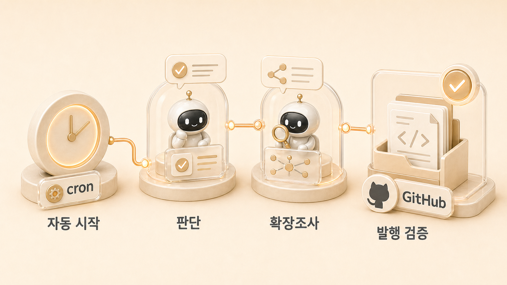

## 이 사례에서 가져갈 운영 규칙

cron 사례의 핵심 규칙은 “자동화는 완성이 아니라 시작 신호”라는 것이다. 처음에는 예약 조사가 매일 오면 콘텐츠도 자동으로 쌓일 것처럼 보인다. 하지만 실제로는 결과가 너무 많거나, 출처가 약하거나, 이미 다룬 주제가 반복되거나, 글처럼 보이지만 책의 흐름에는 맞지 않는 일이 생긴다.

그래서 cron은 글쓰기 에이전트가 아니라 신호 감지 장치로 둔다. cron이 새 신호를 가져오면 하비가 `넘겨/더 파/제품/보류/중복`으로 판단하고, 방울이는 근거를 보강하고, 뽀동이는 독자가 따라 할 수 있는 구조로 바꾼다. 이 순서를 두면 자동화가 품질을 해치지 않고, 사람의 판단이 필요한 지점도 사라지지 않는다.

| 처음에 흔히 막히는 지점 | 운영 규칙 | 따라 하는 방법 |
|---|---|---|
| 조사 결과가 많지만 다음 액션이 없다 | cron 출력에 판단 태그를 넣는다 | `넘겨/더 파/제품/보류/중복` 중 하나를 요구한다 |
| fresh session이라 맥락을 잃는다 | 프롬프트를 self-contained하게 쓴다 | 목적, 볼 것, 제외할 것, 출력 형식, 전달 위치를 모두 적는다 |
| 보고가 글처럼 보여 바로 발행한다 | 발행 전 역할형 검증을 거친다 | 방울이 확장조사와 뽀동이 구조화를 분리한다 |

[TOC]

## 크론 조사에서 WikiDocs 발행까지 이어지는 AI 업무 자동화 케이스

에르메스 에이전트(Hermes Agent) 업무 자동화에서 cron은 “글을 자동으로 완성하는 기능”이 아니라 반복 신호를 놓치지 않게 하는 시작점이다. 예약된 조사가 곧바로 좋은 글이 되는 것은 아니다. 조사 결과를 하비가 판단하고, 방울이가 확장조사하고, 뽀동이가 WikiDocs 구조로 다시 쓰고, GitHub/WikiDocs 발행 흐름을 통과해야 공유 자산이 된다.



이 케이스는 AI 업무 자동화를 “자동 실행”이 아니라 “자동 시작 후 [역할형 에이전트](https://wikidocs.net/345925)가 이어받는 흐름”으로 보는 방법을 보여준다. 핵심은 cron이 모든 일을 처리하게 만드는 것이 아니라, 반복 신호를 놓치지 않게 하고 이후 판단과 품질 관리는 역할별 흐름으로 넘기는 것이다.

## 크론 조사에서 WikiDocs 발행까지

매일 또는 매주 반복되는 조사 주제는 cron으로 시작할 수 있다. 중요한 것은 사람이 판단할 수 있는 요약으로 받은 뒤, 가치 있는 신호만 WikiDocs 원고로 전환하는 것이다.

## 목표

- 반복 조사 주제를 cron으로 자동 실행한다.
- 조사 결과를 Slack 또는 지정 채널로 받는다.
- 하비가 결과를 `넘겨/더 파/제품/보류/중복`으로 분류한다.
- 방울이가 필요한 주제를 확장조사한다.
- 뽀동이가 WikiDocs 페이지 구조로 정리한다.
- GitHub 원본 반영 후 WikiDocs 공개 화면을 확인한다.

## 사전 준비

| 준비 항목 | 설명 |
|---|---|
| 검색 도구 | 웹 검색 MCP, 브라우저 검색, RSS, 공식 문서 확인 경로 중 하나가 필요하다 |
| 메시징 채널 | Slack/Telegram/Discord처럼 결과를 받을 채널을 정한다 |
| cron 기능 | Hermes Agent cron 또는 예약 실행 환경이 필요하다 |
| 역할 기준 | 하비/방울이/뽀동이 중 누가 어떤 판단을 맡을지 정한다 |
| 발행 기준 | 어떤 결과가 WikiDocs 후보인지 미리 정한다 |

cron은 fresh session에서 실행된다. 그래서 “지난번처럼 해줘”라고 적으면 실패하기 쉽다. 작업 목적, 소스, 결과 형식, 전달 위치, 후속 판단 기준을 프롬프트 안에 모두 넣어야 한다.

## 설정 단계

### 1. 조사 주제를 좁힌다

나쁜 주제는 너무 넓거나 너무 즉흥적이다.

```text
AI 최신 뉴스 조사해줘
```

좋은 주제는 반복해서 볼 이유와 판단 기준이 있다.

```text
Hermes Agent, MCP, AI 업무 자동화, 역할형 에이전트 운영 사례 중
WikiDocs에 반영할 만한 새 신호를 조사해줘.
공식 문서 업데이트, 실제 운영 사례, 도구 변화, 실패 사례를 우선해줘.
```

### 2. cron 프롬프트를 self-contained하게 쓴다

```text
매일 오전 8시에 다음 작업을 실행해줘.

목적:
Hermes Agent WikiDocs 책에 반영할 만한 AI 업무 자동화 사례와 도구 변화를 찾는다.

볼 것:
- Hermes Agent 관련 공식 문서/릴리스/가이드 변화
- AI 업무 자동화, MCP, cron, 멀티 에이전트 운영 사례
- SEO/GEO와 콘텐츠 운영 자동화 사례

제외할 것:
- 출처가 불분명한 홍보성 글
- 이미 이전에 다룬 중복 주제
- 제품 광고만 있고 판단 기준이 없는 글

출력 형식:
1. 새 신호 3개 이하
2. 각 항목마다 출처, 핵심 요약, 왜 중요한지, 다음 액션 태그를 적는다
3. 다음 액션 태그는 넘겨/더 파/제품/보류/중복 중 하나로 표시한다
4. WikiDocs 후보는 뽀동이가 이어받을 수 있게 핵심 주장/근거/주의점/추천 구조를 함께 적는다

전달:
Slack으로 짧게 보고한다.
```

이 프롬프트의 핵심은 조사 결과를 많이 받는 것이 아니라 다음 액션이 보이게 받는 것이다.

### 3. 결과를 판단한다

cron 보고가 오면 하비는 바로 글을 쓰지 않는다. 먼저 분류한다.

| 태그 | 의미 | 다음 행동 |
|---|---|---|
| 넘겨 | 지금 콘텐츠 후보로 충분하다 | 뽀동이에게 구조화 요청 |
| 더 파 | 근거가 부족하지만 가능성이 있다 | 방울이 확장조사 |
| 제품 | 기능/서비스 개선 신호에 가깝다 | 비벙이 또는 제품 설계 흐름으로 이동 |
| 보류 | 지금 쓰기에는 약하다 | 저장만 하고 다음 조사 때 재확인 |
| 중복 | 이미 다룬 주제다 | 기존 페이지 링크만 남김 |

### 4. 방울이에게 확장조사를 넘긴다

`더 파` 또는 `넘겨` 태그가 붙은 항목은 방울이가 근거를 보강한다.

```text
방울이, 이 신호를 WikiDocs 후보로 확장조사해줘.

확인할 것:
- 공식 문서나 1차 출처가 있는지
- 실제 운영에서 어떤 문제가 생기는지
- 반례나 실패 패턴이 있는지
- Hermes Agent 책의 어느 장과 연결되는지
- 뽀동이가 글로 만들 때 쓸 핵심 주장과 FAQ 후보

출력은 링크 목록이 아니라 handoff 형식으로 정리해줘.
```

### 5. 뽀동이가 WikiDocs 원고로 바꾼다

뽀동이는 조사 결과를 그대로 붙이지 않는다. 독자가 따라 할 수 있도록 다시 쓴다.

```text
구조:
- 이 사례가 해결하는 문제
- 실제 운영 흐름
- 설정 또는 요청 예시
- 잘못된 패턴과 좋은 패턴
- 판단 기준
- 문제 해결
- FAQ
- 다음 링크
```

### 6. 발행 전 검증한다

발행 전에는 최소한 아래를 확인한다.

```text
- pages 본문에 H1이 없는가
- 이미지 경로가 존재하는가
- heading/image 위아래에 빈 줄이 있는가
- 본문 링크가 WikiDocs 공개 URL로 연결되는가
- 불필요한 구분 문자가 남아 있지 않은가
- 보호해야 할 정보가 드러나지 않는가
- 첫 문단이 독자 질문에 답하는가
```

## 브리핑 메시지 예시

```text
AI 업무 자동화 신호 브리핑

1. Hermes Agent cron 운영 사례
- 요약: 반복 조사는 cron이 시작하고, 글쓰기는 역할형 에이전트가 이어받는 패턴이 안정적이다.
- 왜 중요함: cron 결과를 그대로 글로 쓰면 맥락과 품질 검증이 약해진다.
- 다음 액션: 넘겨
- handoff: 11-2 사례에 설정 단계/문제 해결/FAQ를 보강하면 좋음.

2. MCP 연결 사례
- 요약: GitHub/Notion/Slack 연결은 MCP/API/CLI 중 어떤 방식을 쓰는지에 따라 권한과 복구 방식이 달라진다.
- 왜 중요함: 5장 도구 연결 기준과 연결 가능.
- 다음 액션: 더 파

3. 새 자동화 도구 홍보 글
- 요약: 실제 사용 기준 없이 기능 소개만 있음.
- 다음 액션: 보류
```

## 여러 주제 브리핑 설정

주제별로 시간과 출력 형식을 나눌 수 있다.

```text
매일 오전 8시: Hermes Agent/AI 업무 자동화 신호 브리핑
매일 오후 5시: SEO/GEO와 콘텐츠 운영 자동화 신호 브리핑
매주 금요일 오후 6시: 이번 주 WikiDocs 반영 후보 요약
```

주제가 늘어나면 한 브리핑에 모두 넣지 않는다. 브리핑이 길어지면 사람은 읽지 않고, 자동화는 소음이 된다.

## 고급: 중복 방지

반복 조사에서는 같은 링크가 계속 들어올 수 있다. 이때는 상태 파일이나 메모리 레이어를 사용해 이미 보낸 URL과 판단 결과를 남긴다.

```text
이미 보낸 URL, 제목, 보낸 날짜, 당시 판단 태그를 기록해줘.
같은 URL이 다시 나오면 중복으로 표시하고 새로 요약하지 마.
같은 주제지만 새로운 근거가 추가된 경우에는 기존 판단과 달라진 점만 알려줘.
```

여기서 중요한 것은 기억을 작업 로그로 무한히 쌓는 것이 아니다. 중복 판단에 필요한 최소 상태만 남겨야 한다.

## 실제 운영에서 생긴 기준

방울이의 SEO/GEO 모니터링은 단순 뉴스 수집이 아니라 콘텐츠/제품 신호를 분리하는 운영 흐름으로 바뀌었다. 사용자가 `넘겨`, `더 파`, `제품`, `보류`, `중복`처럼 판단하면 그 판단이 다음 액션을 만든다. 콘텐츠로 갈 신호는 뽀동이에게, 제품 신호는 비벙이에게, 이미지가 필요한 경우 하망이에게 이어진다.

이 흐름이 없으면 cron 결과는 매일 쌓이는 요약으로 끝난다. 흐름이 있으면 자동 조사는 WikiDocs 글, HaloX 콘텐츠, 제품 후보, 체크리스트로 내려간다.

## 문제 해결

### 검색 결과가 너무 많을 때

결과 수를 줄이고 제외 기준을 적는다. “최신 뉴스 모두”보다 “공식 문서 변화와 실제 운영 사례 3개 이하”가 낫다.

### 검색 결과가 너무 약할 때

키워드가 너무 좁을 수 있다. `Hermes Agent v0.4.0 특정 기능명`처럼 좁히기보다 `AI agent cron automation`, `MCP agent workflow`, `AI 업무 자동화 사례`처럼 한 단계 넓힌다.

### cron 결과가 글처럼 보이지만 품질이 약할 때

cron은 초안 작성자가 아니라 신호 감지자로 둔다. 글은 방울이 확장조사와 뽀동이 구조화를 거치게 한다.

### 보고가 와도 후속 액션이 안 생길 때

출력 형식에 다음 액션 태그를 강제로 넣는다. `넘겨/더 파/제품/보류/중복` 같은 태그가 없으면 보고는 읽고 끝나는 알림이 된다.

## 판단 기준

1. cron은 글을 완성하는 도구가 아니라 시작 신호를 만드는 도구로 본다.
2. fresh session 기준으로 프롬프트를 self-contained하게 쓴다.
3. 결과는 사람이 판단할 수 있는 단위로 줄인다.
4. `넘겨/더 파/제품/보류/중복`처럼 다음 액션 태그를 둔다.
5. 후속 작업은 [방울이/뽀동이 handoff](https://wikidocs.net/345993)로 넘긴다.
6. 발행 전에는 [GitHub/WikiDocs 발행 체크](https://wikidocs.net/345994)를 통과한다.

## FAQ

### cron이 바로 글까지 쓰면 안 되나요?

가능은 하지만 권장하지 않는다. cron은 fresh session에서 돌기 때문에 깊은 맥락, 읽는 흐름, 최신 책 구조를 놓칠 수 있다. 글쓰기와 발행은 정리형 에이전트와 검증 절차를 거치는 편이 안전하다.

### cron 결과가 많으면 어떻게 줄이나요?

처음부터 결과 수, 신뢰 기준, 제외 기준, 다음 액션 태그를 프롬프트에 넣는다. 매일 읽기 어려운 보고서는 자동화가 아니라 알림 소음이 된다.
