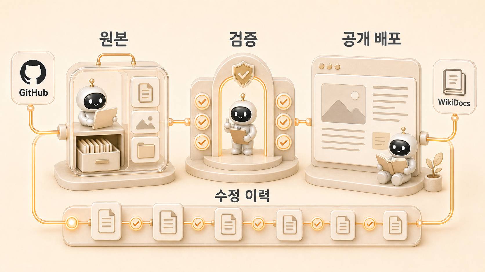

## GitHub와 WikiDocs로 콘텐츠를 발행하고 고치는 흐름

에르메스 에이전트(Hermes Agent) 업무 자동화에서 GitHub와 [WikiDocs](https://wikidocs.net/345908)를 나누는 이유는 원본과 공개 배포 채널을 분리하기 위해서다. `GitHub WikiDocs 연동`이나 `WikiDocs 발행 자동화`를 찾는 독자에게 핵심은 연결 자체보다 원본 관리와 공개 검증을 나누는 기준이다. GitHub는 책 원고의 원본 기준이고, WikiDocs는 독자가 보는 공개 화면이다. 뽀동이가 원고를 고치고 검증을 통과시키면, GitHub 변경이 WikiDocs 발행 흐름으로 이어진다.



이 구조를 쓰는 이유는 단순하다. 공유할 글은 한 번 쓰고 끝나지 않는다. 제목, TOC, 이미지, SEO/GEO, 전자책 규칙, 본문 링크가 계속 바뀐다. 이력과 기준이 남아야 안전하게 고칠 수 있다. 그래서 GitHub/WikiDocs 발행은 7장의 [WikiDocs를 먼저 쓰는 콘텐츠 시스템](https://wikidocs.net/345908)을 운영으로 고정하는 단계다.

## 이 사례에서 가져갈 운영 규칙

GitHub/WikiDocs 발행 사례의 핵심 규칙은 “파일을 고쳤다”와 “독자가 보는 공개 화면이 바뀌었다”를 분리해서 확인하는 것이다. 처음에는 GitHub에 커밋하고 push하면 일이 끝난 것처럼 보인다. 하지만 WikiDocs 동기화가 늦거나, TOC 제목과 본문 제목이 어긋나거나, 이미지 상대 경로가 공개 화면에서 깨지는 일이 생길 수 있다.

그래서 발행 작업은 `수정 → 형식 검증 → GitHub 원격 반영 → WikiDocs TOC 확인 → 대표 페이지 확인 → 짧은 완료 보고`까지를 한 묶음으로 다룬다. 독자가 따라 할 때도 원고 품질과 공개 반영 검증을 같은 체크리스트 안에 넣어야 한다.

| 처음에 흔히 막히는 지점 | 운영 규칙 | 따라 하는 방법 |
|---|---|---|
| GitHub에는 반영됐지만 WikiDocs가 stale하다 | 공개 화면을 별도로 확인한다 | TOC와 수정 page ID를 다시 조회한다 |
| 제목/TOC/본문이 따로 움직인다 | TOC와 페이지 H2를 함께 고친다 | 제목 변경 시 `TOC.md`와 해당 page 첫 제목을 동시에 확인한다 |
| 이미지나 링크가 로컬에서는 되지만 공개본에서 깨진다 | 발행 전후 검증을 분리한다 | 경로 존재, 이미지 간격, WikiDocs 페이지 표시를 모두 본다 |

## 프로젝트: GitHub 원본에서 WikiDocs 공개본까지

Hermes Agent로 WikiDocs 책을 수정할 때는 원고 확인, 형식 검증, 원격 반영, 공개 화면 확인이 한 흐름으로 이어져야 한다. 독자가 그대로 따라 할 수 있게 “수정 → 검증 → 원격 반영 → 공개 확인” 순서로 본다.

## 목표

- GitHub를 책 원고의 원본 기준으로 유지한다.
- WikiDocs는 공개 배포 채널로 둔다.
- TOC, 본문, 이미지, 본문 링크를 함께 검증한다.
- 공개 화면에서 실제로 링크와 이미지가 동작하는지 확인한다.
- 수정 이력과 판단 기준을 남긴다.

## 사전 준비

| 준비 항목 | 설명 |
|---|---|
| GitHub 저장소 | README, TOC, pages, assets 구조가 있어야 한다 |
| WikiDocs GitHub 연동 | WikiDocs 책이 GitHub 저장소와 연결되어 있어야 한다 |
| 발행 기준 | H1 금지, 이미지 경로, 링크 규칙, 불필요한 구분 문자 금지 등 책 규칙을 정한다 |
| 검증 스크립트 | 발행 전 자동으로 확인할 항목을 준비한다 |
| 역할 기준 | 뽀동이가 원고/구조/문체를 보고, 실행형이 명령과 상태를 확인한다 |

## 수정 요청을 발행 작업으로 바꾸는 흐름

사용자가 특정 장이나 페이지 수정을 요청하면 뽀동이는 해당 장의 TOC와 본문을 확인하고, 현재 원고, 원본 자료, 이전 결정 기록, 공개 화면에서 근거를 찾은 뒤 책형 구조로 다시 쓴다. 그다음 전자책/WikiDocs 규칙을 검증하고, 통과한 변경만 발행한다. WikiDocs 화면은 GitHub에 연결된 공개 배포 결과다.

이때 WikiDocs에서 바로 수정하는 것보다 GitHub에서 수정하는 편이 좋다. [원본 기준](https://wikidocs.net/345902)이 하나로 남기 때문이다.

## 발행 흐름

```text
1. TOC에서 대상 장/페이지를 확인한다.
2. 현재 원고와 관련 자료를 읽는다.
3. 독자 문제, 제목, 본문 구조, FAQ, 다음 링크를 보강한다.
4. 이미지가 필요하면 assets 경로와 Markdown 상대 경로를 함께 정리한다.
5. 본문 링크가 WikiDocs 공개 URL로 연결되는지 확인한다.
6. 전자책/WikiDocs 형식 검증을 실행한다.
7. GitHub 원본에 변경을 반영한다.
8. WikiDocs 동기화 후 공개 페이지를 부분 확인한다.
9. Slack에는 완료/남음/다음 중심으로 짧게 보고한다.
```

## 발행 전 확인할 것

| 영역 | 확인 항목 |
|---|---|
| TOC | 링크가 존재하고 제목 흐름이 자연스러운가 |
| 본문 | 첫 답변, 판단 기준, FAQ, 다음 링크가 있는가 |
| 링크 | 본문 링크가 WikiDocs page ID URL인가 |
| 이미지 | 상대 경로가 존재하고 위아래 빈 줄이 있는가 |
| 형식 | pages 본문에 H1이 없는가 |
| 문체 | 어색한 번역투, 불필요한 구분 문자, 블로그용 틀이 남지 않았는가 |
| 안전 | 드러내면 안 되는 세부값과 읽는 사람이 볼 필요 없는 운영 흔적이 제거되었는가 |
| Git | 원본 반영 후 로컬과 원격 상태가 맞는가 |
| 공개 화면 | WikiDocs에서 최신 문장, 이미지, 링크가 보이는가 |

## 검증 스크립트 예시

아래 검증은 기본적인 전자책/WikiDocs 형식 문제를 찾는다.

```bash
python - <<'PY'
from pathlib import Path
import re, json
root = Path('.')
report = {
    'h1_pages': [],
    'bad_heading_spacing': [],
    'bad_image_spacing': [],
    'hr_lines': [],
    'missing_toc_links': [],
    'missing_images': [],
    'middle_dot': [],
}

for p in sorted((root / 'pages').glob('*.md')):
    lines = p.read_text(encoding='utf-8').splitlines()
    for idx, line in enumerate(lines, start=1):
        if re.match(r'^#\\s+', line):
            report['h1_pages'].append([str(p), idx, line])
        if re.match(r'^\\s*-{4,}\\s*$', line):
            report['hr_lines'].append([str(p), idx])
        if chr(0x00B7) in line:
            report['middle_dot'].append([str(p), idx])
        if re.match(r'^#{2,6}\\s+', line):
            if idx > 1 and lines[idx-2] != '':
                report['bad_heading_spacing'].append([str(p), idx, 'before'])
            if idx < len(lines) and lines[idx] != '':
                report['bad_heading_spacing'].append([str(p), idx, 'after'])
        if re.match(r'^\\s*!\\[[^\\]]*\\]\\([^)]+\\)\\s*$', line):
            if idx > 1 and lines[idx-2] != '':
                report['bad_image_spacing'].append([str(p), idx, 'before'])
            if idx < len(lines) and lines[idx] != '':
                report['bad_image_spacing'].append([str(p), idx, 'after'])

links = re.findall(r'\\]\\(([^)]+)\\)', (root / 'TOC.md').read_text(encoding='utf-8'))
report['missing_toc_links'] = [l for l in links if not (root / l).exists()]

for p in sorted((root / 'pages').glob('*.md')):
    for img in re.findall(r'!\\[[^\\]]*\\]\\(([^)]+)\\)', p.read_text(encoding='utf-8')):
        if not img.startswith('http') and not (p.parent / img).resolve().exists():
            report['missing_images'].append([str(p), img])

print(json.dumps({k: len(v) for k, v in report.items()}, ensure_ascii=False, indent=2))
PY
```

검증 수치가 0이 아니면 원본 반영 전에 고친다. 특히 H1, 이미지 경로, TOC 누락, 불필요한 구분 문자는 WikiDocs 책 품질에 바로 영향을 준다.

## 수정 기준

GitHub/WikiDocs 발행에서 중요한 것은 “지금 보이는 화면”보다 “어느 원본을 고쳤는가”다. 본문 링크가 WikiDocs에서 안 먹는 문제도 이 기준으로 해결했다. GitHub 원고의 `.md` 링크는 저장소 안에서는 자연스럽지만, WikiDocs 공개 화면에서는 page ID URL이 필요했다. 그래서 TOC는 GitHub 구조를 유지하고, 본문 링크는 WikiDocs URL로 바꿨다.

이런 판단은 단순 기술 수정이 아니라 발행 구조의 기준이다. 독자가 보는 공개 화면과 작성자가 관리하는 원본 구조가 다를 수 있기 때문이다.

## 문제 해결

### WikiDocs 화면에 최신 내용이 안 보일 때

GitHub 원본 반영 직후에는 WikiDocs 동기화가 조금 늦을 수 있다. 잠시 기다린 뒤 공개 페이지를 다시 확인한다. 계속 반영되지 않으면 WikiDocs GitHub 설정에서 수동 동기화를 확인한다.

### GitHub에서는 링크가 되는데 WikiDocs에서는 안 될 때

본문 링크가 로컬 `.md` 경로일 가능성이 있다. WikiDocs 공개 화면에서는 page ID URL을 쓰는 편이 안전하다. 단, TOC는 GitHub 파일 경로를 유지한다.

### 이미지가 깨질 때

이미지 파일이 실제로 `assets/`에 있는지, 페이지 기준 상대 경로가 맞는지 확인한다. `pages/` 아래 문서에서는 보통 `../assets/...`가 된다.

### 원고는 좋아 보이는데 책 흐름이 어색할 때

해당 페이지 앞뒤 링크를 확인한다. WikiDocs는 단일 글이 아니라 책이므로 다음 링크와 본문 내 contextual link가 중요하다.

## 판단 기준

1. GitHub를 원본으로 둔다.
2. WikiDocs는 공개 배포 채널로 본다.
3. 큰 수정 전에는 TOC와 원본 자료 목록을 확인한다.
4. 본문 링크는 공개 화면에서 동작하는지 본다.
5. 검증 스크립트가 통과하기 전에는 발행하지 않는다.
6. 발행 후 원본과 공개 반영 상태를 확인한다.
7. WikiDocs sync가 늦으면 수동 동기화 가능성을 안내한다.

## FAQ

### WikiDocs에서 바로 수정하면 안 되나요?

GitHub 연동 책에서는 GitHub가 원본이다. WikiDocs 화면에서 바로 고치면 원본과 공개본이 갈라질 수 있다. 수정은 GitHub에서 하고 WikiDocs는 배포 결과로 보는 것이 안전하다.

### 글 하나만 바꿔도 원본 자료 목록을 수정해야 하나요?

항상은 아니다. 하지만 새 운영 케이스가 추가되거나 공식 문서 매핑이 바뀌거나 장의 역할이 달라지면 원본 자료 목록과 책 구조 기준도 함께 봐야 한다.
