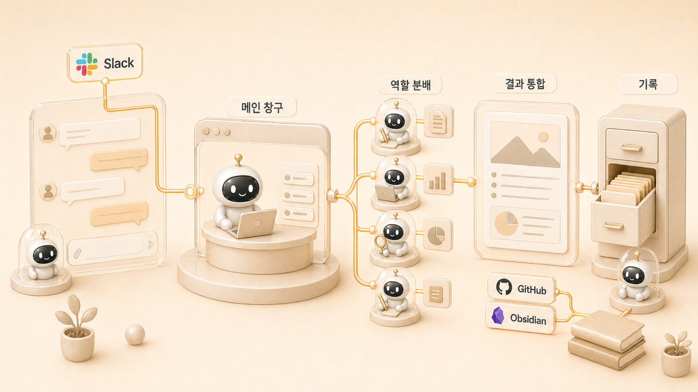

## Slack 스레드에서 하비가 일을 분배하는 방식

Slack 스레드는 에르메스 에이전트(Hermes Agent) 업무 자동화에서 실제 요청이 시작되는 입구다. 사용자는 한 줄로 요청하고, 하비는 그 요청을 바로 처리할지, 방울이/뽀동이/하망이/봉구 같은 역할형 에이전트에게 나눌지 판단한다.



이 케이스의 핵심은 멀티봇이 동시에 말하게 만드는 것이 아니다. 하비를 [AI 개인비서 메인 창구](https://wikidocs.net/345892)로 두고, 필요한 역할만 불러서 결과를 다시 하나로 묶는 것이다. Slack은 빠른 대화 공간이지만, 기준 없이 쓰면 작업 지시, 조사 결과, 실행 보고, 사람 대화가 한곳에 섞인다.

## 프로젝트: Slack 요청을 역할형 에이전트 작업으로 바꾸기

이 프로젝트에서는 Slack 한 줄 요청을 하비가 해석하고, 필요한 경우 방울이/뽀동이/하망이/실행형 에이전트에게 나눠 처리한 뒤, 최종 결과를 다시 짧게 묶어 보고하는 흐름을 만든다.

## 목표

- Slack 요청을 목적/역할/결과물로 나눈다.
- 한 스레드에서 여러 봇이 동시에 말하는 문제를 줄인다.
- 조사, 문서화, 이미지 제작, 실행을 필요한 역할에게만 넘긴다.
- 결과를 Slack 대화에만 남기지 않고 문서/원본/체크리스트로 이동시킨다.
- 완료 보고는 짧고 검증 중심으로 한다.

## 사전 준비

| 준비 항목 | 설명 |
|---|---|
| 메인 창구 | 하비처럼 요청을 먼저 해석할 에이전트를 정한다 |
| 호출 규칙 | 보조 에이전트가 언제 응답하고 언제 침묵할지 정한다 |
| 역할 기준 | 방울이/뽀동이/하망이/실행형이 맡을 일을 구분한다 |
| 결과 위치 | Slack 이후 결과가 GitHub/WikiDocs/shared-memory/이슈 중 어디로 갈지 정한다 |
| 보고 형식 | 완료/남음/다음 중심의 짧은 보고 기준을 정한다 |

## 좋은 Slack 운영 흐름

```text
사용자: 하비야, 이 주제 콘텐츠로 만들 수 있을지 봐줘.

하비:
- 목적: 콘텐츠 후보 판단
- 필요한 역할: 방울이 확장조사, 뽀동이 WikiDocs 구조화
- 결과물: 공유할 수 있는 운영 케이스 초안과 다음 액션

방울이:
공식 문서/사례/반례를 조사하고 handoff를 만든다.

뽀동이:
독자 문제, 제목, 본문 구조, FAQ, 다음 링크로 바꾼다.

하비:
최종 방향, 검증 결과, 남은 일을 묶어 보고한다.
```

이 흐름에서 Slack은 작업의 시작점이지만 최종 저장소는 아니다. 반복 가능한 기준은 WikiDocs나 skill, 체크리스트로 이동해야 한다.

## 하비가 판단하는 기준

| 요청 성격 | 하비의 판단 | 넘길 역할 |
|---|---|---|
| 빠른 답변/방향 판단 | 직접 답한다 | 없음 |
| 근거가 필요한 주제 | 확장조사를 시킨다 | 방울이 |
| 문서/보고/책형 구조 | 정리와 원고화를 맡긴다 | 뽀동이 |
| 이미지/썸네일/시각 자료 | 이미지 방향과 제작을 맡긴다 | 하망이 |
| 명령 실행/검증/배포 | 실행 범위를 확인한다 | 실행형 에이전트 |
| 기능/제품 설계 | 요구사항으로 정리한다 | 비벙이 |

## 요청을 분해하는 실제 패턴

WikiDocs 작업 스레드에서 사용자는 한 번에 여러 요구를 말할 수 있다.

```text
이 장은 실제 내용이 부족한 것 같아.
다른 WikiDocs 사례처럼 더 상세하고 따라 할 수 있게 보완해줘.
```

이 요청은 단순히 “문장 늘리기”가 아니다. 하비나 뽀동이는 아래처럼 나눠야 한다.

| 분해 항목 | 실제 작업 |
|---|---|
| 범위 확인 | TOC에서 11장과 하위 페이지를 찾는다 |
| 기준 파악 | 사용자가 준 참고 사례의 구조를 읽는다 |
| 콘텐츠 보강 | 목표/사전 준비/설정 단계/예시/문제 해결을 추가한다 |
| 검증 | H1, 이미지 경로, 링크, 불필요한 구분 문자, 문체를 확인한다 |
| 발행 | GitHub 원본에 반영하고 WikiDocs 공개 반영을 확인한다 |
| 보고 | 완료/남음/다음 중심으로 짧게 알린다 |

이렇게 분해하면 Slack 스레드는 단순 대화가 아니라 작업 라우터가 된다.

## 좋은 스레드와 나쁜 스레드

| 구분 | 좋은 스레드 | 나쁜 스레드 |
|---|---|---|
| 창구 | 하비가 창구를 잡는다 | 여러 봇이 동시에 답한다 |
| 역할 | 필요한 역할만 부른다 | 모든 봇이 의견을 낸다 |
| 상태 | 완료/남음/다음이 보인다 | 긴 대화만 남는다 |
| 기록 | 결과가 GitHub/WikiDocs/shared-memory로 이동한다 | Slack 안에만 남는다 |
| 후속 | 체크리스트나 skill 후보가 보인다 | 다음에 같은 일을 다시 설명한다 |

이 케이스는 [운영 FAQ와 멀티봇 실패 패턴](https://wikidocs.net/345916), [역할형 에이전트 분리](https://wikidocs.net/345925), [콘텐츠 시스템](https://wikidocs.net/345911)을 실제 Slack 요청에 적용한 예다. 따라서 Slack 메시지 자체보다 요청을 어떤 역할과 저장 위치로 옮겼는지가 더 중요하다.

## 멀티봇 스레드 규칙

Slack에서 여러 에이전트를 함께 운영하면 “누가 답해야 하는가”가 중요하다. 호출 규칙이 없으면 같은 스레드에서 여러 봇이 동시에 답하고, 사람은 오히려 더 피곤해진다.

| 상황 | 권장 행동 |
|---|---|
| 하비만 불렸다 | 하비가 답하고 필요하면 역할을 나눈다 |
| 뽀동이가 직접 불렸다 | 문서/정리/작성 범위에서 뽀동이가 답한다 |
| 방울이가 직접 불렸다 | 조사/근거수집 범위에서 방울이가 답한다 |
| 사람 대화가 끼었다 | 직접 호출되기 전까지 보조 에이전트는 침묵한다 |
| 여러 봇이 함께 있을 수 있다 | 이름이 불린 에이전트만 응답한다 |

이 규칙은 차가워 보이지만 실제로는 협업 품질을 높인다. 에이전트가 많이 말하는 것보다 필요한 순간에 정확히 말하는 것이 중요하다.

## 하비의 완료 보고 예시

Slack 보고는 길게 쓰지 않는다. 작업을 한 뒤에는 상태가 보이면 된다.

```text
완료: 11장 하위 페이지를 실습형 사례 구조로 보강했고, 목표/사전 준비/설정 단계/문제 해결을 추가했어요.
남음: WikiDocs 동기화 후 공개 화면 spot-check 필요.
다음: 11-2 cron 사례를 기준 템플릿으로 삼아 다른 자동화 사례도 같은 깊이로 맞추면 좋아요.
```

보고가 길어야 전문적인 것이 아니다. Slack에서는 짧게, 원본 문서는 자세히가 기본이다.

## 문제 해결

### 여러 에이전트가 동시에 답할 때

메인 창구를 다시 지정한다. “하비가 최종 창구를 잡고, 보조 에이전트는 호출될 때만 답한다”는 규칙을 세운다.

### Slack에만 정보가 쌓일 때

반복 가능한 기준이 생긴 메시지는 WikiDocs, shared-memory, skill, 이슈 중 하나로 이동시킨다. Slack은 흐름의 시작점이지 장기 보관소가 아니다.

### 사용자가 한 번에 여러 요구를 말할 때

요구를 목적/자료/출력/검증/발행으로 나눈다. 바로 답부터 쓰면 일부 요구가 빠진다.

## 판단 기준

- Slack 요청은 먼저 목적/역할/결과물로 나눈다.
- 메인 창구를 정하지 않은 채 여러 봇을 부르지 않는다.
- 보조 에이전트는 필요한 경우에만 명시 호출한다.
- 중간 결과는 Slack에 길게 쌓지 말고 문서나 GitHub로 옮긴다.
- 완료 보고는 짧게, 검증 결과와 다음 액션 중심으로 한다.

## FAQ

### 모든 Slack 스레드를 WikiDocs로 바꿔야 하나요?

아니다. 반복 가능한 판단 기준이 생긴 스레드만 WikiDocs 후보가 된다. 단순 질문이나 일회성 보고는 Slack에 남겨도 된다.

### 하비 없이 보조 에이전트에게 바로 시켜도 되나요?

역할이 분명하면 가능하다. 하지만 여러 역할이 섞인 요청은 하비가 먼저 분해하는 편이 안전하다.
