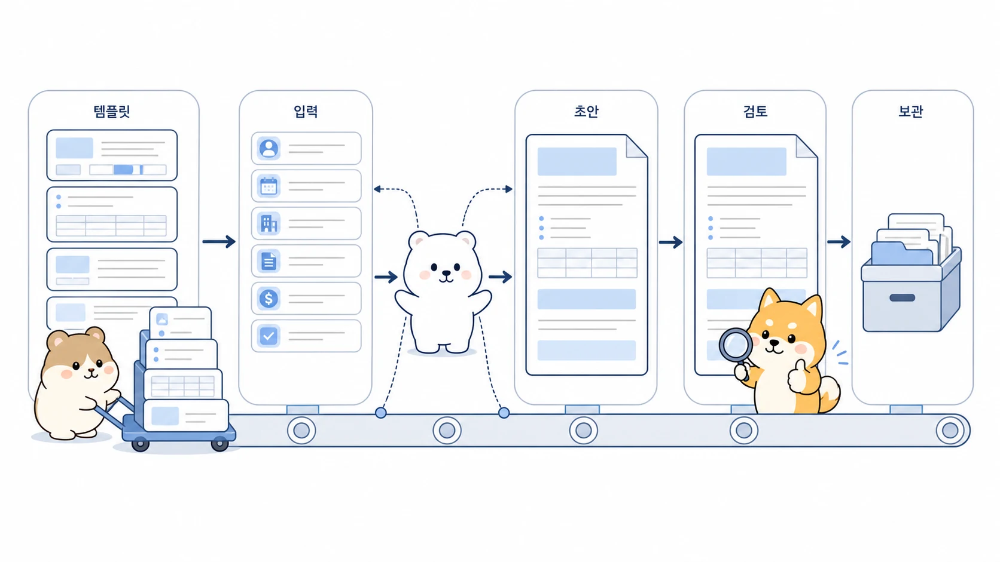

## 반복 문서 제작은 AI 에이전트로 어떻게 줄일까

반복 문서 제작은 많은 팀에서 조용히 시간을 잡아먹는 업무다. 수료증, 참석확인증, 명찰, 안내 카드, 고객별 리포트, 초대장처럼 형식은 거의 같은데 이름, 팀, 날짜, 항목만 달라지는 자료가 대표적이다. 에르메스 에이전트(Hermes Agent)를 쓰면 이런 일을 “한 장씩 만들기”가 아니라 `템플릿 확정 → 데이터 적용 → 일괄 생성 → 검수 → 압축 전달` 흐름으로 바꿀 수 있다.



이 사례에서는 교육 수료증을 예로 들지만, 핵심은 수료증이 아니다. 중요한 것은 Slack 요청 하나에서 시작해 이미지형 에이전트가 샘플을 만들고, 사람 피드백으로 템플릿을 고친 뒤, 참석자 목록 전체에 적용하고, 누락 없이 PNG와 ZIP으로 전달했다는 점이다. 즉, AI 업무 자동화는 거창한 시스템 구축만이 아니라 반복 산출물의 품질과 속도를 함께 줄이는 운영 방식이다.

[TOC]

## 이 사례에서 가져갈 운영 규칙

반복 문서 제작 사례의 핵심 규칙은 “처음부터 전체를 만들지 말고, 샘플 한 장으로 기준을 확정한 뒤 일괄 생성한다”는 것이다. 처음 요청을 받자마자 45장 전체를 만들면 디자인이 마음에 들지 않거나 발급기관 문구가 틀렸을 때 모두 다시 만들어야 한다. 사람은 결과물을 보고 나서야 “마크가 이상하다”, “기관명은 이렇게 줄이자” 같은 피드백을 줄 수 있다.

그래서 이 흐름은 전체 자동화 전에 짧은 피드백 루프를 둔다. 샘플을 만들고, 어색한 장식을 제거하고, 문구를 확정하고, 그다음 명단 전체에 적용한다. 마지막에는 만든 개수와 원래 인원 수가 맞는지, 파일명과 이미지 크기가 일정한지, 핵심 문구가 빠지지 않았는지 확인한다.

| 처음에 흔히 막히는 지점 | 운영 규칙 | 따라 하는 방법 |
|---|---|---|
| 처음부터 전체 파일을 만든다 | 샘플 1장으로 템플릿을 먼저 확정한다 | 디자인, 문구, 로고/마크, 여백을 한 장에서 피드백받는다 |
| 이름과 팀이 많아 누락이 생긴다 | 명단을 표 데이터로 분리한다 | `team,name` 같은 고정 컬럼으로 입력을 받는다 |
| 만들었다는 보고만 있고 검수가 없다 | 생성 개수와 원본 인원 수를 대조한다 | PNG 개수, ZIP 포함 수, 파일명, 문구, 해상도를 확인한다 |

## 시작 상황

요청은 Slack 스레드에서 시작됐다. 사용자는 참고 이미지와 함께 다음 조건을 말했다.

```text
교육명: NAVER 4주 AX - 클로드코드 교육
완료율: 100%
발행일: 4월 29일
발급기관: 퇴근후 AI
표시 정보: 팀 / 이름
결과물: 참석자별 PNG, 최종 ZIP
```

이 요청을 단순히 “수료증 만들어줘”로 처리하면 디자인 작업처럼 보인다. 하지만 실제로는 세 가지 일이 섞여 있었다.

1. 참고 이미지 느낌을 반영한 템플릿 설계
2. 사람 피드백을 받아 문구와 장식 수정
3. 참석자 45명 전체에 같은 기준을 적용하고 검수

따라서 이 작업은 이미지 제작형 에이전트만의 일이 아니라, 반복 산출물 자동화 흐름으로 봐야 한다.

## 목표

- 반복 문서 제작을 한 장씩 수작업하지 않는다.
- 사람 피드백이 필요한 디자인 판단은 샘플 단계에서 끝낸다.
- 명단 데이터와 템플릿을 분리한다.
- 전체 생성 후 누락, 오타, 개수, 파일 크기, 문구를 검수한다.
- 최종 결과물을 바로 전달 가능한 ZIP으로 묶는다.

## 사전 준비

| 준비 항목 | 설명 |
|---|---|
| 고정 문구 | 교육명, 발행일, 기관명, 완료율처럼 모든 파일에 공통으로 들어갈 정보 |
| 개인별 데이터 | 이름, 팀, 부서, 회사명, 개인별 점수처럼 파일마다 달라지는 정보 |
| 샘플 기준 | 참고 이미지, 색상, 여백, 로고/마크 사용 여부, 공식/캐주얼 톤 |
| 출력 형식 | PNG, PDF, ZIP, 파일명 규칙, 해상도 |
| 검수 기준 | 총 인원 수, 파일 개수, 문구 정확성, 잘림, 겹침, 누락 여부 |

반복 문서 제작에서 가장 중요한 준비물은 “예쁜 디자인 설명”보다 정확한 데이터다. 명단이 모호하면 에이전트가 아무리 빠르게 만들어도 누락 검증을 할 수 없다.

## 운영 흐름

```text
1. Slack에서 만들 자료의 목적, 고정 문구, 출력 형식을 받는다.
2. 참고 이미지나 원하는 톤을 바탕으로 샘플 1장을 만든다.
3. 사람 피드백을 받아 어색한 마크, 기관명, 여백, 문구를 수정한다.
4. 확정된 템플릿에 개인별 명단 데이터를 연결한다.
5. 전체 인원 수만큼 PNG를 일괄 생성한다.
6. 생성된 파일 개수와 명단 수를 대조한다.
7. 샘플 이미지를 열어 이름/팀/문구/잘림/겹침을 확인한다.
8. 전체 PNG를 ZIP으로 묶고 최종 경로와 QA 결과를 보고한다.
```

이 흐름에서 자동화의 핵심은 “45장을 빠르게 만들었다”가 아니다. 사람이 판단해야 하는 디자인 피드백과 기계가 잘하는 반복 생성을 분리했다는 점이다.

## 요청 문장 예시

처음부터 아래처럼 요청하면 에이전트가 작업을 더 안전하게 나눌 수 있다.

```text
하망아, 같은 형식의 개인별 PNG 자료를 만들어줘.

공통 문구:
- 제목: NAVER 4주 AX - 클로드코드 교육
- 완료율: 100%
- 발행일: 4월 29일
- 발급기관: 퇴근후 AI

개인별 표시:
- 팀
- 이름

진행 방식:
1. 먼저 샘플 1장만 만들어줘.
2. 내가 디자인과 문구를 확인하면 그다음 전체 명단에 적용해줘.
3. 최종 결과는 PNG 전체와 ZIP으로 묶어줘.
4. 총 인원 수와 생성 파일 수가 맞는지 QA해서 보고해줘.
```

## 명단 데이터 형식

명단은 가능한 한 표 형태로 받는다. 사람이 보기에 편한 문장 목록보다 에이전트가 검수하기 좋은 구조가 안전하다.

```csv
team,name
AI전환추진팀,홍길동
브랜드전략팀,김네이버
데이터플랫폼팀,이서치
```

팀명이 길거나 이름에 특수문자가 들어갈 수 있다면 파일명 규칙도 따로 정한다. 예를 들어 `certificate_팀_이름.png`처럼 만들되, 파일명에 쓸 수 없는 문자는 제거하거나 `_`로 바꾸는 규칙을 둔다.

## QA 체크리스트

| 검수 항목 | 확인 질문 |
|---|---|
| 총 개수 | 원본 명단 수와 생성된 PNG 수가 같은가 |
| ZIP 포함 | ZIP 안의 파일 수가 PNG 수와 같은가 |
| 공통 문구 | 교육명, 발행일, 발급기관, 완료율이 모두 정확한가 |
| 개인 정보 | 이름과 팀이 서로 밀리거나 누락되지 않았는가 |
| 레이아웃 | 긴 팀명이나 이름에서도 글자가 잘리지 않는가 |
| 파일명 | 파일명이 중복되지 않고 찾기 쉬운가 |
| 해상도 | 모든 파일의 크기와 비율이 일정한가 |
| 샘플 확인 | 몇 장을 실제로 열어 텍스트 겹침과 잘림을 확인했는가 |

QA 보고는 길 필요가 없다. 중요한 것은 사람이 다시 열어보지 않아도 위험 지점을 알 수 있게 쓰는 것이다.

```text
완료: 개인별 PNG 45장 생성, ZIP으로 묶음.
검증: 명단 45명 / PNG 45개 / ZIP 포함 45개 대조 완료.
확인: 발급기관 문구, 교육명, 해상도, 샘플 이미지 잘림 없음.
```

## 좋은 예와 나쁜 예

| 구분 | 나쁜 예 | 좋은 예 |
|---|---|---|
| 시작 방식 | “전체 45장 만들어줘” | “샘플 1장 만든 뒤 확인받고 전체 생성해줘” |
| 데이터 입력 | Slack에 이름을 문장으로 나열 | `team,name` 컬럼이 있는 표나 CSV로 전달 |
| 피드백 처리 | 한 장 수정 후 나머지는 추측 | 템플릿을 수정하고 같은 기준으로 전체 재생성 |
| 완료 보고 | “다 만들었어요” | 총 인원 수, PNG 수, ZIP 수, QA 항목을 함께 보고 |
| 재사용 | 다음 행사 때 다시 처음부터 설명 | 템플릿/명단/QA 절차를 Skill 후보로 남김 |

## Skill 후보로 남길 기준

이런 작업이 한 번으로 끝나지 않는다면 Skill 후보가 된다. Skill에는 특정 참석자 명단을 저장하는 것이 아니라, 다음에 같은 종류의 자료를 만들 때 필요한 절차와 검수 기준을 남긴다.

```text
Skill 후보:
- 반복 문서 템플릿 제작 절차
- 샘플 확인 후 일괄 생성하는 순서
- CSV 명단 컬럼 규칙
- PNG/PDF 파일명 규칙
- ZIP 생성과 개수 대조 QA
- vision QA 또는 샘플 이미지 확인 기준
```

이 기준은 [반복 업무가 Skill이 되는 과정](https://wikidocs.net/346236)과 연결된다. 반복 산출물 제작은 결과물보다 절차가 중요하다. 절차가 고정되면 다음에는 더 짧은 요청으로도 같은 품질을 낼 수 있다.

## 어디까지 자동화할 수 있나

이 흐름은 수료증뿐 아니라 아래 작업에 그대로 적용할 수 있다.

| 작업 유형 | 달라지는 데이터 | 최종 산출물 |
|---|---|---|
| 참석확인증 | 이름, 소속, 행사명, 날짜 | 개인별 PNG/PDF |
| 명찰 | 이름, 팀, 직함, QR 코드 | 인쇄용 이미지/PDF |
| 고객별 리포트 표지 | 고객명, 기간, 담당자, 핵심 지표 | PDF 표지/보고서 묶음 |
| 초대장/안내 카드 | 이름, 행사명, 장소, 시간 | 모바일 공유용 이미지 |
| 교육 결과 카드 | 이름, 과정명, 완료율, 다음 안내 | 개인별 카드 이미지 |

공통점은 하나다. 형식은 같고 일부 값만 달라진다. 이런 일은 사람이 한 장씩 손보는 것보다 템플릿과 데이터로 분리하는 편이 안전하다.

## 문제 해결

### 샘플은 괜찮은데 전체 생성에서 글자가 잘릴 때

가장 긴 팀명과 가장 긴 이름을 기준으로 다시 샘플을 만든다. 평균 길이에 맞춘 디자인은 전체 명단에 적용하면 깨질 수 있다.

### 발급기관이나 날짜가 중간에 바뀌었을 때

완성 파일 일부만 고치지 말고 템플릿 값을 바꾼 뒤 전체를 다시 생성한다. 그래야 문구가 섞이지 않는다.

### 명단 수와 파일 수가 다를 때

ZIP을 만들기 전에 멈춘다. 중복 이름, 빈 줄, 잘못된 컬럼, 파일명 충돌을 먼저 확인해야 한다.

### 디자인 피드백이 계속 나올 때

전체 생성으로 넘어가지 않는다. 샘플 단계에서 마크, 여백, 기관명, 폰트 크기 같은 기준을 끝내야 한다. 자동화는 확정된 기준을 반복할 때 강하다.

## 판단 기준

- 같은 형식의 자료가 10개 이상 필요하면 템플릿과 데이터를 분리한다.
- 사람 피드백이 필요한 디자인 판단은 샘플 1장에서 끝낸다.
- 전체 생성 전에는 고정 문구와 개인별 컬럼을 확정한다.
- 완료 보고에는 생성 파일 수와 원본 데이터 수 대조가 반드시 들어간다.
- 반복될 가능성이 있으면 Skill 후보로 남긴다.
- Slack 스레드에서 끝내지 말고 템플릿, 명단 형식, QA 기준을 문서화한다.

## FAQ

### 이런 작업도 AI 업무 자동화라고 볼 수 있나요?

볼 수 있다. AI 업무 자동화는 거대한 사내 시스템을 만드는 일만 뜻하지 않는다. 사람이 반복해서 만들던 산출물을 템플릿, 데이터, 검수 기준으로 나눠 다시 실행 가능하게 만드는 것도 실무 자동화다.

### 처음부터 명단 전체를 주면 더 빠르지 않나요?

빠를 수는 있지만 안전하지 않다. 디자인이나 문구가 확정되지 않은 상태에서 전체 파일을 만들면 피드백 한 번에 모두 다시 만들어야 한다. 샘플 확인 후 전체 생성이 더 안정적이다.

### CSV가 꼭 필요한가요?

꼭 CSV일 필요는 없다. 다만 팀, 이름, 날짜처럼 반복 적용할 값은 표 형태가 좋다. 표가 있어야 누락, 중복, 파일명 충돌을 검수하기 쉽다.

### 결과물을 WikiDocs에 그대로 공개해도 되나요?

개인 이름과 조직 정보가 들어간 파일은 그대로 공개하지 않는다. 공개 사례로 남길 때는 실제 명단이나 파일이 아니라 업무 흐름, 판단 기준, QA 체크리스트만 남긴다.
