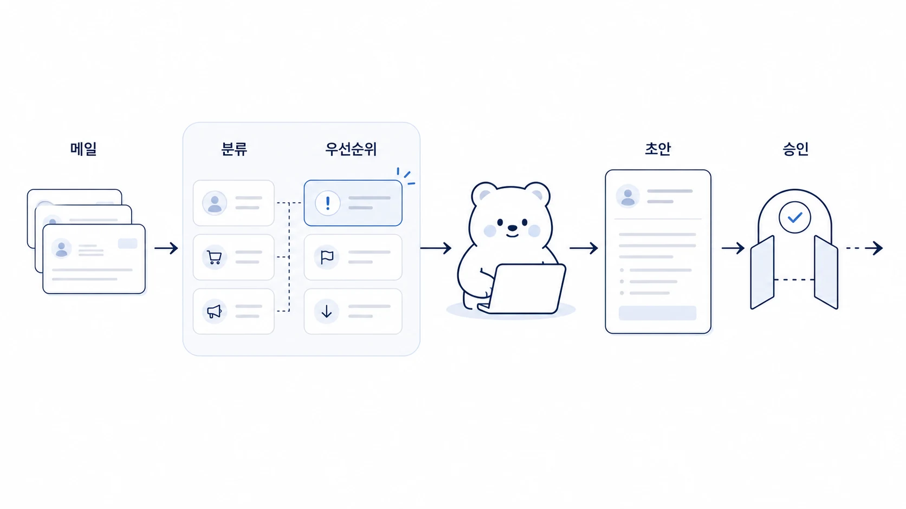

## 메일 정리와 답장 초안은 AI 개인비서에게 어떻게 맡길까

메일 자동화는 AI 개인비서가 가장 빨리 체감되는 업무다. 하지만 처음부터 “알아서 답장 보내줘”로 시작하면 위험하다. Hermes Agent로 메일 정리를 맡길 때 핵심은 자동 발송이 아니라 `분류 → 할 일 추출 → 답장 초안 → 사람 승인`의 순서를 만드는 것이다.



이 사례는 하비가 메일 처리 기준을 잡고, 방울이가 필요한 배경 정보를 확인하고, 뽀동이가 답장 초안을 읽기 좋은 문장으로 다듬는 흐름으로 보면 된다. 실행형 에이전트나 MCP 연동은 마지막 단계다. 먼저 어떤 메일을 어떻게 판단할지 기준부터 세워야 한다.

[TOC]

## 시작 상황

매일 아침 메일함에는 읽어야 할 메일, 나중에 봐도 되는 뉴스레터, 답장해야 할 요청, 일정으로 옮겨야 할 약속이 섞인다. 사람은 메일을 읽기 전에 이미 분류하는 데 에너지를 쓴다.

AI 개인비서에게 맡길 수 있는 첫 업무는 아래처럼 좁게 시작하는 것이 좋다.

| 메일 유형 | AI가 할 일 | 사람이 확인할 일 |
|---|---|---|
| 고객/파트너 요청 | 요약, 요청사항, 답장 초안 작성 | 약속/가격/기한/책임 범위 확인 |
| 내부 공유 | 핵심만 요약하고 보관 후보로 분류 | 실제 액션 여부 판단 |
| 일정 관련 메일 | 날짜/시간/참석자 추출 | 캘린더 등록 전 최종 확인 |
| 뉴스레터 | 주제별 요약, 읽을 가치 판단 | 저장/삭제/추가 조사 결정 |

## 맡긴 역할

| 역할 | 담당 |
|---|---|
| 하비 | 메일 처리 기준과 승인 흐름을 정한다 |
| 방울이 | 메일 내용에 필요한 배경 정보나 링크를 확인한다 |
| 뽀동이 | 답장 초안을 자연스러운 문장과 명확한 구조로 다듬는다 |
| 실행형 에이전트 | 승인된 초안을 저장하거나 발송 준비 상태로 만든다 |

## 막힌 지점

메일 자동화가 흔히 실패하는 이유는 도구 연결이 부족해서가 아니다. 기준이 없는 상태에서 메일함 전체를 맡기기 때문이다.

나쁜 요청은 이런 식이다.

```text
메일 좀 알아서 정리하고 답장 보내줘.
```

이 요청에는 중요도 기준, 답장 금지 조건, 사람 승인 단계, 보관 기준이 없다. AI가 그럴듯한 답장을 만들 수는 있지만, 책임을 져야 하는 약속까지 대신 판단하게 된다.

## 운영 규칙

메일 자동화는 아래 순서로만 확장한다.

1. 읽기 전용 요약부터 시작한다.
2. 중요/보류/참고/삭제 후보를 분류한다.
3. 답장 초안은 만들되 자동 발송하지 않는다.
4. 약속/비용/계약/민감한 정보가 들어가면 사람 확인을 필수로 둔다.
5. 반복되는 분류 기준만 Skill이나 체크리스트로 남긴다.

## 따라 하는 방법

처음에는 메일함 전체가 아니라 하루치 또는 특정 라벨만 대상으로 삼는다.

```text
하비야, 오늘 받은 메일 중 확인이 필요한 것만 정리해줘.

출력 형식:
1. 바로 답장할 메일
2. 일정/할 일로 바꿀 메일
3. 읽고 보관할 메일
4. 삭제 또는 무시해도 되는 후보

각 항목에는 보낸 사람, 핵심 요청, 필요한 액션, 답장 초안 여부를 표시해줘.
답장 초안은 작성하되 실제 발송은 하지 마.
```

## 샘플 산출물

아래처럼 나오면 독자가 바로 따라 할 수 있다. 실제 메일 원문을 공개 문서에 그대로 옮기지 말고, 구조만 익명화해서 남긴다.

| 분류 | 보낸 사람 | 핵심 요청 | 필요한 액션 | 승인 필요 |
|---|---|---|---|---|
| 바로 답장 | 파트너사 담당자 | 다음 주 미팅 가능 시간 확인 | 가능한 시간 2개 제안 | 낮음 |
| 일정 등록 | 고객사 PM | 데모 일정 조율 | 캘린더 초안 생성 | 중간 |
| 보류 | 뉴스레터 | 신규 AI 도구 소개 | 방울이 조사 후보로 보관 | 낮음 |
| 사람 확인 | 계약 관련 문의 | 견적/계약 조건 확인 | 로이드 확인 후 답장 | 높음 |

답장 초안은 아래 정도까지 만들고 멈춘다.

```text
안녕하세요, 확인 감사합니다.

다음 주 미팅은 아래 두 시간 중 하나로 가능할 것 같습니다.
- 화요일 오후 2시
- 수요일 오전 10시

괜찮으신 시간을 알려주시면 캘린더 초대를 보내드리겠습니다.

다만 계약 조건이나 견적 관련 내용은 내부 확인 후 별도로 안내드리겠습니다.
```

이 샘플의 핵심은 답장을 예쁘게 쓰는 것이 아니다. `일정 제안은 가능`, `계약 조건은 확인 필요`처럼 AI가 처리할 수 있는 부분과 사람이 승인해야 하는 부분이 분리되어 있다는 점이다.

## 처음 적용할 때의 30분 실습

1. 최근 24시간 메일 중 고객/파트너 메일만 고른다.
2. `바로 답장/일정 등록/보류/사람 확인` 네 칸으로 나눈다.
3. 바로 답장 가능한 메일 1개만 초안을 만든다.
4. 사람 확인이 필요한 표현에 `확인 필요`를 표시한다.
5. 발송하지 말고 초안 품질만 검토한다.

## 좋은 예와 나쁜 예

| 구분 | 예시 |
|---|---|
| 나쁜 예 | “중요한 메일 알아서 처리해줘” |
| 좋은 예 | “최근 24시간 메일 중 고객 요청만 골라 요청사항/기한/답장 초안/사람 확인 필요 여부로 정리해줘” |

## 체크리스트

- 전용 메일 계정이나 제한된 라벨부터 시작했는가?
- 자동 발송을 막고 초안 생성/사람 승인 단계를 뒀는가?
- 고객명, 계약 조건, 가격, 계정 정보 같은 보호해야 할 정보를 분리했는가?
- 답장 초안에 사실 확인이 필요한 문장을 표시했는가?
- 반복 기준을 Skill이나 운영 체크리스트로 남겼는가?

## 확장 아이디어

메일 정리가 안정되면 캘린더, 할 일 관리, 주간 리포트로 이어갈 수 있다. 예를 들어 일정 메일은 캘린더 초안으로 만들고, 고객 요청 메일은 CRM이나 Notion 기록으로 넘기고, 뉴스레터는 방울이의 주간 조사 후보로 보낼 수 있다.

중요한 것은 자동화 범위를 한 번에 넓히지 않는 것이다. 메일은 외부 사람과 직접 연결되는 채널이므로, Hermes Agent가 빠르게 도와주더라도 최종 책임 지점은 사람에게 남겨야 한다.
