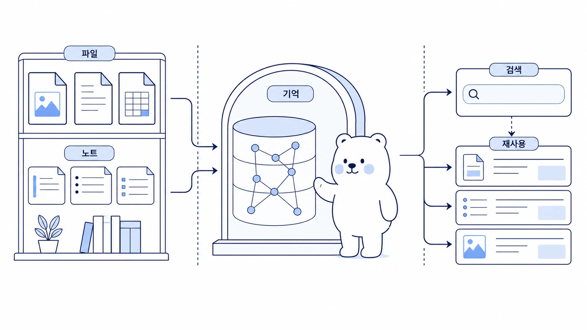

## 파일과 노트는 AI 팀의 장기 기억으로 어떻게 남길까

AI 팀 운영에서 기억은 “많이 저장하는 것”이 아니다. 어디에 무엇을 남길지 나누는 일이다. Slack 대화, 임시 메모, 조사 링크, WikiDocs 원고, Skill 절차, Obsidian 노트가 모두 같은 기억처럼 섞이면 나중에 다시 찾기 어렵다.



이 사례의 핵심은 파일과 노트를 장기 기억으로 남길 때 `memory`, `shared-memory`, `session search`, `Skill`, `Obsidian`, `GitHub 원본`의 역할을 구분하는 것이다.

[TOC]

## 시작 상황

AI와 일하다 보면 중요한 정보가 여러 곳에 흩어진다.

| 정보 유형 | 그대로 두면 생기는 문제 |
|---|---|
| Slack 요청 | 시간이 지나면 맥락을 찾기 어렵다 |
| 조사 링크 | 왜 저장했는지 사라진다 |
| 문서 초안 | 최신본과 폐기본이 섞인다 |
| 반복 절차 | 매번 같은 설명을 다시 하게 된다 |
| 개인 선호 | 에이전트마다 다르게 반영된다 |

장기 기억은 이 문제를 줄이기 위한 운영 장치다.

## 맡긴 역할

| 역할 | 담당 |
|---|---|
| 하비 | 무엇을 어디에 남길지 분류한다 |
| 방울이 | 조사 링크와 근거의 신뢰도를 확인한다 |
| 뽀동이 | 공유 가능한 문서/노트 형태로 정리한다 |
| 봉구 | 파일 이동, 저장, 커밋, 링크 검증을 실행한다 |

## 막힌 지점

기억 관리가 실패하는 이유는 저장을 안 해서가 아니라 너무 아무 데나 저장하기 때문이다. 예를 들어 일시적인 작업 진행 상황을 영구 memory에 넣으면 다음 세션에서 오래된 상태가 사실처럼 보일 수 있다. 반대로 반복 절차를 대화에만 남기면 다음에 같은 일을 또 설명해야 한다.

## 운영 규칙

정보는 아래 기준으로 나눈다.

| 남길 곳 | 적합한 정보 | 피해야 할 정보 |
|---|---|---|
| memory/profile | 오래 유지되는 사용자 선호, 안정적인 환경 사실 | 임시 작업 상태, 긴 로그 |
| session search | 과거 대화에서 다시 찾을 작업 맥락 | 영구 규칙처럼 써야 하는 절차 |
| Skill | 반복 실행 절차, 검증 명령, 실패 대응 | 한 번만 쓴 메모 |
| shared-memory | 팀 공통 규칙, 여러 에이전트가 함께 써야 할 기준 | 개인 취향, 민감한 세부정보 |
| Obsidian/HALOX Brain | 지식 자산, 기획 노트, 장기 아이디어 | 자동 실행에 필요한 비밀값 |
| GitHub/WikiDocs | 외부에 공유할 원고와 배포본 | 내부 토큰, 개인을 특정할 수 있는 정보 |

## 따라 하는 방법

```text
하비야, 이 대화에서 장기 기억으로 남길 것과 남기지 않을 것을 분류해줘.

분류 기준:
1. memory/profile에 남길 안정적인 선호
2. Skill로 만들어야 할 반복 절차
3. shared-memory에 둘 팀 공통 규칙
4. Obsidian 노트로 남길 지식 자산
5. WikiDocs에 맞게 일반화할 수 있는 문서 소재
6. 남기면 안 되는 임시 상태/보호해야 할 정보

각 항목마다 이유와 저장 위치를 함께 적어줘.
```

## 좋은 예와 나쁜 예

| 구분 | 예시 |
|---|---|
| 나쁜 예 | “오늘 WikiDocs 작업 중”을 memory에 저장한다 |
| 좋은 예 | “WikiDocs pages 본문에는 H1을 쓰지 않고 H2부터 쓴다”를 팀 규칙이나 Skill에 남긴다 |

## 체크리스트

- 이 정보가 다음 달에도 유효한가?
- 절차라면 memory가 아니라 Skill에 남겼는가?
- 작업 진행 상태라면 session search로 충분한가?
- 외부에 공유해도 되는 수준으로 일반화됐는가?
- 보호해야 할 정보가 포함되어 있지 않은가?
- 원본 위치와 공개 배포 위치가 구분되어 있는가?

## 확장 아이디어

파일과 노트 기억 관리가 안정되면 AI 팀은 더 빨라진다. 하비는 과거 대화를 session search로 찾고, 뽀동이는 WikiDocs 문체 기준을 Skill에서 꺼내고, 봉구는 검증 명령을 반복 실행할 수 있다. 중요한 것은 모든 것을 기억시키는 것이 아니라, 다시 쓸 수 있는 형태로 나누어 남기는 것이다.
