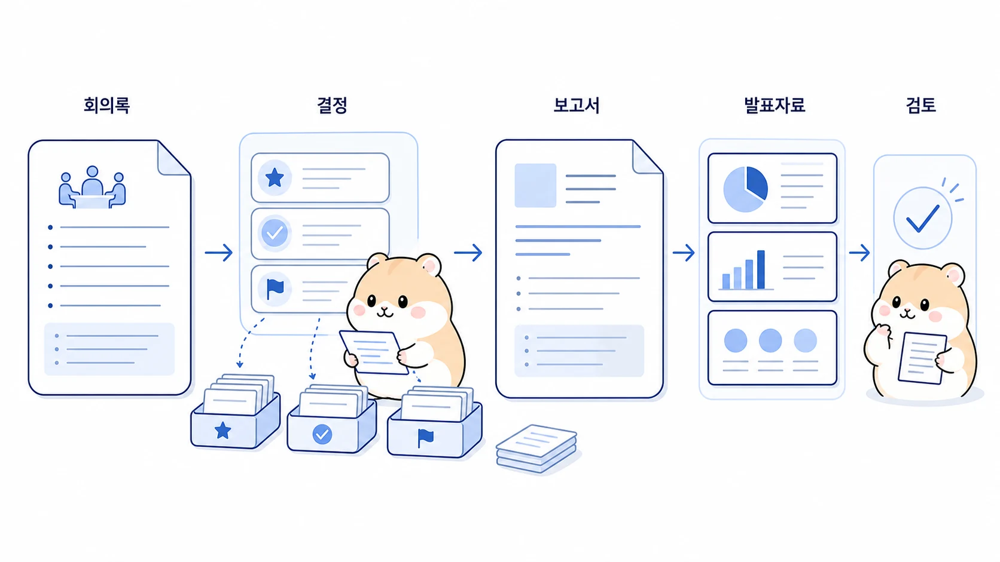

## 회의록은 보고서와 발표자료로 어떻게 바꿀까

회의록 자동화는 단순 요약으로 끝나면 효과가 작다. 회의에서 필요한 것은 “누가 무슨 말을 했는가”보다 “무엇이 결정됐고, 무엇이 아직 열려 있으며, 누가 다음에 무엇을 해야 하는가”다. Hermes Agent로 회의록을 다룰 때는 발언 기록을 보고서와 발표자료의 재료로 바꾸는 흐름을 만들어야 한다.



이 사례는 하비가 회의 목적을 잡고, 뽀동이가 문서 구조를 만들고, 비벙이가 제품/업무 요구사항을 정리하고, 봉구가 파일 생성과 검증을 이어받는 방식으로 이해하면 좋다.

[TOC]

## 시작 상황

회의가 끝나면 보통 긴 메모나 녹취 요약이 남는다. 하지만 그대로 공유하면 읽는 사람이 다시 해석해야 한다.

| 원본에 남는 것 | 실제로 필요한 것 |
|---|---|
| 발언 순서 | 결정 사항과 근거 |
| 긴 논의 | 쟁점과 선택지 |
| 흩어진 아이디어 | 실행 가능한 다음 액션 |
| 참석자 의견 | 합의된 방향과 보류된 질문 |

## 맡긴 역할

| 역할 | 담당 |
|---|---|
| 하비 | 회의 목적과 산출물 형식을 정한다 |
| 뽀동이 | 보고서/공유문/발표자료 흐름으로 재구성한다 |
| 비벙이 | 제품 요구사항, 범위, 검증 조건을 뽑는다 |
| 봉구 | 문서 파일이나 슬라이드 초안을 생성하고 검증한다 |

## 막힌 지점

회의록 자동화가 실패하는 이유는 요약을 너무 빨리 하기 때문이다. 발언을 짧게 줄이는 것과 의사결정 문서로 바꾸는 것은 다르다. 특히 반대 의견, 미정 사항, 담당자, 기한이 빠지면 보기 좋은 요약이지만 실제 업무에는 약한 문서가 된다.

## 운영 규칙

회의록은 아래 순서로 정리한다.

1. 회의 목적과 참석자를 먼저 확인한다.
2. 결정 사항, 미정 사항, 쟁점을 나눈다.
3. 액션 아이템에는 담당자와 기한을 붙인다.
4. 보고서용 문장과 발표자료용 슬라이드 구조를 분리한다.
5. 공개 가능한 내용과 내부 내용, 민감정보를 나눈다.
6. 다음 회의에서 확인할 질문을 남긴다.

## 따라 하는 방법

```text
뽀동아, 이 회의 메모를 보고서와 발표자료 초안으로 바꿔줘.

출력 형식:
1. 5줄 요약
2. 결정 사항
3. 아직 열린 쟁점
4. 액션 아이템: 담당자/기한/확인 방법
5. 보고서 본문 초안
6. 발표자료 5장 구성
7. 다음 회의에서 확인할 질문

주의:
발언록을 그대로 줄이지 말고 결정과 실행 기준 중심으로 정리해줘.
```

## 좋은 예와 나쁜 예

| 구분 | 예시 |
|---|---|
| 나쁜 예 | “회의 내용을 짧게 요약해줘” |
| 좋은 예 | “결정/미정/액션/리스크/다음 회의 질문으로 나누고, 보고서와 슬라이드 목차를 따로 만들어줘” |

## 체크리스트

- 결정 사항과 미정 사항이 분리되어 있는가?
- 액션 아이템에 담당자와 기한이 있는가?
- 제품 요구사항으로 넘길 항목이 따로 표시됐는가?
- 외부 공유 가능 내용과 내부 메모가 분리됐는가?
- 발표자료는 한 장에 한 메시지로 구성됐는가?

## 확장 아이디어

회의록 정리가 안정되면 Google Docs, Notion, Slack 보고, PowerPoint 초안으로 확장할 수 있다. 중요한 것은 도구 연결보다 회의록을 어떤 산출물로 바꿀지 먼저 정하는 것이다. 같은 원본도 임원 보고, 팀 공유, 제품 요구사항, 고객 제안서에 따라 구조가 달라진다.
