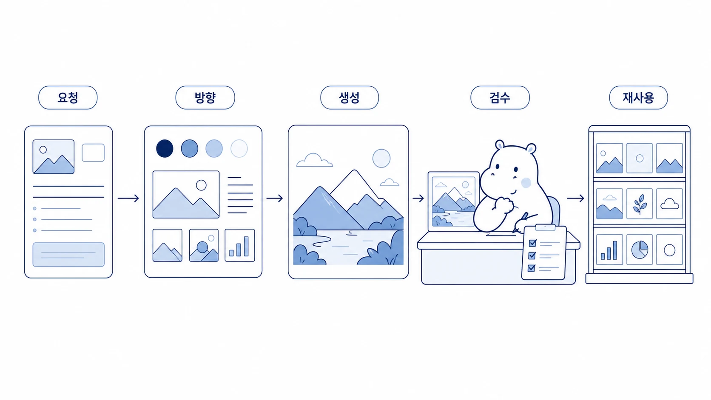

## 이미지 생성은 어떻게 요청/검수/재사용 흐름으로 만들까

이미지 생성은 프롬프트를 길게 쓰는 작업이 아니다. 어떤 메시지를 시각화할지 정하고, 생성 결과를 검수하고, 다시 쓸 수 있는 자산으로 남기는 작업이다. Hermes Agent에서 하망이 같은 이미지 제작형 에이전트를 둘 때 핵심은 “예쁜 이미지”가 아니라 문서와 캠페인에 맞는 이미지 운영 흐름이다.



이 사례는 WikiDocs 본문 이미지, 블로그 썸네일, 카드뉴스, 강의용 시각 자료를 만들 때 사용할 수 있다.

[TOC]

## 시작 상황

콘텐츠를 만들다 보면 이미지가 필요해지는 순간이 있다. 하지만 “AI 에이전트 느낌으로 멋지게”라고 요청하면 결과가 흔들린다. 필요한 것은 이미지 스타일보다 먼저 메시지와 사용처다.

| 확인할 것 | 예시 |
|---|---|
| 사용처 | WikiDocs 본문, 썸네일, 카드뉴스, 발표자료 |
| 핵심 메시지 | 역할형 AI 팀이 일을 나누는 구조 |
| 독자 행동 | 구조를 이해하고 자기 업무에 적용하기 |
| 금지 요소 | 과장된 로봇 이미지, 읽기 어려운 텍스트, 내부 민감정보 |

## 맡긴 역할

| 역할 | 담당 |
|---|---|
| 하비 | 이미지가 필요한지와 사용처를 판단한다 |
| 뽀동이 | 본문 메시지를 이미지 브리프로 압축한다 |
| 하망이 | 이미지 방향, 프롬프트, 생성 결과를 만든다 |
| 봉구 | 파일 저장, 경로 연결, 문서 반영을 실행한다 |
| 뽀동이 | 최종 이미지가 본문 메시지와 맞는지 검수한다 |

## 막힌 지점

이미지 생성이 흔들리는 이유는 프롬프트 품질만의 문제가 아니다. 본문 메시지가 정리되지 않은 상태에서 이미지를 만들기 때문이다. 이미지가 먼저 나오면 문서가 이미지에 끌려가고, 결과적으로 예쁘지만 설명력이 약한 자료가 된다.

## 운영 규칙

이미지 생성은 아래 순서로 진행한다.

1. 본문에서 이미지가 필요한 문단을 고른다.
2. 한 문장 메시지와 사용처를 정한다.
3. 스타일, 비율, 금지 요소를 적는다.
4. 이미지를 생성한다.
5. vision 검수로 텍스트 오류, 과장된 표현, 메시지 불일치를 확인한다.
6. 파일명과 asset 경로를 정리한다.
7. 다음에도 쓸 수 있는 프롬프트와 QA 기준을 남긴다.

## 따라 하는 방법

```text
하망아, 이 WikiDocs 페이지에 들어갈 본문 이미지를 만들어줘.

이미지 목적:
역할형 AI 팀이 하나의 요청을 조사/정리/실행/이미지 제작으로 나눠 처리하는 구조를 보여준다.

조건:
- 본문 삽입용 가로형 이미지
- 텍스트는 최소화
- 하비/방울이/뽀동이/봉구/하망이 역할이 시각적으로 구분되게
- 과장된 SF 로봇 느낌은 피하기

완료 후:
1. 이미지가 핵심 메시지와 맞는지 검수
2. 파일명을 문서 주제에 맞게 정리
3. WikiDocs asset 경로로 연결
```

## 샘플 산출물

이미지 제작 사례는 최종 이미지 파일만 보여주면 따라 하기 어렵다. 아래처럼 `사용처 → 섹션 → 이미지 브리프 → 검수 기준`을 함께 남겨야 한다.

| 사용처 | 섹션 | 이미지 역할 | 검수 기준 |
|---|---|---|---|
| WikiDocs 본문 | AI 개인비서와 역할형 에이전트 차이 | 개념 비교를 한눈에 보여줌 | 텍스트가 적고 역할 차이가 보이는가 |
| 블로그 썸네일 | 이메일 자동화 글 | 메일함이 정리되는 느낌 전달 | 과장된 자동 발송 느낌이 없는가 |
| 상세페이지 | AI 팀 운영 소개 | 문제/해결/결과 흐름을 시각화 | 독자가 다음 섹션을 읽고 싶어지는가 |
| 카드뉴스 | 자료조사 자동화 | 1장 1메시지로 요약 | 한 장에 메시지가 하나만 있는가 |

상세페이지로 확장할 때는 아래 구조를 먼저 잡는다.

```text
1. 문제 제기: 메일, 조사, 이미지 제작이 매번 흩어진다
2. 해결 흐름: 하비가 요청을 받고 역할형 에이전트가 나눠 처리한다
3. 사용 장면: 이메일 자동화 / 자료조사 / 이미지 제작 / WikiDocs 발행
4. 결과물: 답장 초안, 비교표, 이미지 asset, 공개 문서
5. CTA: 내 업무에서 먼저 자동화할 일 하나 고르기
```

이 구조가 잡힌 뒤 하망이에게 이미지 브리프를 넘긴다.

```text
하망아, 상세페이지 첫 화면용 이미지를 만들어줘.

메시지:
흩어진 업무 요청이 하비를 거쳐 이메일/자료조사/이미지 제작/문서 발행 흐름으로 정리된다.

화면 구성:
왼쪽에는 흩어진 Slack/메일/자료 아이콘, 가운데에는 AI 개인비서, 오른쪽에는 정리된 결과물 카드 4개를 배치한다.

검수 기준:
- 자동으로 고객에게 발송되는 느낌은 피한다
- 업무 흐름이 왼쪽에서 오른쪽으로 읽힌다
- 내부 캐릭터보다 역할이 먼저 보인다
- 텍스트는 최소화한다
```

## 처음 적용할 때의 30분 실습

1. 만들 이미지의 사용처를 하나만 고른다.
2. 본문 메시지를 한 문장으로 줄인다.
3. 독자가 이미지를 보고 해야 할 행동을 적는다.
4. 금지 요소 3개를 정한다.
5. 생성 후 vision 검수로 메시지/텍스트/잘림/과장 여부를 확인한다.

## 좋은 예와 나쁜 예

| 구분 | 예시 |
|---|---|
| 나쁜 예 | “AI 자동화 느낌 이미지 만들어줘” |
| 좋은 예 | “Slack 요청이 하비를 거쳐 조사/정리/실행/이미지 역할로 나뉘고 WikiDocs에 반영되는 흐름을 보여줘” |

## 체크리스트

- 이미지가 필요한 이유가 본문 안에 있는가?
- 사용처와 비율이 정해졌는가?
- 텍스트가 깨져도 의미가 전달되는가?
- 내부 이름을 독자가 이해할 역할명과 함께 썼는가?
- 생성 결과를 vision으로 검수했는가?
- 파일명/경로/프롬프트/QA 기준을 남겼는가?

## 확장 아이디어

이미지 생성 흐름은 한 번 만들면 반복 자산이 된다. WikiDocs 본문 이미지에서 시작해 블로그 썸네일, 강의 표지, Slack 공유 카드, SEO/GEO 치트시트까지 확장할 수 있다. 중요한 것은 이미지 파일만 남기는 것이 아니라 어떤 메시지에 어떤 기준으로 만들었는지 함께 남기는 것이다.
