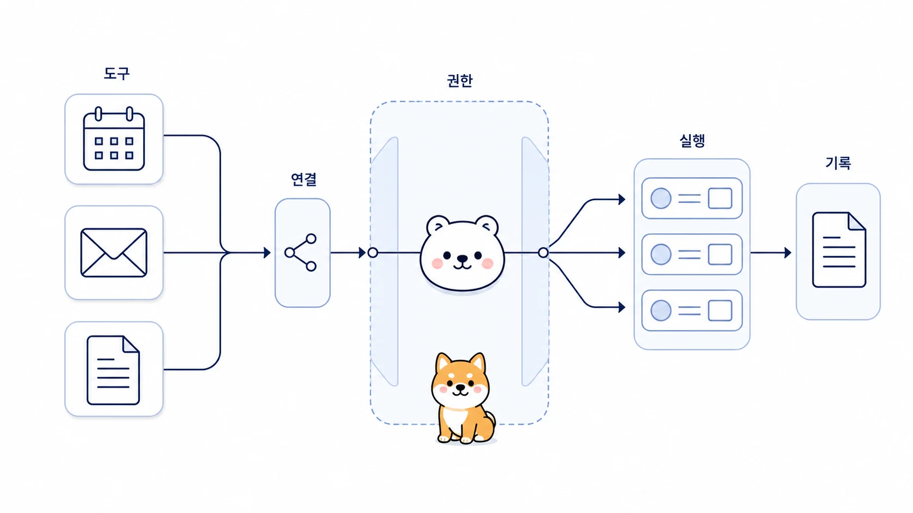

## Google Workspace와 메일 MCP는 업무 흐름에 어떻게 붙일까

Google Workspace와 메일 MCP 연동은 AI 개인비서를 실제 업무 도구 안으로 들여보내는 단계다. Gmail, Calendar, Docs, Sheets 같은 도구를 읽고 쓰기 시작하면 편해지지만, 권한과 승인 기준이 흐리면 위험도 커진다.



이 사례의 핵심은 “연동부터 끝내기”가 아니다. 어떤 작업은 읽기만 허용하고, 어떤 작업은 초안까지만 만들고, 어떤 작업은 사람 승인 후에만 쓰기 작업을 하게 할지 나누는 것이다.

[TOC]

## 시작 상황

메일 정리, 회의 일정, 문서 초안, 스프레드시트 업데이트는 모두 Google Workspace와 연결될 수 있다. 하지만 처음부터 모든 권한을 열 필요는 없다.

| 업무 | 처음에 허용할 범위 | 사람 승인 필요 지점 |
|---|---|---|
| Gmail 정리 | 읽기/분류/답장 초안 | 실제 발송 |
| Calendar | 일정 후보 추출 | 캘린더 등록/변경 |
| Docs | 문서 초안 생성 | 외부 공유/권한 변경 |
| Sheets | 요약/분류/초안 업데이트 | 원본 데이터 수정/삭제 |

## 맡긴 역할

| 역할 | 담당 |
|---|---|
| 하비 | 도구 연결 목적과 권한 경계를 정한다 |
| 방울이 | 필요한 문서/메일/일정 근거를 찾는다 |
| 뽀동이 | 답장 초안, Docs 초안, 보고 문안을 정리한다 |
| 봉구 | 승인된 범위 안에서 파일 생성, 저장, 검증을 실행한다 |

## 막힌 지점

MCP 연동이 실패하는 이유는 설정이 어렵기 때문만은 아니다. 연결 후 무엇을 맡길지 정하지 않았기 때문이다. 도구가 연결되면 AI가 더 많은 일을 할 수 있지만, 그만큼 잘못된 쓰기 작업, 잘못된 공유, 민감정보 노출 가능성도 커진다.

## 운영 규칙

Google Workspace와 메일 MCP는 아래 순서로 붙인다.

1. 먼저 읽기 전용 업무를 정한다.
2. 초안 생성 업무를 분리한다.
3. 발송, 삭제, 공유, 권한 변경은 사람 승인 단계로 둔다.
4. 민감정보가 들어간 문서와 외부 공유 문서를 나눈다.
5. 도구 실행 결과는 링크, 파일명, 변경 전후 상태로 검증한다.
6. 반복되는 흐름만 Skill이나 체크리스트로 남긴다.

## 따라 하는 방법

```text
하비야, Google Workspace를 업무 자동화에 붙일 때 권한 경계를 먼저 설계해줘.

대상 업무:
- Gmail 고객 메일 분류와 답장 초안
- Calendar 일정 후보 추출
- Docs 회의록 보고서 초안

출력 형식:
1. 읽기만 허용할 일
2. 초안 생성까지만 허용할 일
3. 사람 승인 후 실행할 일
4. 절대 자동 실행하지 않을 일
5. 검증 방법
6. Skill로 남길 반복 절차
```

## 좋은 예와 나쁜 예

| 구분 | 예시 |
|---|---|
| 나쁜 예 | “Gmail이랑 Calendar 연결했으니 알아서 처리해줘” |
| 좋은 예 | “Gmail은 읽기/분류/초안까지만, Calendar 등록은 사람 승인 후, Docs는 초안 생성 후 링크로 보고해줘” |

## 체크리스트

- 읽기 권한과 쓰기 권한을 분리했는가?
- 자동 발송/삭제/공유를 막았는가?
- 도구 실행 결과를 링크나 변경 상태로 확인했는가?
- 민감정보가 들어간 문서를 별도 기준으로 다뤘는가?
- 반복 업무만 Skill로 남겼는가?

## 확장 아이디어

이 흐름이 안정되면 메일 정리, 회의록 보고서, 주간 리포트, 자료조사 결과 정리까지 하나의 업무 흐름으로 연결할 수 있다. 예를 들어 Gmail에서 고객 요청을 읽고, Docs에 답장 초안을 만들고, Calendar 후보 일정을 뽑고, Slack으로 사람 승인 요청을 보내는 식이다. 단, 마지막 실행 권한은 업무 위험도에 따라 사람에게 남겨야 한다.
