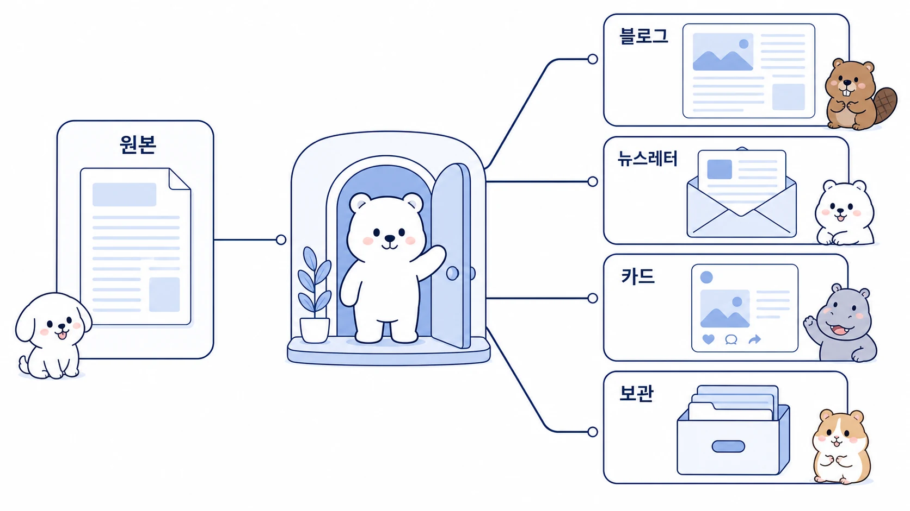

## 블로그와 뉴스레터는 어떻게 하나의 원본에서 재가공할까

좋은 원본 글 하나는 블로그, 뉴스레터, Slack 공유문, 카드뉴스, 강의용 자료로 다시 쓸 수 있다. 하지만 단순히 길이를 줄이는 것만으로는 재가공이 아니다. 채널마다 독자의 상태, 읽는 시간, CTA가 다르기 때문이다.



Hermes Agent로 콘텐츠 재가공을 할 때 핵심은 원본 메시지를 유지하되 채널별 구조와 행동 요청을 바꾸는 것이다. 뽀동이는 글의 흐름을 정리하고, 하망이는 시각 자료 방향을 잡고, 봉구는 발행 포맷과 검증을 이어받는다.

[TOC]

## 시작 상황

WikiDocs 원고나 긴 리서치 메모가 하나 있다. 이 원본은 깊이는 있지만 그대로 블로그나 뉴스레터에 넣으면 길고 무겁다. 반대로 너무 줄이면 핵심 맥락이 사라진다.

| 채널 | 독자 상태 | 바꿔야 할 것 |
|---|---|---|
| WikiDocs | 배우려는 독자 | 구조, 근거, 체크리스트 |
| 블로그 | 문제를 검색한 독자 | 제목, 첫 문단, 사례, SEO/GEO |
| 뉴스레터 | 빠르게 훑는 독자 | 요약, 인사이트, 링크, CTA |
| Slack 공유 | 내부 실행 독자 | 완료/남음/다음 액션 |
| 카드뉴스 | 시각적으로 이해하는 독자 | 한 장 한 메시지, 이미지 흐름 |

## 맡긴 역할

| 역할 | 담당 |
|---|---|
| 하비 | 원본을 어떤 채널로 재가공할지 정한다 |
| 뽀동이 | 채널별 제목, 구조, CTA를 다듬는다 |
| 하망이 | 썸네일/카드뉴스/본문 이미지 방향을 정한다 |
| 봉구 | 파일 생성, 발행 포맷, 링크 검증을 실행한다 |

## 막힌 지점

재가공이 실패하는 이유는 원본을 그대로 복사하거나, 반대로 핵심 메시지를 잃을 만큼 줄이기 때문이다. 블로그는 검색 의도와 첫 문단이 중요하고, 뉴스레터는 독자가 바로 얻는 인사이트와 다음 행동이 중요하다.

## 운영 규칙

콘텐츠 재가공은 아래 순서로 한다.

1. 원본의 핵심 메시지를 한 문장으로 압축한다.
2. 채널별 독자와 읽는 상황을 정한다.
3. 유지할 내용과 덜어낼 내용을 나눈다.
4. 제목/첫 문단/CTA를 채널별로 다시 쓴다.
5. 이미지가 필요한 경우 하망이에게 별도 브리프를 준다.
6. 발행 전 링크, 이미지, 문체, 중복 표현을 검증한다.

## 따라 하는 방법

```text
뽀동아, 이 WikiDocs 원고를 블로그와 뉴스레터로 재가공해줘.

출력 형식:
1. 원본 핵심 메시지 1문장
2. 블로그용 제목 5개
3. 블로그 첫 문단과 본문 구조
4. 뉴스레터 제목 3개
5. 뉴스레터 요약/인사이트/CTA
6. Slack 공유문 3줄
7. 하망이 이미지 브리프가 필요한 경우 별도 제안

주의:
원본 메시지는 바꾸지 말고, 채널별 독자와 CTA만 조정해줘.
```

## 좋은 예와 나쁜 예

| 구분 | 예시 |
|---|---|
| 나쁜 예 | “이 글을 뉴스레터로 줄여줘” |
| 좋은 예 | “검색으로 들어온 독자가 읽을 블로그와 기존 구독자에게 보낼 뉴스레터로 나누고, 각각 제목/첫 문단/CTA를 따로 만들어줘” |

## 체크리스트

- 원본 핵심 메시지를 유지했는가?
- 채널별 독자와 읽는 상황이 다른가?
- 제목과 CTA가 채널에 맞게 바뀌었는가?
- SEO/GEO 키워드가 자연스럽게 들어갔는가?
- 이미지나 카드뉴스가 필요한 경우 별도 브리프가 있는가?
- 발행 전 링크와 포맷을 검증했는가?

## 확장 아이디어

이 흐름은 WikiDocs 책 전체를 블로그 시리즈, 뉴스레터, 강의안, LinkedIn/X 게시물로 확장할 때 유용하다. 단, 모든 채널에 같은 문장을 복사하는 것이 아니라 같은 메시지를 각 채널의 읽기 방식에 맞춰 다시 설계해야 한다.
